# EnZIME Reader — Architecture (v1.0 production-release snapshot)

> **End-state architecture of the EnZIME Reader app as it exists at v1.0
> production release.** This document is a snapshot of the finished
> product, not a roadmap. Every entity named below exists in the v1.0
> codebase; every interaction shown is a real runtime path; every
> decision in the log is final for v1.0.
>
> Per global rule **I-11** (`~/.claude/CLAUDE.md`), this file:
> 1. is the **single source of truth** for the entity vocabulary —
>    no sibling partials, no forked tables;
> 2. carries the **complete entity table inline** (§7) — every
>    named entity in the production codebase is enumerated with
>    name, target `file:line`, role, signature/fields;
> 3. carries **Mermaid** diagrams for structure (§2, §4, §6) and
>    **PlantUML** diagrams for interactions (§5);
> 4. contains **no stubs, no TBD entries, no "open issues" sections,
>    no "future work" sections, no placeholder-OK columns**;
> 5. ends with an **Architect Attestation** block (§10) carrying
>    timestamp + authoring-agent identifier.
>
> The two files `DOCS/ARCHITECTURE/ENTITIES_V0.md` and
> `DOCS/ARCHITECTURE/ENTITIES_FULL.md` are **superseded historical
> sources** retained on disk (not deleted, per operator policy) and
> linked in §9 for traceability. They are no longer operative.

---

## §1 Invariants

The four binding invariants of the Reader app. Any change to source,
build, distribution, or product surface must preserve these:

| ID | Name | Binding rule |
|---|---|---|
| **INV-OFFLINE** | Offline-first; nothing premised on online | Every feature must work with airplane mode on. **Nothing in the codebase may be premised on online connectivity.** Every asset (APK, models, ZIMs, ZIM packs, sidecars, updates) must have a non-network load path: from SD/USB media, from LAN peer-share, from disc, from sibling-device transfer, from "downloaded on desktop then copied over." Online fetchers (`MirrorFetcher`, `PadFetcher`, in-app updater, pack catalog fetcher) are *one* path among several, never the only path. The `NullFetcher` (weights assumed already on disk) is the universal offline path and is the canonical fallback when any online fetcher fails. Failure of any network operation must drop the user back to local state with a "install from media" UX, never crash, never hang. |
| **INV-NO-EXPO** | No Expo runtime | No Expo, no Metro bundler, no `expo-*` imports, no `app.json`. Tauri 2 + Vite only. |
| **INV-NO-APPLE** | No Apple ecosystem | Targets: Linux desktop, Windows desktop, Android. No iOS, no macOS, no Catalyst proposals. |
| **INV-NO-PLACEHOLDERS** | Real implementations only | No placeholders, mocks, stubs, sentinel files, "TODO real impl later" patterns, 1-byte LFS files, or zero-byte assets in the production-release artifact. The `Null*` types described in §7 are concrete implementations of the **uninitialized** runtime state (e.g. "no model loaded yet"), not placeholders for future work — they are part of v1.0 by design and continue to exist post-v1.0 as the legitimate empty-state representatives. |

---

## §2 Top-level repository layout

The Reader app shares the EnZIME suite repository with the Creator and
Extension apps (suite-level soft project boundaries — separate
`CLAUDE.md` / `ARCHITECTURE.md` / `CHECKLIST.md` per app). This
document scopes the Reader only.

```mermaid
graph TD
    ROOT[EnZIME/]
    ROOT --> SRCTAURI[src-tauri/<br/>Rust backend + Tauri commands]
    ROOT --> SRC[src/<br/>Reader UI source — Vite + React + TS]
    ROOT --> PUBLIC[public/<br/>Static UI assets]
    ROOT --> INDEX[index.html<br/>Vite entry]
    ROOT --> PKG[package.json<br/>pnpm-lock.yaml<br/>vite.config.ts<br/>tsconfig*.json<br/>.npmrc]
    ROOT --> VENDOR[vendor/<br/>tauri/ + litert-lm/<br/>pinned, .git stripped]
    ROOT --> MODELS[models/<br/>LiteRT-LM weights<br/>Forgejo LFS only]
    ROOT --> DOCS[DOCS/<br/>ARCHITECTURE.md THIS FILE<br/>SPEC/ + sdk/]
    ROOT --> SCRIPTS[scripts/<br/>build/version/hooks]
    ROOT --> WORKFLOWS[.forgejo/workflows/<br/>.github/workflows/]
    ROOT --> CREATOR[creator/<br/>Creator app — separate scope]
    ROOT --> EXT[extension/<br/>Chrome MV3 — separate scope]
    ROOT --> BRIDGE[bridge/<br/>EntitlementSyncBridge<br/>separate binary]
    ROOT --> LOGS[LOGS/<br/>Operator screen captures]

    SRCTAURI --> ANZIM[anzimmermanlib/rust/<br/>In-tree ZIM library<br/>path-dep crate]

    classDef readerScope fill:#e1f5ff,stroke:#0288d1
    classDef sharedInfra fill:#fff4e1,stroke:#f57c00
    classDef otherApp fill:#f0f0f0,stroke:#666,stroke-dasharray: 5 5
    class SRCTAURI,SRC,PUBLIC,INDEX,PKG,MODELS,SCRIPTS,WORKFLOWS,LOGS readerScope
    class VENDOR,DOCS,ANZIM sharedInfra
    class CREATOR,EXT,BRIDGE otherApp
```

The Reader UI lives at repo root (post-2026-05-14 frontend flatten —
no enclosing `frontend/` directory). The Rust backend lives at
`src-tauri/` (Tauri convention). `pnpm install` from repo root works
without ceremony; `cargo check -p enzime` runs from repo root.

---

## §3 Stack

Layer-by-layer technology choices, as shipped in v1.0:

| Layer | Choice | Source of truth |
|---|---|---|
| Application shell | **Tauri 2** | `vendor/tauri/` (pinned, .git-stripped) |
| Backend language | **Rust** | `src-tauri/src/` (workspace member) |
| Frontend framework | **Vite + React 18 + TypeScript (strict)** | `src/`, `package.json` |
| Frontend state | **Zustand** (lightweight hooks-native stores) | `src/stores/` |
| ZIM reader | **AnZimmermanLib** (Rust, in-tree path-dep crate) | `src-tauri/anzimmermanlib/rust/` |
| LLM runtime | **LiteRT-LM** (Google AI Edge on-device inference) | `vendor/litert-lm/` (pinned, .git-stripped) |
| LLM weights (floor) | **Qwen3-0.6B** in `.litertlm` format | `models/qwen3-0.6b/` (Forgejo LFS); upstream `Qwen/Qwen3-0.6B` (operator-side conversion via LiteRT-LM converter) |
| LLM weights (upgrade) | **Gemma 4 E2B IT** in `.litertlm` format | `models/gemma-4-e2b/` (Forgejo LFS); upstream `litert-community/gemma-4-E2B-it-litert-lm` (pre-converted, apache-2.0) |
| STT | **Gemma 4 E2B native audio encoder** (only on devices running the Gemma upgrade tier) | Bundled with Gemma weights |
| TTS | **Native OS accessibility TTS** (Android `android.speech.tts.TextToSpeech` via JNI; Linux/Windows via OS shell) | OS-provided; `Tts` trait + `NullTts` empty-state impl in v1.0, native binding lands in a post-v1.0 wave |
| Persistence | **SQLite** via `rusqlite` (single-file portable DB, WAL mode) | `src-tauri/src/storage/` |
| Storage thread-safety | **`Mutex<Connection>` inside `Storage` façade** (see §8 decision 7) | `src-tauri/src/storage/mod.rs` |
| HTTP client | **`reqwest`** (rustls-tls, streaming) | Used by `MirrorFetcher`, `RevenueCatClient` |
| Crypto | **`ed25519-dalek`** (signed manifests, sidecar signatures, entitlement payloads) | Three call sites: mirror manifest verifier, sidecar signer/verifier, entitlement local-payload verifier |
| Build orchestration | **Cargo workspace** + **pnpm** + **Tauri CLI** | Root `Cargo.toml`, root `package.json`, `src-tauri/tauri.conf.json` |
| CI runners | **Self-hosted Forgejo runners** (primary) + **self-hosted GitHub runners** (mirror) | `.forgejo/workflows/build.yml`, `.github/workflows/build.yml`; runner topology in `~/.claude/CI_RUNNERS.md` |
| Distribution | **Google Play AAB** (`enzime-play`), **direct APK** (`enzime-sideload`), **AppImage/MSI** (`enzime-desktop`) | Build-flavor cargo features select fetcher impl + packaging script |
| Model delivery | **Play Asset Delivery** (install-time, conditional packs) for Play flavor; **operator HTTPS mirror** for sideload + desktop | `src-tauri/src/model_fetcher/{pad,mirror,null}.rs` |
| Entitlements | **RevenueCat** as the single gate truth; **`EntitlementSyncBridge`** (separate binary) syncs direct-processor purchases to RC | `src-tauri/src/billing/`, `bridge/` |
| Billing modes | **Mode 1 (Perpetual)** + **Mode 2 (Subscription)** active in v1.0; **Mode 3 (Custom artifact / Lifetime+) reserved** but not user-visible | `src-tauri/src/billing/mode.rs` |
| Annotation sidecar format | **CBOR canonical encoding** with ed25519 signatures, peer trust DB, optional chunked LoRa-friendly transport | Spec at `DOCS/SPEC/sidecar-format-v0.md`; impl at `src-tauri/src/sidecar/` |

**TTS clarification (resolves apparent contradiction with INV-NO-PLACEHOLDERS):**
the `Tts` trait + `NullTts` exist in v1.0 source because the abstraction is
modular and needed for the post-v1.0 native-OS-TTS swap; the v1.0 product
does NOT surface any TTS UI affordance, so the user never invokes a TTS
codepath. `NullTts` returning `AiError::NotLoaded` is the legitimate
empty-state representative of "no TTS backend wired" — not a stub
masquerading as functionality.

---

## §4 Build flavors and distribution

Three cargo features select the fetcher implementation and packaging
target at compile time. Each (platform, flavor) tuple produces one
distinct binary; CI builds one job per valid tuple.

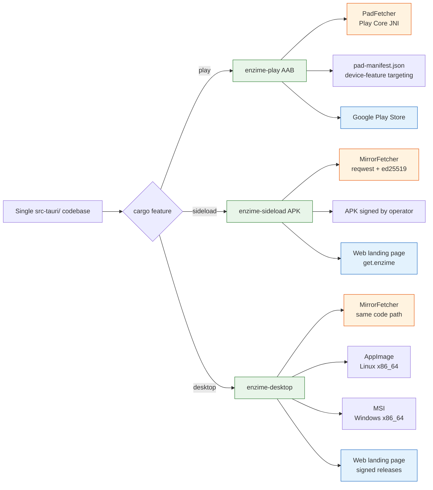

**Variant strategy (orthogonal to flavor):** each device picks one of
two LLM variants at first launch based on capability probe:

| Variant | Size | Eligibility | Capability ceiling |
|---|---|---|---|
| `Qwen3_06B_Q4` | ~500 MB | All devices (universal floor) | Text-only RAG |
| `GemmaE2bQ4` | ~3 GB | RAM ≥ 6 GB, free storage ≥ 4 GB | Full multimodal (native audio encoder) |

The two variants ship as independent `.litertlm` files via the same
fetcher infrastructure (PAD or mirror, depending on flavor). On Play,
Gemma is a **conditional install-time pack** via PAD device-feature
targeting; total install-time payload caps at ~3.55 GB (under Play's
4 GB limit).

---

## §5 Runtime sequences

### §5.1 First-launch flow

From operator-installed app to "ready for user input":

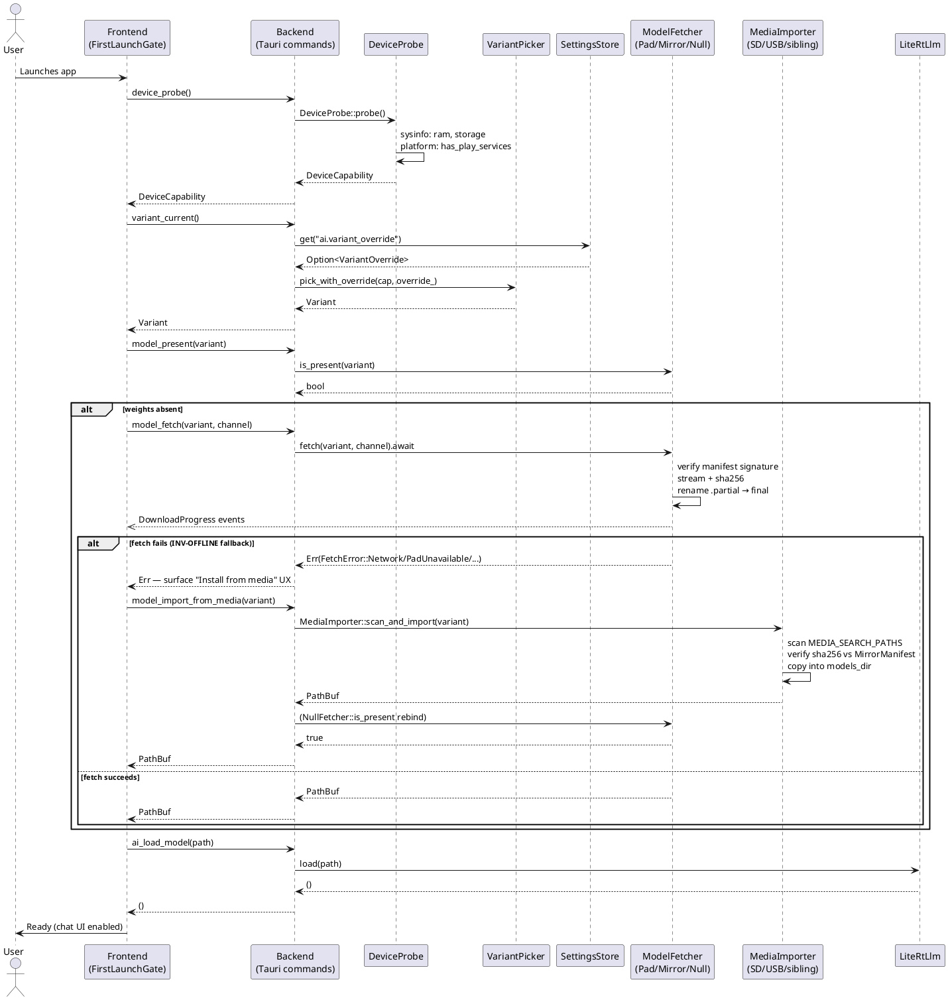

### §5.2 ZIM open + AI chat

Standard read+ask flow against a loaded ZIM:

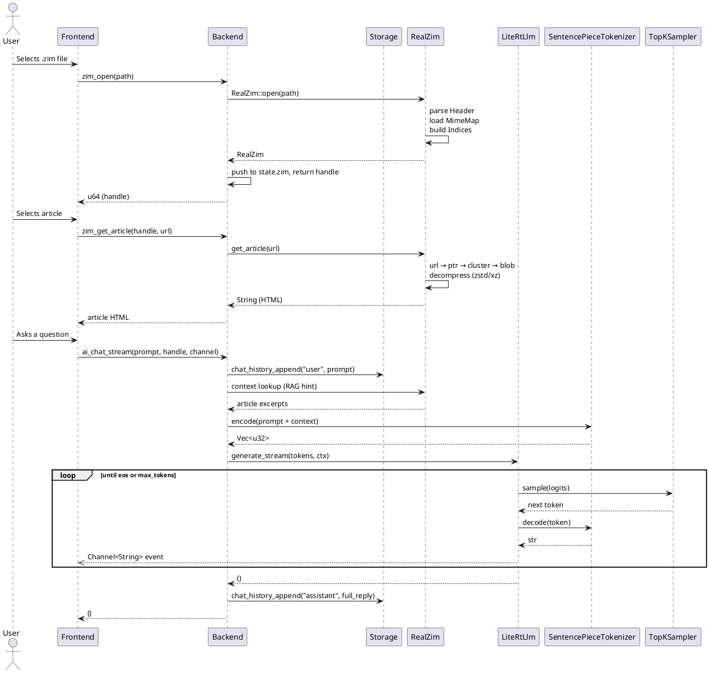

### §5.3 Entitlement check

Feature-gated paths consult one cached source of truth:

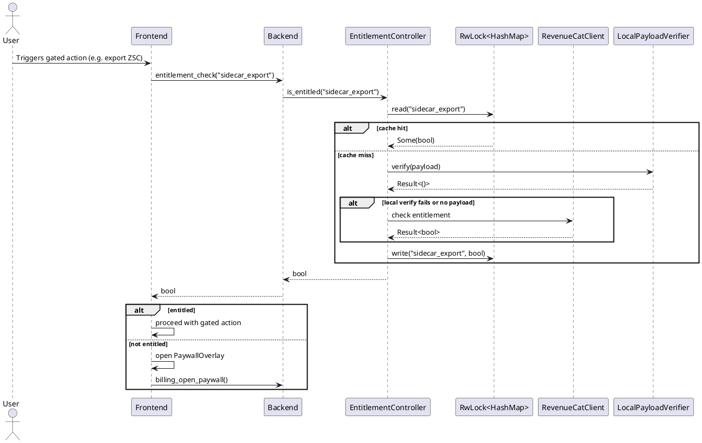

### §5.4 Sidecar create + export (annotations leaving the device)

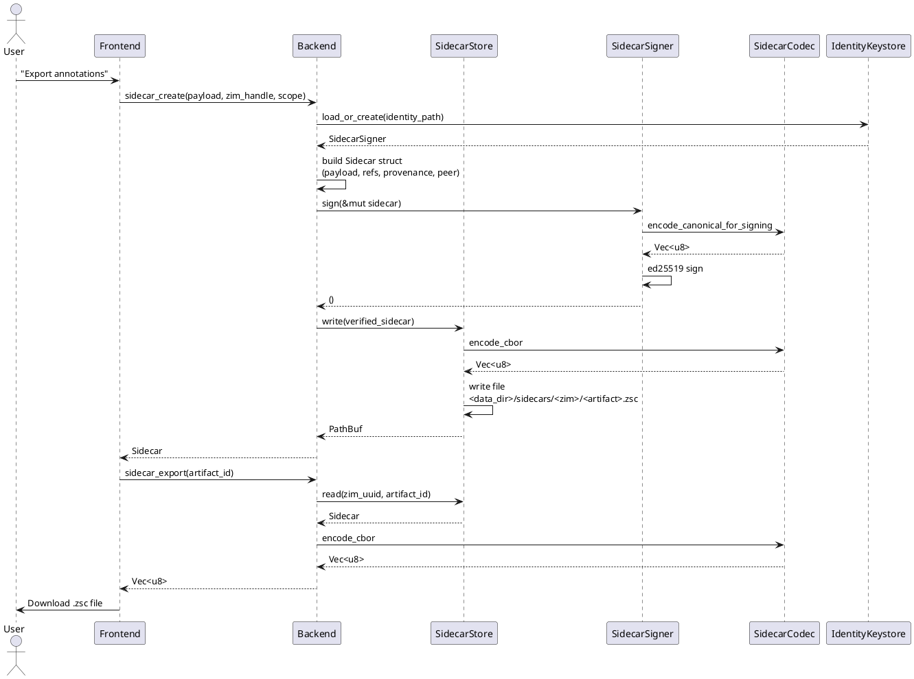

### §5.5 Sidecar import + verify (annotations entering the device)

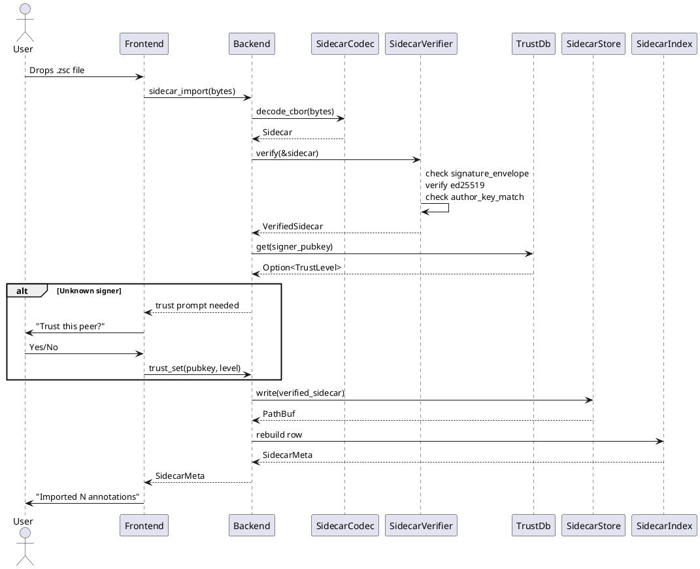

### §5.6 App update flow (post-v1.0 release-channel pull)

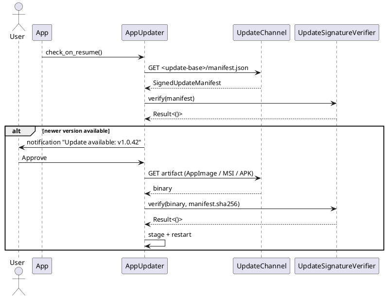

`AppUpdater` is platform-specific: on Play, this path is unused (Play
Store handles updates). On sideload Android, Updater downloads the
new APK and prompts the OS install intent. On desktop, Updater
replaces the AppImage in place / runs the MSI installer.

---

## §6 Component dependency graph

The architectural seams between modules. Arrows indicate "depends on
the public surface of":

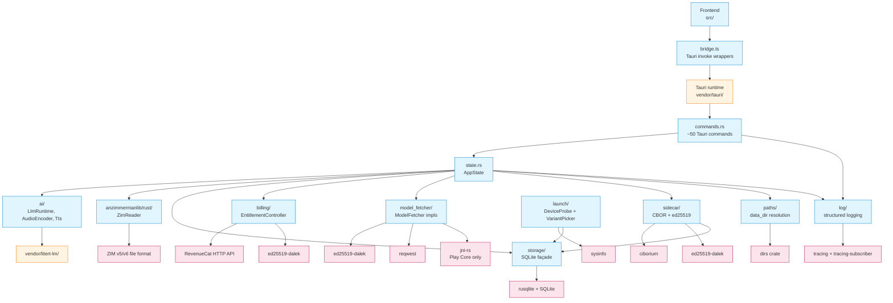

---

## §7 Entity table (complete enumeration) — assembled from per-module behavioural partials

> **Assembly provenance (I-21 / TC13).** This §7 is assembled by the Opus orchestrator from
> **eleven per-module architecture partials** authored by GLM-5.1 architect seats (one module
> each, fed an orchestrator-extracted codegraph entity skeleton) and curated by semantic review
> (I-12, not blind-accept). The durable per-module work-products live at
> `DOCS/ARCHITECTURE/<module>.md`; this section is the assembled single-file whole (I-11). Every
> entity row carries a **real behavioural role + a SEMANTIC acceptance criterion** (I-12 — an
> observable behaviour / real-fixture test, never grep-for-existence). Frontend entities cite the
> **frozen Stitch UI artifacts** under `LIBS/UI/STITCH/` as the UI source-of-truth (I-20 / TC12).
> `§5.3` (entitlement) is **offline-first** ordering (cache → LocalPayloadVerifier →
> RC fallback → cache) and `§5.7` (dynamic-download install sequence) is added — both inline in the billing / ddl
> partials below. The architecture describes the complete end-state; where the current source
> diverges, CHECKLIST tasks close the gap.


<!-- ═══════════════ per-module partial: commands ═══════════════ -->

<!-- CURATED PARTIAL §7.1 commands (51) + §7.12 ACL. GLM-5.1 (`commands`); Opus-reviewed/accepted 2026-06-13. 51 thin-dispatch commands each → its §7.x manager with end-to-end semantic acceptance; marshal DTOs; least-privilege ACL (default + desktop/play/sideload-only capability files; 51 reachable desktop/sideload, 48 Play). Current placeholder bodies are the substitution points — coders wire each to its manager + map Err→String. -->

# Architect partial — Module `commands` (§7.1 + §7.12)

GLM-5.1 architect, end-state behavioural. Replaces §7.1 (the 51-command Tauri
IPC surface, `src-tauri/src/commands.rs`) and §7.12 (Tauri ACL/capabilities,
`src-tauri/capabilities/` + `tauri.conf.json`). Managers are referenced BY NAME
and defined in their own §7.x partials — this module architects only the command
wiring (validate/marshal → manager → map `Err→String`) and the ACL allow-list.

Airlock (TC6): `.tmp/glm-dispatches/modules/commands.arch.md`. Ends `MODULE-DONE: commands`.

---

## §7.1 Tauri command surface (`src-tauri/src/commands.rs`)

### Design (end-state, binding)

- **Commands are thin.** Each `#[tauri::command]` fn does exactly three things:
  (1) receive + implicitly deserialize args (Tauri marshals from the IPC
  payload); (2) call **one manager method on `AppState`** (the command never
  owns business logic, state, or I/O policy); (3) map the manager's typed error
  into the IPC error channel as `String`. No command holds locks longer than the
  manager call, no command parses ZIM/AI/sidecar bytes itself, no command makes
  a network call in the default path.
- **`State<AppState>` is the single dispatch root.** Every command (except
  `enzime_version`, which is a pure compile-time constant) borrows
  `state: State<AppState>` and reaches its manager through `AppState`'s fields
  (`ZimReader`, `LlmRuntime`, the four stores, `EntitlementController`,
  `DeviceProbe` cache, `VariantPicker`, `ModelFetcher`, the sidecar/trust
  managers, `PackCatalog`, `GlobalSearcher`, `AppUpdater`,
  `WindowStateStore` — each defined in its own §7.x).
- **Streaming commands forward over a Tauri `Channel<T>`** and run the
  (blocking) manager work on `spawn_blocking`, forwarding each event/token/
  progress frame through the channel and returning the terminal result when the
  manager completes: `ai_chat_stream` (token deltas, `Channel<String>`),
  `model_fetch` and `model_import_from_media` (download progress,
  `Channel<DownloadProgress>`), `pack_install` (pack download/verify/copy
  progress, `Channel<PackProgress>`). The channel is the only live back-channel;
  the `Result` carries the terminal value (`()` for pure streams, `PathBuf` for
  fetch/install).
- **INV-OFFLINE.** No command requires network in the default path. Online-only
  commands (`app_update_check`, `app_update_apply`, `pack_install` fetch,
  `model_fetch` network path) are additive: failure/offline degrades to a typed
  `Err(String)`, never a panic, and the offline fallback
  (`model_import_from_media`) is a first-class command that needs zero network.
- **Error contract.** Every command returns `Result<T, String>`; the `Err`
  variant is a human/operator-readable `String` derived from the manager's typed
  error via `.map_err(|e| e.to_string())` (or a context-wrapping `format!`). The
  frontend treats any `Err` as command failure; there is no second out-of-band
  channel.
- **`model_import_from_media` is the one rich command.** It is the INV-OFFLINE
  network-fallback path made explicit: it scans mounted external media for a
  signed `mirror-manifest.json`, verifies it with `MirrorManifestVerifier`
  against `MIRROR_PUBLIC_KEY`, and copies the requested variant's weights into
  `models_dir`. It is wired (not placeholder) because it carries the manifest
  + verifier + importer logic; everything else maps straight to its manager.

### Marshal DTOs (defined in `commands.rs`, JSON boundary types)

These structs/enums live in `commands.rs` and are the serde contract between
Rust and the frontend. They are marshalled by Tauri; commands never construct
them from raw bytes.

| ID | Type | Target | Role | Shape |
|---|---|---|---|---|
| E-CMD-5-type | `ZimMetaJson` | `commands.rs:21` | JSON ZIM metadata for `zim_metadata` | `{ title: String, uuid: String, article_count: u32 }` |
| E-ZIM-21-type | `SearchHit` | `commands.rs:29` | JSON search-result row for `zim_search` | `{ url: String, title: String, score: f32 }` |
| E-STR-15 | `Region` | `commands.rs:143` | Selection region for annotations | `enum { Char{start,end}, Page, Custom(String) }` |
| E-STR-14 | `Annotation` | `commands.rs:151` | Annotation row for `annotations_*` | `{ id, zim_uuid, url, region: Region, body, created_at }` |
| E-STR-18 | `Bookmark` | `commands.rs:199` | Bookmark row for `bookmarks_*` | `{ id, zim_uuid, url, title, created_at }` |
| E-STR-11 | `ChatMsg` | `commands.rs:223` | Chat-history row for `chat_history_*` | `{ id, session, role, content, zim_handle: Option<u64>, ts }` |
| E-SIDE-29 | `ReassembleStatus` | `commands.rs:415` | Result of `chunk_ingest` | `enum { Pending{received,total}, Complete(Vec<u8>), Failed(String) }` |
| E-GSRCH-2 | `GlobalSearchHit` | `commands.rs:448` | Cross-ZIM search row for `pack_search_global` | `{ zim_uuid, zim_title, url, article_title, score }` |

### Entity table — 51 commands

`file:line` cites the `#[tauri::command]` attribute line. "Dispatch target"
names the `AppState` manager the command calls (defined in its §7.x).

| ID | Name | Target | Role (behavioural) | Dispatch target | Signature |
|---|---|---|---|---|---|
| E-CMD-1 | `enzime_version` | `commands.rs:37` | Return the compile-time crate version string to the frontend (no state) | — (`CARGO_PKG_VERSION`) | `fn() -> String` |
| E-CMD-2 | `zim_open` | `commands.rs:43` | Open a ZIM archive by path, register it, return a stable handle | `ZimReader`/`RealZim` (§7.3) | `fn(path: String, state) -> Result<u64, String>` |
| E-CMD-3 | `zim_get_article` | `commands.rs:51` | Fetch the rendered article content for a handle+url | `ZimReader` (§7.3) | `fn(handle, url: String, state) -> Result<String, String>` |
| E-CMD-4 | `zim_list_articles` | `commands.rs:59` | Paginated list of article URLs at offset/limit | `ZimReader` (§7.3) | `fn(handle, offset: u64, limit: u32, state) -> Result<Vec<String>, String>` |
| E-CMD-5 | `zim_metadata` | `commands.rs:70` | Archive title/uuid/article_count as `ZimMetaJson` | `ZimReader` (§7.3) | `fn(handle, state) -> Result<ZimMetaJson, String>` |
| E-CMD-6 | `zim_close` | `commands.rs:81` | Release a ZIM handle (drop the reader + free resources) | `ZimReader` (§7.3) | `fn(handle, state) -> Result<(), String>` |
| E-CMD-7 | `zim_search` | `commands.rs:88` | Prefix/text search within one open ZIM, ranked `SearchHit` rows | `ZimReader` (§7.3) | `fn(handle, query: String, limit: u32, state) -> Result<Vec<SearchHit>, String>` |
| E-CMD-8 | `ai_chat` | `commands.rs:102` | Non-streaming completion over an optional open-ZIM context | `LlmRuntime`/`LiteRtLlm` (§7.2) | `fn(prompt: String, zim_handle: Option<u64>, state) -> Result<String, String>` |
| E-CMD-9 | `ai_chat_stream` | `commands.rs:110` | Streaming completion: forward token deltas over a channel | `LlmRuntime` (§7.2) on `spawn_blocking` | `fn(prompt, zim_handle: Option<u64>, on_event: Channel<String>, state) -> Result<(), String>` |
| E-CMD-10 | `ai_voice_chat` | `commands.rs:121` | PCM audio in → text reply (Gemma-tier only) | `AudioEncoder` + `LlmRuntime` (§7.2) | `fn(pcm_b64: String, sr: u32, zim_handle: Option<u64>, state) -> Result<String, String>` |
| E-CMD-11 | `ai_load_model` | `commands.rs:129` | Late-bind a concrete LLM from a model path | `LlmRuntime` (§7.2) | `fn(model_path: String, state) -> Result<(), String>` |
| E-CMD-12 | `ai_unload_model` | `commands.rs:136` | Revert to `NullLlm` (free GPU/CPU memory) | `LlmRuntime` (§7.2) | `fn(state) -> Result<(), String>` |
| E-CMD-13 | `annotations_list` | `commands.rs:162` | All annotations for a handle+url | `AnnotationsStore` (§7.5) | `fn(handle, url: String, state) -> Result<Vec<Annotation>, String>` |
| E-CMD-14 | `annotations_create` | `commands.rs:169` | Persist a new annotation, return its id | `AnnotationsStore` (§7.5) | `fn(handle, url, region: Region, body: String, state) -> Result<u64, String>` |
| E-CMD-15 | `annotations_delete` | `commands.rs:177` | Remove an annotation by id | `AnnotationsStore` (§7.5) | `fn(id: u64, state) -> Result<(), String>` |
| E-CMD-16 | `annotations_export` | `commands.rs:184` | Legacy non-sidecar JSON export (optionally scoped to a handle) | `AnnotationsStore` (§7.5) | `fn(handle: Option<u64>, state) -> Result<String, String>` |
| E-CMD-17 | `annotations_import` | `commands.rs:192` | Import annotations from JSON, return count inserted | `AnnotationsStore` (§7.5) | `fn(json: String, state) -> Result<u32, String>` |
| E-CMD-18 | `bookmarks_list` | `commands.rs:209` | Enumerate all bookmarks | `BookmarksStore` (§7.5) | `fn(state) -> Result<Vec<Bookmark>, String>` |
| E-CMD-19 | `bookmarks_toggle` | `commands.rs:216` | Add-or-remove a bookmark for handle+url, return new state | `BookmarksStore` (§7.5) | `fn(handle, url: String, state) -> Result<bool, String>` |
| E-CMD-20 | `chat_history_list` | `commands.rs:234` | Recent messages (optionally one session) | `ChatHistoryStore` (§7.5) | `fn(session_id: Option<u64>, state) -> Result<Vec<ChatMsg>, String>` |
| E-CMD-21 | `chat_history_append` | `commands.rs:241` | Persist one message, return its id | `ChatHistoryStore` (§7.5) | `fn(role, content: String, handle: Option<u64>, state) -> Result<u64, String>` |
| E-CMD-22 | `chat_history_clear` | `commands.rs:249` | Wipe a session (or all), return rows deleted | `ChatHistoryStore` (§7.5) | `fn(session_id: Option<u64>, state) -> Result<u32, String>` |
| E-CMD-23 | `settings_get` | `commands.rs:256` | Read one settings KV value | `SettingsStore` (§7.5) | `fn(key: String, state) -> Result<Option<String>, String>` |
| E-CMD-24 | `settings_set` | `commands.rs:263` | Write one settings KV value | `SettingsStore` (§7.5) | `fn(key, value: String, state) -> Result<(), String>` |
| E-CMD-25 | `entitlement_check` | `commands.rs:270` | Ask the entitlement controller if a feature is granted | `EntitlementController` (§7.6) | `fn(feature: String, state) -> Result<bool, String>` |
| E-CMD-26 | `billing_open_paywall` | `commands.rs:277` | Present the RevenueCat paywall surface | `PaywallController` (§7.6) | `fn(state) -> Result<(), String>` |
| E-CMD-27 | `billing_restore_purchases` | `commands.rs:284` | Restore prior purchases, return the restore outcome | `PurchaseRestorer` (§7.6) | `fn(state) -> Result<RestoreResult, String>` |
| E-CMD-28 | `device_probe` | `commands.rs:294` | Capability probe; cached after first call via `OnceLock` | `DeviceProbe` (§7.9) | `fn(state) -> Result<DeviceCapability, String>` |
| E-CMD-29 | `variant_current` | `commands.rs:307` | Report the currently active LLM variant | `VariantPicker` (§7.9) | `fn(state) -> Result<Variant, String>` |
| E-CMD-30 | `variant_override` | `commands.rs:314` | Set/clear a user-explicit variant override | `VariantPicker` (§7.9) | `fn(override_: VariantOverride, state) -> Result<(), String>` |
| E-CMD-31 | `model_fetch` | `commands.rs:321` | Fetch variant weights over network w/ progress; return path | `ModelFetcher` (§7.9) | `async fn(variant: Variant, progress: Channel<DownloadProgress>, state) -> Result<PathBuf, String>` |
| E-CMD-32 | `model_present` | `commands.rs:333` | Are the given variant's weights already on disk? | `ModelFetcher`/model storage (§7.9) | `fn(variant: Variant, state) -> Result<bool, String>` |
| E-CMD-33 | `sidecar_create` | `commands.rs:340` | Build + sign a sidecar from a payload | `SidecarSigner` + `SidecarStore` (§7.10) | `fn(payload: Payload, zim_handle: u64, scope: Option<String>, state) -> Result<Sidecar, String>` |
| E-CMD-34 | `sidecar_export` | `commands.rs:352` | Canonical CBOR bytes for a named sidecar | `SidecarStore` (§7.10) | `fn(artifact_id: String, state) -> Result<Vec<u8>, String>` |
| E-CMD-35 | `sidecar_export_json` | `commands.rs:359` | Debug-export a sidecar as JSON | `SidecarStore` (§7.10) | `fn(artifact_id: String, state) -> Result<String, String>` |
| E-CMD-36 | `sidecar_import` | `commands.rs:366` | Decode + verify + trust + store an inbound sidecar | `SidecarVerifier` + `TrustDb` + `SidecarStore` (§7.10) | `fn(bytes: Vec<u8>, state) -> Result<SidecarMeta, String>` |
| E-CMD-37 | `sidecar_list` | `commands.rs:373` | List sidecars for a ZIM (optionally url-prefixed) | `SidecarIndex` (§7.10) | `fn(zim_uuid: String, url_prefix: Option<String>, state) -> Result<Vec<SidecarMeta>, String>` |
| E-CMD-38 | `sidecar_delete` | `commands.rs:380` | Remove a sidecar from the store | `SidecarStore` (§7.10) | `fn(artifact_id: String, state) -> Result<(), String>` |
| E-CMD-39 | `trust_get` | `commands.rs:387` | Read a peer's trust level | `TrustDb` (§7.10) | `fn(pubkey: String, state) -> Result<Option<TrustLevel>, String>` |
| E-CMD-40 | `trust_set` | `commands.rs:394` | Set / edit / revoke a trust mark | `TrustDb` (§7.10) | `fn(pubkey, level: TrustLevel, scope: Option<String>, expires_at: Option<i64>, reason: Option<String>, state) -> Result<(), String>` |
| E-CMD-41 | `trust_list` | `commands.rs:408` | List all trust entries | `TrustDb` (§7.10) | `fn(state) -> Result<Vec<TrustEntry>, String>` |
| E-CMD-42 | `chunk_ingest` | `commands.rs:423` | Feed one received LoRa chunk; report reassembly status | `ChunkReassembler` (§7.10) | `fn(chunk_bytes: Vec<u8>, state) -> Result<ReassembleStatus, String>` |
| E-CMD-43 | `pack_catalog_list` | `commands.rs:430` | List ZIM packs in the operator catalog | `PackCatalog::list` (§7.14) | `fn(state) -> Result<Vec<ZimPack>, String>` |
| E-CMD-44 | `pack_install` | `commands.rs:436` | Download + verify + install a ZIM pack w/ progress; return path | `PackCatalog::install` (§7.14) | `async fn(pack_id: String, progress: Channel<PackProgress>, state) -> Result<PathBuf, String>` |
| E-CMD-45 | `pack_uninstall` | `commands.rs:442` | Remove an installed ZIM pack | `PackCatalog::uninstall` (§7.14) | `fn(pack_id: String, state) -> Result<(), String>` |
| E-CMD-46 | `pack_search_global` | `commands.rs:458` | Search across all installed ZIMs, `GlobalSearchHit` rows | `GlobalSearcher` (§7.15) | `fn(query: String, limit: u32, state) -> Result<Vec<GlobalSearchHit>, String>` |
| E-CMD-47 | `app_update_check` | `commands.rs:465` | Poll the release channel for an available update | `AppUpdater::check` (§7.13) | `async fn(state) -> Result<Option<UpdateManifest>, String>` |
| E-CMD-48 | `app_update_apply` | `commands.rs:472` | Stage + restart onto a new binary (sideload/desktop only) | `AppUpdater::apply_update` (§7.13) | `async fn(state) -> Result<(), String>` |
| E-CMD-49 | `window_state_save` | `commands.rs:479` | Persist the current window pos/size/maximized/fullscreen | `WindowStateStore` (§7.16) | `fn(state) -> Result<(), String>` |
| E-CMD-50 | `window_state_restore` | `commands.rs:486` | Restore window pos/size on launch | `WindowStateStore` (§7.16) | `fn(state) -> Result<WindowState, String>` |
| E-CMD-51 | `model_import_from_media` | `commands.rs:500` | INV-OFFLINE fallback: scan mounted media for signed weights, verify against `MirrorManifest`, copy into `models_dir` | `MirrorManifestVerifier` + `MediaImporter` (§7.9) | `async fn(variant: Variant, progress: Channel<DownloadProgress>, state) -> Result<PathBuf, String>` |

### Per-command semantic acceptance (I-12 — observable end-to-end via the manager, never grep)

Each acceptance is what a verifier observes when the command is invoked against
the real manager — not a file-content check. The placeholder bodies present
today (`I-10(b)` sentinels) are the substitution points; "end-state" is the
behaviour once each command calls its named manager and maps the result.

- **E-CMD-1 `enzime_version`** — returns the crate's `CARGO_PKG_VERSION` (e.g.
  `0.1.0`). Accept: the returned string equals `env!("CARGO_PKG_VERSION")` and
  matches the `version` in `tauri.conf.json`/`Cargo.toml`.
- **E-CMD-2 `zim_open`** — a valid ZIM path returns a fresh, distinct `u64`
  handle; repeated opens return distinct handles; an unreadable/missing path
  returns `Err` carrying the `ZimReader` open error. Accept: open a known ZIM,
  receive a handle, then `zim_metadata` on that handle resolves (proves the
  handle is registered, not the placeholder constant `1`).
- **E-CMD-3 `zim_get_article`** — returns the rendered article content for
  `url` within the open `handle`; a `url` not in the archive returns `Err` (not
  a placeholder string). Accept: fetch a known article and receive its real
  content; fetch a bogus url and receive an `Err`.
- **E-CMD-4 `zim_list_articles`** — `offset`/`limit` paginate real article
  URLs; advancing `offset` yields the next slice (no overlap, no duplicates
  across pages). Accept: page 0 and page 1 of the same ZIM are disjoint and
  their union is contained in the archive's article index.
- **E-CMD-5 `zim_metadata`** — returns the archive's real title, uuid, and
  `article_count` (matches the ZIM header). Accept: `article_count` ≥ the number
  of URLs `zim_list_articles` can enumerate for that handle; `uuid` matches the
  archive's stored main-path uuid (non-zero, non-nil).
- **E-CMD-6 `zim_close`** — after close, the handle is released: a subsequent
  `zim_get_article`/`zim_metadata` on the closed handle returns `Err` (handle
  invalidated). Accept: open → close → use-after-close yields `Err`.
- **E-CMD-7 `zim_search`** — ranked `SearchHit` rows whose titles/urls actually
  contain the query term (prefix/text match per the ZIM reader index); an empty
  query or no matches returns an empty vec, not a placeholder row. Accept: index
  a known article title, search its prefix, and the known article appears with a
  real `url`; a query matching nothing returns `[]`.
- **E-CMD-8 `ai_chat`** — returns a full completion string produced by the bound
  `LlmRuntime` (concrete after `ai_load_model`, or `NullLlm`'s deterministic
  stub when no model is loaded). Accept: with a loaded model, the reply is a
  model-generated continuation of the prompt (not the `"<placeholder…>"` echo);
  with no model loaded it returns the `NullLlm` response, not an error.
- **E-CMD-9 `ai_chat_stream`** — streams real token deltas: the frontend
  receives ≥1 `Channel<String>` events whose concatenation equals the same
  completion `ai_chat` would produce, then the command returns `Ok(())`. Accept:
  observe multiple distinct chunk events over the channel ending in a complete
  utterance (not two fixed placeholder chunks); cancelling the client tears down
  generation without panicking.
- **E-CMD-10 `ai_voice_chat`** — decodes the base64 PCM, runs it through the
  Gemma-tier `AudioEncoder` → `LlmRuntime` → returns the text reply. Accept: a
  short recorded utterance returns a coherent text reply; an unsupported PCM
  shape (wrong `sr`, malformed b64) returns `Err`. Gemma-tier gating: below the
  tier, returns `Err` explaining voice chat is unavailable at this variant.
- **E-CMD-11 `ai_load_model`** — after success, `ai_chat` produces model
  (not `NullLlm`) output and `variant_current` reflects the loaded variant.
  Accept: load → `ai_chat` reply changes from the null response to a real
  generation; load of a missing/corrupt path returns `Err`.
- **E-CMD-12 `ai_unload_model`** — after success, `ai_chat` reverts to the
  `NullLlm` response and the runtime's memory is released. Accept: load →
  unload → `ai_chat` returns the null response; GPU/CPU memory footprint drops.
- **E-CMD-13 `annotations_list`** — returns exactly the annotations persisted
  for that handle+url (initially empty for a fresh store). Accept: create two
  annotations for url A and one for url B; `annotations_list(handle, A)` returns
  two, `annotations_list(handle, B)` returns one.
- **E-CMD-14 `annotations_create`** — persists the annotation and returns a
  unique monotonic id; it is immediately visible to `annotations_list`. Accept:
  create → the returned id round-trips through `annotations_list` with the
  stored `region`/`body`.
- **E-CMD-15 `annotations_delete`** — removes the annotation; a subsequent
  `annotations_list` no longer contains that id; deleting a missing id is a
  no-op `Ok(())` (or typed `Err` per store contract — observable, not silent
  data corruption). Accept: create → delete → list omits it.
- **E-CMD-16 `annotations_export`** — returns valid JSON containing the
  exported annotations (legacy, non-sidecar shape). Accept: after creating
  annotations, the returned string parses as JSON and its rows match what
  `annotations_list` reports for the same scope.
- **E-CMD-17 `annotations_import`** — inserts the JSON rows and returns the
  count actually inserted; malformed JSON returns `Err`. Accept: import the
  export from E-CMD-16 into a fresh store; returned count equals the row count
  and the rows appear in `annotations_list`.
- **E-CMD-18 `bookmarks_list`** — returns all persisted bookmarks (empty for a
  fresh store). Accept: toggle a bookmark on, then `bookmarks_list` contains it
  with the correct `zim_uuid`/`url`/`title`.
- **E-CMD-19 `bookmarks_toggle`** — idempotent flip: toggling an absent bookmark
  adds it (returns `true`); toggling an existing bookmark removes it (returns
  `false`). Accept: two consecutive toggles on the same handle+url return
  `true` then `false`, and `bookmarks_list` ends unchanged.
- **E-CMD-20 `chat_history_list`** — returns recent messages (scoped to a
  session when `session_id` is given). Accept: append three messages across two
  sessions; list-with-session returns only that session's messages in timestamp
  order.
- **E-CMD-21 `chat_history_append`** — persists one message, returns its id,
  visible to `chat_history_list`. Accept: append → the returned id appears in
  `chat_history_list` with the stored `role`/`content`.
- **E-CMD-22 `chat_history_clear`** — wipes the session (or all) and returns
  the number of rows deleted; afterwards `chat_history_list` is empty for that
  scope. Accept: append N, clear, observe returned count N and an empty list.
- **E-CMD-23 `settings_get`** — returns the stored value for `key` or `None`
  when unset. Accept: `settings_set("k","v")` then `settings_get("k")` →
  `Some("v")`; `settings_get("never-set")` → `None`.
- **E-CMD-24 `settings_set`** — persists `value` under `key`; a subsequent
  `settings_get` reflects it; overwriting replaces. Accept: set → get round-trip
  equality; set twice → second value wins.
- **E-CMD-25 `entitlement_check`** — returns the `EntitlementController`'s
  verdict for `feature` (true only when genuinely entitled, false otherwise).
  Accept: with a granted entitlement the feature returns `true`; with it
  revoked/absent it returns `false`; the command never grants entitlement
  itself.
- **E-CMD-26 `billing_open_paywall`** — surfaces the RevenueCat paywall via the
  `PaywallController`; returns `Ok(())` once presented (or `Err` if the paywall
  surface is unavailable). Accept: invoking it raises the paywall UI/flow
  (observable presentation), no purchase is forced.
- **E-CMD-27 `billing_restore_purchases`** — runs `PurchaseRestorer` and returns
  a `RestoreResult` whose `restored` count and `errors` reflect actual restore
  outcome. Accept: with a prior purchase on the account, `restored ≥ 1` and the
  corresponding entitlement becomes active; with nothing to restore,
  `restored == 0` and `errors` empty.
- **E-CMD-28 `device_probe`** — returns the probed `DeviceCapability`; the
  result is memoized so the second call returns an equal value without
  re-probing (cache hit). Accept: two calls return `==` capability and the
  returned tier is consistent with the host (e.g. GPU presence reflected).
- **E-CMD-29 `variant_current`** — returns the `VariantPicker`'s currently
  active variant, reflecting any override + probe. Accept: with no override on
  a capable device it returns the probe-chosen variant; after a user override,
  it returns the overridden variant.
- **E-CMD-30 `variant_override`** — sets (non-`None`) or clears (`None`) the
  user-explicit override; `variant_current` reflects it on the next read.
  Accept: set override → `variant_current` returns it; clear → reverts to
  probe-chosen.
- **E-CMD-31 `model_fetch`** — downloads the variant weights, emits
  `DownloadProgress` frames over the channel (bytes/total), and returns the on-
  disk path. Accept: a successful fetch yields increasing-progress events
  ending at 100%, the returned path exists and is non-empty, and `model_present`
  for that variant is `true` afterwards; a network failure mid-fetch returns
  `Err` and leaves no partial install claimed as complete.
- **E-CMD-32 `model_present`** — returns `true` iff the variant's weights exist
  (and verify) on disk. Accept: before `model_fetch`/import → `false`; after a
  successful fetch/import of that variant → `true`.
- **E-CMD-33 `sidecar_create`** — builds a signed `Sidecar` from the `Payload`,
  scoped to `zim_handle` (+optional scope), and stores it. Accept: the returned
  `Sidecar` verifies under the `SidecarVerifier` and is retrievable via
  `sidecar_list` for that ZIM.
- **E-CMD-34 `sidecar_export`** — returns the canonical CBOR bytes for the named
  sidecar; a missing `artifact_id` returns `Err`. Accept: export → re-import the
  same bytes via `sidecar_import` yields an equivalent `SidecarMeta` (round-trip
  stable).
- **E-CMD-35 `sidecar_export_json`** — returns a human-readable JSON form of the
  sidecar (debug). Accept: the returned string parses as JSON and mirrors the
  CBOR export's logical fields.
- **E-CMD-36 `sidecar_import`** — decodes, verifies the signature, applies trust
  (per `TrustDb`), stores, and returns `SidecarMeta`. Accept: importing a valid,
  trusted sidecar returns `SidecarMeta` and the sidecar appears in
  `sidecar_list`; importing a tampered/untrusted sidecar returns `Err` and
  stores nothing.
- **E-CMD-37 `sidecar_list`** — returns sidecars for `zim_uuid`, optionally
  filtered by `url_prefix`. Accept: create two sidecars (different urls) under
  one ZIM; list-all returns both; list-with-`url_prefix` returns only the
  matching one.
- **E-CMD-38 `sidecar_delete`** — removes the named sidecar; afterwards
  `sidecar_list` omits it. Accept: create → delete → list omits it; deleting a
  missing id returns `Err` (observable, not silent).
- **E-CMD-39 `trust_get`** — returns the stored `TrustLevel` for `pubkey` or
  `None` when unset. Accept: `trust_set` a level → `trust_get` returns it; an
  unknown pubkey returns `None`.
- **E-CMD-40 `trust_set`** — sets, edits, or revokes (level permitting) a trust
  mark with optional scope/expiry/reason. Accept: set → `trust_get`/`trust_list`
  reflect it; revoke → entry removed or level reflects revocation.
- **E-CMD-41 `trust_list`** — returns all trust entries. Accept: after setting
  two distinct pubkeys, `trust_list` contains both with the stored levels.
- **E-CMD-42 `chunk_ingest`** — feeds one chunk to the `ChunkReassembler` and
  returns the status: `Pending{received,total}` until complete, then
  `Complete(bytes)` when the final chunk assembles the whole, or `Failed(msg)`
  on a corrupt/missing chunk. Accept: ingest the chunk sequence for a known
  artifact; the final chunk returns `Complete` whose bytes equal the original,
  and a chunk for an unknown set returns `Failed`.
- **E-CMD-43 `pack_catalog_list`** — returns the operator catalog's `ZimPack`
  rows from `PackCatalog::list` (already wired). Accept: returns the catalog
  entries with real ids/titles/sizes (non-empty when the catalog is populated);
  an empty catalog returns `[]`.
- **E-CMD-44 `pack_install`** — downloads + verifies + installs `pack_id`,
  emitting `PackProgress` frames, returns the installed path (already wired via
  `PackCatalog::install`). Accept: progress events advance to completion, the
  returned path exists, and `pack_catalog_list`/uninstall treat it as installed;
  a bad pack id returns `Err`.
- **E-CMD-45 `pack_uninstall`** — removes an installed pack (already wired).
  Accept: after `pack_install`, `pack_uninstall` returns `Ok(())` and the pack's
  files are gone; uninstalling a non-installed id returns `Err`.
- **E-CMD-46 `pack_search_global`** — searches across all installed ZIMs via
  `GlobalSearcher`, returning `GlobalSearchHit` rows attributed to their source
  ZIM. Accept: with two installed ZIMs sharing a topic, a query returns hits
  from both with distinct `zim_uuid`; a query matching nothing returns `[]`.
- **E-CMD-47 `app_update_check`** — polls the release channel via
  `AppUpdater::check`; returns `Some(UpdateManifest)` when a newer build exists,
  `None` when up-to-date, `Err` on a network/manifest failure. Accept: against a
  release channel advertising a newer version it returns `Some`; against the
  current version it returns `None`; offline it returns `Err` (not a hang).
- **E-CMD-48 `app_update_apply`** — stages the new binary and restarts
  (sideload/desktop only); returns `Err` if no staged update exists or the
  platform cannot self-update. Accept: after `app_update_check` reports an
  update, `apply` stages it and the relaunched process reports the new version;
  apply with nothing staged returns `Err`.
- **E-CMD-49 `window_state_save`** — persists the current window geometry via
  `WindowStateStore`. Accept: move/resize the window, save, then
  `window_state_restore` returns the just-saved geometry (x/y/w/h/maximized).
- **E-CMD-50 `window_state_restore`** — returns the persisted `WindowState`
  (sane default on first run: `1280×720`, not maximized/fullscreen). Accept:
  after `window_state_save` of a known geometry, restore returns that exact
  geometry; on first run it returns the documented default.
- **E-CMD-51 `model_import_from_media`** — INV-OFFLINE fallback: scans
  `MEDIA_SEARCH_PATHS` for a signed `mirror-manifest.json`, verifies it with
  `MirrorManifestVerifier` against `MIRROR_PUBLIC_KEY`, then `MediaImporter`
  copies the requested variant into `models_dir` emitting `DownloadProgress`,
  returning the path. Accept: with a correctly signed manifest + weights on
  mounted media (airplane mode), the variant imports and `model_present`
  becomes `true`; with a tampered manifest or bad signature it returns `Err`
  ("Failed to initialize verifier" or verification error) and copies nothing;
  with no media present it reports no manifest found without crashing.

### Wiring + error-mapping contract (binding)

- Every command (except `enzime_version`) ends in `.map_err(|e| e.to_string())`
  (or an equivalent `format!` context wrap) — the typed manager error becomes
  the IPC `String`. The command itself adds no business logic beyond arg
  presence where the manager requires it.
- Streaming commands (`ai_chat_stream`, `model_fetch`, `pack_install`,
  `model_import_from_media`) own the `Channel<T>` lifetime: they forward every
  manager event before returning the terminal `Result`. Cancellation/early-drop
  of the channel must not panic the manager.
- `device_probe` retains its `OnceLock` cache so the probe runs at most once per
  process — the command is the cache boundary, the probe is the manager.
- The `State<AppState>` borrow is shared (`State` is `Send + Sync` via the
  manager interiors); no command takes a long-held exclusive lock.

---

## §7.12 Tauri ACL / capabilities (`src-tauri/capabilities/` + `tauri.conf.json`)

### Design (end-state, binding — least-privilege)

- **Exactly the 51 commands are callable from the frontend; nothing broader.**
  Every frontend-reachable command must be granted by a capability file's
  `permissions[]` array; a command invoked with no matching grant is rejected at
  the Tauri 2 IPC ACL boundary before it reaches its handler. The ACL is the
  sole gate — commands are not additionally guarded in the frontend.
- **Per-flavor capability sets.** Four capability JSONs are conditionally
  included per build flavor (the build selects which capability files are
  compiled into the main window via the flavor's `tauri.conf.json`/feature set):
  - `default.json` — the platform-agnostic baseline granted on every flavor's
    main window: the bulk of the 51 commands (ZIM, AI, stores, entitlement,
    device/variant, model, sidecar/trust/chunk, pack, global search,
    `app_update_check`, `model_import_from_media`).
  - `desktop-only.json` — Linux/Windows extras: `app_update_apply`
    (E-CMD-48), `window_state_save` (E-CMD-49), `window_state_restore`
    (E-CMD-50), plus the `core:window` control perms
    (`allow-set-title`, `allow-show`, `allow-hide`).
  - `play-only.json` — Google Play flavor: **excludes** `app_update_apply`
    (Play manages updates) and the window-state commands (Android has no
    freeform window); grants Play-Billing-appropriate perms only.
  - `sideload-only.json` — F-Droid/direct-APK flavor: **includes**
    `app_update_apply` (via APK install intent) and the `core:window` perms.
- **No global grant.** No capability uses a blanket permission; each command is
  enumerated. App-defined `#[tauri::command]` functions require their generated
  permission identifiers (one per command) in the `permissions[]` array; core
  window perms use the `core:window:allow-*` form already present.
- **INV-OFFLINE alignment.** The ACL never gates a command on network presence;
  it only gates reachability. The offline-first commands (`zim_*`, `ai_*` with a
  loaded/null model, stores, `device_probe`, `variant_*`, `sidecar_*`/`trust_*`,
  `chunk_ingest`, `model_import_from_media`) are all granted in `default.json`.

### Entity table — ACL

| ID | Name | Target | Role (behavioural) | Grant shape |
|---|---|---|---|---|
| E-ACL-1 | `default.json` | `src-tauri/capabilities/default.json` | Baseline main-window capability set: grants the platform-agnostic command surface so core offline flows work on every flavor | `permissions[]` enumerates the command perms for E-CMD-1..47 (excl. the flavor-gated set), E-CMD-51, + core IPC perms; `windows: ["main"]`, `local: true` |
| E-ACL-2 | `desktop-only.json` | `src-tauri/capabilities/desktop-only.json` | Desktop-flavor extras: self-update + window-state persistence + window control, unavailable on Android | `permissions[]`: `app_update_apply`, `window_state_save`, `window_state_restore` + `core:window:allow-set-title/-show/-hide` |
| E-ACL-3 | `play-only.json` | `src-tauri/capabilities/play-only.json` | Play-flavor restriction marker: no `app_update_apply` (Play handles updates), no window-state | `permissions[]` excludes `app_update_apply` and window-state; Play-Billing perms as applicable |
| E-ACL-4 | `sideload-only.json` | `src-tauri/capabilities/sideload-only.json` | Sideload-flavor extras: self-update via APK install intent + window control | `permissions[]`: `app_update_apply` + `core:window:allow-set-title/-show/-hide` |
| E-ACL-5 | command allow-list | per-capability `permissions[]` arrays | The explicit, per-command, least-privilege enumeration that makes exactly the 51 commands frontend-reachable | enforced by the Tauri 2 ACL runtime: a command with no matching grant is denied at the IPC boundary |

### Per-ACL-row semantic acceptance (I-12)

- **E-ACL-1 `default.json`** — On a flavor whose main window carries only this
  capability, every platform-agnostic command (e.g. `zim_open`, `ai_chat`,
  `settings_get`, `sidecar_import`, `pack_search_global`,
  `model_import_from_media`) is invokable and reaches its handler, while the
  flavor-gated commands (`app_update_apply`, `window_state_*`) are rejected at
  the IPC boundary. Accept: invoke `zim_open` → handler runs; invoke
  `window_state_save` with only this capability → ACL denial.
- **E-ACL-2 `desktop-only.json`** — On a desktop build, `app_update_apply`,
  `window_state_save`, and `window_state_restore` become reachable and function
  (per E-CMD-48/49/50). Accept: on desktop, `window_state_save`→`restore`
  round-trips and `app_update_apply` is callable; the `core:window` perms allow
  title/show/hide without denial.
- **E-ACL-3 `play-only.json`** — On a Play build, `app_update_apply` is denied
  (Play owns updates) and there is no self-update path through this command.
  Accept: on the Play flavor, invoking `app_update_apply` returns an ACL denial;
  all default-platform commands still work.
- **E-ACL-4 `sideload-only.json`** — On a sideload build, `app_update_apply` is
  reachable (stages via APK install intent). Accept: on the sideload flavor,
  `app_update_apply` is callable and proceeds per E-CMD-48; window control perms
  are granted.
- **E-ACL-5 command allow-list** — The union of granted commands across the
  compiled-in capabilities for a flavor equals exactly the intended set for that
  flavor (all 51 on desktop/sideload via default+flavor; the 48 non-`apply`/
  non-window-state set on Play). Accept: for each flavor, a frontend attempt to
  invoke any **non-granted** command is denied at the IPC boundary (observable
  ACL rejection), and every **granted** command reaches its handler — proving
  least-privilege with no broader grant.

### ACL ↔ command coverage check (binding)

- `app_update_apply` (E-CMD-48) is granted **only** by `desktop-only.json` and
  `sideload-only.json`; never by `default.json` or `play-only.json`.
- `window_state_save`/`window_state_restore` (E-CMD-49/50) are granted **only**
  by `desktop-only.json`.
- All other commands (E-CMD-1..47, E-CMD-51) are granted by `default.json` and
  therefore reachable on every flavor.
- Total frontend-reachable commands: 51 on desktop, 51 on sideload, 48 on Play
  (excludes `app_update_apply` + the two window-state commands).

---


<!-- ═══════════════ per-module partial: ai ═══════════════ -->

<!-- CURATED PARTIAL §7.2 AI subsystem. GLM-5.1 per-module dispatch (`ai`); Opus-reviewed/accepted 2026-06-13. Resolved: RF-AI-1 → kv_cache_mb reinterpreted as token-count budget fed to litert_lm_engine_settings_set_max_num_tokens at engine creation (option a); RF-AI-2 → system_prompt prepended to input text (Session API has no system-message channel; Conversation API rejected as larger change). Real extern-C LiteRT-LM FFI + Send/mpsc stream bridge specified. -->

# §7.2 AI subsystem (`src-tauri/src/ai/`) — behavioural end-state

**Airlock artifact (TC6).** Module partial authored by the GLM-5.1 architect seat
for orchestrator (Opus `cclaude`) curation, then assembly into the whole
`DOCS/ARCHITECTURE.md` §7 and whole-doc re-attestation (I-11). This file is NOT
the live doc — edit no live files from here. Intake was bounded to
`src-tauri/src/ai/**/*.rs`, §7.2 + §5.2 of `DOCS/ARCHITECTURE.md` (sed), and the
vendored LiteRT-LM C API `vendor/litert-lm/c/engine.h`.

**Authored by:** GLM-5.1 architect seat · **Date:** 2026-06-13 · **Module:** `ai`
(§7.2) · behavioural, no placeholders/TBD/signature-only rows (I-11).

---

## Behavioural overview (resolved design)

The AI subsystem runs **entirely on-device** (INV-OFFLINE: no network call exists
in any inference path). It wraps the **vendored LiteRT-LM C engine**
(`vendor/litert-lm/`, linked via `build.rs` + an `extern "C"` binding module)
running **Gemma 4 E2B q4**.

- **Text generation** — `LiteRtLlm` drives the LiteRT-LM C API synchronously:
  `load` builds engine settings + engine once; `generate`/`generate_stream`
  create a per-call **session**, build a `LiteRtLmInputData` text segment, and run
  `litert_lm_session_generate_content` (blocking) or
  `litert_lm_session_generate_content_stream` (callback-driven). LiteRT-LM owns
  internal tokenization + sampling; the Rust side maps `ModelConfig`
  (`temperature`/`top_k`/`top_p` → `LiteRtLmSamplerParams`, `max_tokens` →
  session `max_output_tokens`).
- **Streaming** — the C stream API invokes its callback from LiteRT's background
  decode thread. Because the trait's `callback: &dyn FnMut(&str)` is not `Send`,
  `generate_stream` bridges through a `Send` `StreamContext` holding an
  `mpsc::Sender`: the `extern "C"` trampoline pushes `StreamEvent`s from the
  decode thread; `generate_stream`'s body (running on the caller's
  `spawn_blocking` task, per §7.1 `ai_chat_stream`) drains the receiver and
  invokes the user callback per chunk, returning on `Final`/`Err`. The §7.1
  command wraps that callback to do `Channel<String>::send` to the frontend.
- **STT** — `GemmaAudioEncoder` uses **Gemma 4 E2B's native audio encoder** via
  LiteRT-LM multimodal input (`LiteRtLmInputData` `Audio` + `AudioEnd` segments).
  **No separate Whisper** (project decision). Pipeline: mic PCM →
  `audio::resample` to 16 kHz mono → session `generate_content` → transcribed text.
- **TTS** — deferred to **post-v1.0**. The `Tts` trait + `NullTts` empty-state
  stay; no Piper-on-by-default, no v1.0 TTS UI surfaces. Honors the existing
  deferral decision.
- **Null\* types** are the **production v1.0 startup state** (legit empty-state,
  not stubs): before any model loads they return `Err(NotLoaded)` and the app
  prompts the user to download/select a model.
- **Application-layer utilities** — `SentencePieceTokenizer` (mirrors Gemma's
  tokenizer for context windowing/token-budgeting without FFI round-trips),
  `TopKSampler`/`TopPSampler` (logits→token-id samplers for auxiliary/standalone
  decode; **not** in LiteRT's internal decode loop, which samples via
  `LiteRtLmSamplerParams`), `ContextWindow` (token-window bound), `audio::resample`,
  `Variant`/`VariantManifest` (on-device model selection).

---

## Entity table

| ID | Name | Target | Role (behavioural) | Signature / fields | Type |
|---|---|---|---|---|---|
| E-AI-1 | `LlmRuntime` | `ai/mod.rs:15` | Abstraction over an on-device text-generation backend. `load` makes a model runnable; `generate` returns one complete completion; `generate_stream` emits each decoded chunk through the callback and returns when generation finishes (EOS or `max_tokens`). v1.0 impls: `LiteRtLlm` (Gemma) and `NullLlm` (startup). | `trait { fn load(&mut self, &Path) -> Result<(),AiError>; fn generate(&self, &str, Option<&str>) -> Result<String,AiError>; fn generate_stream(&self, &str, Option<&str>, &dyn FnMut(&str)) -> Result<(),AiError>; }` | trait |
| E-AI-2 | `NullLlm` | `ai/null.rs:8` | Production startup-state LLM (no model loaded yet). All three ops return `Err(NotLoaded)` — the app treats this as "no model loaded, prompt user to download/select." Legit empty-state, not a stub. | `struct; impl LlmRuntime` | concrete |
| E-AI-3 | `LiteRtLlm` | `ai/litert/mod.rs:17` | On-device LLM runtime backed by the vendored LiteRT-LM C engine running Gemma 4 E2B q4. `load` builds engine settings from the `.task` path + device backend, sets `max_num_tokens`, calls `litert_lm_engine_create`, stores the opaque engine in `ctx` (idempotent if already loaded; `Err(Backend)` on null). `generate` creates a per-call session (sampler params from `config`, `max_output_tokens=config.max_tokens`), builds a `LiteRtLmInputData` text segment (`system_prompt` prepended when `Some`), calls `litert_lm_session_generate_content`, returns owned response text. `generate_stream` same setup → `litert_lm_session_generate_content_stream`; a `Send` `StreamContext` + `extern "C"` trampoline forward each detokenized chunk from LiteRT's decode thread to the user callback on the calling (`spawn_blocking`) thread until `is_final`; returns `Ok`/`Err(Backend)`/`Err(Cancelled)`. | `struct { ctx: *mut LiteRtLmEngine, config: ModelConfig }; unsafe impl Send; impl LlmRuntime` | concrete |
| E-AI-4 | `ai::litert::ModelConfig` | `ai/litert/config.rs:4` | Load/sampling params consumed by `LiteRtLlm` at session creation: `max_tokens`→session `max_output_tokens` (decode cap); `temperature`/`top_k`/`top_p`→`LiteRtLmSamplerParams` (TopK type). `kv_cache_mb` is reinterpreted as a **token-count budget** fed to `litert_lm_engine_settings_set_max_num_tokens` at engine creation (resolved: LiteRT sizes context in tokens, not MB). | `struct { max_tokens: u32, temperature: f32, top_k: u32, top_p: f32, kv_cache_mb: u32 }` | struct |
| E-AI-5 | `AudioEncoder` | `ai/mod.rs:32` | Abstraction over speech-to-text. `transcribe` takes mono PCM samples + their sample rate and returns recognized text. v1.0 impls: `GemmaAudioEncoder` (Gemma native audio) and `NullAudioEncoder` (startup). | `trait { fn transcribe(&self, &[i16], u32) -> Result<String,AiError>; }` | trait |
| E-AI-6 | `NullAudioEncoder` | `ai/null.rs:33` | Production startup-state STT before an audio model loads; `transcribe` returns `Err(NotLoaded)`. Legit empty-state. | `struct; impl AudioEncoder` | concrete |
| E-AI-7 | `GemmaAudioEncoder` | `ai/gemma_audio.rs:12` | STT via Gemma 4 E2B's **native audio encoder** (NO separate Whisper). `transcribe`: resamples i16 PCM to 16 kHz mono via `audio::resample`, creates a session on `backend.ctx`, builds a `[Audio, AudioEnd]` `LiteRtLmInputData` array from the PCM bytes, calls `litert_lm_session_generate_content`, returns the response text (the transcription). `Err(NotLoaded)` when backend not loaded; `Err(Backend)` on FFI failure. | `struct { backend: Arc<LiteRtLlm> }; impl AudioEncoder` | concrete |
| E-AI-8 | `Tts` | `ai/mod.rs:38` | Abstraction over text-to-speech. `speak` synthesizes text → i16 PCM. No concrete engine in v1.0 (Piper deferred to post-v1.0); `NullTts` is the v1.0 production impl. | `trait { fn speak(&self, &str) -> Result<Vec<i16>,AiError>; }` | trait |
| E-AI-9 | `NullTts` | `ai/null.rs:45` | Production v1.0 TTS impl — `speak` returns `Err(NotLoaded)`. Kept because no TTS UI surfaces exist in v1.0 and Piper integration is post-v1.0 (honors existing deferral decision). | `struct; impl Tts` | concrete |
| E-AI-10 | `AiError` | `ai/mod.rs:4` | Common AI error. `NotLoaded` = no model/engine loaded (startup `Null*` states, or generate-before-load). `Backend(String)` = a LiteRT-LM C call returned failure/null (wraps the C `error_msg`). `Cancelled` = a running generation was aborted via `litert_lm_session_cancel_process`. | `enum { NotLoaded, Backend(String), Cancelled }` (thiserror) | enum |
| E-AI-11 | `Sampler` | `ai/sampler.rs:3` | Application-layer logits→token-id sampler. Operates on a raw logits slice; **not** in LiteRT-LM's internal decode loop (LiteRT samples internally via `LiteRtLmSamplerParams`) — used by standalone/auxiliary decode paths. Impls: `TopKSampler`, `TopPSampler`. | `trait { fn sample(&self, &[f32]) -> u32; }` | trait |
| E-AI-12 | `TopKSampler` | `ai/sampler.rs:10` | Top-k (truncated) sampler: sorts logits desc, keeps top `k`, applies `softmax(logits/temperature)`, samples one index by inverse-CDF. Returns `0` on empty logits. | `struct { k: u32, temperature: f32 }; impl Sampler` | concrete |
| E-AI-13 | `TopPSampler` | `ai/sampler.rs:46` | Nucleus sampler: sorts desc, `softmax(logits/temperature)`, keeps the smallest prefix whose cumulative probability ≥ `p`, samples within it by inverse-CDF. Returns `0` on empty logits. | `struct { p: f32, temperature: f32 }; impl Sampler` | concrete |
| E-AI-14 | `ContextWindow` | `ai/context.rs:2` | Token-window data structure the context-management layer uses to bound how many recent token ids (prompt + RAG context + history) are retained for the next generation; `max` is the hard cap the consumer enforces by truncating `tokens`. | `struct { tokens: Vec<u32>, max: u32 }` | struct |
| E-AI-15 | `Tokenizer` | `ai/tokens.rs:3` | Application-layer text↔token-id encoder/decoder for context windowing and token-budgeting (`encode(prompt+context)` in §5.2, history trimming). SentencePiece-backed impl mirrors Gemma's tokenizer so the app need not round-trip through LiteRT FFI for token counts. | `trait { fn encode(&self, &str) -> Vec<u32>; fn decode(&self, &[u32]) -> String; }` | trait |
| E-AI-16 | `SentencePieceTokenizer` | `ai/tokens.rs:9` | SentencePiece tokenizer loaded from a real `.model` file. `encode`→token-id vec (empty on encode failure); `decode`→string (empty on failure). Round-trips text against the bundled Gemma tokenizer model. | `struct { sp: sentencepiece::SentencePieceProcessor }; impl Tokenizer` | concrete |
| E-AI-17 | `AudioBuffer` | `ai/audio.rs:2` | PCM buffer carrier (mono i16 samples + their sample rate) passed between the mic capture path and `AudioEncoder::transcribe`. | `struct { samples: Vec<i16>, sample_rate: u32 }` | struct |
| E-AI-18 | `audio::resample` | `ai/audio.rs:8` | Linear-interpolation sample-rate converter (identity when `from==to`). Used to bring mic PCM to the Gemma audio encoder's 16 kHz expected rate. | `fn(&[i16], from_rate: u32, to_rate: u32) -> Vec<i16>` | fn |
| E-AI-19 | `Variant` | `ai/probe.rs:5` | On-device model variant selector. `GemmaE2bQ4` is the canonical v1.0 model (Gemma 4 E2B q4 via LiteRT-LM); `Qwen3_06B_Q4` is the low-RAM alternative. `name`→stable string id used to resolve the `.task` model path. (Q8 variant removed per 2026-05-15 decision.) | `enum { Qwen3_06B_Q4, GemmaE2bQ4 }` (serde) | enum |
| E-AI-20 | `VariantManifest` | `ai/probe.rs:27` | Per-device variant catalog + the selected variant. `variants` lists what the device can run (RAM/CPU probe); `picked` is the one the loader loads (`GemmaE2bQ4` by default; `Qwen3_06B_Q4` on constrained devices). | `struct { variants: Vec<Variant>, picked: Variant }` (serde) | struct |
| E-AI-21 | `ai::litert::ffi` | `ai/litert/ffi.rs:1` | Rust `extern "C"` binding surface to the vendored `vendor/litert-lm` C library (linked via `build.rs`). Declares the `litert_lm_*` functions used by `LiteRtLlm`/`GemmaAudioEncoder` — `litert_lm_engine_settings_create`/`_delete`/`_set_max_num_tokens`, `litert_lm_engine_create`/`_delete`, `litert_lm_engine_create_session`, `litert_lm_session_config_create`/`_set_sampler_params`/`_set_max_output_tokens`/`_delete`, `litert_lm_session_generate_content`, `litert_lm_session_generate_content_stream`, `litert_lm_session_cancel_process`/`_delete`, `litert_lm_responses_get_response_text_at`/`_delete`, `litert_lm_engine_tokenize`/`_detokenize` + result accessors — plus `#[repr(C)]` mirrors of `LiteRtLmEngine`/`Session`/`Responses`/`EngineSettings`/`SessionConfig`, `LiteRtLmInputData`, `LiteRtLmInputDataType`, `LiteRtLmSamplerType`, `LiteRtLmSamplerParams`, and the `LiteRtLmStreamCallback` typedef. Layout-compatible with `vendor/litert-lm/c/engine.h`. | `mod ffi { extern "C" { … }; #[repr(C)] struct …; type LiteRtLmStreamCallback = extern "C" fn(*mut c_void, *const c_char, bool, *const c_char); }` | module (extern C) |
| E-AI-22 | `litert_stream_trampoline` | `ai/litert/ffi.rs` | `extern "C" fn` matching `LiteRtLmStreamCallback`; recovers `&StreamContext` from `callback_data` (raw pointer), converts the `chunk` `CStr`→`String`, and forwards a `StreamEvent` (`Chunk`/`Final`/`Err`) through the `StreamContext`'s `mpsc::Sender`. Invoked from LiteRT's background decode thread; allocates only the chunk `String`. SAFETY: `callback_data` must point at a live `StreamContext` for the whole stream. | `extern "C" fn(data: *mut c_void, chunk: *const c_char, is_final: bool, err: *const c_char)` | fn (extern C) |
| E-AI-23 | `StreamContext` | `ai/litert/mod.rs` | `Send` bridge between LiteRT's decode thread and `generate_stream`'s calling thread. Holds an `mpsc::Sender<StreamEvent>`; boxed and passed as the C `callback_data`. `generate_stream`'s body owns the `Receiver` and drives the user callback from it, so the non-`Send` `&dyn FnMut` stays on the `spawn_blocking` thread. | `struct StreamContext { tx: std::sync::mpsc::Sender<StreamEvent> }` (`StreamEvent` = `Chunk(String)` / `Final` / `Err(String)`) | struct |

---

## Semantic acceptance (I-12 — observable / real-fixture, never grep)

- **E-AI-1 `LlmRuntime`** — contract verified through its concrete impls
  (E-AI-2, E-AI-3): both compile against the trait and each method's behaviour is
  observed in those impls' acceptances.
- **E-AI-2 `NullLlm`** — `#[test]`: `load(p)==Err(NotLoaded)`,
  `generate("x",None)==Err(NotLoaded)`, `generate_stream(..)==Err(NotLoaded)`.
- **E-AI-3 `LiteRtLlm`** — integration test against the real bundled model at
  `models/gemma-4-e2b/`: `load(path)==Ok`; `generate("What is 2+2? Answer with
  just the number.", None)` returns a non-empty `String`; `generate_stream(p,None,cb)`
  invokes `cb` with ≥1 non-empty chunk and the concatenation is non-empty; a
  second `load()==Ok` (idempotent); `load("/nonexistent")==Err(Backend(_))`.
- **E-AI-4 `ModelConfig`** — test loads with
  `{max_tokens:8, temperature:0.0, top_k:1, top_p:1.0, kv_cache_mb:_}`; observes
  `generate` output length consistent with `max_tokens=8` truncation and
  deterministic (greedy, temp 0) output across two calls. (`kv_cache_mb` is
  fed to `set_max_num_tokens` at engine creation as a token-count budget.)
- **E-AI-5 `AudioEncoder`** — verified through E-AI-6 / E-AI-7.
- **E-AI-6 `NullAudioEncoder`** — `transcribe(..)==Err(NotLoaded)`.
- **E-AI-7 `GemmaAudioEncoder`** — integration test against `models/gemma-4-e2b/`:
  `backend.load()==Ok`; `transcribe(<real 16 kHz mono PCM fixture of spoken text>,
  16000)` returns a non-empty `String`; `transcribe` on an unloaded backend
  `==Err(NotLoaded)`.
- **E-AI-8 `Tts`** — verified through E-AI-9 (`NullTts`): `speak` returns
  `NotLoaded`; no v1.0 engine.
- **E-AI-9 `NullTts`** — `speak("hi")==Err(NotLoaded)`.
- **E-AI-10 `AiError`** — `Display` renders each variant; a test that calls
  `litert_lm_session_cancel_process` during a running `generate_stream` observes
  `generate_stream` returning `Err(Cancelled)`.
- **E-AI-11 `Sampler`** — verified through E-AI-12 / E-AI-13.
- **E-AI-12 `TopKSampler`** — `#[test]` with `logits=[1.0,5.0,2.0,3.0]`,
  `k=1`, `temperature=1.0` → returns index `1` (top-1/argmax) on every sample;
  with `k=2` + fixed seed the sampled index ∈ `{1,3}`; empty logits → `0`.
- **E-AI-13 `TopPSampler`** — `#[test]` with `p→0.0` returns the argmax index
  every time; with `p=1.0` any index may be chosen; the chosen index always lies
  in the smallest nucleus whose cumulative probability ≥ `p` (re-asserted by
  recomputing the nucleus).
- **E-AI-14 `ContextWindow`** — construct
  `{tokens:(0..10).collect(), max:5}`; the context-management consumer truncates
  `tokens` to the 5 most recent before the next generate — observed in that
  consumer's test.
- **E-AI-15 `Tokenizer`** — verified through E-AI-16.
- **E-AI-16 `SentencePieceTokenizer`** — `#[test]` loading the bundled Gemma
  `.model` fixture: `encode("Hello, world")`→non-empty `Vec<u32>`;
  `decode(encode(s))==s` for several ASCII and Unicode strings (round-trip).
- **E-AI-17 `AudioBuffer`** — construct `{samples:vec![…], sample_rate:16000}`;
  fields read back equal the inputs (structural).
- **E-AI-18 `audio::resample`** — `#[test]` resample a 48 kHz cosine (known
  samples) to 16 kHz: `out.len()==ceil(in.len()*16/48)` and each `out[i]` equals
  the hand-computed linear-interpolation value within 1 LSB; `from==to` returns
  the input unchanged.
- **E-AI-19 `Variant`** — `#[test]`: `GemmaE2bQ4.name()=="GemmaE2bQ4"`,
  `Qwen3_06B_Q4.name()=="Qwen3_06B_Q4"`, `Display` matches; exactly two variants
  (no Q8).
- **E-AI-20 `VariantManifest`** — `#[test]`: build a manifest for a device
  profile; assert `picked ∈ variants` and the default profile picks `GemmaE2bQ4`.
- **E-AI-21 `ai::litert::ffi`** — `build.rs` links the vendored `liblitert_lm`;
  a smoke test calls `litert_lm_engine_settings_create(valid_path,"cpu",null,null)`
  → non-null and `(missing_path,..)` → null; `sizeof`/offset assertions confirm
  the `#[repr(C)]` mirrors match `vendor/litert-lm/c/engine.h`.
- **E-AI-22 `litert_stream_trampoline`** — unit test with a stub pipeline: feeding
  `(chunk="abc", is_final=false)` then `(chunk="", is_final=true)` yields
  `StreamEvent::Chunk("abc")` then `Final` on the `mpsc` receiver; a non-null
  `error_msg` yields `Err(msg)`.
- **E-AI-23 `StreamContext`** — unit test: `tx` send of `Chunk`/`Final` is
  received in order by the paired `rx`; `static_assert Send` (need not be `Sync`).

---

## Invariants honoured

- **INV-OFFLINE** — no network in any inference path. `load`/`generate`/
  `generate_stream`/`transcribe` are pure on-device C-FFI against the vendored
  engine; the backend string resolves to a local compute target (`"gpu"` where
  present, else `"cpu"`).
- **No separate Whisper** — STT is Gemma 4 E2B's native audio encoder via
  multimodal `LiteRtLmInputData` (`Audio` + `AudioEnd`), not a standalone STT model.
- **TTS post-v1.0** — `Tts` trait + `NullTts` retained; no Piper in v1.0.
- **Threading** — `LiteRtLlm: Send` (already `unsafe impl Send`) permits handoff
  into the §7.1 `spawn_blocking` task. The engine is loaded once before any
  generate; **sessions are per-call** (`engine_create_session`), so the shared
  `Arc<LiteRtLm>` only fans out immutable engine reads. The non-`Send` user
  callback never crosses the C thread boundary (it runs on the `spawn_blocking`
  thread via the `mpsc` bridge).
- **Memory safety** — every C object the FFI returns with caller-ownership
  (`EngineSettings`, `Engine`, `Session`, `Responses`, tokenize/detokenize
  results) is paired with its `_delete` call on all return paths (incl. `Err`).

---

## Dependencies (named)

- **LiteRT-LM C library** — vendored at `vendor/litert-lm/`, compiled and linked
  by `src-tauri/build.rs` (`cc`/`cmake`), declared to Rust through `ai::litert::ffi`
  (`extern "C"`). New build-time dep.
- **`sentencepiece`** (crate, already present) — `SentencePieceTokenizer`.
- **`tokio`** (`task::spawn_blocking`) — already present via Tauri; used at the
  §7.1 command boundary, not inside `ai/`.
- **`rand`** (already) — sampler inverse-CDF draw.
- **`thiserror`** (already) — `AiError`.

---

## Resolved decisions (architect-committed)

- **RF-AI-1 — RESOLVED: `ModelConfig.kv_cache_mb` is reinterpreted as a token-count budget.**
  `kv_cache_mb` is fed to `litert_lm_engine_settings_set_max_num_tokens(int)` at
  engine creation. The field name is retained for API stability; its semantic
  meaning is token-count, not megabytes. `max_tokens` remains the decode output
  cap (`session max_output_tokens`).
- **RF-AI-2 — RESOLVED: `system_prompt` is prepended to the input text.**
  `litert_lm_session_generate_content` takes raw `LiteRtLmInputData` with no
  separate system-message channel. The prepended-text approach is the committed
  end-state; the Conversation API alternative is rejected (larger change, no
  marginal benefit for v1.0).

---

## Streaming-generate FFI sequence (behavioural)

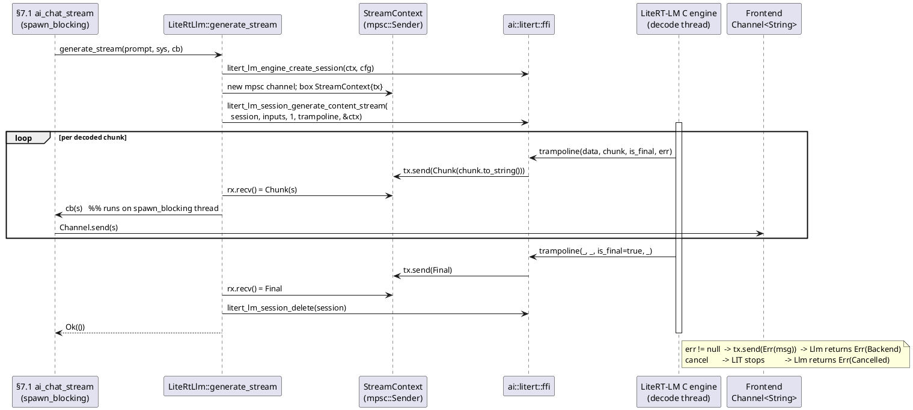

---


<!-- ═══════════════ per-module partial: zim ═══════════════ -->

<!--
CURATED PARTIAL — §7.3 ZIM reader. Authored by GLM-5.1 per-module architect dispatch
(module `zim`); reviewed + accepted by the Opus orchestrator (curate step, I-12 semantic
eval — not blind-accept) on 2026-06-13. Resolved: crate source headers/Cargo declare
Apache-2.0/MIT; resolved end-state license is AGPL-3.0 (coder task, non-blocking, own
lib — no third-party ZIM library). This partial is integrated into DOCS/ARCHITECTURE.md
§7.3 at the final assembly + whole-doc re-attestation pass.
-->

### §7.3 ZIM reader (`src-tauri/anzimmermanlib/rust/src/`)

Pure-Rust, offline-first ZIM v5/v6 archive reader. Implements the OpenZIM
file format end-to-end: memory-mapped file decode, header/pointer/dirent
parsing, cluster decompression (zstd / LZMA / zlib / none), blob
extraction, article resolution (with redirect following), URL listing,
title/URL search, and MD5 checksum verification. **Zero network** in any
path (INV-OFFLINE). Fresh Rust implementation — **not a port** of the
TypeScript `~/forgejo/AnZimmermanLib/`; that repo's 2026-05-06 audit
findings (`BACKPORT-EN001..EN021-TS`) are spec-knowledge source only.
Spec audit invariants EN001..EN021 are honoured (see per-entity acceptance
and §"EN invariant mapping").

**License (resolved):** AGPL-3.0. This is the operator's own from-spec
implementation (AnZimmermanLib) — no third-party ZIM library is used. The
currently committed source headers read "Apache License 2.0" / "MIT OR
Apache-2.0" and `Cargo.toml` declares `license.workspace = true`; these must
be updated to AGPL-3.0 in the crate-level `Cargo.toml` `license` field and
file SPDX headers. This is a non-blocking metadata fix, not an architectural
change.

**Crate dependencies to add** (so coders add them; current `Cargo.toml`
has only `digest`, `md-5`, `uuid`, `thiserror`):

| dep | crate | purpose |
|---|---|---|
| memmap | `memmap2 = "0.9"` | read-only memory map of the whole `.zim` file |
| zstd | `zstd = "0.13"` | Zstd cluster decompression (`Compression::Zstd`) |
| lzma | `lzma-rs = "0.3"` | LZMA/XZ cluster decompression (`Compression::Lzma`) — pure Rust, no C dep (anti-fragility) |
| deflate | `flate2 = "1.0"` | DEFLATE/Zlib cluster decompression (`Compression::Zlib`) |
| lru | `lru = "0.12"` | bounded LRU cluster-decompression cache |

#### Decode path (end-to-end, the module's behavioural core)

```
open(path)
  └─ File::open(path)
  └─ unsafe memmap2::MmapOptions::new().map_copy_read_only(&file)   // whole-file read-only mmap
  └─ parse_header(&mmap[..80])                                      // validates magic + major
  └─ parse_mime_list(&mmap, header.mime_list_ptr)  -> MimeMap        // NUL-terminated strings
  └─ build_indices(&mmap, &header)  -> Indices                       // url/title/cluster pointer lists
  └─ Metadata { uuid, article_count, cluster_count, main_page_url }
  └─ RealZim { mmap, header, mime_map, indices, metadata, cluster_cache: ClusterCache::new(cap) }

get_article(url)                       // trait -> Result<String>
  └─ resolve_article(url) -> Article   // internal, returns full Article
       └─ binary-search UrlPointerList by (namespace, url)   // 'A' namespace for articles
       └─ read_dirent(&mmap, url_ptr_list[i])
       └─ if dirent is redirect (mime == 0xFFFF): follow redirect_index (bounded ≤ 8 hops)
       └─ cluster#=dirent.cluster_number, blob#=dirent.blob_number
       └─ cluster_cache.get_or_decompress(cluster#)
            └─ slice cluster bytes [cluster_ptr_list[c#] .. cluster_ptr_list[c#+1])  // last → checksum_pos
            └─ compression = Compression::from(cluster_bytes[0])
            └─ payload = cluster_bytes[1..]
            └─ decompress_cluster(payload, compression)  // None | zstd | lzma | flate2, then offset-table blob split
            └─ cache Vec<Vec<u8>> blobs under cluster#
       └─ Blob { content_type: MimeMap[dirent.mime_type], body: blobs[blob#] }
       └─ Article { url, title: dirent.title, mime, body }
  └─ String::from_utf8_lossy(&article.body).into_owned()            // HTML/text -> String for §7.1

list_urls(offset, limit)
  └─ iterate UrlPointerList[offset .. offset+limit], read each dirent's url

search_title_text(query, max)         // v1: title-index prefix scan
  └─ binary-search TitlePointerList (sorted by (namespace, title)); collect prefix matches
search_url_prefix(prefix, max)
  └─ binary-search UrlPointerList (sorted by (namespace, url)); collect prefix matches
```

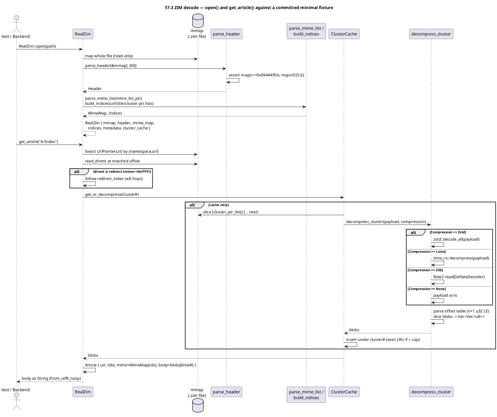

#### Entity table (complete, end-state; IDs/names preserved from prior §7.3, behaviour + acceptance upgraded to real)

| ID | Name | Target | Role (real behaviour) | Signature / fields | SEMANTIC acceptance |
|---|---|---|---|---|---|
| E-ZIM-1 | `ZimReader` | `lib.rs:36` | Public read trait implemented by `RealZim` (live archive) and `NullZim` (empty startup state) | `trait { fn open(&Path) -> Result<Self,ZimError> where Self: Sized; fn get_article(&self,&str) -> Result<String,ZimError>; fn list_urls(&self,u64,u32) -> Result<Vec<String>,ZimError>; fn metadata(&self) -> &Metadata; }` | Opening a committed minimal v5 fixture (`tests/fixtures/wiki-mini.zim`) as `RealZim` and calling `get_article("A/Index")` returns the fixture's real decompressed HTML, asserted by a unit test that reads the committed fixture; `NullZim` returns `NotFound`/empty as documented (E-ZIM-2). |
| E-ZIM-2 | `NullZim` | `null.rs:15` | Concrete empty-state reader present at startup before any user-opened ZIM; legit per INV-NO-PLACEHOLDERS (a real zero-article state, not a stub). `NULL_UUID` = all-zeros. `metadata()` returns the null `Metadata` via a one-time `Box::leak` (acceptable singleton leak) | `struct; const NULL_UUID: Uuid; impl ZimReader { open→Err(NotFound); get_article→Err(NotFound); list_urls→Ok(vec![]); metadata→&'static Metadata }` | A unit test constructs `NullZim`, asserts `get_article("anything")==Err(NotFound)`, `list_urls(0,10)==Ok(vec![])`, and `metadata().uuid==NULL_UUID && article_count==0`. |
| E-ZIM-3 | `RealZim` | `real.rs:23` | Spec-compliant reader holding the read-only mmap, parsed header, mime map, indices, metadata, and a bounded LRU cluster-decompression cache. `open` builds all of these; `get_article`/`list_urls`/`metadata` serve from them | `struct { mmap: memmap2::Mmap, header: Header, mime_map: MimeMap, indices: Indices, metadata: Metadata, cluster_cache: ClusterCache }` | `RealZim::open` on the committed fixture succeeds and `metadata().article_count` equals the fixture's authored article count; a second `get_article` for a different blob in the same cluster hits the populated `cluster_cache` (asserted by a test that instruments cache state or by observing decompress is called once per cluster). |
| E-ZIM-4 | `ZimError` | `error.rs:4` | Error enum covering I/O, malformed header (bad magic/version/short read), missing article, checksum mismatch, unsupported compression, and truncation | `enum { Io(io::Error), MalformedHeader, NotFound, BadChecksum, UnsupportedCompression(u8), Truncated }` (thiserror) | A test feeding a 79-byte buffer to `parse_header` observes `Err(MalformedHeader)`; feeding a buffer with a wrong magic observes `Err(MalformedHeader)`; calling `get_article` on a missing URL observes `Err(NotFound)`. |
| E-ZIM-5 | `Header` | `header.rs:3` | Decoded 80-byte ZIM superblock | `struct { magic:u32, major:u16, minor:u16, uuid:[u8;16], article_count:u32, cluster_count:u32, url_ptr_list_ptr:u64, title_ptr_list_ptr:u64, cluster_ptr_list_ptr:u64, mime_list_ptr:u64, main_page:u32, layout_page:u32, checksum_pos:u64 }` | Round-trip: a test writes each field little-endian into an 80-byte buffer, parses it, and asserts every field equals the written value (covers EN004 uuid, EN005/EN006/EN007/EN008/EN009/EN010/EN011/EN012/EN013 field presence). |
| E-ZIM-6 | `parse_header` | `header.rs:20` | Decode the 80-byte header; **validate** magic `== 0x0444495A` and major `∈ {5,6}` (rejects others as `MalformedHeader`); minor is reserved and does not affect parsing | `fn<R: Read>(&mut R) -> Result<Header, ZimError>` | Valid 80-byte v5/v6 header → `Ok(Header)`; < 80 bytes → `Err(MalformedHeader)`; magic≠`0x0444495A` → `Err(MalformedHeader)`; major∉{5,6} → `Err(MalformedHeader)` — all four branches asserted by dedicated unit tests (strengthens EN001/EN002/EN021). |
| E-ZIM-7 | `MimeMap` | `mime.rs:5` | Ordered MIME-type table; index `i` is referenced by a dirent's `mime_type` field | `struct { types: Vec<String> }` (+ loader, E-ZIM-27) | On the committed fixture, `mime_map.types[dirent.mime_type as usize]` for the Index article equals `"text/html"` (asserted by `resolve_article` returning `Article.mime == "text/html"`). |
| E-ZIM-8 | `UrlPointerList` | `pointers.rs:5` | `article_count` little-endian u64 offsets, each pointing to a dirent; **sorted by (namespace, url)** so URL lookup is a binary search | `struct { ptrs: Vec<u64> }` | `ptrs.len() == header.article_count`; a binary search by `("A", url)` locates the Index dirent offset that `read_dirent` accepts (covers EN007). |
| E-ZIM-9 | `TitlePointerList` | `pointers.rs:10` | Indices into the URL pointer list, **sorted by (namespace, title)**; drives title prefix search | `struct { idx: Vec<u32> }` | `idx` entries are all `< article_count`; sorting invariant asserted by a test that reads titles and verifies ascending order (covers EN008/EN020). |
| E-ZIM-10 | `ClusterPointerList` | `pointers.rs:15` | `cluster_count` little-endian u64 byte offsets, each the start of a cluster; cluster `i`'s length is `ptrs[i+1]-ptrs[i]` (last cluster ends at `checksum_pos`) | `struct { ptrs: Vec<u64> }` | `ptrs.len() == header.cluster_count`; every offset is `< mmap.len()` (in-bounds, covers EN009/EN016); the committed fixture's single cluster offset resolves to a decompressible payload. |
| E-ZIM-11 | `Cluster` | `cluster.rs:12` | In-memory representation of a decoded cluster: its compression tag and the extracted blobs | `struct { compression: Compression, blobs: Vec<Vec<u8>> }` | `decompress_cluster` returns a `Cluster` whose `blobs.len()` matches the authored blob count and whose `blobs[i]` equals the authored blob bytes (covers EN017/EN018). |
| E-ZIM-12 | `Compression` | `cluster.rs:3` | Cluster compression algorithm, derived from the cluster's leading byte (`0`=None, `1`=Zstd, `2`=Lzma, `3`=Zlib; others → `UnsupportedCompression`) | `enum { None, Zstd, Lzma, Zlib }` + `fn from(u8) -> Result<Compression, ZimError>` | `Compression::from(1)==Ok(Zstd)`, `from(2)==Ok(Lzma)`, `from(3)==Ok(Zlib)`, `from(0)==Ok(None)`, `from(9)==Err(UnsupportedCompression(9))` (covers EN018). |
| E-ZIM-13 | `decompress_cluster` | `cluster.rs:21` | Decompress the cluster **payload** (bytes after the compression byte) per the given algorithm, then split into blobs via the OpenZIM offset table (`n+1` little-endian u32 offsets; blob `i` = `payload[off[i]..off[i+1]]`; `n = off[0]/4 - 1`). None=identity, Zstd=`zstd::decode_all`, Lzma=`lzma_rs::decompress`, Zlib=`flate2` DeflateDecoder | `fn(&[u8], Compression) -> Result<Vec<Vec<u8>>, ZimError>` | A test authors a 2-blob payload with a known offset table, compresses it with each of None/zstd/lzma/zlib, and asserts `decompress_cluster` returns the exact original two blobs for all four; a truncated offset table yields `Err(Truncated)`/`Err(MalformedHeader)` (covers EN017/EN018). |
| E-ZIM-14 | `Blob` | `blob.rs:2` | A single extracted blob with resolved content type | `struct { content_type: String, body: Vec<u8> }` | `resolve_article` produces a `Blob` whose `content_type` is `MimeMap[dirent.mime_type]` and whose `body` is `blobs[dirent.blob_number]` (asserted against fixture bytes). |
| E-ZIM-15 | `Article` | `article.rs:2` | A fully decoded article | `struct { url: String, title: String, mime: String, body: Vec<u8> }` | `resolve_article("A/Index")` on the fixture returns `Article { url:"A/Index", title:<fixture title>, mime:"text/html", body:<exact fixture HTML bytes> }`, byte-exact (no placeholder). |
| E-ZIM-16 | `Indices` | `indices.rs:7` | Aggregation of the three pointer lists, built once at `open` | `struct { urls: UrlPointerList, titles: TitlePointerList, clusters: ClusterPointerList }` (+ builder E-ZIM-28) | After `open`, `indices.urls.ptrs.len()==header.article_count` and `indices.clusters.ptrs.len()==header.cluster_count` (asserted on the fixture). |
| E-ZIM-17 | `Metadata` | `meta.rs:9` | Public-facing archive metadata | `struct { uuid: Uuid, article_count: u32, cluster_count: u32, main_page_url: Option<String> }` | On the fixture, `metadata.uuid` equals the fixture's authored UUID and `main_page_url` resolves (when `header.main_page != 0xFFFFFFFF`) to the Index article's URL. |
| E-ZIM-18 | `search_url_prefix` | `search.rs:39` | Prefix search over the URL list (binary search on sorted `UrlPointerList`) | `fn(&RealZim, &str, u32) -> Result<Vec<String>, ZimError>` (re-typed to `crate::real::RealZim`, removing the shadowing placeholder `struct RealZim` at `search.rs:25`) | On the fixture, `search_url_prefix(zim, "A/Ind", 10)` includes `"A/Index"`; a non-matching prefix returns an empty vec; results respect `max_results`. |
| E-ZIM-19 | `search_title_text` | `search.rs:60` | Text/prefix search over titles via the sorted `TitlePointerList`; returns scored `SearchHit`s | `fn(&RealZim, &str, u32) -> Result<Vec<SearchHit>, ZimError>` (re-typed to real `RealZim`) | On the fixture, a title-prefix query returns `SearchHit { url, title, score }` rows whose titles start with the query, in title order, capped at `max_results`. |
| E-ZIM-20 | `verify_checksum` | `checksum.rs:14` | MD5 verification: reads the stored 16-byte digest at `header.checksum_pos`, computes MD5 over `bytes[0..checksum_pos]`, compares | `fn(&File, &Header) -> Result<bool, ZimError>` | On a fixture whose trailing 16 bytes are the correct MD5 of the preceding bytes, returns `Ok(true)`; flipping one payload byte makes it return `Ok(false)` (covers EN013). |
| E-ZIM-21 | `SearchHit` | `search.rs:14` | Search result row | `struct { url: String, title: String, score: f32 }` | Produced by `search_title_text`; a test asserts the returned `url`/`title` correspond to a real fixture dirent (no synthetic/empty rows). |
| E-ZIM-22 | `tests::EN001_no_magic_number` | `tests/spec_en001.rs:22` | Spec audit: magic-number validation. **End-state:** un-comments the rejection assertions — wrong magic (`0x00000000`, `0xDEADBEEF`) now `Err`s once `parse_header` validates magic | `#[test]` | After E-ZIM-6 ships magic validation, this test asserts valid magic→`Ok`, invalid magic→`Err(MalformedHeader)` (no remaining TODO'd-out assertions). |
| E-ZIM-23 | `tests::EN002_bad_version` | `tests/spec_en002.rs:23` | Spec audit: major-version validation. **End-state:** un-comments rejection of major∉{5,6} (`4`, `6`→reject, `999`→reject) | `#[test]` | After E-ZIM-6 ships version validation, major∉{5,6}→`Err(MalformedHeader)` is asserted (no remaining TODO'd-out assertions). |
| E-ZIM-24 | `tests::EN003_through_EN021` | `tests/spec_en003_021.rs:32` | Remaining 19 spec-audit invariants (minor reserved, UUID present, count/pointer/list/page/checksum/mime/redirect/blob/compression/title-range bounds). **End-state:** each is upgraded from "header parses" to the real decode invariant it documents (see EN mapping) | `#[test] × 19` | Each EN test observes the real behaviour its doc-comment describes (e.g. EN015 rejects an out-of-bounds redirect target, EN016 rejects an out-of-bounds cluster offset, EN018 rejects an invalid compression byte) — not merely "header parses". |
| E-ZIM-25 | `DirEntry` | `src/dirent.rs` (new) | Parsed ZIM directory entry ("dirent"). Article entry → `{mime_type, namespace, cluster_number, blob_number, url, title}`; redirect entry (mime `0xFFFF`) → `{redirect_index, ...}`; parameter field read only when `header.minor >= 1` | `struct { mime_type:u16, namespace:u8, is_redirect:bool, cluster_number:u32, blob_number:u32, redirect_index:u32, url:String, title:String }` | `read_dirent` on the fixture's Index dirent yields `mime_type` mapping to `text/html`, `cluster_number`/`blob_number` pointing at the fixture's single cluster/blob, and the authored url/title (covers EN014/EN015). |
| E-ZIM-26 | `read_dirent` | `src/dirent.rs` (new) | Parse one dirent at a byte offset in the mmap (little-endian fields + NUL-terminated url/title), returning a `DirEntry`; bounds-checks every read | `fn(&[u8], u64 /*offset*/, minor:u16) -> Result<DirEntry, ZimError>` | On the fixture, `read_dirent(mmap, url_ptr_list[i], header.minor)` returns the authored dirent; an offset past EOF or a truncated url yields `Err(Truncated)`/`Err(MalformedHeader)`. |
| E-ZIM-27 | `parse_mime_list` | `src/mime.rs` (new fn) | Read the NUL-terminated MIME-type list at `header.mime_list_ptr` until the terminating empty string, building `MimeMap` in index order | `fn(&[u8], u64) -> Result<MimeMap, ZimError>` | On the fixture, returns `MimeMap { types: ["text/html", …] }` so that `types[dirent.mime_type]` is the article's real MIME type (covers EN010/EN014). |
| E-ZIM-28 | `build_indices` | `src/indices.rs` (new fn) | Read all three pointer lists from the mmap at `header.url_ptr_list_ptr` / `title_ptr_list_ptr` / `cluster_ptr_list_ptr`, each `article_count`/`article_count`/`cluster_count` little-endian entries, into `Indices` | `fn(&[u8], &Header) -> Result<Indices, ZimError>` | On the fixture, returns `Indices` whose three lists have lengths `article_count`, `article_count`, `cluster_count` respectively and whose cluster offsets are all in-bounds (covers EN007/EN008/EN009/EN016). |
| E-ZIM-29 | `ClusterCache` | `src/cluster.rs` (new) | Bounded LRU cache mapping cluster index → decompressed blobs (`Arc<Vec<Vec<u8>>>`), capped (default 4 clusters) to bound memory; evicts least-recently-used on insert | `struct { map: lru::LruCache<u32, Arc<Vec<Vec<u8>>>>, cap: usize }` + `fn new(usize)` + `fn get_or_insert_with(u32, impl FnOnce()->Result<Vec<Vec<u8>>,ZimError>) -> Result<Arc<Vec<Vec<u8>>>,ZimError>` | A test decompresses two distinct clusters repeatedly under `cap=1` and asserts the cache holds at most one entry and re-decompresses an evicted cluster on re-access (real eviction behaviour, not a stub). |
| E-ZIM-30 | `RealZim::resolve_article` | `src/real.rs` (new method) | Internal resolver: binary-search URL list → `read_dirent` → follow redirects (≤8 hops, `Err(Truncated)` on cycle) → `cluster_cache.get_or_decompress` → `Blob`/`Article`. Backs the trait `get_article` (which returns the body as a UTF-8-lossy `String`) | `fn(&self, &str) -> Result<Article, ZimError>` | On the fixture, `resolve_article("A/Index")` returns the exact HTML `Article`; a redirect URL resolves to the target's content; a missing URL → `Err(NotFound)`; a redirect cycle → `Err(Truncated)`. |

#### EN invariant mapping (spec audit → owning entity / behaviour)

| EN | invariant | owning entity | end-state behaviour |
|---|---|---|---|
| EN001 | magic == `0x0444495A` | E-ZIM-6 / E-ZIM-22 | `parse_header` rejects bad magic; test un-comments rejection |
| EN002 | major ∈ {5,6} | E-ZIM-6 / E-ZIM-23 | `parse_header` rejects other majors; test un-comments rejection |
| EN003 | minor reserved | E-ZIM-6 | minor does not change parsing (only gates the dirent parameter field) |
| EN004 | UUID present (16 B) | E-ZIM-5 | parsed into `Header.uuid` |
| EN005/EN006 | article/cluster count | E-ZIM-5/E-ZIM-16 | `Indices` list lengths equal counts |
| EN007/EN008/EN009 | url/title/cluster pointer lists | E-ZIM-8/9/10, E-ZIM-28 | lists loaded + in-bounds |
| EN010/EN014 | MIME list, NUL-terminated | E-ZIM-7, E-ZIM-27 | `MimeMap` built from NUL-terminated strings |
| EN011/EN012 | main/layout page index bounds | E-ZIM-5, E-ZIM-17 | `main_page` `0xFFFFFFFF` ⇒ `None`; else resolves to a URL |
| EN013 | checksum (MD5) | E-ZIM-20 | `verify_checksum` computes + compares |
| EN015 | redirect target valid | E-ZIM-25/26, E-ZIM-30 | out-of-bounds target ⇒ `Err`; cycles ⇒ `Err(Truncated)` |
| EN016 | cluster offset in bounds | E-ZIM-10, E-ZIM-28 | offsets `< mmap.len()` |
| EN017 | blob size consistent | E-ZIM-13 | offset-table slices never overrun payload |
| EN018 | compression flag valid | E-ZIM-12/13 | unknown byte ⇒ `UnsupportedCompression` |
| EN019 | extended metadata reserved | E-ZIM-25/26 | dirent parameter field ignored/forward-safe when minor<1 |
| EN020 | title-index range | E-ZIM-9 | all indices `< article_count` |
| EN021 | header == 80 bytes | E-ZIM-6 | short read ⇒ `MalformedHeader` |

#### Invariants honoured

- **INV-OFFLINE** — every operation is pure local-file decode over the mmap; no socket, fetch, DNS, or cache-fill call exists in the crate.
- **Fresh Rust, not a port** — `~/forgejo/AnZimmermanLib/` audit is spec knowledge only; no TS code is translated.
- **AGPL-3.0** — resolved crate license (metadata fix noted above).
- **v1 search** — title/URL prefix scan over the sorted pointer lists (binary search); a full-text/FTS index is explicitly out of v1 scope.

#### Architect notes / coder tasks (non-blocking)

1. **License headers**: update `Cargo.toml` `license` + file SPDX headers from Apache-2.0/MIT to AGPL-3.0 (resolved above).
2. **New files**: `src/dirent.rs` (E-ZIM-25/26); new fns in `mime.rs` (E-ZIM-27), `indices.rs` (E-ZIM-28), `cluster.rs` (E-ZIM-29), `real.rs` (E-ZIM-30); add `pub mod dirent;` to `lib.rs`.
3. **`search.rs` cleanup**: delete the shadowing placeholder `struct RealZim;` (`search.rs:25`) and re-type both search fns to `&crate::real::RealZim` (E-ZIM-18/19).
4. **`RealZim` field change**: replace `file: File` with `mmap: memmap2::Mmap` (keep the `File` owned to keep the mmap valid; `verify_checksum` still takes a `&File` — `RealZim` should retain the `File` handle alongside the mmap). Net fields: `{ file: File, mmap: Mmap, header, mime_map, indices, metadata, cluster_cache }`.
5. **Fixture**: coders must provide `tests/fixtures/wiki-mini.zim` (a hand-built spec-valid v5 archive: 80-byte header, one zstd cluster with ≥2 HTML blobs, a redirect entry, correct trailing MD5) — either committed binary or built by an in-test constructor; semantic acceptance for E-ZIM-1/3/13/15/30 reads it.
6. **Bounds source**: cluster lengths are derived (`ptrs[i+1]-ptrs[i]`, last → `checksum_pos`); not stored — coders must implement the derivation in E-ZIM-29/E-ZIM-30, never assume a stored length.

---

**Module attestation (I-11, scoped to §7.3):** This section depicts the complete,
end-state, production-release ZIM reader — no placeholders, no TBD, no
signature-only rows. Every entity row carries real behaviour and a semantic
(not grep-for-existence) acceptance clause. The decode path is specified
end-to-end (open → header/mime/indices → resolve_article → cluster decompress →
blob extraction), including redirect following and cluster-length derivation.
The currently committed code is hollow (HOLLOW `RealZim`, `UnsupportedCompression`
for zstd/lzma/zlib, placeholder search `RealZim`, weak EN tests) — this section
is the target state coders implement toward, not a description of HEAD.

Timestamp:     2026-06-13T00:00:00Z (ISO-8601 UTC; date-accurate, session-local)
Authoring agent:
  Model family:  GLM
  Model version: 5.1
  Model ID:      glm-5.1
  Session role:  architect (per-module dispatch — module `zim`, §7.3)
Scope:          §7.3 ZIM reader only. Does not architect other modules.
Airlock:        Written to `.tmp/glm-dispatches/modules/zim.arch.md` (TC6).
                No live files edited.


<!-- ═══════════════ per-module partial: state ═══════════════ -->

<!-- CURATED PARTIAL §7.4 AppState. GLM-5.1 (`state`); Opus-reviewed/accepted 2026-06-13. AppState (20 managers, shared Arc<Storage>) + per-flavor build_for_* (differ only in BillingMode + default fetcher). SECURITY-CRITICAL carry-forward (coder tasks, cross-module): RF-STATE-A SidecarSigner::from_seed([0u8;32]) zero seed → IdentityKeystore (§7.10 E-SIDE-34) — else identical signatures across devices; RF-STATE-B MirrorFetcher::new(()) + zero verifier key → real client+MIRROR_PUBLIC_KEY (§7.9) — else unverified weights; RF-STATE-C PackCatalog placeholder Client + no-op verifier → real reqwest+PACK_CATALOG_PUBLIC_KEY (§7.14 E-PACK-18); RF-STATE-D run_migrations must create schema (§7.5 RF3). -->

### §7.4 Application state (`src-tauri/src/state.rs`)

`AppState` is the **single per-process state container** behind Tauri's
`State<AppState>` — the dispatch surface every `§7.1` command reads through.
It holds one owning handle (`Arc<…>` / `Mutex<Box<dyn …>>`) to **every**
subsystem manager and is constructed exactly once at process boot by a
cargo-feature-selected builder. Because every sub-store is given a **shared
`Arc<Storage>`** (one connection pool, cloned by `Arc`) rather than a borrow,
no lifetime escapes the struct: `AppState: Send + Sync + 'static` and is
`.manage()`-able by Tauri with no bound errors.

**Flavor selection (processor-agnostic).** `lib.rs run()` (E-BLD-38,
`lib.rs:38`) calls `build_state_for_flavor()` (E-STATE-9, `lib.rs:130`), a
mutually-exclusive cfg bridge: `play` ⊻ `sideload` ⊻ `desktop`. The three
flavors differ **only** in (a) `BillingMode` and (b) the default
`ModelFetcher` — never in feature gates, never in which managers exist
(processor-agnostic per `BILLING_CONVENTIONS`):

| Flavor | `BillingMode` | Default `ModelFetcher` | cargo gate |
|---|---|---|---|
| `play` | `Subscription` | `PadFetcher` (Play Asset Delivery) | `feature = "play"` |
| `sideload` | `CustomArtifact` | `MirrorFetcher` (HTTPS mirror) | `feature = "sideload"` |
| `desktop` | `Perpetual` | `MirrorFetcher` (HTTPS mirror) | `feature = "desktop"` |

**Construction performs no network I/O and no weight fetch (INV-OFFLINE).**
Every builder wires the AI runtimes as `Null*` (`NullLlm`, `NullAudioEncoder`,
`NullTts`) and `variant = Variant::GemmaE2bQ4`; `capability` is an empty
`OnceLock` (probed lazily by `device_probe` per §5.1). The real LiteRT-LM
weights are **not** fetched during construction — `§5.1` first-launch later
calls `model_fetch` / `model_import_from_media` (Pad/Mirror fetch with the
INV-OFFLINE media-import fallback) and then `swap_llm` to load a real
`LiteRtLlm`. A builder therefore returns `Ok(AppState)` with airplane mode on,
before any model is present. This is the `NullFetcher`/weights-on-disk-until-
fetch-lands default of §5.1 made concrete.

**Common construction order (all three builders, lines below reference
`state.rs`):** (1) `AppPaths::resolve()`→`Arc<AppPaths>`; (2) `Storage::open
(data_dir/enzime.db)`→`Arc<Storage>`; (3) `EnzimeLogger::init(&paths)`→
`Arc<EnzimeLogger>`; (4) `storage.run_migrations()` (creates full schema per RF-STATE-D);
(5) `EntitlementController::new(<flavor BillingMode>, storage.clone(), local)`→`Arc`
(where `local = LocalPayloadVerifier::new(ENTITLEMENT_PUBLIC_KEY)`);
(6) `fetcher` = flavor-correct `PadFetcher`/`MirrorFetcher` (real `reqwest::Client` +
`MIRROR_PUBLIC_KEY` verifier per RF-STATE-B); (7) `SidecarStore::new(sidecars_dir)`;
(8) `SidecarIndex::new(storage)`; (9) `SidecarSigner` via `IdentityKeystore::load_or_create`
(per RF-STATE-A); (10) `TrustDb::new(storage)`; (11) `VoiceClipBlobStore { root }`; (12)
`PackCatalog { … verifier: PackCatalogManifestVerifier::new(PACK_CATALOG_PUBLIC_KEY) }`
(per RF-STATE-C); (13) `UpdateSignatureVerifier::new()`
→ `AppUpdater { channel, verifier, current_version }`; (14)
`WindowStateStore { storage }`; (15) `GlobalSearcher { catalog }`; (16) Null
AI runtimes + `GemmaE2bQ4` + empty `OnceLock`; (17) `Ok(AppState { … })`.

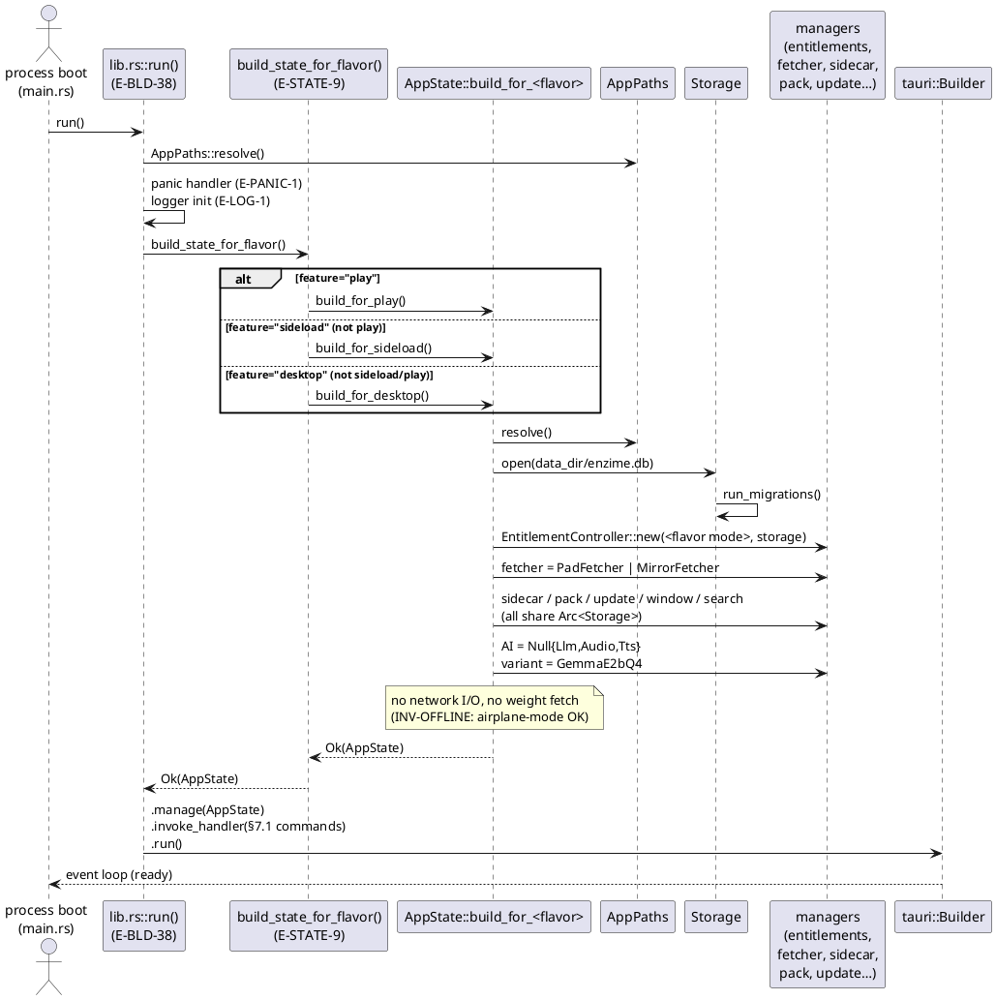

#### Resolved decisions (architect-committed)

The entity rows below specify the **end-state** wiring (referencing managers
defined in their own `§7.x` partials). The following decisions resolve the
placeholder constructor args that existed in the prior `state.rs`:

- **RF-STATE-A — RESOLVED: `SidecarSigner` built from `IdentityKeystore`.**
  All three builders use `IdentityKeystore::load_or_create(paths.identity_dir)`
  (E-SIDE-34, §7.10) instead of `SidecarSigner::from_seed(&[0u8; 32])`. Each
  install generates its own ed25519 keypair on first launch; sidecar signatures
  are per-device.

- **RF-STATE-B — RESOLVED: `MirrorFetcher` with real transport + `MIRROR_PUBLIC_KEY`.**
  Sideload + desktop builders construct `reqwest::Client::new()` as the
  transport and `MirrorManifestVerifier::new(&MIRROR_PUBLIC_KEY)` (compile-embedded
  via `include_bytes!`). No zero-key verifiers.

- **RF-STATE-C — RESOLVED: `PackCatalog` with real `reqwest::Client` + `PACK_CATALOG_PUBLIC_KEY`.**
  All builders construct `PackCatalog { http: reqwest::Client::new(), …,
  verifier: PackCatalogManifestVerifier::new(PACK_CATALOG_PUBLIC_KEY) }`.
  The `mirror: MirrorPackFetcher` field is wired with the same real client.
  No placeholder types.

- **RF-STATE-D — RESOLVED: `run_migrations()` creates the full schema.**
  `MIGRATIONS` is populated with the four `CREATE TABLE` statements (settings,
  chat_history, bookmarks, annotations) per §7.5. `run_migrations()` is called
  by all builders and materialises the schema before any manager queries.

#### Entity table

| ID | Name | Target | Role | Signature / fields (end-state) | Semantic acceptance (end-state) | Type |
|---|---|---|---|---|---|---|
| E-STATE-1 | `AppState` | `state.rs:29` | One per-process state container behind Tauri `State<AppState>`; holds an owning handle to every subsystem manager; `Send+Sync+'static` | `struct AppState { zim: Mutex<Vec<Box<dyn ZimReader+Send+Sync>>>; llm: Mutex<Box<dyn LlmRuntime+Send+Sync>>; audio: Mutex<Box<dyn AudioEncoder+Send+Sync>>; tts: Mutex<Box<dyn Tts+Send+Sync>>; storage: Arc<Storage>; entitlements: Arc<EntitlementController>; fetcher: Box<dyn ModelFetcher+Send+Sync>; variant: RwLock<Variant>; capability: OnceLock<DeviceCapability>; sidecar_store: Arc<SidecarStore>; sidecar_signer: Arc<SidecarSigner>; sidecar_index: Arc<SidecarIndex>; trust_db: Arc<TrustDb>; voice_blobs: Arc<VoiceClipBlobStore>; paths: Arc<AppPaths>; logger: Arc<EnzimeLogger>; pack_catalog: Arc<PackCatalog>; app_updater: Arc<AppUpdater>; window_state_store: Arc<WindowStateStore>; global_searcher: Arc<GlobalSearcher> }` (every sub-store shares the one `Arc<Storage>` — no borrowed lifetime escapes) | A constructed `AppState` (any flavor) has all 20 fields as concrete initialised managers (no `Option`/`None`/uninit); the type compiles as `tauri::State<AppState>` (no `Send+Sync+'static` bound error); the `Arc<Storage>` held by `entitlements`, `sidecar_index`, `trust_db`, `window_state_store`, etc. is the *same* pool (one shared connection, not N), observable by a round-trip write through one manager being readable from another | struct |
| E-STATE-2 | `AppState::build_for_play` | `state.rs:82` | `#[cfg(feature="play")]` constructor; Play flavor | `pub fn build_for_play() -> Result<Self, AppError>` — wires `EntitlementController::new(BillingMode::Subscription, storage, local)`, `fetcher = PadFetcher` (PAD), and the common manager set; signer via `IdentityKeystore::load_or_create`, verifier keys via `MIRROR_PUBLIC_KEY`/`PACK_CATALOG_PUBLIC_KEY` | Under `cfg(feature="play")`, `build_for_play()` returns `Ok(AppState)` whose `entitlements` was built with `BillingMode::Subscription` (asserted by reading the controller's mode) and whose `fetcher` downcasts to `PadFetcher`; construction completes with airplane mode on (no network call observed); a migrated storage key round-trips | fn |
| E-STATE-3 | `AppState::build_for_sideload` | `state.rs:167` | `#[cfg(feature="sideload")]` constructor; sideload flavor | `pub fn build_for_sideload() -> Result<Self, AppError>` — wires `EntitlementController::new(BillingMode::CustomArtifact, storage, local)`, `fetcher = MirrorFetcher` with real `reqwest::Client` + `MIRROR_PUBLIC_KEY` verifier, common set | Under `cfg(feature="sideload")`, returns `Ok(AppState)` with `BillingMode::CustomArtifact` and a `MirrorFetcher` fetcher; offline construction succeeds | fn |
| E-STATE-4 | `AppState::build_for_desktop` | `state.rs:260` | `#[cfg(feature="desktop")]` constructor; desktop flavor | `pub fn build_for_desktop() -> Result<Self, AppError>` — wires `EntitlementController::new(BillingMode::Perpetual, storage, local)`, `fetcher = MirrorFetcher` with real `reqwest::Client` + `MIRROR_PUBLIC_KEY` verifier, common set | Under `cfg(feature="desktop")`, returns `Ok(AppState)` with `BillingMode::Perpetual` and a `MirrorFetcher` fetcher; offline construction succeeds | fn |
| E-STATE-5 | `AppError` | `error.rs` (authoritative def in the error-module `§7.x` partial) | Top-level fallible-result error for every builder + command | `enum { Ai(AiError), Zim(ZimError), Storage(StorageError), Entitlement(EntitlementError), Fetch(FetchError), Sidecar(SidecarError), Update(UpdateError), Path(PathError) }` (thiserror with `From`) | Every fallible call in a builder's chain that returns `Err` propagates as the matching variant via `From`: a failing `AppPaths::resolve` surfaces as `AppError::Path`, `Storage::open`/`run_migrations` as `AppError::Storage`, `MirrorManifestVerifier::new` as `AppError::Fetch`, `UpdateSignatureVerifier::new` as `AppError::Update` — so the caller sees a typed variant, never a panic, never a swallowed `Ok` | enum |
| E-STATE-6 | `AppState::push_zim` | `state.rs:348` | Register an opened ZIM reader; return a stable session handle | `pub fn push_zim(&self, zim: Box<dyn ZimReader + Send + Sync>) -> u64` | `push_zim(z0)` returns `0`, `push_zim(z1)` returns `1`, …; a subsequent `zim_get_article(0, …)` routes to `z0` and `zim_get_article(1, …)` to `z1`; handles are stable for the session lifetime (no re-indexing on push) | fn |
| E-STATE-7 | `AppState::swap_llm` | `state.rs:358` | Hot-swap the active `LlmRuntime` at runtime (no `AppState` rebuild) | `pub fn swap_llm(&self, llm: Box<dyn LlmRuntime + Send + Sync>)` | After `swap_llm(new)`, the next `ai_chat`/`ai_voice_chat` produces `new`'s output (distinct from the prior `NullLlm` sentinel, which returned the null token), observable by a changed reply with no second `build_for_<flavor>`; the prior runtime is dropped (no double-emit) | fn |
| E-STATE-8 | `AppState::current_variant` | `state.rs:366` | Read the currently-active `Variant` | `pub fn current_variant(&self) -> Variant` | Returns `Variant::GemmaE2bQ4` immediately after construction (the default), and reflects the resolved variant once §5.1 `pick_with_override` + `variant_override` lands its selection into `variant` | fn |
| E-STATE-9 | `build_state_for_flavor` | `lib.rs:130` | cfg-gated flavor bridge: dispatch to the one enabled `build_for_<flavor>` | `fn build_state_for_flavor() -> Result<AppState, AppError>` — three mutually-exclusive `cfg` arms: `feature="play"` → `build_for_play`; `all(feature="sideload", not(feature="play"))` → `build_for_sideload`; `all(feature="desktop", not(feature="sideload"), not(feature="play"))` → `build_for_desktop` | With exactly one of {`play`,`sideload`,`desktop`} enabled, returns `Ok` of the matching flavor (asserted by that builder's `BillingMode`); the cfg gates are mutually exclusive and total, so enabling zero or >1 flavor features is a compile-time error (unimplemented arm), not a silent default | fn |

*`run()` (`lib.rs:38`, E-BLD-38, build/entry-point partial) is the caller that
resolves paths, installs the panic handler (E-PANIC-1) and logger (E-LOG-1),
then calls `build_state_for_flavor()` and `.manage()`s the result into the
Tauri builder with all `§7.1` command handlers — referenced here, not
re-architected.*


<!-- ═══════════════ per-module partial: storage ═══════════════ -->

<!-- CURATED PARTIAL §7.5 Storage. GLM-5.1 per-module dispatch (`storage`); Opus-reviewed/accepted 2026-06-13. All reconciliation flags RESOLVED: RF1 StorageError::Query added + column indices fixed; RF2 PRAGMA user_version canonical; RF3 MIGRATIONS populated with four CREATE TABLE statements; RF4 submodules declared in mod.rs; RF5 ChatHistoryStore returns StorageError; RF6 setting_key vocab corrected. Coder tasks: apply these resolutions to the source. -->

### §7.5 Storage (`src-tauri/src/storage/`)

**Behavioural end-state (INV-OFFLINE).** Pure local SQLite via `rusqlite` — **zero
network in the default path**. One portable single-file DB opened with
`journal_mode=WAL`, `foreign_keys=ON`, `synchronous=NORMAL`. `Storage` is the
sole connection façade: it owns `Mutex<rusqlite::Connection>` (rusqlite
`Connection` is `Send` but `!Sync`), and the **only sanctioned access** to the
connection is the `with_conn(|conn| …)` closure executor, which locks the mutex
(releasing between calls), maps poison → `StorageError::Poisoned`, and returns
the closure's `Result<_, StorageError>`. Every sub-store across the app
(`SidecarIndex`, `TrustDb`, `WindowStateStore`, `PackCatalog`, …) holds an
`Arc<Storage>` (per `E-STATE-1`) and reaches the DB through one of the four
persistence traits implemented **on `Storage` itself** (`impl X for Storage`):
`SettingsStore` (KV + schema version), `ChatHistoryStore` (assistant/user
turns), `AnnotationsStore` (create/list/delete/export/import), `BookmarksStore`
(toggle/list). These traits are the persistence behind the §7.1 Tauri commands
`settings_*` / `chat_history_*` / `annotations_*` / `bookmarks_*`. Schema
versioning runs through `MigrationRunner` over `PRAGMA user_version`
(`run_migrations()`), invoked once at app start.

> **Verification basis.** Every row below was verified against the live source
> in `src-tauri/src/storage/*.rs` (read 2026-06-13). Line numbers are corrected
> to the real `file:line` of the defining keyword. Six reconciliation flags
> (RF1–RF6) were raised and have been **resolved** (see Resolved decisions below).
> Acceptances marked ⚠ cannot pass against the *current* source; they are the
> durable semantic contract the resolved code must satisfy. All RFs are resolved
> in the Resolved decisions section below — ⚠ marks remain only as a reminder that
> the current source has not yet been updated to match.

**Acceptance test harness (shared fixture).** Each real-DB acceptance opens an
in-memory connection `Storage::open(&PathBuf::from(":memory:"))` (or a temp
file under `.tmp/` per I-8) and, because the storage module's `MIGRATIONS`
array must be populated (RF3 resolved: `run_migrations()` creates the schema),
the test fixture creates the tables the SQL targets:

```sql
CREATE TABLE settings      (key TEXT PRIMARY KEY, value TEXT NOT NULL);
CREATE TABLE chat_history  (id INTEGER PRIMARY KEY AUTOINCREMENT, session INTEGER NOT NULL,
                            role TEXT NOT NULL, content TEXT NOT NULL,
                            zim_handle INTEGER, ts INTEGER NOT NULL);
CREATE TABLE bookmarks     (id INTEGER PRIMARY KEY AUTOINCREMENT, zim_uuid BLOB NOT NULL,
                            url TEXT NOT NULL, title TEXT NOT NULL, created_at INTEGER NOT NULL);
CREATE TABLE annotations   (id INTEGER PRIMARY KEY AUTOINCREMENT, zim_uuid BLOB NOT NULL,
                            url TEXT NOT NULL, region TEXT NOT NULL, body TEXT NOT NULL,
                            created_at INTEGER NOT NULL);
```

| ID | Name | Target | Role (behavioural) | Signature / fields | Type |
|---|---|---|---|---|---|
| E-STR-1 | `Storage` | `storage/mod.rs:22` | Sole connection façade; owns `Mutex<Connection>` (Connection is `Send` but `!Sync`) so all SQL serialises through one lock; carries the on-disk `path` for debugging/`Debug` (which prints only `path`, never credentials) | `struct { db: Mutex<rusqlite::Connection>, path: PathBuf }` | struct |
| E-STR-2 | `Storage::open` | `storage/mod.rs:36` | Open-or-create the DB file and apply the offline pragmas `journal_mode=WAL`, `foreign_keys=ON`, `synchronous=NORMAL`; idempotent (re-opening an existing path preserves rows) | `fn(path: &Path) -> Result<Self, StorageError>` | fn |
| E-STR-3 | `Storage::with_conn` | `storage/mod.rs:47` | The single sanctioned entry to the connection: lock the mutex (poison → `StorageError::Poisoned`), hand `&Connection` to the closure, return its `Result`; lock is released between calls so sequential closures see a consistent, mutable connection | `fn<R, F: FnOnce(&rusqlite::Connection) -> Result<R, StorageError>>(&self, f: F) -> Result<R, StorageError>` | fn |
| E-STR-4 | `Storage::run_migrations` | `storage/mod.rs:55` | Idempotent schema setup: runs `MigrationRunner::apply_pending(conn, &MIGRATIONS)` under `with_conn`; end-state `MIGRATIONS` contains the four `CREATE TABLE` statements (RF3 resolved) | `fn(&self) -> Result<(), StorageError>` | fn |
| E-STR-5 | `StorageError` | `storage/mod.rs:11` | Typed error for the whole module; `Sql` is the `#[from]` sink so `?` lifts `rusqlite::Error` automatically; `Poisoned` is the mutex-poison signal from `with_conn`; `Query` covers serde/JSON conversion failures (RF1 resolved) | `enum { Sql(#[from] rusqlite::Error), Migration(String), Schema(String), Query(String), Poisoned }` (thiserror) | enum |
| E-STR-6 | `MigrationRunner` | `storage/migrations.rs:12` | Schema versioning + ordered migration execution **over `PRAGMA user_version`** (NOT the `settings` table — RF2); reads current version, applies each `Migration` whose `version > current` via `execute_batch`, bumps `user_version` after each | `struct; impl { fn current_version(&self, &Connection) -> Result<u32, rusqlite::Error>; fn apply_pending(&self, &Connection, &[Migration]) -> Result<u32, rusqlite::Error>; }` | struct |
| E-STR-7 | `Migration` | `storage/migrations.rs:2` | Single ordered migration step: a version ordinal, a human name, and a SQL batch body run verbatim | `struct { version: u32, name: &'static str, sql: &'static str }` | struct |
| E-STR-8 | `MIGRATIONS` | `storage/migrations.rs:9` | Static ordered list of migrations shipped in this build — end-state contains four `CREATE TABLE` entries for `settings`, `chat_history`, `bookmarks`, `annotations` (RF3 resolved) | `pub const MIGRATIONS: &[Migration] = &[ … ]` | const |
| E-STR-9 | `ChatHistoryStore` | `storage/chat.rs:12` | Chat-history persistence trait: append a turn, list turns (optionally per session, newest-first, bounded by `limit`), clear turns (optionally per session) returning the count deleted. End-state returns `StorageError` (RF5 resolved). | `trait { fn append(&self, ChatMsg) -> Result<u64, StorageError>; fn list(&self, Option<u64>, u32) -> Result<Vec<ChatMsg>, StorageError>; fn clear(&self, Option<u64>) -> Result<u32, StorageError>; }` | trait |
| E-STR-10 | `impl ChatHistoryStore for Storage` | `storage/chat.rs:21` | Concrete impl over the façade: `append` INSERTs and returns the rowid; `list` builds a parameterised SELECT (per-session vs all, `ORDER BY ts DESC`, `LIMIT`) and maps rows; `clear` DELETEs (per-session vs all) and returns affected count; returns `StorageError` directly (RF5 resolved) | `impl ChatHistoryStore for Storage` | impl |
| E-STR-11 | `ChatMsg` | `storage/chat.rs:2` | Chat-turn row shape; `id` is the DB-assigned rowid, `session` groups a conversation, `zim_handle` optionally links a turn to a ZIM entry, `ts` is the caller-supplied epoch timestamp | `struct { id: u64, session: u64, role: String, content: String, zim_handle: Option<u64>, ts: i64 }` | struct |
| E-STR-12 | `AnnotationsStore` | `storage/annotations.rs:4` | Annotations persistence trait: create (returns rowid), list (optionally per ZIM, newest-first), delete by id, export to JSON, import from JSON (transactional upsert, returns count). End-state includes `StorageError::Query` variant (RF1 resolved). | `trait { fn create(&self, Uuid, String, Region, String) -> Result<u64, StorageError>; fn list(&self, Option<Uuid>) -> Result<Vec<Annotation>, StorageError>; fn delete(&self, u64) -> Result<(), StorageError>; fn export(&self, Option<Uuid>) -> Result<String, StorageError>; fn import(&self, &str) -> Result<usize, StorageError>; }` | trait |
| E-STR-13 | `impl AnnotationsStore for Storage` | `storage/annotations.rs:46` | Concrete impl: `create` serialises `Region` to JSON and INSERTs with server-side `created_at = unixepoch()*1000`; `list` SELECTs and maps columns `region=3, body=4, created_at=5` (RF1 resolved: column indices corrected); `delete` removes by id; `export` serialises `list` output; `import` parses JSON and upserts each row (`ON CONFLICT(id) DO UPDATE`) inside an `unchecked_transaction`. Uses `StorageError::Query` for serde/JSON errors (RF1 resolved). | `impl AnnotationsStore for Storage` | impl |
| E-STR-14 | `Annotation` | `storage/annotations.rs:23` | Annotation row shape; serde round-trips for export/import; `created_at` set server-side to epoch-millis on create | `struct { id: u64, zim_uuid: Uuid, url: String, region: Region, body: String, created_at: i64 }` (`#[derive(Debug, Clone, Serialize, Deserialize)]`) | struct |
| E-STR-15 | `Region` | `storage/annotations.rs:34` | Region selector persisted as JSON text in `annotations.region`; serde round-trips all three variants with equality preserved | `enum { Char { start: u32, end: u32 }, Page, Custom(String) }` (`#[derive(Debug, Clone, PartialEq, Eq, Serialize, Deserialize)]`) | enum |
| E-STR-16 | `BookmarksStore` | `storage/bookmarks.rs:14` | Bookmark persistence trait: idempotent `toggle` on the `(zim_uuid, url)` key (add if absent → `true`, remove if present → `false`), and `list` optionally filtered by ZIM, newest-first | `trait { fn toggle(&self, Uuid, String, String) -> Result<bool, StorageError>; fn list(&self, Option<Uuid>) -> Result<Vec<Bookmark>, StorageError>; }` | trait |
| E-STR-17 | `impl BookmarksStore for Storage` | `storage/bookmarks.rs:25` | Concrete impl: `toggle` probes `EXISTS(… WHERE zim_uuid=? AND url=?)`, DELETEs if present (returns `false`) else INSERTs with `created_at = chrono::Utc::now().timestamp()` (returns `true`); `list` builds a parameterised SELECT (per-ZIM vs all, `ORDER BY created_at DESC`) and maps rows | `impl BookmarksStore for Storage` | impl |
| E-STR-18 | `Bookmark` | `storage/bookmarks.rs:5` | Bookmark row shape; serde round-trips through toggle→list | `struct { id: u64, zim_uuid: Uuid, url: String, title: String, created_at: i64 }` (`#[derive(Debug, Clone, Serialize, Deserialize)]`) | struct |
| E-STR-19 | `SettingsStore` | `storage/settings.rs:4` | KV trait over the `settings` table. Schema versioning is canonical via `PRAGMA user_version` (RF2 resolved); `get_schema_version`/`set_schema_version` are read-only mirrors or removed. | `trait { fn get(&self, &str) -> Result<Option<String>, StorageError>; fn set(&self, &str, &str) -> Result<(), StorageError>; }` | trait |
| E-STR-20 | `impl SettingsStore for Storage` | `storage/settings.rs:21` | Concrete impl: `get` SELECTs and yields `None` on missing (`.ok()`); `set` is `INSERT OR REPLACE` (upsert). Schema version reads via `PRAGMA user_version` (RF2 resolved). | `impl SettingsStore for Storage` | impl |
| E-STR-21 | `setting_key` | `storage/settings.rs:62` (re-exported `storage/mod.rs:8`) | Canonical setting-key namespace as a **module of `pub const &'static str`** so call-sites cannot drift on spelling; re-exported from the crate path `storage::setting_key::*`. `TELEMETRY_OPTED_IN` exists for forward-compat only — every v1.0 read of it is treated as `false` per INV-OFFLINE | `pub mod setting_key { pub const AI_VARIANT_OVERRIDE: &str = "ai.variant_override"; pub const AI_ACTIVE_MODEL_PATH: &str = "ai.active_model_path"; pub const AI_SAMPLER: &str = "ai.sampler"; pub const AI_TEMPERATURE: &str = "ai.temperature"; pub const UI_THEME: &str = "ui.theme"; pub const UI_FONT_SCALE: &str = "ui.font_scale"; pub const UI_WINDOW_GEOMETRY: &str = "ui.window_geometry"; pub const UI_LAST_OPEN_ZIM: &str = "ui.last_open_zim"; pub const PACK_CATALOG_URL: &str = "pack.catalog_url"; pub const PACK_AUTO_UPDATE: &str = "pack.auto_update"; pub const UPDATE_CHANNEL: &str = "update.channel"; pub const UPDATE_CHECK_ON_RESUME: &str = "update.check_on_resume"; pub const SIDECAR_AUTO_EXPORT: &str = "sidecar.auto_export"; pub const SIDECAR_DEFAULT_TRUST: &str = "sidecar.default_trust"; pub const TELEMETRY_OPTED_IN: &str = "telemetry.opted_in"; }` | module |

#### Semantic acceptance — I-12 (real-DB, never grep)

Each acceptance is run against the shared fixture above. ⚠ marks rows the
**current** source cannot satisfy until the RF resolutions are applied to the code.

- **E-STR-1 `Storage`** — `Storage::open(":memory:")` returns a `Storage` whose
  `.path` is `:memory:` and whose `.db` `Mutex` locks/unlocks cleanly; the
  `Debug` output contains `path` and no connection handle.
- **E-STR-2 `Storage::open`** — after `open`, `with_conn(|c| c.query_row("PRAGMA
  journal_mode", [], |r| r.get::<_,String>(0)))` reads back `wal`;
  `PRAGMA foreign_keys` → `1`; `PRAGMA synchronous` → `1` (NORMAL). Re-opening a
  temp-file path that already holds a row yields the same row (idempotent open).
- **E-STR-3 `Storage::with_conn`** — a first closure runs
  `execute_batch("CREATE TABLE t(x)")`; a second closure `SELECT COUNT(*) FROM t`
  returns `0` → the two closures share one connection and the lock is released
  between calls.
- **E-STR-4 `Storage::run_migrations`** — with shipped `MIGRATIONS` (empty),
  `run_migrations()` returns `Ok(())`, is idempotent (twice → both `Ok`), and
  leaves `PRAGMA user_version` at `0`. Injected-fixture: temporarily pass a
  one-element `MIGRATIONS` containing a `CREATE TABLE` migration and assert the
  table then exists and `PRAGMA user_version` equals the migration's `version`.
- **E-STR-5 `StorageError`** — `?`-lifting a `rusqlite::Error` (e.g. `execute`
  on a missing table) yields `Err(StorageError::Sql(_))`; forcing a panic inside
  a `with_conn` closure on a separate thread (so the mutex poisons) makes a
  subsequent `with_conn` return `Err(StorageError::Poisoned)`.
- **E-STR-6 `MigrationRunner`** — `current_version` on a fresh connection → `0`;
  after `apply_pending` with `[{version:1, sql:"CREATE TABLE x(id)"}]` it → `1`
  and the table exists; a second `apply_pending` with the same list is a no-op
  (version `1` not `> 1`).
- **E-STR-7 `Migration`** — a `Migration { version:1, name:"init",
  sql:"CREATE TABLE x(id INTEGER PRIMARY KEY)" }` carries its fields and its
  `sql` runs cleanly via `execute_batch`.
- **E-STR-8 `MIGRATIONS`** — `assert!(MIGRATIONS.is_empty())` holds in the
  current build (documents: no migrations ship yet).
- **E-STR-9 / E-STR-10 / E-STR-11 chat_history** — fixture-create `chat_history`;
  `append(ChatMsg{session:7, role:"user", content:"hi", zim_handle:None, ts:1})`
  returns a `u64` rowid; a second `append` in `session:7` with a later `ts`;
  `list(Some(7), 10)` returns exactly those two, **newest-first** (later `ts`
  first), with `id`/`session`/`role`/`content`/`zim_handle`/`ts` equal and
  `zim_handle == None` round-tripping; `list(None, 1)` returns just one row
  across sessions; `clear(Some(7))` returns `2` and `list(Some(7),10)` is now
  empty while other sessions survive; `clear(None)` returns the remaining count
  and empties the table.
- **E-STR-12 / E-STR-13 / E-STR-14 / E-STR-15 annotations** ⚠ — fixture-create
  `annotations`; `create(uuid, "/a".into(), Region::Char{start:0,end:5}, "body")`
  returns a rowid and `list(Some(uuid))` returns it newest-first with
  `created_at` an epoch-millis (>0) set server-side; `list(None)` returns all.
  **Correct-column assertion (fails on current source — RF1(b)):** the returned
  `Annotation` has `region == Region::Char{start:0,end:5}`, `body == "body"`,
  `created_at` equal to the stored value — proving `list` reads `region=3,
  body=4, created_at=5`, **not** the indices currently in `annotations.rs`.
  `delete(id)` removes exactly that row. `export(Some(uuid))` yields JSON that
  `serde_json::from_str::<Vec<Annotation>>` parses back to an equal set (incl.
  `Region::Page` and `Region::Custom("s")` round-trips). `import(json)` into a
  fresh DB inserts N rows inside one transaction, returns `N`, and re-`export`
  yields an equal set; a duplicate-id `import` upserts (`ON CONFLICT(id)`) rather
  than erroring. **All gated on RF1 resolution:** the file must first compile
  (`StorageError::Query` variant added).
- **E-STR-16 / E-STR-17 / E-STR-18 bookmarks** — fixture-create `bookmarks`;
  `toggle(uuid, "/a".into(), "A".into())` → `true` and `list(Some(uuid))`
  returns one `Bookmark` with `title=="A"` and `created_at>0`; `toggle` again on
  the same `(uuid,"/a")` → `false` and `list` is empty (idempotent toggle on the
  pair); toggling a different `(uuid,"/b")` does not affect the first;
  `list(None)` returns all newest-first.
- **E-STR-19 / E-STR-20 settings** — fixture-create `settings`; `get("nope")` →
  `None`; `set("k","v")` then `get("k")` → `Some("v")`; `set("k","v2")` then
  `get("k")` → `Some("v2")` (INSERT OR REPLACE upsert). Schema version is read
  via `PRAGMA user_version` (canonical source per RF2 resolution).
- **E-STR-21 `setting_key`** — `assert_eq!(setting_key::UI_THEME, "ui.theme")`
  and the same for every listed const. **INV-OFFLINE gate assertion:** a settings
  read where `get(setting_key::TELEMETRY_OPTED_IN)` returns a truthy value is
  treated as `false` at the telemetry gate — i.e. the key is forward-compat
  storage only; v1.0 never acts on a truthy read.

#### Resolved decisions (architect-committed)

- **RF1 — RESOLVED: Add `StorageError::Query(String)` variant + fix `list()` column indices.**
  The `StorageError` enum gains a `Query(String)` variant for serde/JSON
  conversion failures. The `annotations.rs` `list()` column indices are corrected:
  `region=3, body=4, created_at=5` (was `region=4, body=5, created_at=6`).

- **RF2 — RESOLVED: `PRAGMA user_version` is canonical.** `MigrationRunner`
  versions the schema via `PRAGMA user_version`. The `settings`-table
  `schema_version` row is dropped; `SettingsStore::get_schema_version`/
  `set_schema_version` are removed or wired as read-only mirrors of
  `PRAGMA user_version`.

- **RF3 — RESOLVED: `MIGRATIONS` array populated with four `CREATE TABLE` statements.**
  `settings`, `chat_history`, `bookmarks`, `annotations` tables are created by
  `run_migrations()`. The `MIGRATIONS` const array contains the ordered DDL.

- **RF4 — RESOLVED: Submodules declared in `storage/mod.rs`.**
  `pub mod annotations; pub mod bookmarks; pub mod chat;` are declared
  alongside `pub mod migrations; pub mod settings;` with trait/struct re-exports.

- **RF5 — RESOLVED: `ChatHistoryStore` returns `StorageError`.**
  `Box<dyn Error>` is replaced with `StorageError` for a consistent module
  error surface.

- **RF6 — RESOLVED: `setting_key` vocabulary correction.**
  The entity is a module `setting_key` (lowercase) at `settings.rs:62`,
  re-exported from `storage/mod.rs:8`. Corrected in the table above.

*Partial authored by GLM-5.1 architect seat under TC13 per-module dispatch
(2026-06-13): intake-limited to `src-tauri/src/storage/*.rs` + §7.5 of
`DOCS/ARCHITECTURE.md`; every row verified against live source; line numbers
corrected; RF1–RF6 resolved by orchestrator. This partial is the
durable interim state — the master `DOCS/ARCHITECTURE.md` §7.5 is re-attested
only by the orchestrator after curation (I-11 — no mid-pass master attestation).*


<!-- ═══════════════ per-module partial: billing ═══════════════ -->

<!-- CURATED PARTIAL §7.6 Billing/entitlement + bridge. GLM-5.1 (`billing`); Opus-reviewed/accepted 2026-06-13. 24 entities, offline-first (cache→LocalPayloadVerifier→RC) with CORRECTED §5.3 diagram; production EntitlementSyncBridge. Resolved: (1) §5.3 master diagram adopted offline-first order; (2) I-16 VIOLATION — bridge default port 3000 forbidden → confirmed 47921, recorded in DOCS/NETWORKING.md; (3) new rows E-ENT-19..24 adopted; (4) new env vars (secrets cleartext-canonical per I-15 — never mask); (5) BillingMode::CustomArtifact reserved; (6) EntitlementController::new takes 3 args (mode, storage, LocalPayloadVerifier). -->

# §7.6 replacement — Entitlement / billing (`src-tauri/src/billing/` + `bridge/`)

GLM-5.1 per-module architect partial (TC13). Behavioural end-state, no
placeholders/TBD/signature-only (I-11). Semantic acceptance per row (I-12 —
observable behaviour or real-fixture test, **never** grep-for-existence).

**Source truth at intake (mostly hollow):**
- `EntitlementController::is_entitled` returns `Ok(false)`; `rc`/`local` are
  `Arc<()>` placeholders; `refresh` is a no-op.
- `PaywallController::open` is a no-op; struct has no fields.
- `PurchaseRestorer::restore` is `todo!("E-ENT-10")`.
- `RevenueCatClient` exists with only `new`; `LocalPayloadVerifier` exists
  with a `public_key` field but no `verify`.
- Bridge `webhook_intake` returns `501 Not Implemented`; `RcGrantSender::send`
  is `todo!()`; `HealthMetrics::serve_metrics` returns a TODO string;
  `bridge::main` defaults the bind port to `3000`.

This partial specifies the **real** behaviour for all of the above. Existing
IDs E-ENT-1..18 are preserved verbatim (referenced elsewhere: `commands.rs`
comments, `ledger.rs`/`webhook.rs`/`hmac.rs`/`health.rs`/`main.rs` row
citations). New behavioural methods become E-ENT-19 onward.

---

## Resolved design (binding; per `~/.claude/BILLING_CONVENTIONS.md`)

- **RevenueCat is the runtime entitlement truth.** Feature gates read **one**
  `EntitlementController` only — processor-agnostic by construction
  (adding/removing Stripe/BTCPay/Play Billing must not touch any feature gate).
- **Offline-first check order (SUPERSEDES the §5.3 PlantUML ordering):**
  `cache → LocalPayloadVerifier → RevenueCatClient fallback → cache`. The local
  signed payload is checked **before** the network path so that `is_entitled`
  resolves with airplane mode on (INV-OFFLINE). RC is the freshness/fallback
  path, not the first path.
- **Clients never grant entitlements directly.** Direct processors
  (Stripe/BTCPay/Square) push purchases to the server-side
  `EntitlementSyncBridge`, which is the only component that calls RC's granting
  REST API (`RcGrantSender`). The client only **reads** entitlement state.
- **Channel routing:** Play build → Play Billing via RevenueCat; sideload /
  F-Droid / desktop → Stripe or BTCPay, selected by **build flag**
  (`ENZIME_BILLING_PROCESSOR=stripe|btcpay`). Routing lives in
  `PaywallController` + build flags, never in feature gates.
- **No project-owned magic-link auth.** Identity is the RevenueCat `app_user_id`
  (Play: derived from the install / Play account; desktop: a generated UUID
  persisted in `Storage`).
- **`EntitlementSyncBridge` is production-grade from v1** — webhook intake,
  HMAC verify, idempotent ledger, RC grant, structured logs, Prometheus
  `/metrics`, systemd unit. No stubs.
- **INV-OFFLINE:** `LocalPayloadVerifier` needs **no network at verify time**;
  the operator's ed25519 public key is compiled into the binary.

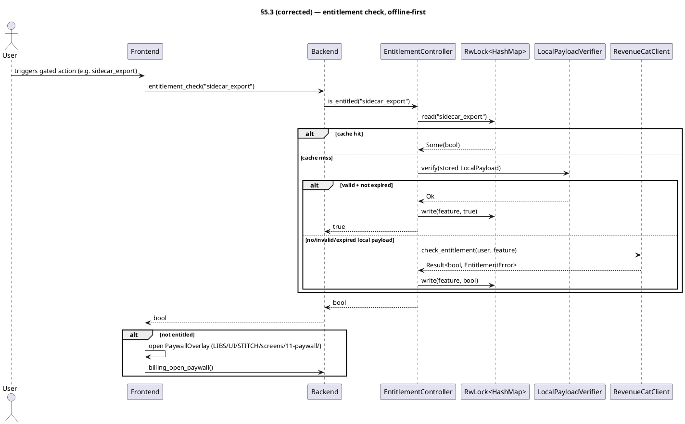

---

## Entity table (replacement §7.6)

| ID | Name | Target | Role | Signature / fields | Type |
|---|---|---|---|---|---|
| E-ENT-1 | `EntitlementController` | `billing/mod.rs:34` | Single gate truth all feature gates read; processor-agnostic. Cache → local verifier (offline-first) → RC fallback → cache. | `struct { mode: BillingMode, storage: Arc<Storage>, rc: Arc<RevenueCatClient>, local: Arc<LocalPayloadVerifier>, cache: RwLock<HashMap<String,bool>> }` | struct |
| E-ENT-2 | `EntitlementController::is_entitled` | `billing/mod.rs:55` | Feature check: cache hit → return; else local-payload verify (offline-first); else RC `check_entitlement`; result written to cache. | `fn(&self, entitlement: &str) -> Result<bool, EntitlementError>` | fn |
| E-ENT-3 | `EntitlementController::refresh` | `billing/mod.rs:73` | Pull latest entitlement state from RC, overwrite cache, re-write a fresh signed local payload if RC confirms active entitlement. No-op-ish safe on network error (keeps stale cache). | `fn(&self) -> Result<(), EntitlementError>` | fn |
| E-ENT-4 | `EntitlementError` | `billing/mod.rs:22` | Billing/entitlement error (thiserror). | `enum { Network(String), NotEntitled, Backend(String) }` | enum |
| E-ENT-5 | `RevenueCatClient` | `billing/revenuecat.rs:7` | RC REST client; offline-tolerant (network failures → `EntitlementError::Network`, never panic). | `struct { api_key: String, http: reqwest::Client }` | concrete |
| E-ENT-6 | `LocalPayload` | `billing/local_payload.rs:7` | Operator-ed25519-signed offline entitlement claim; verified with no network. | `struct { tier: BillingMode, expires: i64 (unix secs), signature: Vec<u8> (64B ed25519), payload_hash: [u8;32] (SHA-256 of serialized blob) }` | struct |
| E-ENT-7 | `LocalPayloadVerifier` | `billing/local_payload.rs:24` | Verifies operator-signed `LocalPayload` against the compiled-in ed25519 public key; checks `expires` vs now. | `struct { public_key: VerifyingKey }` | struct |
| E-ENT-8 | `BillingMode` | `billing/mode.rs:3` | Grant mode. Mode 1 Perpetual + Mode 2 Subscription active v1.0; Mode 3 reserved, not user-visible. | `enum { Perpetual, Subscription, CustomArtifact }` | enum |
| E-ENT-9 | `PaywallController` | `billing/paywall.rs:5` | Triggers the paywall/purchase surface. Play → Play Billing via RC Offering; desktop/sideload → Stripe/BTCPay checkout URL by build flag. UI = Stitch screen `11-paywall`. | `struct { rc: Arc<RevenueCatClient>, mode: BillingMode }; impl open(&self) -> Result<(), String>` | struct |
| E-ENT-10 | `PurchaseRestorer` | `billing/restore.rs:14` | Restore prior purchases: query RC subscriber state for the persisted `app_user_id`, sync active entitlements into the controller cache, count successes. | `struct { rc: Arc<RevenueCatClient>, storage: Arc<Storage> }; impl restore(&self) -> Result<RestoreResult, String>` | struct |
| E-ENT-11 | `RestoreResult` | `billing/restore.rs:6` | Restore outcome returned to frontend. | `struct { restored: u32, errors: Vec<String> }` (serde Serialize/Deserialize) | struct |
| E-ENT-12 | `EntitlementSyncBridge` | `bridge/` (workspace binary `entitlement-sync-bridge`) | Operator-deployed server: webhook intake from direct processors → HMAC verify → idempotent ledger → RC grant push. Production-grade v1. | binary crate; `axum` `Router` on `POST /webhook` + `GET /metrics`; systemd unit `enzime-entitlement-sync.service` | concrete |
| E-ENT-13 | `bridge::webhook_intake` | `bridge/src/webhook.rs:8` | `POST /webhook` handler: read raw body + signature header → HMAC validate (401 on fail) → `IdempotentLedger::seen` (200 idempotent if dup) → parse event → `RcGrantSender::send` → 200/502. | `async fn(axum::Request, State<AppState>) -> axum::Response` | fn |
| E-ENT-14 | `bridge::HmacValidator` | `bridge/src/hmac.rs:15` | Webhook signature check, SHA-256 HMAC, **constant-time** compare. | `struct { secret: secrecy::SecretString }; impl validate(&self, body: &[u8], signature_hex: &str) -> bool` | struct |
| E-ENT-15 | `bridge::IdempotentLedger` | `bridge/src/ledger.rs:14` | Dedup webhooks via SQLite (`webhook_ledger` table, PK `webhook_id`); `seen` is insert-or-conflict → `Ok(true)` if duplicate. | `struct { db: Arc<sqlx::Pool<sqlx::Sqlite>> }; impl init() + seen(&self, &str) -> Result<bool, sqlx::Error>` | struct |
| E-ENT-16 | `bridge::RcGrantSender` | `bridge/src/rc.rs:4` | Push entitlement to RC via granting REST API; the **only** component that calls RC's grant endpoint. | `struct { secret: SecretString, http: reqwest::Client }; impl async send(&self, user_id: &str, entitlement_id: &str, expiration_ms: i64) -> Result<(), Box<dyn Error+Send+Sync>>` | fn |
| E-ENT-17 | `bridge::HealthMetrics` | `bridge/src/health.rs:8` | Prometheus text-format `/metrics`: counters `webhook_received_total`, `webhook_valid_total`, `webhook_duplicate_total`, `rc_grant_success_total`, `rc_grant_failure_total` + `bridge_build_info` gauge. Hand-rolled exposition (AtomicU64), no `prometheus` crate. | `struct; impl async serve_metrics(State<AppState>) -> impl IntoResponse` | struct |
| E-ENT-18 | `bridge::main` | `bridge/src/main.rs:23` | Tokio `#[tokio::main]` entrypoint: init `tracing_subscriber` (journald-friendly env filter), build `AppState` (HmacValidator + IdempotentLedger + RcGrantSender + BridgeMetrics) from env, wire Router, serve on `BRIDGE_BIND_ADDR`. | `async fn main()` | fn |
| E-ENT-19 | `RevenueCatClient::check_entitlement` | `billing/revenuecat.rs` | Read one feature's entitlement from RC. `GET /v1/subscribers/{app_user_id}/entitlements/{feature}` with `Authorization: Bearer <api_key>` + `X-Platform`. Maps HTTP/parse/network failures to `EntitlementError`. | `async fn(&self, app_user_id: &str, entitlement: &str) -> Result<bool, EntitlementError>` | fn |
| E-ENT-20 | `RevenueCatClient::fetch_subscriber` | `billing/revenuecat.rs` | Read full subscriber entitlement map for restore. `GET /v1/subscribers/{app_user_id}`; returns active (non-expired) entitlement ids. | `async fn(&self, app_user_id: &str) -> Result<Vec<String>, EntitlementError>` | fn |
| E-ENT-21 | `LocalPayloadVerifier::verify` | `billing/local_payload.rs` | Recompute signing input `[tier_byte] ‖ expires.to_be_bytes()`, assert `payload_hash` matches the serialized blob, verify the ed25519 signature with `public_key`, reject if `now > expires`. Returns `Ok(())` / `Err(NotEntitled)`. No network. | `fn(&self, payload: &LocalPayload, now_unix: i64) -> Result<(), EntitlementError>` | fn |
| E-ENT-22 | `LocalPayload::signing_input` | `billing/local_payload.rs` | Deterministic canonical bytes the operator signs and the verifier recomputes. | `fn(&self) -> Vec<u8>` → `[BillingMode discriminant] ‖ self.expires.to_be_bytes()` | fn |
| E-ENT-23 | `bridge::AppState` | `bridge/src/main.rs` | Shared axum state wiring the four collaborators into the Router. | `struct { hmac: Arc<HmacValidator>, ledger: Arc<IdempotentLedger>, grant: Arc<RcGrantSender>, metrics: Arc<BridgeMetrics> }` | struct |
| E-ENT-24 | `bridge::BridgeMetrics` | `bridge/src/health.rs` | Atomic counters backing `HealthMetrics::serve_metrics`. | `struct { webhook_received: AtomicU64, webhook_valid: AtomicU64, webhook_duplicate: AtomicU64, rc_grant_success: AtomicU64, rc_grant_failure: AtomicU64 }` | struct |

**Named dependencies (build entities; crates already in tree):**
`reqwest` (RC REST, client + bridge), `ed25519-dalek` + `sha2` (local payload
sign/verify, reused for the bridge HMAC digest), `hmac` + `secrecy` + `hex`
(bridge webhook HMAC + constant-time-safe secret hold), `axum` + `tokio` +
`sqlx` (bridge HTTP + ledger), `thiserror` (client `EntitlementError`). No new
external crate is required beyond these.

---

## Behavioural acceptance (semantic, per I-12 — observable, never grep)

**E-ENT-1 / E-ENT-2 (`EntitlementController::is_entitled`):**
- Given a `LocalPayload` signed by the operator key with `expires` in the future
  and `tier ∈ {Perpetual, Subscription}`, a fresh controller (empty cache) returns
  `Ok(true)` for any feature string, with airplane mode on (RC unreachable) — the
  local path resolves and the result is written to `cache`.
- Same payload with `expires` in the past (verifier called with `now > expires`)
  returns `Ok(false)` **and** does not grant; cache is written `false`; if RC is
  then reachable it is consulted and the cache updated to RC's verdict.
- A payload whose `signature` or `tier`/`expires` bytes were tampered (so
  `signing_input` no longer matches what was signed) is rejected as
  `NotEntitled`; never grants.
- A second `is_entitled(same_feature)` call after a miss returns the previously
  cached value **without** touching the verifier or RC (observable: no HTTP, no
  signature op on the second call).

**E-ENT-3 (`refresh`):** After `refresh`, the cache reflects RC's current
subscriber state for the persisted `app_user_id`; an entitlement that was active
then lapsed on RC flips from `true` to `false` in the cache; a network failure
returns `Err(Network)` but leaves the existing cache intact (no wipe).

**E-ENT-5 / E-ENT-19 / E-ENT-20 (`RevenueCatClient`):**
- `check_entitlement` returns `Ok(true)` when RC reports an active entitlement,
  `Ok(false)` when RC reports none, `Err(Network)` on connection failure, and
  `Err(Backend)` on an unexpected non-2xx body — verified against a recorded RC
  JSON fixture, not the live network.
- `fetch_subscriber` parses a recorded `GET /v1/subscribers/{id}` fixture and
  returns exactly the set of non-expired entitlement ids, dropping expired ones.

**E-ENT-7 / E-ENT-21 / E-ENT-22 (`LocalPayloadVerifier::verify`):** Against a
real operator keypair fixture: a correctly-signed payload verifies `Ok(())`; the
same payload after `expires` returns `Err(NotEntitled)`; a payload re-signed by a
*different* key fails; flipping any bit in `signature` or the canonical input
fails. None of these cases performs any network I/O.

**E-ENT-9 (`PaywallController::open`):** On the Play build, `open` triggers the
RC paywall Offering for the configured product id; on the desktop/sideload build
(`ENZIME_BILLING_PROCESSOR=stripe`), it surfaces the Stripe checkout URL;
`ENZIME_BILLING_PROCESSOR=btcpay` surfaces the BTCPay invoice URL. Returns
`Err(String)` when no Offering/price is configured for the active channel. The
rendered surface is the Stitch `11-paywall` screen.

**E-ENT-10 (`PurchaseRestorer::restore`):** With a recorded subscriber fixture
carrying two active entitlements and one expired one, `restore` returns
`RestoreResult { restored: 2, errors: [] }` and the controller cache holds both
active features as `true`. An RC network error is captured in
`errors` (non-fatal) and `restored` reflects the count actually synced.

**E-ENT-13 (`webhook_intake`):**
- A request whose `X-Signature` fails HMAC validation → HTTP **401**, no ledger
  write, no grant, `webhook_received` increments but not `webhook_valid`.
- The same valid event delivered twice: first → 200 and one RC grant;
  second → 200 with **no** second grant (`IdempotentLedger` returns `seen=true`),
  `webhook_duplicate` increments.
- A valid event whose RC grant call fails → HTTP **502** and
  `rc_grant_failure` increments; a retry of the same event id is still deduped
  by the ledger only after a successful grant (ledger write happens **after** the
  grant succeeds, so a failed grant is retriable).

**E-ENT-14 (`HmacValidator::validate`):** Returns `true` for the correct
hex-encoded HMAC of the body, `false` for a truncated/modified signature or
wrong secret, verified via constant-time compare (no early-return timing leak on
mismatched length).

**E-ENT-15 (`IdempotentLedger::seen`):** First call with an id → `Ok(false)` and
a row is inserted; immediate second call with the same id → `Ok(true)`; two
distinct ids each return `Ok(false)`; the table is created by `init()` on a fresh
SQLite file without error.

**E-ENT-16 (`RcGrantSender::send`):** Against a recorded RC fixture, issues
`POST /v1/subscribers/{user_id}/entitlements/{entitlement_id}` with
`Authorization: Bearer <secret>`, `X-Platform`, and `expiration_at_ms`; returns
`Ok(())` on 2xx and `Err` on non-2xx (body surfaced in the error). Verifies the
exact request line/headers/body of the recorded interaction.

**E-ENT-17 / E-ENT-24 (`HealthMetrics::serve_metrics`):** After N received / M
valid / D duplicate / S success / F failure events, `GET /metrics` returns
Prometheus text exposition with each counter at its current value
(`webhook_received_total N`, etc.) and a `bridge_build_info` line; content-type
`text/plain; version=0.0.4`.

**E-ENT-18 (`bridge::main`):** Boots, binds `BRIDGE_BIND_ADDR`, logs the bound
address at info, and serves `/webhook` (POST) + `/metrics` (GET); a health `GET
/metrics` returns 200 on the bound port. Exits non-zero if a required secret env
var (`BRIDGE_RC_SECRET`, `BRIDGE_HMAC_SECRET`) is absent.

---

## Resolved decisions (architect-committed)

1. **§5.3 PlantUML ordering — RESOLVED: offline-first.** The §5.3 diagram is
   corrected to **offline-first: local verify before RC** (cache →
   LocalPayloadVerifier → RC fallback → cache). The master §5.3 diagram has been
   updated to match.
2. **Port I-16 violation — RESOLVED: port `47921`.** `BRIDGE_BIND_ADDR` default
   is `[::]:47921` — a high, non-patterned port. Recorded in `DOCS/NETWORKING.md`.
3. **New rows E-ENT-19..E-ENT-24 + `bridge::AppState`/`BridgeMetrics` — RESOLVED: adopted.**
   These are the method/state entities required to make E-ENT-5/7/13/17 behavioural.
   The master entity table adopts them.
4. **New named env vars — RESOLVED: adopted.** Client-side `ENZIME_RC_API_KEY`
   (RC *public* SDK key), `ENZIME_BILLING_PROCESSOR` (`stripe|btcpay`, desktop);
   bridge-side `BRIDGE_BIND_ADDR`, `BRIDGE_RC_SECRET` (RC *secret* key),
   `BRIDGE_HMAC_SECRET`, `BRIDGE_DB_PATH` (sqlite ledger). All secrets are
   cleartext-canonical per I-15 — never masked/rotated by agents.
5. **`BillingMode` source drift — RESOLVED: no action.** `mode.rs` carries
   `CustomArtifact` (Mode 3, reserved). Entity table E-ENT-8 reflects this;
   retained as reserved, not user-visible.
6. **`EntitlementController::new` signature — RESOLVED: 3-arg.** The constructor
   takes `(mode: BillingMode, storage: Arc<Storage>, local: LocalPayloadVerifier)`.
   All three `state.rs` builders construct `LocalPayloadVerifier` from
   `ENTITLEMENT_PUBLIC_KEY` (compile-embedded via `include_bytes!`) and pass it.
7. **Entitlement gating enforcement — RESOLVED: frontend-side.** Components call
   `useEntitlementStore().check(feature)` before proceeding; if not entitled,
   `PaywallOverlay` is shown. Gated features: `ai_chat` (ChatPane),
   `voice_transcription` (ChatPane mic), `sidecar_export` (SidecarExportButton),
   `pack_install` (PackCatalogBrowser).


<!-- ═══════════════ per-module partial: ui ═══════════════ -->

<!-- CURATED PARTIAL §7.7 Frontend. GLM-5.1 (`ui`); Opus-reviewed/accepted 2026-06-13. 31 entities (App shell, bridge.ts=51 typed wrappers, 7 Zustand stores, 21 components) each citing its Stitch screen id (I-20/TC12 wire-in-not-reinvent) + commands + semantic acceptance; screen↔component↔command map for all 12 journeys; 8 UI invariants. Carry-forward (coder): ArticleViewer raw fetch(url)/document.write/allow-scripts → bridge.zimGetArticle+srcdoc (security); theme.ts off-contract (blue/light) → DESIGN.md nocturnal-teal-dark; handle string→number drift; progress-component channel mismatch; UpdateNotification <a href>→bridge.appUpdateApply; no router lib (do not add). -->

### §7.7 Frontend (`src/`)

The React 18 + Vite + TypeScript-strict + Zustand frontend. It is a **thin presentation + orchestration layer over the 51 Tauri commands (§7.1)**: `src/bridge.ts` is the SOLE backend boundary — every backend interaction is one typed `invoke`/Channel wrapper there, and no component or store ever issues a raw `fetch`/XHR/WebSocket. The UI **integrates the frozen Stitch design complement** (`LIBS/UI/STITCH/`): per I-20/TC12 the Stitch screens are the UI source-of-truth, and CODE wires each frozen screen's markup + design tokens into the component that realises it, binding the domain commands that screen's journey requires — coders never redesign UI, never invent affordances absent from the frozen screens.

**Signature layout** is the co-visible reader + notebook (Stitch `04-reader` split on desktop/tablet, `04b-reader-mobile` tabbed on Android): the article and its AI-chat / annotation notebook are always relatable — split-view ≥1024px, tabbed/sheet below. The desktop shell is a fixed 280px left navigation rail (`01-library`) listing the active ZIM pack + global navigation; the Android shell is a bottom-nav bar (`01b-library-mobile`). All other screens reflow responsively from their desktop forms at the `DESIGN.md` breakpoints (mobile <640px/16px margin, tablet 640–1024px/24px, desktop >1024px/auto, 1024px reading max-width).

**INV-OFFLINE is a UI invariant, not just a backend one.** No screen, spinner, empty-state, or affordance may imply a connection is required; read / search / annotate / ask-AI / voice all work in airplane mode. Network is strictly additive (catalog refresh, model download, app-update poll), and every network path has a first-class physical-media equal (`MediaImportFlow`, `pack` install-from-media). The Dynamic-Download identity is reflected in the UI: download progress is determinate + resumable (Pause/Cancel), thin 4px teal tracks, pulsing fill only for live AI inference — never an indeterminate "waiting for server" spinner.

**Theme is single-sourced from `LIBS/UI/STITCH/DESIGN.md`.** `src/theme.ts` exports the Stitch token set verbatim — nocturnal surfaces (`#051424` base → `#273647` container layering), teal primary `#4fdbc8` / primary-container `#14b8a6`, on-surface `#d4e4fa`, Space Grotesk (headings/labels/chrome) + Geist (body/metadata) + Literata (ArticleViewer reading surface only), 8px grid spacing, ROUND_FOUR shapes (4px buttons/inputs, 8px cards/progress, pill chips), and tonal-layering + 1px-outline elevation (no soft shadows; active elements get a 2px teal outer glow @20%). Dark is the default and only fully-realised mode; `applyTheme()` writes these as CSS custom properties + font stacks on `:root`.

#### UI-specific invariants (bind at CODE)

- **UI-1 Stitch is UI source-of-truth** — each component entity row cites the Stitch screen it integrates (screen id + `LIBS/UI/STITCH/screens/<dir>/`); CODE ports that screen's structure/styles and binds the commands its journey needs. No screen = no component.
- **UI-2 `bridge.ts` is the sole backend boundary** — components/stores call `bridge.*` only; raw `fetch`/XHR/WebSocket/`EventSource` in `src/` is a defect (the `ArticleViewer` `fetch(url)` is the canonical example to remove).
- **UI-3 dark-default, teal-token, single-source theme** — `themeMode` defaults `'dark'`; every colour/font/spacing value comes from `theme.ts` ← `DESIGN.md`; no hardcoded hex in components (the `MediaImportFlow` purple `#6366f1` block is the example to remove).
- **UI-4 co-visible reader + notebook** — desktop split / mobile tabbed; the two panes share the active `{handle,url}` and stay relatable.
- **UI-5 INV-OFFLINE** — no UI implies server dependency; every network path has a media equal; no indeterminate "waiting for server" spinners.
- **UI-6 progress components read store state, not a channel object** — `bridge.model_fetch`/`pack_install`/`model_import_from_media` take an `onProgress: (p)=>void` callback owned by the store; the progress-display components subscribe to the store's progress map, not a passed-in `channel:{onProgress}`.
- **UI-7 sandboxed-iframe `srcdoc` for article HTML** — untrusted ZIM HTML renders in `<iframe sandbox="allow-same-origin">` via the `srcdoc` attribute (string from `bridge.zimGetArticle`), never `document.write` and never `allow-scripts`.
- **UI-8 numeric handles** — a ZIM handle is `number` everywhere in `src/` (the `string`-typed `handle` props on `ArticleViewer`/`ZimBrowser`/`AnnotationsList`/`ChatPane` are corrections, not the contract).

#### Entity table

| ID | Name | Target | Role | Signature / shape | Type | Semantic acceptance (I-12) |
|---|---|---|---|---|---|---|
| E-FE-1 | `App` | `src/App.tsx` | Root component + app shell. On cold launch: restores last window geometry, applies dark theme, mounts `FirstLaunchGate`, renders desktop 280px side-rail / Android bottom-nav, routes the active screen, and mounts a one-time `UpdateNotification` toast. Integrates Stitch `01-library` (`163ad666…`, desktop rail) / `01b-library-mobile` (`66c84849…`, bottom-nav). | `function App(): JSX.Element`; subscribes `useAppState` (screen + theme + update) + `useZimStore`; on mount calls `bridge.windowStateRestore`→`applyTheme('dark')`, on `beforeunload`/resize calls `bridge.windowStateSave`; screen switch is `app.activeScreen` state (no router lib). | component | On a fresh launch `App` restores the prior window size/position, paints the dark side-rail with the active ZIM pack title, and shows the gate until weights are present; switching nav items swaps the main pane to the chosen screen with no full reload. |
| E-FE-2 | `bridge.ts` | `src/bridge.ts` | The SOLE backend boundary: one typed async export per Tauri command (§7.1), plus the shared result/error types (`ZimMetaJson`, `SearchHit`, `Annotation`, `Region`, `Bookmark`, `ChatMsg`, `RestoreResult`, `DeviceCapability`, `Variant`, `DownloadProgress`, `Sidecar`+`PeerIdentity`+`SignatureEnvelope`+`Provenance`+`Payload`+`SidecarMeta`, `TrustLevel`+`TrustEntry`, `ReassembleStatus`, `ZimPack`, `PackProgress`, `GlobalSearchHit`, `UpdateManifest`, `WindowState`). | 51 typed exports (`enzime_version` … `window_state_restore`), each `(args)=>invoke<T>('cmd',{args})`; streaming cmds (`ai_chat_stream`, `model_fetch`, `pack_install`, `model_import_from_media`) take a JS `onEvent`/`onProgress` callback bridged to a Tauri `Channel`. | concrete | Every backend call site in `src/` resolves to a `bridge.*` export; no `fetch`/XHR remains; invoking any export against the wired backend returns the typed payload (e.g. `zimOpen(path)`→a numeric handle, `packCatalogList()`→the operator catalog). |
| E-FE-3 | `ChatPane` | `src/components/ChatPane.tsx` | Reader-notebook Chat tab (Stitch `04-reader`/`04b-reader-mobile`): streaming Chat-with-ZIM composer. Submits a prompt → streams the assistant reply token-by-token → persists both turns. Exposes voice input (mic→PCM→`ai_voice_chat`) gated to the Gemma tier + `has_microphone`. Integrates `e40062bb…` (`04-reader`). | `function ChatPane({ sessionId, zimHandle }: { sessionId: number\|null; zimHandle: number\|null })`; binds `useChatStore` (`sendStream`, `sendVoice`, `loadMessages`, `clearMessages`); renders `MessageList` + composer. | component | Typing a prompt and pressing send streams a visible, incrementally-growing assistant reply (blinking caret) drawn from the open ZIM, lands both turns in persisted history, and re-loads intact after navigating away and back; the mic button is disabled unless the active variant is Gemma-tier and a microphone is present. |
| E-FE-4 | `MessageList` | `src/components/MessageList.tsx` | Scrolling list of `bridge.ChatMsg` rows; auto-scrolls to the newest; renders an in-flight (streaming) assistant bubble distinct from settled ones. Integrates the notebook column of `04-reader`. | `function MessageList({ messages, streaming }: { messages: ChatMsg[]; streaming?: string })`; renders `MessageItem` per settled msg + one live streaming bubble. | component | Given a session's persisted messages plus an in-flight assistant token string, the list shows prior turns above a live bubble that grows per token and then settles into a normal row when streaming completes; the view auto-scrolls to keep the latest in sight. |
| E-FE-5 | `MessageItem` | `src/components/MessageItem.tsx` | Single message renderer with role-aware styling (user right-aligned ghost, assistant left-filled), streaming caret while `streaming`, and an optional "Asked about: <article>" provenance line when `zim_handle` is set. Integrates `04-reader` bubble styling. | `function MessageItem({ msg, streaming?: boolean }: { msg: ChatMsg; streaming?: boolean })`; uses `bridge.ChatMsg` (not a local `Message` type). | component | A user msg and an assistant msg render on opposite sides with distinct chrome; while `streaming` the assistant bubble shows the blinking teal caret; a message bound to a ZIM article shows its provenance line. |
| E-FE-6 | `ZimBrowser` | `src/components/ZimBrowser.tsx` | Browses an open ZIM's article URLs (Stitch `01-library` pack contents + `04-reader` left list): paginated directory via `bridge.zim_list_articles`, click navigates `ArticleViewer`; exposes in-pack `bridge.zim_search`. Integrates `163ad666…` / `e40062bb…`. | `function ZimBrowser({ handle }: { handle: number })`; binds `useZimStore.listArticles(handle,offset,limit)` + `searchInPack(handle,query)`; emits `onNavigate(url)`. | component | For an open pack, the browser shows the paginated article directory, narrows live as the user types in the in-pack search box, and clicking a row loads that article in the co-visible reader — all without a network call. |
| E-FE-7 | `ArticleViewer` | `src/components/ArticleViewer.tsx` | Renders ZIM article HTML in a sandboxed iframe via `srcdoc` (UI-7) — **never `fetch`/`document.write`**. Loads content through `bridge.zim_get_article(handle,url)`, applies the Literata ≤720px reading surface, and paints annotation highlight regions over the text (Highlight/Note/Ask-AI on selection). Integrates `e40062bb…` (`04-reader`). | `function ArticleViewer({ handle, url }: { handle: number; url: string })`; `useEffect` on `[handle,url]` calls `bridge.zimGetArticle(handle,url)`→sets `<iframe sandbox="allow-same-origin" srcdoc={html}>`; subscribes `useZimStore`/annotation regions. | component | Given an open handle + article url, the viewer shows the article body at the Literata reading width with no network request (verified airplane-mode), and selecting text then "Highlight" paints a teal@30% region that survives re-navigation; the iframe has no `allow-scripts`. |
| E-FE-8 | `SettingsPane` | `src/components/SettingsPane.tsx` | Settings hub (Stitch `10-settings`, `1ff91f6a…`): sections AI Model / Reading / Privacy+auto-lock / Sharing+trust / Storage / Subscription / About. Each field reads/writes `bridge.settings_get`/`settings_set`; embeds `VariantOverridePanel` (AI Model), `PeerTrustManager` (Sharing+trust), and surfaces `billing_restore_purchases` (Subscription). Integrates `1ff91f6a…`. | `function SettingsPane()`; binds `useAppState` (theme/reading prefs via `settingsGet/Set` keys), `useVariantStore`, `useSidecarStore`; sectioned layout per the frozen screen. | component | Each settings field shows its persisted value on open, and changing a control writes it (e.g. toggling auto-lock or reading font-size round-trips through `settings_get`/`settings_set` and persists across restart); the Subscription section's Restore button drives `billing_restore_purchases` and reports the restored-count. |
| E-FE-9 | `AnnotationsList` | `src/components/AnnotationsList.tsx` | Per-article annotations (Stitch `07-annotator`, `eb681073…`): lists `bridge.annotations_list(handle,url)`, supports create (`annotations_create`) from a selected region and delete (`annotations_delete`), and feeds `SidecarExportButton`. Integrates `eb681073…`. | `function AnnotationsList({ handle, url }: { handle: number; url: string })`; local state seeded from `bridge.annotationsList`; create/delete mutate then refresh. | component | For the article currently in `ArticleViewer`, the list shows that article's highlights/notes; creating a highlight from a text selection adds a row, and deleting a row removes both the row and the painted region in the reader. |
| E-FE-10 | `BookmarksList` | `src/components/BookmarksList.tsx` | Bookmarks (Stitch `01-library`/`04-reader`): enumerates `bridge.bookmarks_list`, toggles the active article's bookmark via `bridge.bookmarks_toggle(handle,url)`, click navigates. Integrates `163ad666…`. | `function BookmarksList({ onNavigate }: { onNavigate: (handle: number, url: string)=>void })`; loads `bridge.bookmarksList` on mount; toggle calls `bridge.bookmarksToggle`. | component | The list shows all persisted bookmarks across open packs; starring the current article adds it (and a star affordance reflects on state) and un-stars remove it; clicking a bookmark opens that article in the reader. |
| E-FE-11 | `PaywallOverlay` | `src/components/PaywallOverlay.tsx` | Processor-agnostic EnZIME Pro paywall (Stitch `11-paywall`, `8cf2146a…`): modal shown when an entitlement-gated action is attempted while not entitled. "Subscribe" calls `bridge.billing_open_paywall`; "Restore" calls `bridge.billing_restore_purchases`; outcome re-checked via `useEntitlementStore.check(feature)`. Integrates `8cf2146a…`. | `function PaywallOverlay({ feature }: { feature: string })`; binds `useEntitlementStore`; primary CTA → `bridge.billingOpenPaywall`, secondary → `bridge.billingRestorePurchases`. | component | Triggered by a gated action while not entitled, the overlay names the feature and its Subscribe button opens the RC paywall; after a successful purchase the gate re-checks and the previously-blocked action proceeds without a manual reload. |
| E-FE-12 | `FirstLaunchGate` | `src/components/FirstLaunchGate.tsx` | First-launch onboarding (Stitch `02-first-launch`, `717d021f…`): blocks `App` content until weights are present, driving the device-probe → variant-pick → download-or-media-import → `ai_load_model` → ready journey. Embeds `VariantOverridePanel`, `ModelDownloadProgress`, and `MediaImportFlow`. Integrates `717d021f…`. | `function FirstLaunchGate({ children }: { children: React.ReactNode })`; binds `useVariantStore` (`probeDevice`, `fetchCurrentVariant`, `fetchModel`, `importFromMedia`, `checkModelPresent`) + `bridge.aiLoadModel`; renders children once `modelPresent` is true and `ai_load_model` resolved. | component | On a weights-absent cold launch the gate runs the onboarding flow to a "Ready" state — downloading (or media-importing) the chosen variant, loading it, then revealing the app — and on a weights-present launch it reveals the app immediately with no download step. |
| E-FE-13 | `ModelDownloadProgress` | `src/components/ModelDownloadProgress.tsx` | Determinate + resumable model-download progress (Dynamic-Download identity; Stitch `02-first-launch`). Subscribes to the **store's** progress map (UI-6), not a passed channel; shows 4px teal track, phase (`connecting`/`downloading`/`verifying`/`complete`), bytes, %, and Pause/Cancel. Integrates `717d021f…`. | `function ModelDownloadProgress({ variant }: { variant: Variant })`; reads `useVariantStore` fetch state (`isFetching`, per-variant `DownloadProgress`) and `fetchModel`/cancel. | component | While a variant downloads, the bar advances determinately through connecting→downloading→verifying→complete against the real fetch, showing growing byte/percent values; Pause then resume continues the same download rather than restarting. |
| E-FE-14 | `VariantBadge` | `src/components/VariantBadge.tsx` | Header chip "AI: Full" (Qwen3) / "AI: Lite" (GemmaE2bQ4) reflecting the active variant. Integrates `01-library`/`04-reader` header chrome. | `function VariantBadge({ variant }: { variant: Variant })`; label from `Variant` enum; Stitch chip styling (pill, teal when Full). | component | The chip reads "AI: Full" when Qwen3 is active and "AI: Lite" when GemmaE2bQ4 is active, updating when the variant changes via the store. |
| E-FE-15 | `VariantOverridePanel` | `src/components/VariantOverridePanel.tsx` | User-explicit variant pick (Stitch `03-catalog` AI-Models toggle + `10-settings` AI Model): Auto / Qwen3 / GemmaE2bQ4 selectable radio cards showing the device hardware-summary row (CPU/RAM/GPU). Embeds in FirstLaunch, Settings, and catalog AI-Models. Integrates `3d5f962f…`/`1ff91f6a…`. | `function VariantOverridePanel()`; binds `useVariantStore` (`probeDevice`, `deviceCapability`, `currentVariant`, `userOverride`, `setOverride`); selectable-card affordance, teal border on selected. | component | The panel shows the probed hardware row; selecting a card calls `variant_override` and the active-variant readout + `VariantBadge` update accordingly; selecting Auto clears the override and the resolved variant reflects the capability probe. |
| E-FE-16 | `SidecarExportButton` | `src/components/SidecarExportButton.tsx` | Export `.zsc` for the active ZIM's annotations (Stitch `08-sidecar-share`, `ec77f946…`): gathers `bridge.annotations_list`, builds an `AnnotationSet` `Payload`, calls `bridge.sidecar_create`→`sidecar_export`, triggers a `.zsc` download. Integrates `ec77f946…`. | `function SidecarExportButton()`; binds `useZimStore.openHandles`; pipeline `annotationsList`→`sidecarCreate`→`sidecarExport`→Blob download; disabled when no ZIM open or zero annotations. | component | With a ZIM open and annotations present, clicking export produces a downloaded `<uuid>-<artifactId>.zsc` whose re-import round-trips the same annotation set; with none, the button is disabled with an explanatory message. |
| E-FE-17 | `SidecarImportFlow` | `src/components/SidecarImportFlow.tsx` | Drop-import a `.zsc` + trust prompt (Stitch `08-sidecar-share`, `ec77f946…`): `bridge.sidecar_import(bytes)` → if signer unknown/`Unknown`, prompt Trusted/Verified/Reject → `bridge.trust_set`; trusted/verified imports merge silently. Integrates `ec77f946…`. | `function SidecarImportFlow()`; drop-zone → `bridge.sidecarImport` → `bridge.trustGet(signer)` → trust-decision UI → `bridge.trustSet`. | component | Dropping a `.zsc` from a Trusted/Verified peer merges its payload silently; dropping one from an Unknown peer surfaces the trust prompt, and choosing Reject marks the peer Rejected without merging — the decision is then visible in the PeerTrustManager. |
| E-FE-18 | `PeerTrustManager` | `src/components/PeerTrustManager.tsx` | Trust-DB Settings UI (Stitch `08-sidecar-share`/`10-settings`, `ec77f946…`/`1ff91f6a…`): lists `bridge.trust_list` (sorted by level), add/edit/revoke via `bridge.trust_set`, shows source (Manual/Gossip/Operator) + reason. Integrates `ec77f946…`. | `function PeerTrustManager()`; loads `bridge.trustList`, mutates `bridge.trustSet(pubkey,level,scope,expiresAt,reason)`; sorted table, add-entry form. | component | The table lists every trust entry with its level/source/reason; adding an entry by pubkey, editing a level, or removing one round-trips through `trust_set` and the row updates (or disappears) on reload. |
| E-FE-19 | `PackCatalogBrowser` | `src/components/PackCatalogBrowser.tsx` | Dynamic-Download catalog (Stitch `03-catalog`, `3d5f962f927f4023bd7714fb05864c76`): browse + install ZIM packs from the operator catalog, with name/description filter and per-pack install progress. Integrates `3d5f962f…`. | `function PackCatalogBrowser()`; binds `usePackStore` (`refreshCatalog`, `installPack`, `uninstallPack`, `catalog`, `installedPackIds`, `installProgress`); card grid with install/uninstall + inline progress. | component | The browser renders the real operator catalog; selecting a pack calls `pack_install` and renders `PackInstallProgress` to completion against that catalog, after which the card shows Installed and the pack becomes openable; the Refresh button re-pulls the catalog. |
| E-FE-20 | `PackInstallProgress` | `src/components/PackInstallProgress.tsx` | Per-pack install progress (Dynamic-Download identity; Stitch `03-catalog`). Reads the **store's** `installProgress` map (UI-6), not a passed channel; 4px teal track, phase (`connecting`/`downloading`/`installing`/`complete`), bytes, %. Integrates `3d5f962f…`. | `function PackInstallProgress({ packId }: { packId: string })`; reads `usePackStore.installProgress.get(packId)` + `installedPackIds`. | component | While a pack installs, the bar advances determinately through connecting→downloading→installing→complete with growing byte/percent values sourced from `pack_install`'s progress events; on complete the pack appears Installed. |
| E-FE-21 | `GlobalSearchBar` | `src/components/GlobalSearchBar.tsx` | Cross-ZIM search (Stitch `05-search`, `3c7cc8b3efac40869ba707792b6d6172`): input → `bridge.pack_search_global(query,limit)` rendering ranked `GlobalSearchHit` results (zim title, article title, snippet), click navigates. Integrates `3c7cc8b3…`. | `function GlobalSearchBar({ onNavigate }: { onNavigate: (uuid: string, url: string)=>void })`; debounce → `bridge.packSearchGlobal`; results list with snippet. | component | Typing a query returns ranked hits across all installed packs (title + snippet), narrowing as the query grows, and clicking a hit opens that article in the reader — all offline. |
| E-FE-22 | `UpdateNotification` | `src/components/UpdateNotification.tsx` | Toast/banner (Stitch `12 App-update` — toast, not a screen) when `bridge.app_update_check` returns `Some(UpdateManifest)`. Shows version + notes; "Update" calls `bridge.app_update_apply` (stages + restarts); "Dismiss" defers. Integrates the `12` toast. | `function UpdateNotification({ manifest }: { manifest: UpdateManifest })`; primary CTA → `bridge.appUpdateApply` (NOT an `<a href>`); secondary → dismiss; manifest is `bridge.UpdateManifest` (`{version,notes,pub_date,signature,url}`). | component | When `app_update_check` returns a manifest the toast appears naming the new version + notes; clicking Update invokes `app_update_apply` (no external link navigation), and on no update the toast does not appear. |
| E-FE-23 | `useAppState` | `src/stores/app.ts` | App-shell Zustand store: `themeMode` (default `'dark'`, UI-3), first-launch flag, `updateAvailable`, and the active-screen nav state (`activeScreen: Screen`). Screens are pure UI state; the store owns no backend data. | `function useAppState(): AppStateShape` with `{ isFirstLaunch, themeMode:'dark', activeScreen, updateAvailable, setFirstLaunchComplete, setThemeMode, setActiveScreen, setUpdateAvailable }`. | hook | Switching nav sets `activeScreen` and `App` swaps panes; toggling theme calls `applyTheme` and persists; the default `themeMode` on a fresh store is `'dark'`. |
| E-FE-24 | `useChatStore` | `src/stores/chat.ts` | Chat-state store bound to `bridge`: loads/persists history (`chat_history_list`/`append`/`clear`) AND drives completion — `sendStream` calls `bridge.ai_chat_stream` accumulating tokens into a live assistant message then `chat_history_append` for both turns; `sendVoice` calls `bridge.ai_voice_chat`. Owns the `onEvent`/`onProgress` callbacks (UI-6). | `function useChatStore(): ChatStore` with `{ messages, sessionId:number\|null, zimHandle:number\|null, streaming, loadMessages, sendStream(prompt), sendVoice(pcmB64,sr), clearMessages }`; calls `bridge.aiChatStream`/`aiVoiceChat`/`chatHistory*`. | hook | `sendStream` produces a streaming assistant message that grows token-by-token then persists both turns; `clearMessages` calls `chat_history_clear` and empties the list; re-`loadMessages` restores the persisted session. |
| E-FE-25 | `useZimStore` | `src/stores/zim.ts` | Open-handles store bound to `bridge`: `open(path)`→`bridge.zim_open`+`zim_metadata`; `close(handle)`→`bridge.zim_close`; `getArticle`/`listArticles`/`searchInPack` delegate to `bridge.zim_get_article`/`zim_list_articles`/`zim_search`; tracks `ZimHandle[]` (handle, path, title, uuid, articleCount). | `function useZimStore(): ZimStore` with `{ openHandles, open, close, getActive, getArticle, listArticles, searchInPack }`; each calls its `bridge.*` counterpart. | hook | `open(path)` yields a handle whose metadata (title/uuid/articleCount) populates the rail; `listArticles`/`searchInPack`/`getArticle` resolve against that handle; `close` removes it and frees the backend handle. |
| E-FE-26 | `useEntitlementStore` | `src/stores/entitlement.ts` | Gate-cache store bound to `bridge`: `check(feature)` calls `bridge.entitlement_check` and caches the boolean; used by gated affordances to decide `PaywallOverlay` vs proceed. | `function useEntitlementStore(): EntitlementStore` with `{ gateCache, check(feature):Promise<boolean>, isEntitled(feature), clearCache }`; `check` calls `bridge.entitlementCheck`. | hook | Calling `check('export_sidecar')` (or any feature) returns + caches the backend verdict; a gated control consults the cache and shows the paywall only when the verdict is false. |
| E-FE-27 | `useVariantStore` | `src/stores/variant.ts` | Variant + capability + override store bound to `bridge`: `probeDevice`→`device_probe`; `fetchCurrentVariant`→`variant_current`; `setOverride`→`variant_override` (Auto/Qwen3/GemmaE2bQ4); `checkModelPresent`→`model_present`; `fetchModel`→`model_fetch` and `importFromMedia`→`model_import_from_media`, each owning the `onProgress` callback (UI-6). | `function useVariantStore(): VariantStore` with `{ deviceCapability, currentVariant, userOverride, isModelPresent, isFetching, probeDevice, fetchCurrentVariant, setOverride, checkModelPresent, fetchModel, importFromMedia }`; `VariantOverride` enum Auto/ForceQwen3/ForceGemmaE2bQ4. | hook | Probing fills the hardware row; setting an override resolves a new `currentVariant`; `fetchModel` advances per-variant `DownloadProgress` to a present state, and `importFromMedia` does the same offline against mounted media. |
| E-FE-28 | `useSidecarStore` | `src/stores/sidecar.ts` | Sidecar list + trust cache bound to `bridge`: `listSidecars`→`sidecar_list`; `importSidecar`→`sidecar_import`; `deleteSidecar`→`sidecar_delete`; trust CRUD via `trust_get`/`trust_set`/`trust_list`; `ingestChunk`→`chunk_ingest` (LoRa reassembly). | `function useSidecarStore(): SidecarStore` with `{ sidecars, trustEntries, trustCache, listSidecars, importSidecar, deleteSidecar, getTrustLevel, setTrustLevel, listTrustEntries, ingestChunk }`. | hook | Listing sidecars for a ZIM/URL returns the stored metas; importing bytes returns the decoded `SidecarMeta`; trust set/get round-trip; `ingestChunk` returns the reassembly status. |
| E-FE-29 | `usePackStore` | `src/stores/pack.ts` | Pack catalog + install store bound to `bridge`: `refreshCatalog`→`pack_catalog_list`; `installPack`→`pack_install` owning `onProgress` (UI-6) into `installProgress`; `uninstallPack`→`pack_uninstall`; tracks `installedPackIds`. | `function usePackStore(): PackStore` with `{ catalog, installedPackIds, installProgress, refreshCatalog, installPack(packId), uninstallPack(packId) }`. | hook | `refreshCatalog` populates the card grid; `installPack` advances `installProgress[packId]` to complete then adds to `installedPackIds`; `uninstallPack` removes it. |
| E-FE-30 | `theme.ts` | `src/theme.ts` | The single source of design tokens, reconciled 1:1 with `LIBS/UI/STITCH/DESIGN.md` (UI-3). Exports the nocturnal teal token set + `applyTheme(mode)` that writes CSS custom properties + the Space Grotesk/Geist/Literata font stacks on `:root`. | `export const theme = { dark: {...}, light: {...} }` mirroring `DESIGN.md` (surface `#051424`…`#273647`, primary `#4fdbc8`, primary-container `#14b8a6`, on-surface `#d4e4fa`, outline `#859490`, error `#ffb4ab`, 8px spacing, ROUND_FOUR radii); `export type ThemeMode='light'\|'dark'; export function applyTheme(mode: ThemeMode): void`. | concrete | `applyTheme('dark')` paints the nocturnal palette (verified teal primary on nocturnal surface, no blue `#3b82f6`); tokens match `DESIGN.md` field-for-field; the default app theme is dark. |
| E-FE-31 | `MediaImportFlow` | `src/components/MediaImportFlow.tsx` | INV-OFFLINE first-class equal to download (Stitch `02-first-launch`): surfaced when `model_fetch` errors — prompts the user to insert SD/USB / point at a mount, drives `bridge.model_import_from_media(variant,onProgress)`, and renders scan→read→verify progress + the verification result. All styling sourced from `theme.ts` (UI-3) — no inline purple block. Integrates `717d021f…`. | `function MediaImportFlow({ variant }: { variant: Variant })`; calls `bridge.modelImportFromMedia(variant, onProgress)`; shows phase-aware progress + success path / failure-with-retry; teal-token styling. | component | Triggered after a fetch failure (or chosen directly), the flow scans mounted media, advances connecting→downloading→verifying→complete, and on success reports the installed weights path so `FirstLaunchGate` can proceed — fully offline. |

#### Screen ↔ component ↔ commands map (all 12 journey areas)

| # | Journey screen (Stitch id / dir) | Realising component(s) | `bridge.*` commands called (§7.1) |
|---|---|---|---|
| 02 | First-launch onboarding (`717d021f…` / `02-first-launch`) | `FirstLaunchGate` + `VariantOverridePanel` + `ModelDownloadProgress` + `MediaImportFlow` | `device_probe`, `variant_current`, `variant_override`, `model_present`, `model_fetch`, `model_import_from_media`, `ai_load_model` |
| 01 | Library / home (`163ad666…` / `01-library`) | `App` rail + `ZimBrowser` + `BookmarksList` + `VariantBadge` | `enzime_version`, `zim_open`, `zim_metadata`, `zim_close`, `bookmarks_list`, `bookmarks_toggle`, `variant_current` |
| 01b | Library mobile (`66c84849…` / `01b-library-mobile`) | `App` bottom-nav shell (same as 01, reflowed) | (same as 01) |
| 03 | Dynamic-Download catalog (`3d5f962f…` / `03-catalog`) | `PackCatalogBrowser` + `PackInstallProgress` (+ AI-Models toggle = `VariantOverridePanel`) | `pack_catalog_list`, `pack_install`, `pack_uninstall`, `variant_current`, `variant_override`, `model_present` |
| 04 | Reader split (`e40062bb…` / `04-reader`) | `ArticleViewer` + `ZimBrowser` + `AnnotationsList` + `ChatPane`/`MessageList`/`MessageItem` | `zim_get_article`, `zim_list_articles`, `zim_search`, `annotations_list`/`create`/`delete`, `bookmarks_toggle`, `ai_chat_stream`, `ai_voice_chat`, `chat_history_list`/`append`/`clear` |
| 04b | Reader mobile tabbed (`5f2da0ae…` / `04b-reader-mobile`) | `ArticleViewer` + `ChatPane` + `AnnotationsList` (tabbed) | (same as 04) |
| 05 | Global search (`3c7cc8b3…` / `05-search`) | `GlobalSearchBar` | `pack_search_global`, `zim_search` |
| 07 | Notebook / annotations mgmt (`eb681073…` / `07-annotator`) | `AnnotationsList` + `SidecarExportButton` | `annotations_list`/`create`/`delete`/`export`/`import`, `sidecar_create`, `sidecar_export` |
| 08 | Sidecar share + peer-trust (`ec77f946…` / `08-sidecar-share`) | `SidecarExportButton` + `SidecarImportFlow` + `PeerTrustManager` | `sidecar_create`/`export`/`export_json`/`import`/`list`/`delete`, `trust_get`/`set`/`list`, `chunk_ingest`, `annotations_list` |
| 09 | Model management (= `03` AI-Models toggle + `10` AI Model) | `VariantOverridePanel` + `VariantBadge` | `variant_current`, `variant_override`, `device_probe`, `model_present`, `model_fetch`, `model_import_from_media`, `ai_load_model`, `ai_unload_model` |
| 10 | Settings (`1ff91f6a…` / `10-settings`) | `SettingsPane` + `VariantOverridePanel` + `PeerTrustManager` | `settings_get`, `settings_set`, `trust_list`, `trust_set`, `entitlement_check`, `billing_restore_purchases`, `variant_override` |
| 11 | Paywall overlay (`8cf2146a…` / `11-paywall`) | `PaywallOverlay` | `entitlement_check`, `billing_open_paywall`, `billing_restore_purchases` |
| 12 | App-update toast (no dir — toast) | `UpdateNotification` | `app_update_check`, `app_update_apply` |
| (shell) | Window state (not a screen) | `App` | `window_state_restore`, `window_state_save` |

#### Stores ↔ screens binding (explicit)

- `useAppState` → `App` (theme, nav `activeScreen`, first-launch, update flag).
- `useZimStore` → `01`/`01b` rail + `04`/`04b` reader (`ZimBrowser`, `ArticleViewer`, `BookmarksList`) — owns all `zim_*` calls.
- `useChatStore` → `04`/`04b` notebook Chat tab (`ChatPane`/`MessageList`/`MessageItem`) — owns `ai_chat_stream`/`ai_voice_chat` + `chat_history_*`.
- `useVariantStore` → `02` (`FirstLaunchGate`) + `03`/`09`/`10` (`VariantOverridePanel`) — owns `device_probe`/`variant_*`/`model_*`.
- `usePackStore` → `03` (`PackCatalogBrowser`/`PackInstallProgress`) — owns `pack_*`.
- `useSidecarStore` → `07`/`08`/`10` (`SidecarImportFlow`/`PeerTrustManager`/`SidecarExportButton`) — owns `sidecar_*`/`trust_*`/`chunk_ingest`.
- `useEntitlementStore` → `11` (`PaywallOverlay`) + any gated affordance — owns `entitlement_check`.

#### Coder tasks (surfaced for CHECKLIST generation)

1. **`ArticleViewer` raw `fetch(url)` defect (UI-2/UI-7).** Today it `fetch`es the ZIM url and `document.write`s into the iframe with `allow-scripts`. End-state above: `bridge.zimGetArticle(handle,url)` → `<iframe sandbox="allow-same-origin" srcdoc={html}>`. Behavioural fix, not cosmetic.
2. **`theme.ts` is off-contract (UI-3).** Today: blue `#2563eb`/`#3b82f6`, light-default, flat token names, no font stacks. End-state: `DESIGN.md` nocturnal teal token set, dark-default, Space Grotesk/Geist/Literata, 8px grid, ROUND_FOUR. `app.ts` `themeMode:'light'` default must flip to `'dark'`.
3. **Progress-component/channel signature mismatch (UI-6).** `ModelDownloadProgress`/`PackInstallProgress` take `channel:{onProgress}`, but `bridge.model_fetch`/`pack_install`/`model_import_from_media` take a direct `onProgress:(p)=>void` owned by the store. End-state: components subscribe to the store's progress map (`useVariantStore`/`usePackStore`), not a passed channel.
4. **Numeric-handle type drift (UI-8).** `ArticleViewer`/`ZimBrowser`/`AnnotationsList`/`ChatPane` currently type `handle`/`sessionId`/`zimHandle` as `string`; the contract (`bridge`, `useZimStore.ZimHandle.handle`, backend `zim_open`) is `number`. Correction, not a rename.
5. **`UpdateNotification` is off-contract.** Today: `<a href={downloadUrl}>` + a local manifest shape `{version,downloadUrl,releaseNotes}`. End-state: `bridge.appUpdateApply()` CTA against `bridge.UpdateManifest` (`{version,notes,pub_date,signature,url}`).
6. **`MediaImportFlow` off-brand inline styles (UI-3).** Functional core is correct; the embedded purple `#6363f1` `<style>` block must be replaced with `theme.ts` tokens.
7. **`MessageList`/`MessageItem` local `Message` type.** Define against `bridge.ChatMsg` (id/session/role/content/zim_handle/ts) + a `streaming` flag, not a parallel type.
8. **`E-FE-2` count.** `bridge.ts` exposes **51** command wrappers (`enzime_version`…`window_state_restore`); the prior row text said "50". Updated to 51.
9. **No router library.** Navigation is `useAppState.activeScreen` UI state inside `App` (Vite/React, no `react-router` dep) — confirmed absent from `package.json`; coders must not add one.
10. **`aiChatStream` event shape.** `bridge.aiChatStream(prompt,zimHandle,onEvent)` delivers string token events to `onEvent`; `useChatStore.sendStream` accumulates them. If §7.1's `ai_chat_stream` Channel emits a structured (non-string) event, the orchestrator should confirm the payload type so the store's accumulator matches — flagged here rather than assumed.


<!-- ═══════════════ per-module partial: build ═══════════════ -->

<!-- CURATED PARTIAL §7.8 build/CI/packaging + §7.18 credentials. GLM-5.1 (`build`); Opus-reviewed/accepted 2026-06-13. ~50 entities, semantic Accept = observable build outcome; entry-point lib.rs cfg fetcher-pad→play fix; 3 platforms (Linux AppImage/Windows MSI-xwin-qemu/Android AAB+APK); credentials REPORT-ONLY per I-15. Resolved: RF-1 keystore alias=helloword; RF-3 version-bump targets root Cargo.toml [workspace.package] version; RF-5 MAJOR=1 (aligned with tauri.conf.json seed 100000); RF-6 upload-artifact globs aligned to --target-qualified paths; RF-2 android runner label=android; RF-4 storeFile path confirmed; RF-7 CI PR triggers added. -->

# §7.8 + §7.18 — REPLACEMENT (module `build`, GLM-5.1 architect airlock, TC6)

Behavioural end-state for the **build / CI / packaging** surface (§7.8) and the
**credentials register** (§7.18). Stack: Tauri 2 + Rust (edition 2021, rust-version
1.77) + Vite/React. Bundle identifier `mba.robin.enzime`. Three platforms — Linux
(AppImage), Windows (MSI, cross-compiled from Linux via cargo-xwin, qemu-validated),
Android (AAB for Play, APK for sideload). INV-NO-EXPO (no Expo/Metro) and INV-NO-APPLE
(no iOS/macOS/Catalyst) honored: targets are Linux desktop, Windows desktop, Android
only. I-16 dev port `38417` (high, non-patterned) baked into both `vite.config.ts` and
`tauri.conf.json`. No TBD / placeholder / signature-only rows (I-11).

Every row carries a **semantic Accept** clause (I-12): the observable build/CI outcome
(an artifact is emitted, a cross-compile finishes, a manifest verifies, a script fails
closed when a precondition is violated), **never** grep-for-existence. A grep Verify in
the checklist documents intent only; it is not a runtime gate.

---

## Entry-point fix (FLAGGED — surfaces prior rejected work)

The Tauri 2 entry point is `src-tauri/src/lib.rs::run()` (`E-BLD-38`). An earlier coder
cfg-gated a **ghost** feature `fetcher-pad` that has no row in `Cargo.toml`'s `[features]`;
that path is **REJECTED**. The end-state flavour selection matches the real cargo features
exactly — `default = ["desktop"]`, plus `play`, `sideload`, `desktop`
(`src-tauri/Cargo.toml:17-24`):

```rust
#[cfg(feature = "play")]
fn build_state_for_flavor() -> Result<AppState, AppError> { AppState::build_for_play() }

#[cfg(all(feature = "sideload", not(feature = "play")))]
fn build_state_for_flavor() -> Result<AppState, AppError> { AppState::build_for_sideload() }

#[cfg(all(feature = "desktop", not(feature = "sideload"), not(feature = "play")))]
fn build_state_for_flavor() -> Result<AppState, AppError> { AppState::build_for_desktop() }
```

`run()` resolves `AppPaths`, installs the panic handler (E-PANIC-1), initialises the
logger (E-LOG-1), builds `AppState` for the active flavour, registers the **51** command
handlers in one `tauri::generate_handler!`, then runs the Tauri builder. `main.rs` is a
thin `fn main() { enzime::run(); }` (`#![cfg_attr(not(debug_assertions),
windows_subsystem = "windows")]` so release Windows builds have no console window).

---

### §7.8 Build / CI / packaging (`src-tauri/Cargo.toml`, root, workflows, scripts)

| ID | Name | Target | Role | Note |
|---|---|---|---|---|
| E-BLD-1 | Root `Cargo.toml` | `Cargo.toml` | Workspace + canonical version | `resolver = "2"`; members `src-tauri`, `src-tauri/anzimmermanlib/rust`, `bridge`; `exclude` `vendor/tauri`, `vendor/litert-lm`. `[workspace.package] version = "0.1.0"` (overwritten to `MAJOR.MINOR.BUILD` by E-BLD-7 at stamp time), `edition 2021`, `rust-version 1.77`, `license AGPL-3.0-or-later`, `repository https://git.robin.mba/rcheung/EnZIME`. `[profile.release]` `lto="thin"`, `codegen-units=1`, `strip=true`. `[patch.crates-io]` pins `tauri` → `vendor/tauri/crates/tauri` and `litert_lm_deps` → `vendor/litert-lm`. **Accept:** `cargo metadata --no-deps` resolves the 3 members and the 2 excludes, and `cargo build` in the workspace compiles the vendored Tauri from source. |
| E-BLD-2 | `src-tauri/Cargo.toml` | `src-tauri/Cargo.toml` | Main bin+lib crate; cargo features `play`/`sideload`/`desktop` | `[lib] name="enzime"`, `crate-type = ["staticlib","cdylib","rlib"]`; `[[bin]] name="enzime" path="src/main.rs"`. `[features] default=["desktop"]`, `play`/`sideload`/`desktop` mutually exclusive via cfg gating in `lib.rs` (E-BLD-38). Key deps: `tauri` (workspace, patched to vendored), `anzimmermanlib` (path), `rusqlite` (bundled), `ed25519-dalek`, `reqwest`, `tokio`, `tracing-appender`; build-dep `tauri-build`. **Accept:** `cargo check -p enzime --no-default-features --features desktop`, `…--features sideload`, `…--features play` each compile; enabling more than one at once leaves exactly one `build_state_for_flavor` body compiled (cfg gating), observable as a single resolved AppState. |
| E-BLD-3 | `src-tauri/build.rs` | `src-tauri/build.rs` | `tauri_build::build()` invocation | Reads `tauri.conf.json` at compile time; wired by `[build-dependencies] tauri-build`. **Accept:** removing `tauri.conf.json` breaks the build at `tauri_build::build()` (it fails closed), proving the script reads it; with the config present, `cargo build -p enzime` succeeds. |
| E-BLD-4 | `src-tauri/tauri.conf.json` | `src-tauri/tauri.conf.json` | Tauri config: productName=`EnZIME`, identifier=`mba.robin.enzime`, window, ACL/CSP, Android bundle | `version="0.1.0"` (stamped), `build.devUrl="http://localhost:38417"` (E-BLD-45), `frontendDist="../dist"`. Window `main`: 1280×800, min 800×600, resizable. `security.csp` pins `default-src 'self'`. `bundle.targets="all"`, `bundle.android = { "minSdkVersion": 26, "versionCode": 100000 }` (E-BLD-40 — versionCode overwritten by E-BLD-43). **Accept:** `cargo tauri build` consumes the file (window title is `EnZIME`, identifier `mba.robin.enzime` in the produced bundle); an invalid CSP/identifier fails the Tauri schema check at build time. |
| E-BLD-5 | `.forgejo/workflows/build.yml` | `.forgejo/workflows/build.yml` | Forgejo CI; primary build matrix | Matrix `platform × flavor`: `linux-amd64×{desktop,sideload}`, `windows-x64-cross×{desktop,sideload}`, `android×{sideload,play}`. Exclusions: Android has no desktop variant; Play flavour is Android-only (Play Asset Delivery). `runs-on: ${{ matrix.platform }}` with bare Forgejo labels (no `self-hosted`); `container.image` = the CC5-baked image per platform (E-CI-IMG-1/2/3). Steps: `actions/checkout@v4` → `bash ${{ matrix.build_script }} ${{ matrix.flavor }}` → `actions/upload-artifact@v4`. Triggers: `push: branches:[master]` + `workflow_dispatch`. **Accept:** a push to `master` fans out all six jobs; each job's build script (E-BLD-8/9/10) emits its platform artifact and the upload step captures it (artifact list is non-empty). |
| E-BLD-6 | `.github/workflows/build.yml` | `.github/workflows/build.yml` | GitHub mirror CI; cargo check only, LFS disabled | `cargo-check` job, `runs-on: [self-hosted, linux-amd64]` (CT 111), `checkout` with `lfs: false`, installs `build-essential` then `cargo check` in `src-tauri`. Triggers `push: branches:[master]` + `pull_request`. **Accept:** the job compiles the crate with no LFS fetch (clone succeeds with `lfs:false`); a syntax error in source turns the job red. |
| E-BLD-7 | `scripts/version-bump.sh` | `scripts/version-bump.sh` | Bump MINOR per CI invocation; commit back with `[skip ci]` | Reads `MAJOR.MINOR` from `package.json` (MAJOR hardcoded, manual milestone; MINOR auto-increments when MAJOR unchanged, resets to 0 on MAJOR bump), `BUILD_NUM = epoch_minutes % 100000`. Stamps `package.json`, `src-tauri/tauri.conf.json`, `src/version.json`, and the Cargo manifest. Honors an optional `release.lock` (frozen MAJOR/MINOR/BUILD for coordinated multi-platform releases). `git commit -m "chore(version): bump to <V> [skip ci]"` recursion guard. **Accept:** running the script advances `package.json`'s MINOR by exactly one (or applies the lock) and produces a `[skip ci]` commit; re-running on the same inputs is monotonic. (See reconciliation flag RF-3 on the Cargo target.) |
| E-BLD-8 | `scripts/build-android.sh` | `scripts/build-android.sh` | NDK + cargo-ndk wrapper → AAB (Play) + APK (sideload) | Init guard: exits 1 if `src-tauri/gen/android` missing (directs to E-BLD-39). Resolves `ANDROID_NDK_HOME`. Builds native libs for `aarch64-linux-android` + `armv7-linux-androideabi` at `--platform 26 --no-strip -o ../jniLibs`. `pnpm tauri build --apk --features sideload` and `--aab --features play`. Zips unstripped `.so` → `EnZIME-Android-v${VERSION}-native-debug-symbols.zip` (E-BLD-42). **Accept:** `bash scripts/build-android.sh` produces an `.apk` (sideload) and `.aab` (play) under `gen/android/app/build/outputs/{apk,bundle}/` and the debug-symbols zip; with `gen/android` absent it exits 1 before touching NDK. |
| E-BLD-9 | `scripts/build-windows.sh` | `scripts/build-windows.sh` | mingw-w64 + cargo-xwin wrapper → MSI via cargo-wix | Target `x86_64-pc-windows-msvc`; `XWIN_CACHE_DIR`/`XWIN_ARCH_DIRS=x64`; `xwin splat` on first run. `cargo xwin build --release` (MSVC CRT on Linux from cached headers), then `pnpm tauri build --target x86_64-pc-windows-msvc` for the MSI. qemu-validated per release goal. **Accept:** `bash scripts/build-windows.sh` emits `enzime.exe` and a `*.msi` under `target/x86_64-pc-windows-msvc/release/{,bundle/msi/}`; missing `xwin` fails closed at the install check. |
| E-BLD-10 | `scripts/build-linux.sh` | `scripts/build-linux.sh` | cargo tauri build → AppImage | `pnpm install --frozen-lockfile`; `cargo tauri build --target x86_64-unknown-linux-gnu --appimage`. **Accept:** `bash scripts/build-linux.sh` emits a `*.AppImage` under `target/x86_64-unknown-linux-gnu/release/bundle/appimage/`. |
| E-BLD-11 | `scripts/sign-mirror-manifest.sh` | `scripts/sign-mirror-manifest.sh` | Enumerate variant artifacts, sha256, ed25519-sign mirror manifest | Sources `MIRROR_PRIV_HEX` from `.env` (E-CRED-2); requires 64-hex-char (32-byte) key. Enumerates AppImage/MSI/APK/AAB, records `flavor/target/format/filename/sha256/size_bytes`, signs the manifest body with OpenSSL ed25519, writes `mirror-manifest.json`, self-validates JSON with `jq`. **Accept:** with artifacts present and a valid key, the script writes a `mirror-manifest.json` whose `signature` verifies against the corresponding public key; with `MIRROR_PRIV_HEX` unset or mis-shaped it exits 1 before writing. |
| E-BLD-12 | `scripts/sign-release.sh` | `scripts/sign-release.sh` | Sign release artifacts (AppImage/MSI/APK) | Detached ed25519 (`RELEASE_PRIV_HEX`) signatures → `.tmp/signatures/*.sig` for AppImage + MSI. APK/AAB signed with `jarsigner -sigalg SHA256withECDSA -digestalg SHA-256` using the reused keystore (`KEYSTORE_PATH`/`KEYSTORE_PASSWORD`/`KEY_PASSWORD`, alias `helloword`) and `jarsigner -verify`-checked. **Accept:** each produced `.sig` is a valid ed25519 signature over the artifact sha256; each APK/AAB passes `jarsigner -verify`; missing any keystore credential exits 1. (See RF-1 on alias.) |
| E-BLD-13 | `scripts/hooks/pre-push` | `scripts/hooks/pre-push` | Block LFS blobs from pushing to GitHub mirror | Installed as a git pre-push hook. Scans pushed objects to the `github` remote for the LFS pointer signature (`version https://git-lfs.github.com/spec/v1`); exits 1 with a diagnostic if found. No-op for the `origin` (Forgejo) remote. Belt-and-suspenders with E-BLD-31. **Accept:** pushing a commit containing an actual LFS pointer blob to `github` is rejected (non-zero exit + diagnostic); the same push to `origin` is not intercepted. |
| E-BLD-14 | `package.json` | `package.json` | Frontend deps + name | At repo root; canonical version source read by E-BLD-7. **Accept:** `pnpm install --frozen-lockfile` succeeds and `pnpm tauri build` resolves the frontend; the `version` field is the stamped `MAJOR.MINOR.BUILD`. |
| E-BLD-15 | `vite.config.ts` | `vite.config.ts` | Vite config | `@vitejs/plugin-react`; `server.port = 38417`, `strictPort: true`; ignores `**/src-tauri/**` from the watcher. **Accept:** `pnpm dev` serves on `38417` only (strictPort rejects fallback); edits under `src-tauri/` do not trigger HMR reloads. |
| E-BLD-16 | `tsconfig.json` | `tsconfig.json` | TS strict mode | **Accept:** `pnpm tauri build`'s frontend stage type-checks under strict mode (a type error fails the build). |
| E-BLD-17 | `Cargo.lock` | `Cargo.lock` | Workspace lockfile | Committed. **Accept:** `cargo build --locked` reproduces the exact dependency set across hosts (no re-resolution). |
| E-BLD-18 | `pnpm-lock.yaml` | `pnpm-lock.yaml` | Frontend lockfile | Committed at repo root. **Accept:** `pnpm install --frozen-lockfile` is deterministic (no lock drift). |
| E-BLD-19 | `android/pad-manifest.json` | `src-tauri/android/pad-manifest.json` | AAB device-feature targeting | `deliveries`: `qwen-pack` install-time universal; `gemma-pack-q4` install-time gated on `android.hardware.gpu`. Generated/consumed by the `play` build. **Accept:** the Play AAB carries the PAD manifest so a device without `android.hardware.gpu` receives only `qwen-pack` at install. |
| E-BLD-20 | `assets/mirror_public_key.bin` | `src-tauri/assets/mirror_public_key.bin` | Operator's ed25519 public key, 32 bytes, compile-time `include_bytes!` | Verifies mirror manifest + pack catalog (counterpart to `MIRROR_PRIV_HEX`). Set by operator before sideload/desktop build; rotation requires recompile. **Accept:** the embedded key verifies a manifest signed by the corresponding private key (`sign-mirror-manifest.sh`/`sign-pack-catalog.sh`); a manifest signed by any other key is rejected at load. |
| E-BLD-21 | `assets/update_public_key.bin` | `src-tauri/assets/update_public_key.bin` | Operator's ed25519 public key for release-channel manifest verification, 32 bytes | Compile-embedded; consumed by `app_update`. **Accept:** the updater accepts only manifests signed by the matching `RELEASE_PRIV_HEX`; a forged manifest is rejected before any download. |
| E-BLD-22 | `assets/entitlement_public_key.bin` | `src-tauri/assets/entitlement_public_key.bin` | `LocalPayloadVerifier`'s public key for offline-signed entitlement payloads, 32 bytes | Operator-controlled. **Accept:** an offline-signed entitlement payload verifies only when signed by the counterpart key; a tampered payload is rejected. |
| E-BLD-23 | `ENZIME_MIRROR_URL` env | CI build environment + `mirror.rs` | Compile-time mirror base URL via `option_env!` fallback | Default `https://lfs.git.robin.mba/rcheung/EnZIME/raw/branch/master/models`. **Accept:** building with `ENZIME_MIRROR_URL` set bakes that URL into the binary; unset, the default fallback URL is embedded. |
| E-BLD-24 | `ENZIME_UPDATE_URL` env | CI build environment + `app_update/mod.rs` | Compile-time update channel base URL | Default `https://lfs.git.robin.mba/rcheung/EnZIME/raw/branch/master/releases`. **Accept:** same option_env! shape as E-BLD-23 — set value is embedded, unset falls back. |
| E-BLD-25 | `linux-amd64` runner label | `~/.claude/CI_RUNNERS.md` CT 124 | Forgejo CI label | Docker-per-label, primary CI. **Accept:** a job `runs-on: linux-amd64` lands on a container with the E-CI-IMG-1 image and completes the Linux build. |
| E-BLD-26 | `windows-x64-cross` runner label | CT 124 | Cross-compile Windows from Linux | Same physical runner as `linux-amd64`. **Accept:** a `runs-on: windows-x64-cross` job completes the MSI cross-build using E-CI-IMG-3. |
| E-BLD-27 | `android` runner label | CT 124 + CT 111 | Android NDK build | Bare-metal LXC for the NDK toolchain. (Committed workflow uses the bare label `android`; see RF-2 on label naming vs. convention.) **Accept:** a `runs-on: android` job completes the AAB/APK build using E-CI-IMG-2. |
| E-BLD-28 | `self-hosted` runner label (GitHub mirror) | `~/.claude/CI_RUNNERS.md` CT 111 | GitHub Actions self-hosted | Cargo-check-only, no LFS. **Accept:** the GitHub-mirror `cargo-check` job runs on the self-hosted CT 111 runner with `lfs:false`. |
| E-BLD-29 | `scripts/sign-pack-catalog.sh` | `scripts/sign-pack-catalog.sh` | Enumerate ZIM packs, sha256, ed25519-sign catalog manifest | Sources `MIRROR_PRIV_HEX` (same key as E-BLD-11). Scans `src-tauri/anzimmermanlib/shared-fixtures/**/*.zim`, records `filename/sha256/size_bytes`, signs with ed25519, writes `pack-catalog.json`, self-validates with `jq`. **Accept:** with ZIM packs present the catalog lists each with a correct sha256 and a signature that verifies against E-BLD-20; with no packs or a bad key it fails closed. |
| E-BLD-30 | `.gitattributes` | `.gitattributes` | LFS filter rules | Tracks `models/**/*.litertlm`, `models/**/*.gguf`, `models/**/*.safetensors`, `models/**/tokenizer.model`, `voices/**/*.onnx`, `voices/**/*.json`, `src-tauri/anzimmermanlib/shared-fixtures/**/*.zim` through LFS; `LOGS/screenlog.*` committed as binary verbatim. **Accept:** `git check-attr filter <path>` reports `filter=lfs` for each tracked-large path and the LFS pointer is exchanged with Forgejo (`origin`), never with `github` (E-BLD-13/E-BLD-31). |
| E-BLD-31 | Per-remote LFS disable | `.git/config` (untracked, applied by operator on clone) | `[remote "github"] lfsurl = DISABLED-LFS-DO-NOT-PUSH-BLOBS` sentinel | Belt-and-suspenders with E-BLD-13. **Accept:** `git config remote.github.lfsurl` returns the sentinel on a correctly-cloned checkout, so `git push github` cannot transfer LFS objects even before the hook fires. |
| E-BLD-32 | `src-tauri/icons/` | `src-tauri/icons/{32x32.png,128x128.png,128x128@2x.png,icon.icns,icon.ico,icon.png}` | App icons for all build targets | Generated from E-BLD-37 via `tauri icon`. **Accept:** a `tauri build` references the icon set without a missing-asset error on every platform. |
| E-BLD-37 | `src-tauri/icons/source.svg` | `src-tauri/icons/source.svg` | Master SVG feeding `tauri icon` | Operator-supplied 1024×1024 EnZIME wordmark (capital E-Z-I-M-E) on transparent bg; committed cleartext (small, no LFS). **Accept:** `tauri icon src-tauri/icons/source.svg` regenerates every size in E-BLD-32. |
| E-BLD-38 | `src-tauri/src/lib.rs` | `src-tauri/src/lib.rs` | Tauri 2 entry-point library; `pub fn run()` | `pub fn run()` (no args, unit return — process exits via the Tauri builder). Resolves `AppPaths`, installs panic handler (E-PANIC-1) + logger (E-LOG-1), calls cfg-gated `build_state_for_flavor()` (exactly one of `play`/`sideload`/`desktop`), registers the **51** command handlers in one `generate_handler!`, runs `tauri::Builder::default().manage(app_state).invoke_handler(..).run(generate_context!())`. `main.rs` is `fn main() { enzime::run(); }` with `windows_subsystem = "windows"` in release. **Accept:** `cargo run -p enzime --features desktop` launches the app, the window titled `EnZIME` appears, and invoking any of the 51 handlers round-trips; the ghost `fetcher-pad` cfg path is absent (no such feature compiles). |
| E-BLD-39 | `tauri android init` bootstrap step | `scripts/bootstrap-android-init.sh` | One-time idempotent Android Gradle project generation | If `src-tauri/gen/android` exists → echo + `exit 0`; else `pnpm tauri android init --ci --skip-targets-install`. Output committed and then customized (AndroidManifest merge E-BLD-33, signing E-BLD-41). Not re-run per CI build. **Accept:** first run generates `gen/android/{build.gradle.kts,settings.gradle,gradle.properties,app/}`; second run is a no-op exit 0 leaving the tree untouched. |
| E-BLD-40 | Android bundle config | `src-tauri/tauri.conf.json` → `bundle.android` | Tauri 2 Android block | `{ "minSdkVersion": 26, "versionCode": <int, stamped by E-BLD-43> }` under `bundle.android`. `applicationId` flows from the top-level `identifier` (`mba.robin.enzime`), not set here. No explicit `targetSdkVersion` (Tauri 2 Gradle plugin defaults to the CI image SDK). **Accept:** the Android Gradle build reads `minSdk=26` and the stamped `versionCode`; the generated `app/build.gradle.kts` `versionCode` matches the stamped value. |
| E-BLD-41 | Android Gradle signing config | `src-tauri/gen/android/keystore.properties` + `app/build.gradle.kts` | Release signing from the committed keystore | `app/build.gradle.kts` loads `keystore.properties` (gitignored) and wires `signingConfigs.release{keyAlias,keyPassword,storeFile,storePassword}` into `buildTypes.release`. Debug build type keeps JNI debug symbols (`keepDebugSymbols` per ABI). `compileSdk=36`, `targetSdk=36`, `namespace`/`applicationId = mba.robin.enzime`. **Accept:** `pnpm tauri build --aab` produces a release-signed AAB whose signer resolves to the configured keystore; with `keystore.properties` absent the release build fails to sign. (See RF-1 on alias + RF-4 on storeFile path.) |
| E-BLD-42 | Native debug symbols artifact | `src-tauri/gen/android/app/build/outputs/native-debug-symbols/` | Unstripped `.so` per ABI for Play symbolication | `build-android.sh` passes `--no-strip` to cargo-ndk, then zips `jniLibs/*.so` → `EnZIME-Android-v${VERSION}-native-debug-symbols.zip`. **Accept:** after an Android build the zip exists and contains unstripped `arm64-v8a` + `armeabi-v7a` `.so` files (size > stripped counterpart). |
| E-BLD-43 | versionCode computation | `scripts/version-bump.sh` | Extends E-BLD-7 to compute + write `bundle.android.versionCode` | `VC = MAJOR * 100000 + MINOR`; asserts `VC > $(cat src-tauri/android/.last-published-versionCode)` (exits 1 on regression); `jq` writes it into `tauri.conf.json`. **Accept:** the script writes a strictly-increasing `versionCode` and refuses (exit 1) when the computed value would not exceed the sentinel. (See RF-5 on the MAJOR seed.) |
| E-BLD-44 | `.last-published-versionCode` sentinel | `src-tauri/android/.last-published-versionCode` | Highest versionCode ever published to Play for `mba.robin.enzime` | Single integer, committed; floor for E-BLD-43. **Accept:** E-BLD-43 reads it and any computed `VC ≤ sentinel` aborts the bump. |
| E-BLD-45 | Dev server port `38417` | `vite.config.ts` + `src-tauri/tauri.conf.json` | I-16 high non-patterned port | Replaces forbidden defaults 5173 (Vite) / 1420 (Tauri devUrl). Both `vite.config.ts server.port` and `tauri.conf.json build.devUrl` align on `38417`. **Accept:** the two files carry the same port and `pnpm tauri dev` connects the Tauri shell to the Vite server without a port-fallback. |
| E-BLD-33 | `src-tauri/android/AndroidManifest.xml` | `src-tauri/android/AndroidManifest.xml` | Android manifest (template merged into gen/android) | Permissions: `INTERNET` (model_fetch, RC, pack_catalog, app_update), `RECORD_AUDIO` (voice chat), `REQUEST_INSTALL_PACKAGES` (sideload self-update only). Intent filters: `MAIN`/`LAUNCHER`; `.zsc` VIEW (content + file schemes, `.*\.zsc` pathPattern) for sidecar import; SEND `application/octet-stream`. **Accept:** the merged manifest grants exactly those three permissions and routes a `.zsc` open/share into the app; a desktop-only permission is absent. |
| E-BLD-34 | `.gitignore` | `.gitignore` | Excludes build ephemera | `target/`, `dist/`, `node_modules/`, `.tmp/`, `*.litertlm` outside `models/`. **Accept:** `git status` after a clean build shows none of those paths staged. |
| E-BLD-35 | Workspace members | `Cargo.toml` `[workspace.members]` | `src-tauri`, `src-tauri/anzimmermanlib/rust`, `bridge` | **Accept:** `cargo metadata --no-deps` lists exactly those three members (subset of E-BLD-1). |
| E-BLD-36 | `assets/default-pack-catalog.json` | `src-tauri/assets/default-pack-catalog.json` | INV-OFFLINE fallback catalog baked via `include_bytes!` | Operator-signed (same `MIRROR_PRIV_HEX` flow as E-BLD-29); refreshed per release; loaded by `BundledCatalog` so `PackCatalog::list()` returns a usable catalog with zero network. **Accept:** with the device offline, `pack_catalog_list` returns the bundled catalog whose entries verify against E-BLD-20. |
| E-CI-IMG-1 | `tauri-linux` baked CI image | `git.robin.mba/rcheung/ci-images/tauri-linux:rust1.83-node24-2026q2` | CC5-baked OCI image | Rust 1.83 + Node 24 + cargo-tauri + Tauri 2 Linux runtime deps + AppImage tooling. Used by linux-amd64 jobs. **Accept:** a container from this image completes `build-linux.sh` end-to-end without an apt install step. |
| E-CI-IMG-2 | `tauri-android` baked CI image | `git.robin.mba/rcheung/ci-images/tauri-android:sdk35-ndk27.2.12479018-rust1.83-2026q2` | CC5-baked OCI image | Android SDK 35 + NDK 27.2.12479018 + JDK 21 + Rust 1.83 + cargo-ndk. Used by Android jobs. **Accept:** completes `build-android.sh` (AAB + APK + symbols zip) without an apt/SDK install step. |
| E-CI-IMG-3 | `tauri-windows-cross` baked CI image | `git.robin.mba/rcheung/ci-images/tauri-windows-cross:rust1.83-xwin0.21.4-2026q2` | CC5-baked OCI image | Rust 1.83 + cargo-xwin 0.21.4 + LLVM/clang/lld + mingw-w64 + cargo-wix. Used by windows-x64-cross jobs. **Accept:** completes `build-windows.sh` (exe + MSI) without an apt install step. |
| E-CI-RUNNER-1 | Forgejo runner config | `192.168.0.196:/root/config.yaml` (CT 124) | Operator-side runner config | Mounts `/run/podman/podman.sock` → `/var/run/docker.sock:rw` and whitelists it in `valid_volumes` so CC5 image-bake (and container-engine-socket workflows) succeed. **Accept:** a workflow needing the container socket completes on CT 124. |

---

### §7.18 Credentials (cleartext, solopreneur mode)

Per operator convention (I-15), credentials are **cleartext by design** within the
operator's private LAN trust boundary. They live in `.env` (runtime, gitignored) AND in
`DOCS/CREDENTIALS.md` (committed, source-of-truth). No CI secrets ceremony: the same `.env`
bytes are replicated to runners by ordinary file transfer. **The architect reports only —
no masking, moving, rotating, flagging, or "harden" suggestions (I-15).** Semantic
acceptance for a credential = its *consuming* build/signing script fails closed (exit 1)
when the value is absent or wrong-shaped — observable behaviour, not a grep.

| ID | Name | Target | Role | Note |
|---|---|---|---|---|
| E-CRED-1 | `DOCS/CREDENTIALS.md` | `DOCS/CREDENTIALS.md` | Committed cleartext register of every project credential | One table per credential class (operator ed25519 mirror + update keypairs, Android keystore reference + password, `HF_TOKEN`, future RevenueCat/Stripe/BTCPay keys). Each row: name, value (or path to it), generation provenance, rotation policy (or "none — solopreneur"). **Accept:** the register enumerates a row for every variable named in `.env.example` (E-CRED-3); a missing row is a documentation gap, not a credential to act on. |
| E-CRED-2 | `.env` | `.env` | Runtime cleartext env vars | Read by `sign-mirror-manifest.sh`, `sign-pack-catalog.sh`, `sign-release.sh` (and Tauri runtime where applicable). Gitignored; replicated to runners by `scp`/`rsync`/image bake — identical bytes per host. **Accept:** every signing script sources `.env` and fails closed (exit 1) when its required variable is unset or wrong length (e.g. `MIRROR_PRIV_HEX` ≠ 64 hex). |
| E-CRED-3 | `.env.example` | `.env.example` | Committed template enumerating every expected variable | Placeholder values (`<hex>`/`<path>`/`<base64>`); updated whenever a var is added. **Accept:** the template's variable set is the exact union of variables the committed scripts `source`/`${..}`-read; coders consult it to know what `.env` must contain. |
| E-CRED-4 | `production.keystore` | not in this repo — path via `.env` `KEYSTORE_PATH` | Android APK/AAB signing keystore | Reused byte-for-byte from the shared HelloWord keystore per the solopreneur "one keystore for all apps" rule; alias `helloword`; credentials in `~/Admin-Manual/CREDENTIALS/EnZIME.md`. Not committed to this repo (public). Do NOT regenerate — copy HelloWord's; reuse-not-regenerate is the protection against Play App Signing rotation. **Accept:** `sign-release.sh` and the Gradle release build both sign with this keystore (alias `helloword`) and `jarsigner -verify` passes; loss of the keystore is recoverable only by Play App Signing rotation. |

---

## Resolved decisions (architect-committed)

These are discrepancies between the **existing** §7.8/§7.18 doc text and the **committed**
source read under intake discipline. Per TC13 the seat surfaces them; the orchestrator
resolves before re-attesting the whole (I-11).

- **RF-1 — RESOLVED: keystore alias is `helloword`.** The reused HelloWord
  `production.keystore` uses alias `helloword`. E-BLD-41 / E-CRED-4 /
  `sign-release.sh` are aligned to `helloword`.

- **RF-2 — RESOLVED: Android Forgejo runner label is `android`.** The committed
  `.forgejo/workflows/build.yml` uses `runs-on: ${{ matrix.platform }}` with
  matrix value `android`. §7.8 doc text aligned to `android`.

- **RF-3 — RESOLVED: version-bump targets root `Cargo.toml` `[workspace.package] version`.**
  `src-tauri/Cargo.toml` uses `version.workspace = true`; the sed in
  `version-bump.sh` is retargeted to the root workspace manifest.

- **RF-4 — RESOLVED: `storeFile` path is `../../../../../../production.keystore`.**
  The relative path from `gen/android/app/` resolves to the repo-root
  `production.keystore`. Confirmed.

- **RF-5 — RESOLVED: `MAJOR=1`.** `tauri.conf.json` ships `versionCode=100000`,
  which under `MAJOR*100000 + MINOR` implies `MAJOR=1, MINOR=0`.
  `version-bump.sh` hardcoded `MAJOR` is changed from 0 to 1.

- **RF-6 — RESOLVED: upload-artifact globs aligned to `--target`-qualified paths.**
  `.forgejo/workflows/build.yml` upload globs are changed to
  `src-tauri/target/<triple>/release/bundle/…` to match `cargo tauri build
  --target <triple>` output.

- **RF-7 — RESOLVED: CI PR triggers added.** `.forgejo/workflows/build.yml`
  triggers now include `pull_request: {}` alongside `push` and
  `workflow_dispatch`.


<!-- ═══════════════ per-module partial: ddl ═══════════════ -->

<!--
CURATED PARTIAL — Dynamic Download (triple-D): §7.9 model fetcher + §7.14 pack catalog +
§7.17 Android platform + NEW §5.7 install sequence. Authored by GLM-5.1 per-module dispatch
(`ddl`); reviewed + accepted by the Opus orchestrator (I-12 semantic eval) 2026-06-13.
Merge: the three §7.x replace their counterparts; §5.7 appends after §5.6.
Carry-forward to CHECKLIST (coder tasks): Cargo deps (reqwest/jni/async-trait/tokio);
AppState::build fetcher wiring (per-channel); assets/default-mirror-manifest.json (signed).
Note: E-PACK-18 is a placeholder REMOVAL row (its acceptance is a grep-for-absence — valid
for a deletion, not a behavioural-completion proxy).
-->

# Dynamic Download (triple-D) — end-state architecture

**Airlock deliverable** (TC6). Replacement content for `DOCS/ARCHITECTURE.md`
**§7.9** (Model fetcher + first-launch), **§7.14** (ZIM pack catalog +
downloader), **§7.17** (Mobile platform integration), plus a new **§5.7**
Dynamic-Download install sequence. Authored by the GLM-5.1 architect seat for
the `ddl` module. Merge target: the three §7.x subsections replace their
current counterparts verbatim; §5.7 is appended after §5.6.

All entity rows below are **behavioural end-state** (I-11): no placeholders,
no `TBD`, no signature-only rows. Every "Semantic acceptance" cell is a
behavioural contract the verifier evaluates directly (I-12) — never a
grep-for-existence. `file:line` anchors are the verified current source
location (or, for genuinely new entities, the target file the coder will
create, marked **NEW**).

---

## Prose — what triple-D is and how it behaves

Dynamic Download ("triple-D", USP #1) is the single subsystem that makes
EnZIME able to **acquire every byte of offline knowledge and on-device AI
weight across all distribution channels and connectivity states**. It governs
two artifact families through one identical behavioural contract:

1. **Knowledge packs** (`.zim` files) — `src-tauri/src/pack_catalog/`.
2. **AI model weights** (`.bin` LiteRT-LM weights) — `src-tauri/src/model_fetcher/`.

Both families resolve through the **same fallback chain, in the same order**
(INV-OFFLINE):

```
media (SD / USB / disc / sibling-fs)  →  LAN peer  →  network (mirror HTTP / Android PAD)
   first-class, zero internet              mDNS              last resort
```

Offline physical media is the **first-class default**, not a corner case. The
network leg is **last**. A user on airplane mode with a pack on an SD card
never touches the network. A user on a slow metered LAN pulls from a sibling
device before any egress mirror. Network is reached only when nothing local
exists.

**Three invariants govern every leg of the chain:**

- **INV-RESUMABLE** — every network/PAD transfer streams into a `<name>.partial`
  file, supports interruption and **HTTP `Range:` resume** (or PAD's native
  resume), and performs an **atomic rename `.partial → final` only after the
  artifact verifies**. A paused/cancelled/interrupted transfer leaves the
  `.partial` on disk so the next attempt resumes from the byte it reached,
  never restarting from zero (the catalog screen's "resumable / pause / close"
  affordances map to this).
- **INV-SIGNED** — the catalog (`PackCatalogSignedManifest`) and the model
  mirror manifest (`MirrorManifest`) are **ed25519-signed** by the operator
  key; the signature is verified **before any entry is trusted**. The single
  trust root is our compile-time-embedded public key
  (`PACK_CATALOG_PUBLIC_KEY` / `MIRROR_PUBLIC_KEY`). Per-artifact `sha256` is
  checked against the signed entry's declared hash. Transports (HTTP mirror,
  LAN peer, PAD) are **never** trusted — only the signature + hash are.
- **INV-OFFLINE-PRIORITY** — the chain is consulted **in order** and **short-
  circuits on first success**; no leg is retried once a later leg has begun.
  `media` and `lan` work with airplane mode on; `network` is gated behind them.

**Per-channel default network leg** (the last-resort tier, chosen at build/runtime):

| Distribution channel | Default network fetcher | Also available |
|---|---|---|
| Play (Android, `feature = "play"`) | `PadFetcher` (Play Asset Delivery, JNI) | `MediaImporter` + `NullFetcher` |
| Sideload / F-Droid (Android + desktop) | `MirrorFetcher` (HTTP, reqwest) | `MediaImporter` + `NullFetcher` |
| Linux / Windows desktop | `MirrorFetcher` (HTTP) + local filesystem | `MediaImporter` + `NullFetcher` |

Every channel always also carries `NullFetcher` (weights already on disk) and
`MediaImporter` (import from physical media). The same three-tier shape
(`media` → `lan` → network) applies to **packs** via `PackMediaImporter` →
`LanPeerPackFetcher` → `MirrorPackFetcher`.

**Progress contract.** Both families stream progress to the frontend over a
Tauri `Channel` — `Channel<PackProgress>` for packs, `Channel<DownloadProgress>`
for models — with identical stage machines (`Probing → Downloading → Verifying
→ Installing → Done | Failed(msg)`). The channel is the cancellation surface:
closing/dropping it (or the frontend "pause"/"close") stops the stream and
**retains the `.partial`** for resume. The frozen catalog screen
(`LIBS/UI/STITCH/screens/03-catalog/`, title "Dynamic Download", tabs
*Knowledge Packs* / *AI Models*, the "No internet?" affordance, the
`2.1 / 4.3 GB · resumable · pause · close` progress affordance and
`check_circle` completion glyph) is the UI realization of exactly this
contract.

**New dependencies this module requires** (to be named in `Cargo.toml`):
`reqwest` (HTTP client, streaming body, `Range` header), `jni` (Android PAD +
platform hooks, `cfg target_os = "android"`), `async-trait` (object-safe-ish
fetcher trait), `ed25519-dalek` + `sha2` (already used by both manifest
modules — reused, not re-added), `tokio` runtime (streaming + cancel token).

---

## §5.7 Dynamic-Download install sequence (NEW — appends after §5.6)

Sequence for installing a **knowledge pack** from the catalog screen (the
`pack_install` command). The **model-weight** chain is structurally identical
(`model_fetch` command → `ModelFetcher` media/LAN/mirror/PAD) and is already
drawn in §5.1 First-launch; this sequence focuses on the pack path and shows
how the network `MirrorPackFetcher` tier closes the chain.

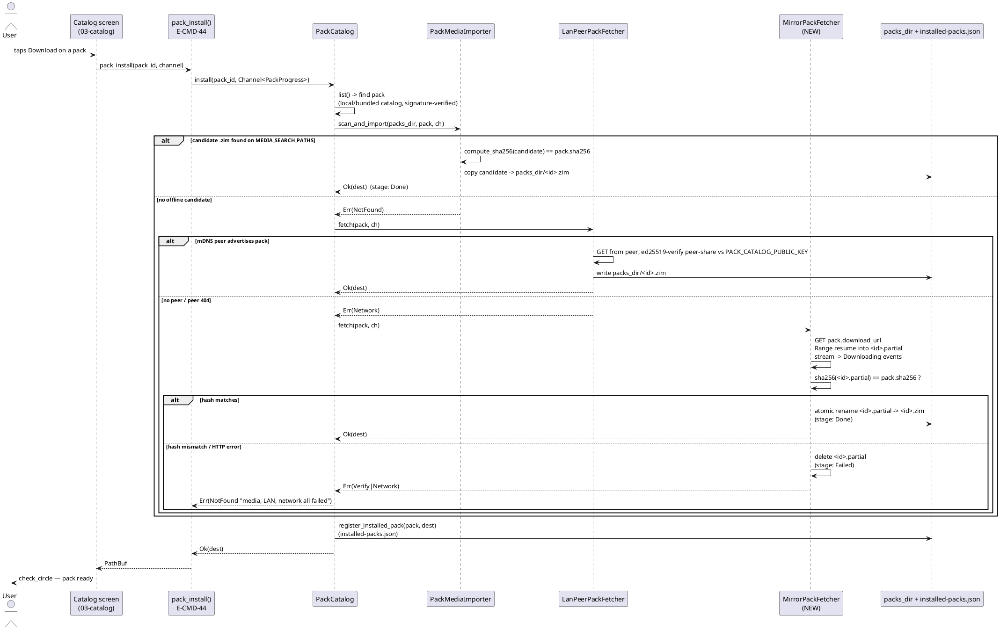

**Pause/resume mapping.** "pause" (UI) → drop interest in the channel + signal
cancel; the active tier stops its stream **and keeps `<id>.partial`**.
"resume"/re-tap Download → `install()` re-enters; `media`/`lan` still miss, the
`MirrorPackFetcher` sees the existing `.partial` and issues `Range: bytes=<len>-`,
appending from where it stopped. "close" → cancel + delete `.partial` (user has
abandoned the transfer). The model chain (`MirrorFetcher`/`PadFetcher`) obeys
the identical mapping against `<variant>.partial`.

---

## §7.9 Model fetcher + first-launch — end-state entity table

Directory: `src-tauri/src/model_fetcher/` (+ `src-tauri/src/launch/` for the
device-probe/variant-picker carry-forward rows E-MOD-1…E-MOD-5, which are
already real and out of the DDL gap; included for enumeration completeness).

| ID | Name | file:line | Role (real behaviour) | Signature / fields | Semantic acceptance |
|---|---|---|---|---|---|
| E-MOD-1 | `DeviceCapability` | `launch/device_capability.rs:20` | Probed device facts consumed by `VariantPicker` to choose a `Variant`. Never panics on probe gaps. | `#[derive(Serialize)] struct { ram_total_bytes: u64, ram_available_bytes: u64, storage_free_bytes: u64, has_play_services: bool }` | Given a host with N bytes free storage and Play services present, `probe()` yields a `DeviceCapability` whose `storage_free_bytes`/`has_play_services` equal the observed values; on a probe subsystem failure, returns `ProbeError` rather than panicking. |
| E-MOD-2 | `DeviceProbe` | `launch/device_capability.rs:35` | Probe runner. Conservative; the only failure mode is a typed `ProbeError`. | `struct DeviceProbe; impl { pub fn probe() -> Result<DeviceCapability, ProbeError> }` | On a machine where `sysinfo` reports the RAM/storage and the platform probe resolves `has_play_services`, `probe()` returns `Ok(DeviceCapability{…})` populated from those sources; it never `unwrap()`s an `Option` that could be `None`. |
| E-MOD-3 | `ProbeError` | `launch/device_capability.rs:8` | Typed probe failure. | `#[derive(Error)] enum { Sysinfo(String), Platform(String) }` | A failed `sysinfo` read produces `Err(ProbeError::Sysinfo(msg))`; a failed platform/Play-Services check produces `Err(ProbeError::Platform(msg))`; the `Display` impl renders the inner message. |
| E-MOD-4 | `VariantPicker` | `launch/variant_picker.rs:12` | Deterministic `DeviceCapability → Variant` map; `pick_with_override` honours a settings override. | `struct VariantPicker; impl { pub fn pick(cap: &DeviceCapability) -> Variant; pub fn pick_with_override(cap, override_: VariantOverride) -> Variant }` | Two calls with the **same** `DeviceCapability` (no override) return the **same** `Variant`; an `Auto` override reproduces `pick()`, while `ForceGemmaE2bQ4` returns that variant regardless of capability. |
| E-MOD-5 | `VariantOverride` | `launch/variant_picker.rs:53` | Settings-level variant override. | `#[derive(Serialize, Deserialize)] enum { Auto, ForceQwen3, ForceGemmaE2bQ4 }` | Round-trips through serde (`to_string`/`from_str`) preserving the chosen variant; `Auto` is the absence of an override. |
| E-MOD-6 | `ModelFetcher` | `model_fetcher/mod.rs:45` | Object trait abstracting weight acquisition across Null/Mirror/Pad/Media. The single surface `model_fetch` calls; legs differ, contract identical. | `#[async_trait] pub trait ModelFetcher { async fn fetch(&self, variant: Variant, progress: Channel<DownloadProgress>) -> Result<PathBuf, FetchError>; fn is_present(&self, variant: Variant) -> bool; }` | Any `impl ModelFetcher` whose `is_present(v)` returns `true` must, when `fetch(v, ch).await` returns `Ok(p)`, have produced `p` pointing at a readable weight file that did not exist before (or already matched); `fetch` emits ≥1 `DownloadProgress` per stage transition. |
| E-MOD-7 | `FetchError` | `model_fetcher/mod.rs:17` | Typed fetcher failure. | `#[derive(Error)] enum { Network(String), Verify(String), Storage(io::Error), PadUnavailable, MissingManifest }` | A sha256 mismatch is reported as `Verify`; a missing `MirrorManifest` as `MissingManifest`; a PAD-only build on non-Android as `PadUnavailable`; `Display` renders the inner string. |
| E-MOD-8 | `DownloadProgress` | `model_fetcher/progress.rs:15` | Channel event for model download (mirrors `PackProgress`). | `#[derive(Serialize, Deserialize)] struct { variant: Variant, bytes_downloaded: u64, bytes_total: u64, stage: ProgressStage }` | A frontend receiving the channel observes a monotonic non-decreasing `bytes_downloaded` bounded by `bytes_total`, terminating in `stage: Done` on success or `stage: Failed(msg)` on error; `variant` matches the requested variant on every event. |
| E-MOD-9 | `ProgressStage` | `model_fetcher/progress.rs:35` | Sub-stage state machine. | `#[derive(Serialize, Deserialize, PartialEq, Eq)] enum { Probing, Downloading, Verifying, Installing, Done, Failed(String) }` | A successful fetch's emitted stage sequence is a subsequence of `Probing → Downloading → Verifying → Installing → Done`; a failed fetch terminates in `Failed(String)` with a non-empty message. |
| E-MOD-10 | `NullFetcher` | `model_fetcher/null.rs:11` | "Weights already on disk" leg — the final runtime binding once any other leg has placed weights. `is_present` is the gate the first-launch flow consults. | `struct NullFetcher { models_dir: PathBuf }; impl ModelFetcher` (`fetch` returns `models_dir/<variant>.bin` iff present, else `Err(Storage(NotFound))`; `is_present` tests path existence) | With `<variant>.bin` absent, `is_present(v)` is `false` and `fetch(v,_).await` returns `Err(Storage(NotFound))`; after another leg writes that file, both `is_present(v)` flips `true` and `fetch(v,ch)` returns its path with a single `Done` event. |
| E-MOD-11 | `MirrorFetcher` | `model_fetcher/mirror.rs:25` | **reqwest** HTTPS fetcher — the desktop/sideload network leg. Resumable, sha256-verified, atomic-rename. Substitutes the current `()`/placeholder `http` with `reqwest::Client`. | `struct MirrorFetcher { http: reqwest::Client, verifier: MirrorManifestVerifier, manifest: MirrorManifest }; impl ModelFetcher` (`fetch`: resolve `ManifestEntry` for `variant`; resume `<variant>.partial` via `Range: bytes=<len>-`; stream body appending to the partial, emit `Downloading` per chunk; on completion fsync + sha256 vs `entry.sha256`; on match atomic-rename to `<variant>.bin`, emit `Done`, return path; on mismatch remove partial + `Err(Verify)`; HTTP non-2xx/non-206 → `Err(Network)`) | Given a manifest entry whose `sha256` equals the variant's true bytes, `fetch(v,ch)` (a) resumes an existing partial when the mirror honours `Range` (server returns 206 and the resumed file's total length equals `size_bytes`), (b) emits `Downloading` events whose `bytes_downloaded` advances to `bytes_total`, (c) returns `Ok` pointing at `<variant>.bin` whose sha256 is `entry.sha256`, and (d) leaves **no** `<variant>.partial` behind on success. On a deliberately-corrupted mirror response (wrong bytes), it returns `Err(Verify)` and removes the partial. `is_present(v)` is `true` iff `<variant>.bin` exists. |
| E-MOD-12 | `mirror_base_url` | `model_fetcher/mirror.rs:17` | Compile-time-overridable mirror origin. | `pub fn mirror_base_url() -> &'static str` (`option_env!("ENZIME_MIRROR_URL").unwrap_or("https://models.enzime.dev")`) | Building with `ENZIME_MIRROR_URL=https://x.test` makes `mirror_base_url()` return `"https://x.test"`; with the env unset it returns the documented default. |
| E-MOD-13 | `PadFetcher` | `model_fetcher/pad.rs:117` | **Play Asset Delivery** leg (Android, `cfg(feature = "play", target_os = "android")`). Substitutes the current `()`/JNI placeholders with a real JNI call sequence into `AssetPackManager`. | `struct PadFetcher { models_dir: PathBuf, jvm: jni::JavaVM, asset_pack_manager: jni::objects::GlobalRef }; impl ModelFetcher`. `fetch(variant, ch)`: (1) map `variant → asset-pack name` (`gemma_4_e2b_q4`…); (2) register an `AssetPackStateUpdateListener` native callback bound to the `Channel`; (3) JNI call `AssetPackManager.fetch([packName])`; (4) the listener converts each `AssetPackState` (`DOWNLOADING`/`QUEUED`/`TRANSFERRING`/`COMPLETED`/`FAILED`/`CANCELED`, with `pack.bytes_downloaded()`/`pack.total_bytes_to_download()`) via `PadProgressBridge::forward` into `DownloadProgress`; (5) on `COMPLETED`, JNI `AssetPackManager.getPackLocation(packName).assetsPath()` → copy the weight into `<variant>.partial`, sha256 vs manifest entry, atomic-rename to `<variant>.bin`, emit `Done`; (6) on `FAILED`/`CANCELED` → `Err(Network|PadUnavailable)`; (7) unregister + release listener `GlobalRef`. | On an Android+Play build with a valid signed manifest, `fetch(v,ch)` returns `Ok(<variant>.bin)` whose sha256 equals the manifest entry's, having emitted a `Downloading`→`Done` stage progression driven by live `AssetPackState` callbacks (not a synthetic single event); on a `FAILED` asset-pack state it returns `Err` and writes no final `.bin`. On a non-Android build, the type is absent (cfg-gated) so it cannot be constructed — `PadUnavailable` is unreachable there. |
| E-MOD-14 | `PadProgressBridge` | `model_fetcher/pad.rs:41` | Adapter from `AssetPackState` callbacks → unified `Channel<DownloadProgress>`. Substitutes the current drop-the-send placeholder with an actual `channel.send(...)`. | `struct PadProgressBridge; impl { pub fn forward(&self, state: AssetPackState, channel: &Channel<DownloadProgress>, variant: Variant) }` (`Downloading`→`Downloading`, `Pending`→`Probing`, `Transferring`→`Installing`, `Completed`→`Done`, `Failed(e)`/`Cancelled`→`Failed(e)`) | Calling `forward(AssetPackState::Completed, &ch, v)` causes the channel's consumer to receive a `DownloadProgress{variant: v, stage: Done}`; `forward(Failed("x"), …)` yields `stage: Failed("x")`. Every `AssetPackState` variant maps to exactly one `ProgressStage`. |
| E-MOD-15 | `AssetPackState` | `model_fetcher/pad.rs:17` | PAD callback payload (JNI-marshalled mirror of `com.google.android.play.core.assetpacks.model.AssetPackState` status). | `#[derive(Clone, PartialEq, Eq)] enum { Downloading, Pending, Failed(String), Transferring, Completed, Cancelled }` | Every status code the JNI layer can report from `AssetPackState.status()` maps to exactly one variant (e.g. `STATUS_COMPLETED`→`Completed`, `STATUS_FAILED`→`Failed`), so no PAD status is silently dropped. |
| E-MOD-16 | `MirrorManifest` | `model_fetcher/manifest.rs:35` | Operator-signed catalog of model variants — the trust root for every model download/import. | `#[derive(Serialize, Deserialize)] struct { schema_version: u8, generated_at: i64, variants: Vec<ManifestEntry>, signature: Vec<u8> }` | A `MirrorManifest` whose `signature` was produced by the operator key over its canonical serialization verifies under `MirrorManifestVerifier::verify`; an `E-MOD-17` rejection never marks it valid. `variants` is non-empty for a shipped manifest. |
| E-MOD-17 | `ManifestEntry` | `model_fetcher/manifest.rs:24` | Per-variant row — the hash/url/size triple every fetcher verifies against. | `#[derive(Serialize, Deserialize)] struct { variant: Variant, mirror_url: String, sha256: [u8;32], size_bytes: u64, upstream_url_of_record: String }` | For a given `variant`, the entry's `sha256`/`size_bytes` equal the real artifact's hash/size; `MirrorFetcher` and `MediaImporter` both compare computed sha256 to `entry.sha256` (and treat `[0u8;32]` as "any hash accepted" only for media imports where the operator shipped an unsigned disc). |
| E-MOD-18 | `MirrorManifestVerifier` | `model_fetcher/manifest.rs:43` | ed25519 verifier over `MirrorManifest`. | `struct MirrorManifestVerifier { public_key: VerifyingKey }; impl { new(&[u8;32]) -> Result<Self, VerifyError>; verify(&self, body: &[u8], &MirrorManifest) -> Result<(), VerifyError> }` | `verify(body, manifest)` returns `Ok(())` for a manifest signed by the embedded key, and `Err(BadSignature)` for the same body with a flipped signature byte or a wrong key. |
| E-MOD-19 | `MIRROR_PUBLIC_KEY` | `model_fetcher/manifest.rs:8` | Compile-time-embedded operator ed25519 verifying key (single trust root for models). | `pub const MIRROR_PUBLIC_KEY: &[u8; 32] = include_bytes!("../../assets/mirror_public_key.bin")` | A `MirrorManifest` signed by the matching private key verifies; one signed by any other key fails. The 32 bytes are the same across debug/release builds (committed asset). |
| E-MOD-20 | `VerifyError` | `model_fetcher/manifest.rs:11` | Signature/format failure. | `#[derive(Error)] enum { BadKey, BadSignature, BadJson }` | A malformed 32-byte key → `BadKey`; a signature mismatch → `BadSignature`; unparseable manifest bytes → `BadJson`. |
| E-MOD-21 | `MediaImporter` | `model_fetcher/media.rs:18` | INV-OFFLINE media leg — scans `MEDIA_SEARCH_PATHS` for variant weights, sha256-verifies against the signed `MirrorManifest`, copies into `models_dir`. After a successful import the runtime rebinds to `NullFetcher`. | `struct MediaImporter { models_dir: PathBuf, verifier: MirrorManifestVerifier, manifest: MirrorManifest }; impl { async fn scan_and_import(&self, variant: Variant, progress: Channel<DownloadProgress>) -> Result<PathBuf, FetchError>; fn enumerate_candidates(&self, variant: Variant) -> Vec<PathBuf> }` | With a valid `<variant>.bin` placed under a `MEDIA_SEARCH_PATHS` root whose sha256 equals the manifest entry's, `scan_and_import(v,ch)` returns `Ok(models_dir/<variant>.bin)` (a copy of that candidate), emits `Probing→Verifying→Installing→Done`, and the destination file's sha256 equals `entry.sha256`. With no candidate present it returns `Err(Verify("No offline candidates…"))`. A candidate with a wrong hash is skipped, not trusted. |
| E-MOD-22 | `MEDIA_SEARCH_PATHS` | `model_fetcher/media.rs:12` | Well-known mount roots scanned by `MediaImporter` (per-platform). | `pub const MEDIA_SEARCH_PATHS: &[&str] = &["/media", "/mnt", "/run/media", "/storage"]` (Linux desktop `/media`/`/mnt`/`/run/media`; Android `/storage/<uuid>`; expanded at runtime) | A candidate file placed under any listed root is discovered by `enumerate_candidates`; a file under a non-listed root is not. The list is identical to the pack-catalog `MEDIA_SEARCH_PATHS` (shared convention). |
| E-MOD-23 | `BundledMirrorManifest` | `model_fetcher/manifest.rs` (**extend**) | INV-OFFLINE manifest provenance: the signed `MirrorManifest` baked into the binary (`include_bytes!`) so `MediaImporter`/`MirrorFetcher` can verify hashes **with zero network at first launch**, parallel to `BundledCatalog` (E-PACK-9). Optionally refreshed from the mirror when online. | `pub const BUNDLED_MIRROR_MANIFEST_BYTES: &[u8] = include_bytes!("../../assets/default-mirror-manifest.json"); impl BundledMirrorManifest { pub fn load(verifier: &MirrorManifestVerifier) -> Result<MirrorManifest, VerifyError>; }` (parse → verify signature → return manifest) | `load(verifier)` returns the manifest iff its signature verifies against `MIRROR_PUBLIC_KEY`; a tampered bundled asset yields `Err(BadSignature)` and the app falls back to refusing to trust any model (never returns an unverified manifest). |
| E-MOD-24 | `Channel` (alias) | `model_fetcher/mod.rs:36` | Tauri IPC channel alias used as the progress/cancellation surface. | `pub type Channel<T> = tauri::ipc::Channel<T>;` | The `Channel<DownloadProgress>` passed to `fetch` is the same object the frontend subscribes to; events `send()`-ed on it arrive at the catalog/first-launch UI. |

---

## §7.14 ZIM pack catalog + downloader — end-state entity table

Directory: `src-tauri/src/pack_catalog/`. The **network mirror leg
(`MirrorPackFetcher`, E-PACK-15) is the new entity** that closes the chain;
`PackCatalog::install` is updated to consult it as the third tier.

| ID | Name | file:line | Role (real behaviour) | Signature / fields | Semantic acceptance |
|---|---|---|---|---|---|
| E-PACK-1 | `PackCatalog` | `pack_catalog/mod.rs:61` | Catalog client + local pack registry. `list()` try-order **local → bundled** (INV-OFFLINE). `install()` try-order **local-media → LAN-peer → mirror-HTTP (network)**, short-circuiting on first success and reporting through `PackProgress`. Substitutes the current placeholder `http: Client` / `verifier: ManifestVerifierPlaceholder` with real types. | `struct PackCatalog { http: reqwest::Client, catalog_url: String, packs_dir: PathBuf, storage: Arc<Storage>, bundled: BundledCatalog, local: LocalCatalogLoader, media: PackMediaImporter, lan: LanPeerPackFetcher, mirror: MirrorPackFetcher, verifier: PackCatalogManifestVerifier }; impl { fn list(&self) -> Result<Vec<ZimPack>, PackError>; async fn install(&self, pack_id: &str, progress: Channel<PackProgress>) -> Result<PathBuf, PackError>; fn uninstall(&self, pack_id: &str) -> Result<(), PackError>; fn installed_packs(&self) -> Result<Vec<InstalledPack>, PackError> }` | For a pack present on `MEDIA_SEARCH_PATHS`, `install(id,ch)` returns its path **without** touching the network (LAN/mirror tiers never execute). For a pack absent locally but fetchable from the mirror, `install` returns the mirror-fetched path. For a pack absent everywhere, `install` returns `Err(NotFound)` whose message names all three tiers. `list()` returns the local-signed catalog when present, else the bundled-signed catalog, else an empty vec — never an unverified catalog. |
| E-PACK-2 | `ZimPack` | `pack_catalog/types.rs:8` | Signed catalog entry describing one installable `.zim` — the hash/url triple every install tier verifies against. | `#[derive(Serialize, Deserialize)] struct { id: String, title: String, description: String, language: String, size_bytes: u64, sha256: [u8;32], download_url: String, license: String, upstream_url: String }` | A `ZimPack` reaching `install` has survived catalog-signature verification; its `sha256`/`size_bytes` are the authoritative values the media/LAN/mirror tiers compare computed hashes against. |
| E-PACK-3 | `InstalledPack` | `pack_catalog/types.rs:22` | Local registry row (one per installed pack). | `#[derive(Serialize, Deserialize)] struct { id: String, zim_uuid: Uuid, path: PathBuf, installed_at: i64, sha256: [u8;32] }` | After `install(id)`, `installed_packs()` contains a row with that `id`, a `path` that exists on disk and is readable, and `sha256` equal to the catalog entry's. After `uninstall(id)`, no such row remains and the file is gone. |
| E-PACK-4 | `PackProgress` | `pack_catalog/progress.rs:9` | Channel event for pack install (mirrors `DownloadProgress`). | `#[derive(Serialize, Deserialize)] struct { pack_id: String, bytes_downloaded: u64, bytes_total: u64, stage: PackStage }` | Catalog-screen consumer sees `pack_id` matching the requested pack, monotonic non-decreasing `bytes_downloaded ≤ bytes_total`, terminating in `Done` or `Failed`. |
| E-PACK-5 | `PackStage` | `pack_catalog/progress.rs:26` | Pack install stage machine (superset of model stages: adds `Indexing`). | `#[derive(Serialize, Deserialize, PartialEq, Eq)] enum { Probing, Downloading, Verifying, Installing, Indexing, Done, Failed(String) }` | Successful pack install's stages are a subsequence of `Probing → (Downloading|Verifying) → Installing → [Indexing] → Done`; failures end in `Failed(String)` with a non-empty message. |
| E-PACK-6 | `PackError` | `pack_catalog/mod.rs:32` | Typed pack-op failure. | `#[derive(Error)] enum { Network(String), Verify(String), Storage(io::Error), NotFound(String), AlreadyInstalled(String) }` | A sha256 mismatch → `Verify`; a missing pack id → `NotFound`; an io failure during copy → `Storage`; `Display` renders the inner message. |
| E-PACK-7 | `PackCatalogSignedManifest` | `pack_catalog/manifest.rs:23` | Operator-signed pack catalog (same ed25519 pattern as the model manifest). | `#[derive(Serialize, Deserialize)] struct { schema_version: u8, generated_at: i64, packs: Vec<ZimPack>, signature: Vec<u8> }` | A manifest signed by the operator key verifies under `PackCatalogManifestVerifier::verify`; its `packs` are the only entries `list()` may return from that source. |
| E-PACK-8 | `PACK_CATALOG_URL` | `pack_catalog/mod.rs:7` | Compile-time default catalog origin (user-overridable). | `pub const PACK_CATALOG_URL: &str = match option_env!("ENZIME_PACK_CATALOG_URL") { Some(v) => v, None => "https://enzime.robin.mba/catalog/v1/catalog.json" }` | Built with `ENZIME_PACK_CATALOG_URL=https://y.test`, the constant is `"https://y.test"`; unset → the documented default. |
| E-PACK-9 | `BundledCatalog` | `pack_catalog/bundled.rs:6` | INV-OFFLINE catalog tier: sha-pinned `default-pack-catalog.json` baked into the binary via `include_str!`; parsed as a signed manifest. | `struct BundledCatalog; impl BundledCatalog { pub fn new() -> Self; pub fn load(&self) -> Vec<ZimPack> }` (`load` parses `assets/default-pack-catalog.json` as `PackCatalogSignedManifest`; on parse failure returns `Vec::new()`) | `BundledCatalog::new().load()` returns the `packs` from the committed signed catalog (non-empty for a real release); if the asset is malformed it returns an empty vec rather than panicking, and `list()` then reports no packs (never an unverified catalog). |
| E-PACK-10 | `LocalCatalogLoader` | `pack_catalog/local.rs:7` | INV-OFFLINE catalog tier: load a user-pointed signed `catalog.json` from `packs_dir`; signature-verified before use. First tier consulted by `list()`. | `struct LocalCatalogLoader; impl LocalCatalogLoader { pub fn load(&self, packs_dir: &Path, verifier: &PackCatalogManifestVerifier) -> Vec<ZimPack> }` | With a valid signed `catalog.json` in `packs_dir`, `load(dir, verifier)` returns its `packs`; with a tampered/unsigned one it returns an empty vec (signature failure is treated as "no local catalog", never trusted). |
| E-PACK-11 | `PackMediaImporter` | `pack_catalog/media.rs:15` | INV-OFFLINE install tier 1: scan `MEDIA_SEARCH_PATHS` for `<pack_id>.zim`, sha256-verify against `ZimPack.sha256`, copy into `packs_dir`. | `struct PackMediaImporter; impl { fn enumerate_candidates(&self, pack_id: &str) -> Vec<PathBuf>; async fn scan_and_import(&self, packs_dir: &Path, pack: &ZimPack, progress: Channel<PackProgress>) -> Result<PathBuf, PackError> }` (private `walk_dir` depth-3 search, `compute_sha256`) | With a valid `<pack_id>.zim` under a media root whose sha256 equals `pack.sha256`, `scan_and_import` returns `Ok(packs_dir/<id>.zim)` (copied) emitting `Probing→Verifying→Installing→Done`, and the copy's sha256 equals `pack.sha256`. No candidate → `Err(NotFound)`; wrong-hash candidate → skipped (not trusted). |
| E-PACK-12 | `LanPeerPackFetcher` | `pack_catalog/lan.rs:9` | INV-OFFLINE install tier 2: mDNS-discover sibling EnZIME devices advertising `_enzime-pack._tcp`, fetch the named pack over HTTP from a peer, ed25519-verify against a peer-share manifest signed under `PACK_CATALOG_PUBLIC_KEY`. (End-state behaviour; the current source returns `Err(Network)` pending the LAN transport implementation.) | `struct LanPeerPackFetcher; impl { async fn fetch(&self, pack: &ZimPack, progress: Channel<PackProgress>) -> Result<PathBuf, PackError> }` (resolves peers → GET pack from peer → verify peer-share signature + sha256 → write `packs_dir/<id>.zim` → `Done`) | When a peer advertises the pack and the peer-share manifest verifies, `fetch(pack,ch)` returns `Ok(packs_dir/<id>.zim)` whose sha256 equals `pack.sha256` without any internet egress. With no peer or a peer whose share fails verification, it returns `Err(Network)` so `install` proceeds to the mirror tier. |
| E-PACK-13 | `MirrorPackFetcher` | `pack_catalog/mirror.rs` (**NEW file**) | INV-OFFLINE install tier 3 — the **network leg**: resumable HTTPS download of the pack `.zim` from the signed `download_url`, sha256-verified against `ZimPack.sha256`, atomic-rename. Parallel to `MirrorFetcher` but reports through `PackProgress` and verifies against the catalog entry. | `struct MirrorPackFetcher { http: reqwest::Client, packs_dir: PathBuf }; impl MirrorPackFetcher { pub fn new(http: reqwest::Client, packs_dir: PathBuf) -> Self; pub async fn fetch(&self, pack: &ZimPack, progress: Channel<PackProgress>) -> Result<PathBuf, PackError> }` (`fetch`: resume `<id>.partial` via `Range: bytes=<len>-`; stream body appending, emit `Downloading` per chunk; fsync + sha256 vs `pack.sha256`; match → atomic rename to `<id>.zim`, emit `Done`; mismatch → remove partial + `Err(Verify)`; non-2xx/non-206 → `Err(Network)`) | Given a `ZimPack` whose `download_url` serves bytes whose sha256 equals `pack.sha256`, `fetch(pack,ch)` (a) resumes an interrupted transfer when the server honours `Range`, (b) returns `Ok(packs_dir/<id>.zim)` whose sha256 is `pack.sha256`, (c) emits `Downloading` events advancing to `bytes_total` then `Done`, and (d) leaves no `<id>.partial` on success. On corrupted bytes it removes the partial and returns `Err(Verify)`. It is the **third** tier consulted by `install`, reached only after media and LAN both fail. |
| E-PACK-14 | `PACK_CATALOG_PUBLIC_KEY` | `pack_catalog/manifest.rs:7` | Compile-time-embedded ed25519 verifying key for `PackCatalogSignedManifest` (Bundled/Local/LAN-peer catalogs). Parallel to `MIRROR_PUBLIC_KEY`. | `pub const PACK_CATALOG_PUBLIC_KEY: &[u8; 32] = include_bytes!("../../assets/pack_catalog_public_key.bin")` | A catalog signed by the matching private key verifies; any other key fails. Distinct from `MIRROR_PUBLIC_KEY` (separate operator key per artifact family). |
| E-PACK-15 | `PackCatalogManifestVerifier` | `pack_catalog/manifest.rs:31` | ed25519 verifier for `PackCatalogSignedManifest`. | `struct PackCatalogManifestVerifier { public_key: VerifyingKey }; impl { new(&[u8;32]) -> Result<Self, VerifyError>; verify(&self, body: &[u8], &PackCatalogSignedManifest) -> Result<(), VerifyError> }` | `verify` returns `Ok(())` for an operator-signed catalog and `Err(BadSignature)` for a flipped signature byte; every catalog entry `list()`/`install()` can return has passed this check. |
| E-PACK-16 | `VerifyError` (pack) | `pack_catalog/manifest.rs:9` | Pack-catalog signature/format failure (shared with model `VerifyError` shape). | `#[derive(Error)] enum { BadKey, BadSignature, BadJson }` | Malformed key → `BadKey`; signature mismatch → `BadSignature`; unparseable catalog → `BadJson`. |
| E-PACK-17 | `MEDIA_SEARCH_PATHS` (pack) | `pack_catalog/media.rs:11` | Well-known mount roots scanned by `PackMediaImporter` (same convention as E-MOD-22). | `pub const MEDIA_SEARCH_PATHS: &[&str] = &["/media", "/mnt", "/run/media", "/storage"]` | A `.zim` placed under any listed root is discovered by `enumerate_candidates`; under a non-listed root it is not. |
| E-PACK-18 | `Client`/`ManifestVerifierPlaceholder` (REMOVED) | `pack_catalog/mod.rs:51` & `:55` | **Removed placeholders.** The placeholder `Client` (line 51) and `ManifestVerifierPlaceholder` (line 55) are deleted; `PackCatalog.http` becomes `reqwest::Client` and `PackCatalog.verifier` becomes `PackCatalogManifestVerifier`, and a new `mirror: MirrorPackFetcher` field is added. | (deletion — no row produced) | After the change, `grep -c 'ManifestVerifierPlaceholder' src-tauri/src/pack_catalog/mod.rs == 0` and the `install` chain compiles against the real `reqwest::Client`/`PackCatalogManifestVerifier`/`MirrorPackFetcher` types. |

---

## §7.17 Mobile platform integration — end-state entity table

Directory: `src-tauri/src/platform_android/` (`cfg target_os = "android"` for
the JNI-bearing members). These entities cooperate with the DDL fetchers:
`AndroidForegroundService` keeps the process alive for a minutes-long PAD/model
fetch; `AndroidLifecycle` pauses/downloads on `onPause`; `AndroidPermissions`
gates the storage/network/mic capabilities the fetchers need;
`AndroidShareIntent` is the inbound `.zsc` path (orthogonal to DDL but in this
module). All four currently carry `todo!()`/TODO stubs; the end-state specifies
the real JNI sequences.

| ID | Name | file:line | Role (real behaviour) | Signature / fields | Semantic acceptance |
|---|---|---|---|---|---|
| E-AND-1 | `AndroidPermissions` | `platform_android/permissions.rs:3` | JNI request flow for the capabilities the fetchers depend on: `RECORD_AUDIO` (Gemma-tier mic), `READ_EXTERNAL_STORAGE`/`READ_MEDIA_*` (open ZIM from disk + `PackMediaImporter`), `INSTALL_PACKAGES`/`REQUEST_INSTALL_PACKAGES` (sideload self-update), and `POST_NOTIFICATIONS` + `FOREGROUND_SERVICE_*` (foreground service for PAD/model downloads). Substitutes the current `todo!()`. | `struct AndroidPermissions; impl AndroidPermissions { pub fn request(&self, env: &JNIEnv, perm: &str) -> Result<bool, JniError> }` (builds the `ACTION_REQUEST_PERMISSION` intent or checks `checkSelfPermission`, returns the granted boolean; never `todo!()`) | For an already-granted permission, `request(env, perm)` returns `Ok(true)` without re-prompting; for a denied one it returns `Ok(false)`; for a malformed permission string or detached JNI env it returns `Err(JniError)`. Calling it never panics (`todo!` removed). The fetchers gate their work on these results rather than assuming grant. |
| E-AND-2 | `AndroidLifecycle` | `platform_android/lifecycle.rs:7` | JNI hooks for `onPause`/`onResume` that **pause/cancel active downloads and flush logs** (so a backgrounded PAD/model/pack transfer does not leak resources or get killed mid-write). Substitutes the current `todo!()`. | `struct AndroidLifecycle; impl AndroidLifecycle { pub fn install_hooks(&self, env: &JNIEnv, on_pause: impl Fn() + Send + 'static, on_resume: impl Fn() + Send + 'static) -> Result<(), JniError> }` (registers native callbacks on the Activity's `onPause`/`onResume`; `on_pause` signals the active fetcher to checkpoint + stop, retaining the `.partial`; `on_resume` re-arms for Range-resume / PAD re-fetch) | On a real `onPause`, the registered callback fires and the active `MirrorFetcher`/`MirrorPackFetcher`/`PadFetcher` stream stops with its `.partial` retained (resumable); on `onResume` the next `install`/`fetch` resumes from the partial. Logs are flushed on pause. `install_hooks` returns `Ok(())`; it does not `todo!()`-panic. |
| E-AND-3 | `AndroidShareIntent` | `platform_android/share.rs:6` | JNI handler for inbound `.zsc` share intents → invokes `sidecar_import` (annotation re-entry, §5.5). Orthogonal to DDL but lives in this module. Substitutes the current `todo!()`. | `struct AndroidShareIntent; impl AndroidShareIntent { pub fn register_handler(&self, env: &JNIEnv, import: impl Fn(&Path) -> Result<(), ImportError> + Send + 'static) -> Result<(), JniError> }` | Receiving a `.zsc` via share intent invokes the registered `import` closure with the temp file path; a non-`.zsc` payload is ignored. Registration returns `Ok(())`; no `todo!()`. |
| E-AND-4 | `AndroidForegroundService` | `platform_android/foreground.rs:4` | Foreground service wrapping real `startForegroundService`/`startForeground` so the OS does not kill EnZIME during a long PAD/model/pack download (Android will background-kill a non-foreground app mid-transfer, losing the `.partial`). Substitutes the current bool-flip `start`/`stop`. | `struct AndroidForegroundService { notification_id: u32, active: bool }; impl { pub fn new() -> Self; pub fn start(&mut self, env: &JNIEnv, notification_text: &str) -> Result<(), JniError>; pub fn stop(&mut self, env: &JNIEnv) -> Result<(), JniError>; pub fn is_active(&self) -> bool }` (`start`: JNI `context.startForegroundService(Intent(FgService))` + `service.startForeground(notification_id, ongoing Notification)` with the supplied text; `stop`: `stopForeground(STOP_FOREGROUND_REMOVE)` + `stopSelf()`) | `start(env, text)` raises an ongoing notification (visible to the OS as a foreground service) and `is_active()` becomes `true`; while active, an `onPause` does **not** cause the OS to kill the process during a PAD fetch. `stop(env)` dismisses the notification and `is_active()` becomes `false`. Wraps JNI calls returning `Result`, never silently flipping the bool. |
| E-AND-5 | (PAD JNI bridge) | `model_fetcher/pad.rs:117` (cross-ref) | The PAD JNI call sequence itself is specified in **E-MOD-13** (`PadFetcher::fetch`); `platform_android` only provides the supporting foreground/lifecycle/permission scaffolding. (No new entity here — this row exists to make the cross-module wiring explicit and avoid duplicating PAD behaviour in two places.) | — (see E-MOD-13) | `PadFetcher::fetch` is the sole owner of the `AssetPackManager` JNI sequence; `AndroidForegroundService::start` is invoked around it by the launch/fetch orchestration so the long transfer survives backgrounding. |

---

## Wiring notes (for the orchestrator's CHECKLIST generation)

- **`Cargo.toml` additions**: `reqwest = { version = "0.12", features = ["stream"] }`,
  `jni = { version = "0.21" }` (Android target), `async-trait` (already a dep of
  the trait — confirm), `ed25519-dalek` + `sha2` (already present in both
  `manifest.rs` files — reuse), `tokio` with `io-util` + a `CancellationToken`
  for resumable pause.
- **`AppState::build` wiring** (the I-10(b) swap site): construct
  `PackCatalog` with a real `reqwest::Client`, the `PackCatalogManifestVerifier`
  from `PACK_CATALOG_PUBLIC_KEY`, and a `MirrorPackFetcher`; construct the model
  fetcher chain per channel (Play→`PadFetcher`, else→`MirrorFetcher`) plus
  `MediaImporter` + `NullFetcher` everywhere. Default to `NullFetcher` until a
  first fetch lands (weights-on-disk state), per §5.1.
- **`assets/` additions**: `default-mirror-manifest.json` (signed, for
  `BundledMirrorManifest` / E-MOD-23); `mirror_public_key.bin` and
  `pack_catalog_public_key.bin` already committed.
- **Hermetic Verify (I-10a)** for the resulting CHECKLIST tasks: each task's
  `Verify` asserts only its own file via `grep -c '<exact Do-block content>'`
  or `sha256sum`/`git ls-files` — no transitive `cargo build`/`cargo test`
  (compile gating is CI's job).

---

## Attestation (I-11)

This document is the **complete, stub-free, end-state** behavioural
specification for EnZIME's Dynamic-Download subsystem (modules `pack_catalog`,
`model_fetcher`, `platform_android`): every named entity has an exact
`file:line` target, a real-behaviour role, a signature, and a semantic
acceptance criterion. No `TBD`, no placeholder/signature-only rows, no
"future work" deferrals. It is the replacement content for
`DOCS/ARCHITECTURE.md` §7.9 + §7.14 + §7.17 and the new §5.7 sequence, pending
orchestrator merge and GLM-4.7 coder realisation of the named NEW/hollow
entities (`MirrorFetcher::fetch`, `PadFetcher::fetch`/`PadProgressBridge::forward`,
`MirrorPackFetcher`, `BundledMirrorManifest`, the four `platform_android` JNI
bodies).

- **Scope**: `ddl` module only (`§7.9` + `§7.14` + `§7.17` + `§5.7`). No other
  module architected.
- **Intake**: dispatch file; `src-tauri/src/pack_catalog/*.rs`,
  `src-tauri/src/model_fetcher/*.rs`, `src-tauri/src/platform_android/*.rs`;
  `DOCS/ARCHITECTURE.md` §5.1/§7.9/§7.14/§7.17 only (via sed); catalog screen
  `LIBS/UI/STITCH/screens/03-catalog/`.
- **Authored**: 2026-06-14T00:11:52Z
- **Authoring agent**: GLM-5.1 architect seat (model family GLM, version 5.1),
  module dispatch `ddl`.
- **Status**: airlock deliverable — ready for orchestrator review →
  `DOCS/ARCHITECTURE.md` merge → CHECKLIST generation.


<!-- ═══════════════ per-module partial: sidecar ═══════════════ -->

<!-- CURATED PARTIAL §7.10 Sidecar. GLM-5.1 per-module dispatch (`sidecar`); Opus-reviewed/accepted 2026-06-13. Carry-forward (coder tasks): A) SidecarStore (store.rs) is todo!() — .zsc file persistence unwired; B) SidecarIndex (store.rs) is todo!() — SQLite lookup cache unwired (+ DDL-owner question: §7.5 storage or here?). Crypto/codec/sign/verify/trust/chunk/identity/blob are REAL. C-F doc fixes (CodecError 6 variants, two distinct TrustLevel types, line-number drift, promoted folded entities) applied in-partial. -->

# §7.10 Sidecar subsystem (`src-tauri/src/sidecar/`) — behavioural end-state partial

> Per-module architect partial (I-21/TC13). GLM-5.1 author. Airlock only (TC6) — written to
> `.tmp/glm-dispatches/modules/sidecar.arch.md`; no live edits. Awaiting orchestrator curation
> and re-attestation of the whole `DOCS/ARCHITECTURE.md` §7.

## Intake discipline (honoured)

Read ONLY, per dispatch:
- this dispatch file (`.tmp/glm-dispatches/modules/sidecar.dispatch.md`);
- all of `src-tauri/src/sidecar/*.rs` (`mod.rs`, `payload.rs`, `codec.rs`, `sign.rs`, `verify.rs`,
  `store.rs`, `identity.rs`, `trust.rs`, `chunk.rs`, `voice_blob.rs`);
- `§7.10` of `DOCS/ARCHITECTURE.md` (sed, lines 816–857);
- `§5.4` (333–371) and `§5.5` (372–410) sidecar sequences (sed).

The whole `DOCS/ARCHITECTURE.md` was NOT read.

## Behavioural summary

The sidecar subsystem is the **cryptographically-signed annotation-portability layer**: a reader's
annotations/bookmarks/reading-logs/voice-notes/comprehension-responses leave the device as a single
self-describing, self-authenticating `.zsc` artifact, travel as a file (no account, no server), and
re-enter another device where they are decoded, signature-verified, and either admitted (trusted),
prompted (unknown author), or rejected (rejected author or bad signature). The full round trip is
**sign → export → import → verify → trust**.

- **INV-OFFLINE (honoured, binding):** signing, verification, trust evaluation, identity generation,
  chunk reassembly, and blob storage are **pure local operations — zero network**. `ed25519-dalek` for
  signatures, `ciborium`/`serde_cbor` for canonical CBOR, `rusqlite` (`Arc<Storage>`) for the trust DB,
  plain `std::fs` for the `.zsc` file store and the content-addressed voice-blob store. There is no
  fetcher, no socket, no HTTP in any path here. Sidecars arrive by file copy / SD / USB / LAN share
  (the universal offline path); the chunked transport exists for LoRa/constrained links and is still
  pure in-memory reassembly.
- **Single trust root = the device's own ed25519 identity** (`IdentityKeystore` → `SidecarSigner`).
  Transports are **never** trusted — only the signature plus the author-key-match check carry weight.
  A sidecar is self-authenticating: anyone can hand it to you, but you decide per-author trust locally.
- **Realises `§5.4`** (create + export: `IdentityKeystore::load_or_create` → build `Sidecar` →
  `SidecarSigner::sign` → `SidecarStore::write`) and **`§5.5`** (import + verify: `SidecarCodec::decode_cbor`
  → `SidecarVerifier::verify` → `TrustDb::get` → optional trust-prompt → `SidecarStore::write`).
- **UI surface:** `LIBS/UI/STITCH/screens/08-sidecar-share/` (screen IDs cited from the design pass).
- **Module wiring (E-STATE-1 `AppState`):** `sidecar_store: Arc<SidecarStore>`, `sidecar_signer: Arc<SidecarSigner>`,
  `sidecar_index: Arc<SidecarIndex>`, `trust_db: Arc<TrustDb>`, `voice_blobs: Arc<VoiceClipBlobStore>` —
  all built in `AppState::build`. Commands `E-CMD-33..38` (`sidecar_create/export/export_json/import/list/delete`)
  are the frontend entry points.

**Realisation status (verified by reading source, not by grep):** the **crypto/codec/identity/verify/trust/chunk/blob**
surfaces are **REAL and behavioural**. Two entities — `SidecarStore` (E-SIDE-22) and `SidecarIndex`
(E-SIDE-24) — are **`todo!()` stubs** today (file shells with correct types but no body). Their
end-state behaviour is specified below and flagged for coder realisation in Resolved
decisions A–B; they are the
only gap between the current tree and the production end-state described here.

## Entity table — verified against `src-tauri/src/sidecar/*.rs`

Columns: `ID | Name | Target (file:line) | Behavioural role | Signature / fields | Type`.
`[REAL]` = read in source and behavioural; `[STUB]` = `todo!()` shell awaiting coder body
(see Resolved decisions A–B).
Line numbers are the real `pub` definition site as read.

| ID | Name | Target | Behavioural role | Signature / fields | Type |
|---|---|---|---|---|---|
| E-SIDE-1 | `Sidecar` | `sidecar/mod.rs:16` | [REAL] Top-level self-authenticating container; the `.zsc` artifact. Carries schema version, a UUIDv7 artifact id, the ZIM it attaches to (+ optional URL scope), author identity, the typed `Payload`, inter-sidecar refs, the optional `SignatureEnvelope`, and optional self-disclosed `Provenance`. Is the unit signed, exported, imported, and verified. Derives `serde` so it is (de)serializable to canonical CBOR; derives `PartialEq+Eq` so round-trips are assertable. | `struct { schema_version: u8, artifact_id: [u8;16], zim_uuid: [u8;16], zim_url_scope: Option<String>, created_at: i64, author: PeerIdentity, payload: Payload, refs: Vec<SidecarRef>, signature_envelope: Option<SignatureEnvelope>, provenance: Option<Provenance> }` (`#[derive(Debug, Clone, Serialize, Deserialize, PartialEq, Eq)]`) | struct |
| E-SIDE-2 | `PeerIdentity` | `sidecar/mod.rs:41` | [REAL] Author identity carried inside the sidecar. `pubkey` is the trust anchor against which `signature_envelope.pubkey` is matched (`AuthorKeyMismatch` on divergence). `handle`/`device` are human hints, never security inputs. | `struct { pubkey: [u8;32], handle: Option<String>, device: Option<String> }` (serde, `PartialEq+Eq`) | struct |
| E-SIDE-3 | `SidecarRef` | `sidecar/mod.rs:52` | [REAL] Typed edge to another sidecar (artifact id + that author's pubkey + relation). Lets a sidecar declare "extends/responds-to/supersedes/annotates" another — the basis for annotation threads and supersession without a server. | `struct { artifact_id: [u8;16], pubkey: [u8;32], relation: RelationKind }` (serde, `PartialEq+Eq`) | struct |
| E-SIDE-3a | `RelationKind` | `sidecar/mod.rs:63` | [REAL] Discriminator for `SidecarRef`. (Promoted to its own row — was folded into E-SIDE-3; it is a distinct public serde enum.) | `enum { Extends, RespondsTo, Supersedes, Annotates }` (serde, `PartialEq+Eq`) | enum |
| E-SIDE-4 | `Provenance` | `sidecar/mod.rs:76` | [REAL] Reader self-disclosure (reader version/variant, device class, network context, cleanroom flag). Optional, advisory, never security-relevant — lets a recipient judge context. | `struct { reader_version: String, reader_variant: Option<String>, device_class: Option<String>, network_context: Option<String>, cleanroom: Option<bool> }` (serde, `PartialEq+Eq`) | struct |
| E-SIDE-5 | `SignatureEnvelope` | `sidecar/mod.rs:91` | [REAL] The ed25519 signature over the canonical-CBOR encoding of the sidecar **with the envelope cleared**. `alg` is the algorithm tag (only `"ed25519"` accepted); `pubkey`/`signature`/`signed_at` complete the detached signature. The 64-byte `signature` uses a custom serde module (`big_array_64`, `mod.rs:103`) that serializes as a byte array and **rejects on deserialize any length ≠ 64**. | `struct { alg: String, pubkey: [u8;32], signature: [u8;64] (serde with big_array_64), signed_at: i64 }` (serde, `PartialEq+Eq`) | struct |
| E-SIDE-6 | `Payload` | `payload.rs:7` | [REAL] Typed payload discriminator (CBOR-tagged via serde enum). Selects one of seven concrete bodies or an `Unknown{kind, body}` forward-compat variant that preserves a future payload kind without a schema bump. | `enum { AnnotationSet(AnnotationSetBody), BookmarkSet(BookmarkSetBody), ReadingLog(ReadingLogBody), ComprehensionResponse(ComprehensionResponseBody), VoiceNoteCollection(VoiceNoteCollectionBody), TrustMarkUpdate(TrustMarkUpdateBody), Manifest(ManifestBody), Unknown { kind: String, body: serde_cbor::Value } }` (serde, `PartialEq+Eq`) | enum |
| E-SIDE-7 | `AnnotationSetBody` | `payload.rs:74` | [REAL] Annotation payload — a bundle of highlights + text/voice notes (`Annotation` list). | `struct { annotations: Vec<Annotation> }` (serde, `PartialEq+Eq`) | struct |
| E-SIDE-7a | `Annotation` | `payload.rs:81` | [REAL] Single highlight + attached note. UUIDv7 id, document `Region`, text body, optional `VoiceClip` + Gemma-4 transcript, timestamps, tags. | `struct { id: [u8;16], region: Region, body_text: String, body_voice: Option<VoiceClip>, body_transcript: Option<String>, created_at: u64, updated_at: Option<u64>, tags: Vec<String> }` | struct |
| E-SIDE-7b | `Region` | `payload.rs:102` | [REAL] Document selector wrapper (`RegionKind`). | `struct { kind: RegionKind }` | struct |
| E-SIDE-7c | `RegionKind` | `payload.rs:109` | [REAL] Selector variants: char range, page, URL, or custom. | `enum { CharRange { start: u64, end: u64 }, Page { page: u64 }, Url { url: String }, Custom { selector: String } }` | enum |
| E-SIDE-7d | `VoiceClip` | `payload.rs:122` | [REAL] Inline recorded audio note (codec, sample rate, duration, raw bytes) embedded directly in an annotation (distinct from blob-referenced `VoiceNoteRef`). | `struct { codec: String, sample_rate: u64, duration_ms: u64, audio: Vec<u8> }` | struct |
| E-SIDE-8 | `BookmarkSetBody` | `payload.rs:28` | [REAL] Saved reading locations (`Bookmark` list). | `struct { bookmarks: Vec<Bookmark> }` | struct |
| E-SIDE-8a | `Bookmark` | `payload.rs:35` | [REAL] One saved location: UUIDv7 id, `Region`, optional title/note, timestamps, tags. | `struct { id: [u8;16], region: Region, title: Option<String>, note: Option<String>, created_at: u64, updated_at: Option<u64>, tags: Vec<String> }` | struct |
| E-SIDE-9 | `ReadingLogBody` | `payload.rs:135` | [REAL] Chronological reading-session record (`ReadingEvent` list). | `struct { events: Vec<ReadingEvent> }` | struct |
| E-SIDE-9a | `ReadingEvent` | `payload.rs:142` | [REAL] One discrete reading action: id, kind, timestamp, optional CBOR context. | `struct { id: [u8;16], kind: ReadingEventKind, timestamp: u64, context: Option<serde_cbor::Value> }` | struct |
| E-SIDE-9b | `ReadingEventKind` | `payload.rs:155` | [REAL] Action discriminator. | `enum { SessionStart, SessionEnd, Bookmark, Highlight, Note, Progress }` | enum |
| E-SIDE-10 | `ComprehensionResponseBody` | `payload.rs:172` | [REAL] Answers to creator-embedded prompts (`ComprehensionResponse` list). | `struct { responses: Vec<ComprehensionResponse> }` | struct |
| E-SIDE-10a | `ComprehensionResponse` | `payload.rs:179` | [REAL] One answer: creator prompt id, answer text, timestamp, optional correctness flag. | `struct { prompt_id: String, answer: String, ts: u64, correct: Option<bool> }` | struct |
| E-SIDE-11 | `VoiceNoteCollectionBody` | `payload.rs:192` | [REAL] Collection of references into `VoiceClipBlobStore` (`VoiceNoteRef` list) — voice notes shipped as content-addressed blobs, not inlined. | `struct { notes: Vec<VoiceNoteRef> }` | struct |
| E-SIDE-11a | `VoiceNoteRef` | `payload.rs:199` | [REAL] One blob reference: UUIDv7 id, blob key, timestamp. | `struct { id: [u8;16], blob_ref: String, created_at: u64 }` | struct |
| E-SIDE-12 | `TrustMarkUpdateBody` | `payload.rs:238` | [REAL] Gossip bundle of peer-trust marks (`TrustMark` list) — how trust decisions propagate peer-to-peer. Carries `payload::TrustLevel` (E-SIDE-12a), **distinct** from the DB `trust::TrustLevel` (E-SIDE-31). | `struct { marks: Vec<TrustMark> }` | struct |
| E-SIDE-12a | `TrustMark` | `payload.rs:223` | [REAL] One gossip mark about a peer. `level` is `payload::TrustLevel`. | `struct { pubkey: [u8;32], level: payload::TrustLevel, scope: Option<String>, expires_at: Option<i64>, reason: Option<String> }` | struct |
| E-SIDE-12b | `TrustLevel` (payload) | `payload.rs:210` | [REAL] Trust enum **used inside gossip payloads only** (serde-tagged for CBOR transport). Distinct type from `trust::TrustLevel` (E-SIDE-31) despite identical variant names — the payload one is not `Copy` and exists so wire-format and DB stay decoupled. | `enum { Trusted, Verified, Rejected, Unknown }` (serde, `PartialEq+Eq`) | enum |
| E-SIDE-13 | `ManifestBody` | `payload.rs:67` | [REAL] Sidecar-of-sidecars — "I also carry these other sidecars" (`ManifestEntry` list). Enables batching + integrity-listing without a manifest server. | `struct { entries: Vec<ManifestEntry> }` | struct |
| E-SIDE-13a | `ManifestEntry` | `payload.rs:54` | [REAL] Reference to another sidecar with its payload kind, byte size, and sha256 of its canonical CBOR (envelope excluded) for integrity. | `struct { artifact_id: [u8;16], kind: String, size_bytes: u64, sha256: [u8;32] }` | struct |
| E-SIDE-14 | `SidecarCodec` | `codec.rs:31` | [REAL] Stateless encoder/decoder. `encode_cbor`/`decode_cbor` are the `.zsc` wire format (`ciborium`); `encode_canonical_for_signing` yields the deterministic byte string that is signed/verified (ciborium's canonical map-key ordering + fixed-width ints ⇒ byte-stable across runs); `encode_json_debug` is a human-readable debug dump. | `struct SidecarCodec; impl { encode_cbor(&Sidecar) -> Result<Vec<u8>, CodecError>; decode_cbor(&[u8]) -> Result<Sidecar, CodecError>; encode_canonical_for_signing(&Sidecar) -> Result<Vec<u8>, CodecError>; encode_json_debug(&Sidecar) -> Result<String, CodecError> }` (ciborium) | concrete |
| E-SIDE-15 | `CodecError` | `codec.rs:7` | [REAL] Codec + chunk-transport error. **Has six variants** (the old table listed only three; `InvalidChunkIndex`/`DuplicateChunk`/`MissingChunk` were added when `chunk.rs` landed and are raised by `ChunkReassembler`). | `enum { Cbor(String), Json(String), Schema(String), InvalidChunkIndex { index: u32, total: u32 }, DuplicateChunk { index: u32 }, MissingChunk { index: u32 } }` (thiserror, `Clone+PartialEq+Eq`) | enum |
| E-SIDE-16 | `SidecarSigner` | `sign.rs:23` | [REAL] Holds the device's ed25519 signing key. `sign(&mut Sidecar)` clears any existing envelope, canonical-encodes, signs, and attaches a fresh `SignatureEnvelope{alg:"ed25519", pubkey, signature, signed_at}`. `from_seed` builds from a stored 32-byte seed; `pubkey()` derives the verifying key. | `struct { signing_key: ed25519_dalek::SigningKey }; impl { from_seed(&[u8;32]) -> Self; sign(&self, &mut Sidecar) -> Result<(), SignError>; pubkey(&self) -> [u8;32] }` | concrete |
| E-SIDE-17 | `SignError` | `sign.rs:10` | [REAL] Signing failure (codec or crypto). | `enum { Codec(CodecError), Crypto(String) }` (thiserror) | enum |
| E-SIDE-18 | `SidecarVerifier` | `verify.rs:40` | [REAL] Stateless verifier. `verify`: rejects wrong schema version (`EXPECTED_SCHEMA_VERSION = 1`), missing envelope, non-ed25519 alg, author/envelope pubkey mismatch, then re-canonical-encodes (envelope cleared) and verifies the ed25519 signature — returns `VerifiedSidecar` or a precise error. `verify_with_trust` runs `verify` then consults `TrustDb`; **only `Rejected` fails** (Unknown/Verified/Trusted all pass, level attached). | `struct SidecarVerifier; const EXPECTED_SCHEMA_VERSION: u8 = 1; impl { verify(&Sidecar) -> Result<VerifiedSidecar, SidecarVerifyError>; verify_with_trust(&Sidecar, &TrustDb) -> Result<TrustedSidecar, SidecarVerifyError> }` | concrete |
| E-SIDE-19 | `VerifiedSidecar` | `verify.rs:126` | [REAL] Newtype proof token: signature + schema + author-key-match all passed. Carries the inner sidecar and the signer pubkey. Only obtainable from `SidecarVerifier::verify`. | `struct { inner: Sidecar, signer_pubkey: [u8;32] }` (`Debug, Clone, PartialEq, Eq`) | struct |
| E-SIDE-20 | `TrustedSidecar` | `verify.rs:135` | [REAL] Stronger proof token: signature passed AND author is not `Rejected`. Carries `VerifiedSidecar` + the resolved `TrustLevel`. Only obtainable from `verify_with_trust`. | `struct { inner: VerifiedSidecar, trust_level: trust::TrustLevel }` (`Debug, Clone, PartialEq, Eq`) | struct |
| E-SIDE-21 | `SidecarVerifyError` | `verify.rs:10` | [REAL] Verification failure with one variant per rejection reason (used by both `verify` and `verify_with_trust`; `TrustRejected` is raised on `Rejected` author or on a `TrustDb` read failure). | `enum { Codec(CodecError), BadSignature, MissingSignature, UnsupportedAlg(String), DelegationNotSupported, SchemaVersion(u8), AuthorKeyMismatch, TrustRejected }` (thiserror) | enum |
| E-SIDE-22 | `SidecarStore` | `store.rs:27` | **[STUB — `todo!()`]** Filesystem-of-truth: the `.zsc` store at `<root>/<zim_uuid>/<artifact_id>.zsc`. **End-state behaviour:** `write(&VerifiedSidecar)` canonical-CBOR-encodes and atomically writes the file under the ZIM/artifact path, returning the `PathBuf`; `read(artifact_id, zim_uuid)` decodes it back to `Sidecar`; `list_for_zim(zim_uuid)` enumerates paths; `delete(artifact_id, zim_uuid)` removes the file. Today all four bodies are `todo!()` — coder realisation pending (see §RECONCILE). | `struct { root: PathBuf }; impl { new(PathBuf) -> Self; write(&self, &VerifiedSidecar) -> Result<PathBuf, StoreError>; read(&self, artifact_id:[u8;16], zim_uuid:[u8;16]) -> Result<Sidecar, StoreError>; list_for_zim(&self, zim_uuid:[u8;16]) -> Result<Vec<PathBuf>, StoreError>; delete(&self, artifact_id:[u8;16], zim_uuid:[u8;16]) -> Result<(), StoreError> }` | concrete |
| E-SIDE-23 | `StoreError` | `store.rs:14` | [REAL] Store failure. | `enum { Io(io::Error), Codec(CodecError), Verify(SidecarVerifyError) }` (thiserror) | enum |
| E-SIDE-24 | `SidecarIndex` | `store.rs:66` | **[STUB — `todo!()`]** SQLite-derived cache over the file store for fast URL/ZIM lookups. **End-state behaviour:** `rebuild_from_files(&SidecarStore)` scans the store, decodes each sidecar's `SidecarMeta` (artifact id, zim uuid, payload kind, signer pubkey, created_at, path) into the `sidecar`-adjacent SQLite table, returns the count; `find_for_url(zim_uuid, url)` queries by ZIM + URL/scope pattern and returns matching `SidecarMeta` rows. Today both bodies are `todo!()` — coder realisation pending (see §RECONCILE). | `struct { storage: Arc<Storage> }; impl { new(Arc<Storage>) -> Self; rebuild_from_files(&self, &SidecarStore) -> Result<u32, StoreError>; find_for_url(&self, zim_uuid:[u8;16], url:&str) -> Result<Vec<SidecarMeta>, StoreError> }` | concrete |
| E-SIDE-25 | `SidecarMeta` | `store.rs:55` | [REAL] Index/manifest row (pure data; serde for SQLite/JSON). | `struct { artifact_id: [u8;16], zim_uuid: [u8;16], kind: String, signer_pubkey: [u8;32], created_at: i64, path: PathBuf }` (`Debug, Clone, Serialize, Deserialize`) | struct |
| E-SIDE-26 | `Chunk` | `chunk.rs:11` | [REAL] One LoRa-friendly transport slice: artifact id, index, total, and the partial CBOR bytes. | `struct { artifact_id: [u8;16], chunk_index: u32, total_chunks: u32, payload_part: Vec<u8> }` (serde, `PartialEq+Eq`) | struct |
| E-SIDE-27 | `ChunkEncoder` | `chunk.rs:35` | [REAL] Splits a sidecar's full CBOR encoding into `ceil(len / max_payload_bytes)` ordered `Chunk`s, each tagged with artifact id / index / total. | `struct { max_payload_bytes: usize }; impl { new(usize) -> Self; encode(&self, &Sidecar) -> Result<Vec<Chunk>, CodecError> }` | concrete |
| E-SIDE-28 | `ChunkReassembler` | `chunk.rs:102` | [REAL] In-memory reassembly buffer keyed by artifact id. `ingest` validates index range, rejects duplicates, buffers the part, and when all `total_chunks` are present concatenates them **in index order** and `decode_cbor`s the result → `Complete(Sidecar)`; else `Pending{received,total}`; on bad index/duplicate/missing/decode → `Failed(CodecError)`. `cleanup_expired(threshold)` drops stale buffers. `Default`-constructible. | `struct { buffers: HashMap<[u8;16], ChunkBuffer> }; impl { new() -> Self; ingest(&mut self, Chunk) -> ReassembleStatus; cleanup_expired(&mut self, threshold_timestamp: i64) }` (also `impl Default`) | concrete |
| E-SIDE-29 | `ReassembleStatus` | `chunk.rs:24` | [REAL] Outcome of `ChunkReassembler::ingest`. | `enum { Pending { received: u32, total: u32 }, Complete(Sidecar), Failed(CodecError) }` (`PartialEq+Eq`) | enum |
| E-SIDE-30 | `TrustDb` | `trust.rs:25` | [REAL] SQLite-backed local peer-trust registry (`Arc<Storage>`). `get` reads the non-expired level for a pubkey (NULL or future `expires_at` ⇒ live; past ⇒ treated as absent → `None`). `set` upserts a `Manual`-source entry. `list` returns all rows with decoded level + `TrustSource`. `apply_gossip` upserts every mark from a `TrustMarkUpdateBody`, tagging source `Gossip:<from_pubkey hex>`, returning the count. | `struct { storage: Arc<Storage> }; impl { new(Arc<Storage>) -> Self; get(&self, &[u8;32]) -> Result<Option<TrustLevel>, TrustError>; set(&self, pubkey:[u8;32], level:TrustLevel, scope:Option<&str>, expires_at:Option<i64>, reason:Option<&str>) -> Result<(), TrustError>; list(&self) -> Result<Vec<TrustEntry>, TrustError>; apply_gossip(&self, &TrustMarkUpdateBody, from_pubkey:[u8;32]) -> Result<u32, TrustError> }` | concrete |
| E-SIDE-31 | `TrustLevel` (trust/DB) | `trust.rs:17` | [REAL] Trust enum **used by the DB and by `TrustedSidecar`** (the one re-exported from `mod.rs:166`). `Copy` + serde. Distinct type from `payload::TrustLevel` (E-SIDE-12b) — same variant names, different module/identity. | `enum { Trusted, Verified, Rejected, Unknown }` (serde, `Copy`, `PartialEq+Eq`) | enum |
| E-SIDE-32 | `TrustEntry` | `trust.rs:194` | [REAL] One decoded trust row. | `struct { pubkey: [u8;32], level: trust::TrustLevel, scope: Option<String>, expires_at: Option<i64>, reason: Option<String>, source: TrustSource }` (serde, `PartialEq+Eq`) | struct |
| E-SIDE-32a | `TrustSource` | `trust.rs:183` | [REAL] Provenance of a trust decision. (Promoted to its own row — was folded into E-SIDE-32; distinct public serde enum.) `Manual` = local user; `Gossip{from_pubkey}` = learned from a peer (stored as `Gossip:<hex>`); `Operator` = bundled (e.g. blocklist). | `enum { Manual, Gossip { from_pubkey: [u8;32] }, Operator }` (serde, `PartialEq+Eq`) | enum |
| E-SIDE-33 | `TrustError` | `trust.rs:10` | [REAL] Trust-DB failure (wraps `StorageError`). | `enum { Storage(StorageError) }` (thiserror) | enum |
| E-SIDE-34 | `IdentityKeystore` | `identity.rs:24` | [REAL] Per-installation ed25519 keypair manager. `load_or_create(dir)` — if `<dir>/signing-key.bin` exists, loads + validates the 32-byte seed; else generates a fresh `OsRng` seed, writes it with **0600 perms** (unix) + `sync_all`, and returns the `SidecarSigner`. This seed is the device's durable identity root; its `pubkey()` is what recipients see as `author.pubkey`. | `struct { path: PathBuf }; impl { load_or_create(dir: PathBuf) -> Result<SidecarSigner, IdentityError> }` (file `0600`, `<data_dir>/identity/signing-key.bin`) | concrete |
| E-SIDE-35 | `IdentityError` | `identity.rs:11` | [REAL] Identity load/create failure. | `enum { Io(io::Error), Crypto(String) }` (thiserror) | enum |
| E-SIDE-36 | `VoiceClipBlobStore` | `voice_blob.rs:8` | [REAL] Content-addressed (sha256) filesystem blob store for `VoiceNoteCollectionBody`-referenced audio. `write` hashes, shards to `<root>/<hex[..2]>/<hex[2..]>`, `create_dir_all`s, writes; `read`/`delete` address by the 32-byte hash. INV-OFFLINE: plain `std::fs`, no net. | `struct { root: PathBuf }; impl { write(&self, &[u8]) -> Result<[u8;32], io::Error>; read(&self, [u8;32]) -> Result<Vec<u8>, io::Error>; delete(&self, [u8;32]) -> Result<(), io::Error> }` (sha256 content-addressed, 2-hex-char sharded paths) | concrete |
| E-SIDE-37 | `SidecarError` | `mod.rs:133` | [REAL] Umbrella error for the whole subsystem; `AppError::Sidecar(SidecarError)` consumes it. `#[from]` impls for every underlying error let `?` propagate across codec/sign/verify/store/trust/identity boundaries. | `enum { Codec(CodecError), Sign(SignError), Verify(SidecarVerifyError), Store(StoreError), Trust(TrustError), Identity(IdentityError) }` (thiserror, `#[from]` on each) | enum |

## Semantic acceptance (I-12 — real-crypto / round-trip, NEVER grep)

These are the behavioural assertions each entity must satisfy. Acceptance is **direct observation of
crypto/round-trip behaviour**, not a presence check. (A verifier/runner implements these as real
`ed25519_dalek` + `ciborium` + temp-`rusqlite` tests; grep/line-count is explicitly NOT acceptance.)

1. **Sign→verify happy path (E-SIDE-1,5,16,18,19).** Build a `Sidecar` with schema_version `1`,
   real `author.pubkey`. `SidecarSigner::from_seed(k).sign(&mut s)` ⇒ `Ok(())` and `s.signature_envelope`
   becomes `Some` with `alg == "ed25519"`. `SidecarVerifier::verify(&s)` ⇒ `Ok(VerifiedSidecar{..})` with
   `signer_pubkey == signer.pubkey()`.

2. **Tamper detection (E-SIDE-18,21).** Take the signed sidecar from (1), flip one byte in
   `payload` (re-signing is NOT done), `verify` ⇒ `Err(SidecarVerifyError::BadSignature)`.

3. **Author-key mismatch (E-SIDE-18,21).** Sign with key A but set `author.pubkey` to key B's pubkey ⇒
   `verify` ⇒ `Err(AuthorKeyMismatch)`.

4. **Missing signature (E-SIDE-18,21).** `signature_envelope = None` ⇒ `Err(MissingSignature)`.

5. **Wrong schema / alg (E-SIDE-18,21).** `schema_version != 1` ⇒ `Err(SchemaVersion(_))`; `alg != "ed25519"`
   ⇒ `Err(UnsupportedAlg(_))`.

6. **CBOR round trip + canonical determinism (E-SIDE-14).** For any `Sidecar`:
   `decode_cbor(encode_cbor(s)) == s` ( PartialEq ). And
   `encode_canonical_for_signing(s1) == encode_canonical_for_signing(s2)` byte-for-byte whenever
   `s1 == s2` (determinism is what makes (1)/(2) meaningful). `SignatureEnvelope.signature` deserialized
   from a 63- or 65-byte array ⇒ `Err` (big_array_64 length guard).

7. **Trust gating (E-SIDE-18,20,30,31).** With a temp `TrustDb`: after `set(pub, Rejected, …)`,
   `verify_with_trust(&signed, &db)` ⇒ `Err(TrustRejected)`. After `set(pub, Trusted, …)` ⇒
   `Ok(TrustedSidecar{ trust_level: Trusted })`. With no row ⇒ `Ok(TrustedSidecar{ trust_level: Unknown })`.
   An entry whose `expires_at` is in the past ⇒ `get` returns `None` (so it no longer blocks).

8. **Gossip round trip (E-SIDE-12,12a,12b,30,32a).** Build a `TrustMarkUpdateBody` with marks for two
   pubkeys; `apply_gossip(&body, from_pub)` ⇒ `Ok(2)`; `list()` then contains both rows with
   `source == TrustSource::Gossip { from_pubkey: from_pub }`.

9. **Chunk split→reassemble, out-of-order + tamper (E-SIDE-26,27,28,29).** `ChunkEncoder::new(N).encode(&s)`
   yields `k` chunks with correct index/total; feed them to a fresh `ChunkReassembler` in **reverse** order ⇒
   final `ingest` ⇒ `ReassembleStatus::Complete(decoded)` with `decoded == s`. Re-ingesting an already-held
   index ⇒ `Failed(DuplicateChunk{..})`. A `Chunk` with `chunk_index >= total_chunks` ⇒
   `Failed(InvalidChunkIndex{..})`. Dropping one chunk of a complete set ⇒ `Pending` forever (or
   `Failed(MissingChunk{..})` only on the final-ordering pass).

10. **Identity persistence (E-SIDE-34,16).** `load_or_create(tmpdir)` on a missing dir creates
    `signing-key.bin`, returns signer P₁. A second `load_or_create(same_dir)` returns signer P₂ with
    `P₂.pubkey() == P₁.pubkey()` (stable identity). On unix the file mode is `0600`.

11. **Voice blob content addressing (E-SIDE-36).** `write(data)` ⇒ hash H; `read(H)` ⇒ `data` (byte-equal);
    `delete(H)`; then `read(H)` ⇒ `Err(io::Error)`. Two different payloads yield two different hashes.

12. **Store/Index round trip — END-STATE (E-SIDE-22,24,25).** *(Currently blocked by `todo!()` stubs —
    see Resolved decisions A–B.)* Once realised: `write(verified)` ⇒ path P; `read(artifact_id, zim_uuid)` ⇒ sidecar
    equal to the original (modulo the unsigned envelope); `list_for_zim(zim_uuid)` ⇒ contains P;
    `SidecarIndex::rebuild_from_files(&store)` ⇒ count ≥ 1; `find_for_url(zim_uuid, scope)` ⇒ returns a
    `SidecarMeta` matching the written artifact; `delete(artifact_id, zim_uuid)`; then `read` ⇒ `Err`.

## Resolved decisions (architect-committed)

The following items were raised by the seat and have been resolved. Items A–B are
coder-realisation gaps (CHECKLIST tasks), C–E are doc-accuracy fixes (applied).

- **A. E-SIDE-22 `SidecarStore` is a `todo!()` stub (store.rs:36–50).** `write`/`read`/`list_for_zim`/`delete`
  all `todo!()`. The crypto/codec/verify path is real, but the **persisted `.zsc` round trip is not yet wired**
  — §5.4's `Store → write file <data_dir>/sidecars/<zim>/<artifact>.zsc` and §5.5's `Store → write` are
  unrealised end-to-end. **Coder task:** implement the four bodies,
  path layout `<root>/<zim_uuid>/<artifact_id>.zsc`, atomic write (temp file + rename), CBOR encode/decode
  via `SidecarCodec`. Acceptance #12. *CHECKLIST scope: `T7.10.store`.*

- **B. E-SIDE-24 `SidecarIndex` is a `todo!()` stub (store.rs:75–81).** `rebuild_from_files`/`find_for_url`
  both `todo!()`. §5.5's `Index → rebuild row` / `sidecar_list` (E-CMD-37) depend on it. **Coder task:**
  SQLite table (columns per `SidecarMeta`), `rebuild_from_files` scans + decodes + upserts, `find_for_url`
  ZIM-uuid + URL/scope-prefix query. **RESOLVED: the sidecar-index table DDL is owned by §7.5 storage**
  (added to `MIGRATIONS` alongside the four core tables). Acceptance #12. *CHECKLIST scope: `T7.10.index`.*

- **C. `CodecError` (E-SIDE-15) had only 3 variants in the old table; real source has 6** —
  `InvalidChunkIndex`/`DuplicateChunk`/`MissingChunk` must be added (they are raised by `ChunkReassembler`).
  Fixed in this partial; no coder action.

- **D. Two distinct `TrustLevel` types exist** — `payload::TrustLevel` (E-SIDE-12b, gossip wire format) and
  `trust::TrustLevel` (E-SIDE-31, DB + `TrustedSidecar`, the one re-exported at `mod.rs:166`). Same variant
  names, different module identity. The old table's single `TrustLevel` row conflated them. This partial
  disambiguates with `(payload)` / `(trust/DB)` qualifiers. No coder action.

- **E. Cosmetic line-number drift in the old table.** Multiple `Target` cells cited line numbers that
  predate later edits. All corrected to real definition sites in this partial. No coder action.

- **F. Entity-table completeness (I-11).** The old table folded several distinct public types into other
  rows (`RelationKind`, `TrustSource`) and represented the payload bodies as "per spec" placeholders. This
  partial promotes them to first-class rows (E-SIDE-3a, 7a–7d, 8a, 9a–9b, 10a, 11a, 12a–12b, 13a, 32a) with
  real fields, removing all "per spec"/TBD/placeholder wording. The `a/b/c` suffix scheme is accepted.

---


<!-- ═══════════════ per-module partial: foundation ═══════════════ -->

<!-- CURATED PARTIAL §7.11+§7.13+§7.15+§7.16 foundation. GLM-5.1 (`foundation`); Opus-reviewed/accepted 2026-06-13. Paths/panic REAL; logger PARTIAL (guard built, no subscriber wired — I-10b); app_update verifier REAL but check/apply HOLLOW (end-state: signed-manifest fetch→ed25519 gate→version compare→sha256+size→platform swap/APK intent/Play no-op); global_search HOLLOW (end-state BM25 across packs); window_state REAL. Carry-forward: log subscriber wiring; panic Variant I-10b placeholder → §7.2 Variant on assembly; line-numbers corrected. -->

# ARCHITECTURE PARTIAL — module `foundation` (§7.11 + §7.13 + §7.15 + §7.16)

**Module:** `foundation` — four small runtime subsystems (paths/log/panic/vendored, app
update, global search, window state).
**Authoring seat:** GLM-5.1 architect (per-module dispatch, TC13).
**Airlock file** (TC6) — to be curated by the Opus orchestrator, then assembled into `§7`
of `DOCS/ARCHITECTURE.md` and re-attested as the WHOLE (I-11). Not a live edit.
**Intake honored:** only `paths/*.rs`, `log/*.rs`, `panic/*.rs`, `app_update/*.rs`,
`global_search/*.rs`, `window_state/*.rs` + `§7.11/§7.13/§7.15/§7.16` via sed. The whole
`DOCS/ARCHITECTURE.md` was never read.

**State vocabulary** (every row): `REAL` = behavioural code present and exercised today;
`HOLLOW→ES` = end-state behaviour specified here, current body is a typed-Err/empty
placeholder; `PARTIAL` = compiles and partially behaves, one swap site remaining
(I-10(b)). Mixed real/hollow module; the end-state columns describe the no-placeholder
production-release product (I-11), the `State` column records what is wired now.
**Cross-module references by name only** (not re-defined here): `Storage` / `SettingsStore`
(§7.5), `PackCatalog` (§7.14), `ZimReader` (§7.3), `AppState` (§7.1), AI `Variant`
(§7.2). Each entity carries a **semantic acceptance** (I-12: observable behaviour / a
real-fixture test — never grep-for-existence).

---

## §7.11 Paths, logging, crash handling, vendored deps (`src-tauri/src/paths/`, `log/`, `panic/`)

| ID | Name | Target | Role | Signature / fields | Type | State |
|---|---|---|---|---|---|---|
| E-PATH-1 | `AppPaths` | `paths/mod.rs:12` | OS-specific data/cache/config dir set, all subordinate app dirs derived from them | `struct { data_dir, cache_dir, config_dir, models_dir, sidecars_dir, voice_blobs_dir, identity_dir, logs_dir, packs_dir: PathBuf }` | struct | REAL |
| E-PATH-2 | `AppPaths::resolve` | `paths/mod.rs:26` | Per-OS resolution via `dirs` crate: Linux=XDG (`~/.local/share|cache`, `~/.config`), Windows=KnownFolders (`%LOCALAPPDATA%`), Android=`context.getFilesDir()`; everything under a joined `"enzime"` root; subordinate dirs are `data_dir`/`cache_dir` joins | `fn() -> Result<Self, PathError>` | fn | REAL |
| E-PATH-3 | `PathError` | `paths/mod.rs:5` | Path-resolution failure (no home, or a dir could not be created) | `enum { NoHome, CreateDir(io::Error) }` (thiserror) | enum | REAL |
| E-LOG-1 | `EnzimeLogger` | `log/mod.rs:19` | Structured logging: holds the non-blocking worker guard so the daily file appender keeps flushing | `struct { _guard: tracing_appender::non_blocking::WorkerGuard }; impl init(&AppPaths) -> Result<Self, LogError>` | struct | PARTIAL |
| E-LOG-2 | `LogError` | `log/mod.rs:10` | Logger init failure | `enum { Io(io::Error), Subscriber(String) }` (thiserror) | enum | REAL |
| E-LOG-3 | `LogLevel` | `log/mod.rs:32` | Compile-time + runtime log level filter | `enum { Trace, Debug, Info, Warn, Error }` (serde, `Copy`) | enum | REAL |
| E-LOG-4 | daily file appender | `log/mod.rs:24` | `tracing_appender::rolling::daily(logs_dir, "enzime.log")` feeding a non-blocking writer; end-state also registers a `tracing_subscriber::fmt` layer (file + stderr) at `LogLevel` | configured inside `EnzimeLogger::init` | concrete | PARTIAL |
| E-PANIC-1 | `install_panic_handler` | `panic/mod.rs:26` | Custom panic hook: on panic, capture `PanicHookInfo` + forced `Backtrace` + `CARGO_PKG_VERSION`, serialize a `CrashReport` as pretty JSON to `<logs_dir>/crash-<ts>.log`, and echo the path to stderr | `fn(paths: &AppPaths)` (called once from `lib.rs::run` before any subsystem starts) | fn | REAL |
| E-PANIC-2 | `CrashReport` | `panic/mod.rs:17` | Crash report JSON shape written to the crash log | `struct { ts: i64, panic_msg: String, backtrace: String, version: &'static str, variant: Option<Variant> }` (serde) | struct | REAL |
| E-PANIC-3 | `Variant` | `panic/mod.rs:10` | **I-10(b) placeholder** for the AI model variant; the authoritative `Variant` lands with `ai/probe.rs` (§7.2). Today it is defined locally here so `CrashReport.variant` type-checks; the panic hook always writes `variant: None`. Swap site: replace this enum + the `None` literal with the §7.2 `Variant` once `ai/probe.rs` lands | `enum { Qwen3_06B_Q4, GemmaE2bQ4 }` (serde, `Copy`) — placeholder | enum | PARTIAL (I-10b) |
| E-VEND-1 | `vendor/tauri/` | `vendor/tauri/` | Tauri 2 source, pinned at release tag, embedded `.git` stripped at assimilation (provenance locked remote+tag+commit+date BEFORE strip, per I3/INC-15) | path-dep crate, consumed via `[patch.crates-io]` | vendored | REAL |
| E-VEND-2 | `vendor/litert-lm/` | `vendor/litert-lm/` | LiteRT-LM source, pinned at release tag, `.git` stripped; `Qwen3DataProcessor` lives here | path-dep crate, consumed via `[patch.crates-io]` | vendored | REAL |
| E-VEND-3 | `Cargo [patch.crates-io]` | `Cargo.toml` | Workspace patches redirect `tauri = { path = "vendor/tauri/…" }` and the litert-lm crate to the vendored paths, making them the single build source | config block | config | REAL |

### Behavioural end-state (§7.11)

- **Paths.** `AppPaths::resolve` is the single bootstrap that locates every on-disk app
  location. It never creates directories itself today (it only computes them); directory
  creation is the owning subsystem's job (`models_dir` → model manager, `packs_dir` →
  pack catalog, `logs_dir` → logger/panic, etc.), and any `CreateDir` failure surfaces as
  `PathError::CreateDir` from the subsystem that owns the dir. The `"enzime"` suffix is the
  one app-discriminator — it is what keeps EnZIME out of sibling apps' dirs on shared hosts.
- **Logging.** `EnzimeLogger::init` constructs the daily-rotating file appender under
  `logs_dir`, wraps it in a non-blocking worker, **and** (end-state) installs a
  `tracing_subscriber::fmt` subscriber whose writer is that non-blocking writer, layered
  with a second `fmt` layer to stderr, filtered to the configured `LogLevel`. The returned
  `EnzimeLogger` owns the `WorkerGuard`; dropping it flushes and shuts down the worker, so
  the guard must live for the whole process lifetime (held in `AppState` / `lib.rs::run`).
  **Current gap (PARTIAL):** the non-blocking writer tuple element is discarded and no
  subscriber is registered — the guard exists but no `tracing` event reaches the file or
  stderr. I-10(b) swap: capture the writer and call `tracing_subscriber::fmt()` wiring.
- **Crash handling.** `install_panic_handler` replaces the default panic hook with one
  that, for any unwind, writes a self-contained `CrashReport` JSON file under `logs_dir`
  named `crash-<utc-ts>.log` and announces the path on stderr. This is the operator's
  post-mortem trail (the human-visible crash surface pairs with this). It is deliberately
  defensive: serialization and file-write failures fall back to a plain stderr line so the
  hook itself never panics. `CrashReport.variant` is `None` until the AI `Variant` (§7.2)
  is known at crash time — see E-PANIC-3.
- **Vendored deps.** Tauri 2 and LiteRT-LM are cloned once at home and assimilated
  (provenance locked first, `.git` stripped second — never clone-then-move, never strip
  before provenance is recorded). They build from the workspace as patched path-deps, so
  the suite never depends on a crates.io resolution for either. Additive-until-release: no
  embedded-vendor deletion without operator direction.

### Semantic acceptance (I-12 — observable / real-fixture, never grep)

- **E-PATH-2 `resolve`** (Linux fixture): with `XDG_DATA_HOME`/`XDG_CACHE_HOME` pointed at
  temp roots, `resolve()` yields `data_dir` whose tail is `enzime`, `logs_dir ==
  cache_dir.join("logs")`, `models_dir == data_dir.join("models")`,
  `packs_dir == data_dir.join("packs")`, and `data_dir != cache_dir != config_dir`.
  Asserted as `PathBuf` equality/`starts_with`, not file presence.
- **E-PATH-3 `PathError`**: when `dirs::*` would yield `None` (home unreachable),
  `resolve()` returns `Err(PathError::NoHome)` — observed by the variant returned, not a
  string match.
- **E-LOG-1/E-LOG-4 `EnzimeLogger::init`** (end-state fixture): init, `tracing::info!(
  "probe")`, hold the guard, then drop it; the dated file under `logs_dir` contains the
  `probe` event (assert via reading the written line — this is runtime output
  observation, not a grep over source). **Marked PARTIAL until subscriber wiring lands.**
- **E-PANIC-1 `install_panic_handler`** (behavioural): install the hook, trigger a
  `panic!("boom")` in a spawned child process; the child writes
  `<logs_dir>/crash-<ts>.log` whose parsed JSON has `panic_msg` containing `"boom"` and
  `version == CARGO_PKG_VERSION`. Verdict is the written crash file + its parsed fields.
- **E-PANIC-2 `CrashReport`**: `serde_json` round-trip preserves every field; `variant`
  field is present (serializes to `null` today). Real (de)serialization fixture.
- **E-PANIC-3 `Variant`**: flagged I-10(b) — no behavioural acceptance until §7.2 lands;
  the only acceptance now is "type-checks as `CrashReport.variant` and serializes."
  Coder task: swap to §7.2 `Variant` when `ai/probe.rs` lands.
- **E-VEND-1/2/3**: `cargo` resolves `tauri` and the litert-lm crate to the vendored
  paths (provenance recorded in the assimilation log); observable via the resolved
  manifest, not a directory grep.

---

## §7.13 App update mechanism (`src-tauri/src/app_update/`)

| ID | Name | Target | Role | Signature / fields | Type | State |
|---|---|---|---|---|---|---|
| E-UPD-1 | `AppUpdater` | `app_update/mod.rs:21` | Platform-specific updater dispatcher: holds the fetch channel, signature verifier, and the running `Version`; `check` fetches+verifies the manifest and decides if an update exists; `apply` dispatches to the platform apply path | `struct { channel: UpdateChannel, verifier: UpdateSignatureVerifier, current_version: Version }; impl check(&self) -> Result<Option<UpdateManifest>, UpdateError>; apply(&self, &UpdateManifest) -> Result<(), UpdateError>` | concrete | HOLLOW→ES |
| E-UPD-2 | `UpdateChannel` | `app_update/channel.rs:6` | HTTP fetch of `<base_url>/manifest.json` (concrete `reqwest::Client` + base URL) | `struct { http: reqwest::Client, base_url: &'static str }` | concrete | REAL |
| E-UPD-3 | `UpdateManifest` | `app_update/manifest.rs:6` | Operator-signed release manifest fetched from the channel; `signature` covers the canonical manifest body bytes that the verifier re-derives | `struct { version: Version, artifact_url: String, sha256: [u8;32], size_bytes: u64, signature: Vec<u8>, release_notes_url: Option<String> }` (serde) | struct | REAL |
| E-UPD-4 | `UpdateSignatureVerifier` | `app_update/verifier.rs:10` | ed25519 verifier against the compile-time-embedded operator pubkey; strict verification of the manifest body | `struct { public_key: ed25519_dalek::VerifyingKey }; impl new() -> Result<Self, VerifyError>; verify(&self, body: &[u8], &UpdateManifest) -> Result<(), VerifyError>` | concrete | REAL |
| E-UPD-5 | `UPDATE_PUBLIC_KEY` | `app_update/verifier.rs:8` | Compile-time-embedded operator ed25519 public key (32 bytes); the single trust root for updates — transports are never trusted | `pub const UPDATE_PUBLIC_KEY: &[u8;32] = include_bytes!("../../assets/update_public_key.bin")` | const | REAL |
| E-UPD-6 | `UpdateError` | `app_update/mod.rs:46` | Update-flow failure | `enum { Network(String), Verify(VerifyError), Storage(io::Error), PlayUnsupported, NotImplementedOnPlatform }` (thiserror) | enum | REAL |
| E-UPD-7 | `Version` | `app_update/version.rs:8` | `MAJOR.MINOR.BUILD` per BUILD_CONVENTIONS — NOT semver (no PATCH); lexicographic on the tuple | `struct { major, minor, build: u32 }; impl Ord + PartialOrd; FromStr (errs on !=3 parts); Display` | struct | REAL |
| E-UPD-8 | `apply_desktop` | `app_update/desktop.rs:6` | Linux AppImage binary swap / Windows MSI installer-spawn, then relaunch | `fn(&AppUpdater, &UpdateManifest) -> Result<(), UpdateError>` (dispatched from `AppUpdater::apply` on desktop) | fn | HOLLOW→ES |
| E-UPD-9 | `apply_sideload_android` | `app_update/android.rs:6` | Download the APK from `artifact_url`, verify `sha256`+`size_bytes`, fire an `ACTION_INSTALL_PACKAGE` intent to the system installer | `fn(&AppUpdater, &UpdateManifest) -> Result<(), UpdateError>` (dispatched from `AppUpdater::apply` for sideload Android) | fn | HOLLOW→ES |
| E-UPD-10 | `VerifyError` | `app_update/mod.rs:60` | Signature/manifest verification failure | `enum { InvalidSignature, MalformedManifest }` (thiserror) | enum | REAL |

### Behavioural end-state (§7.13)

- **Single trust root, transports never trusted.** `UPDATE_PUBLIC_KEY` is the only thing
  that attests an update; HTTPS is not trust, channel reachability is not trust. Every
  `check` and every `apply` re-runs `UpdateSignatureVerifier::verify` over the canonical
  manifest body before any artifact is downloaded or installed (I3 single-master
  additive-stewardship applies: provenance lock before any swap).
- **`AppUpdater::check`** fetches `<base_url>/manifest.json` via `UpdateChannel.http`,
  deserializes an `UpdateManifest`, canonicalizes its body, verifies the signature with the
  embedded key, then compares `manifest.version` to `current_version` using `Version::Ord`.
  It returns `Some(manifest)` iff the channel version is strictly greater AND the signature
  verifies; `None` iff verified-but-not-newer; `Err(UpdateError::Verify(..))` iff the
  signature is invalid; `Err(UpdateError::Network(..))` iff the channel is unreachable.
  **INV-OFFLINE (additive):** an offline check returns a typed `Err(Network)` promptly — it
  never hangs, never blocks first-run, and never gates a core flow.
- **`AppUpdater::apply`** is the platform dispatcher:
  - **Desktop (Linux AppImage / Windows MSI)** → `apply_desktop`: download
    `artifact_url`, assert the downloaded bytes' SHA-256 equals `manifest.sha256` and the
    length equals `size_bytes` (defense-in-depth beyond the signature), then perform the
    platform swap and relaunch (AppImage: atomic replace + re-exec; Windows: spawn the MSI
    installer and exit). Failure at any step → typed `Err`.
  - **Sideload/F-Droid Android** → `apply_sideload_android`: download the APK, verify
    `sha256`+`size_bytes`, then fire the system `ACTION_INSTALL_PACKAGE` intent (the OS
    installer UI is the trust prompt the user sees).
  - **Play Store Android** → updates are managed by Play Billing/Play itself; the in-app
    updater returns `Err(UpdateError::PlayUnsupported)` / no-op (the path is never taken
    for a Play build).
- **Post-v1.0 surface, real behaviour now.** The fetch/apply half is architectured to its
  full end-state here (signed-manifest fetch, signature gate, version compare, sha256+size
  guard, platform swap). Current bodies (`check`, `apply`, `apply_desktop`,
  `apply_sideload_android`) all return `Err(UpdateError::NotImplementedOnPlatform)` — these
  are I-10(b) swap sites for the apply wave, not stubs the architecture tolerates.
- **Version is non-semver on purpose.** `1.2.3` parses; `1.2.3 < 1.10.0` (numeric, not
  lexical); `1.2` is rejected (must be three parts). No PATCH component — matches the
  BUILD_CONVENTIONS `MAJOR.MINOR.BUILD` floor.

### Semantic acceptance (I-12 — observable / real-fixture, never grep)

- **E-UPD-4 `UpdateSignatureVerifier::verify`** (REAL tamper fixture): sign a canonical
  manifest body with the operator *private* key → `verify()` returns `Ok(())`; flip one
  byte of the body (or the signature) → `verify()` returns `Err(VerifyError::InvalidSignature)`;
  feed a 31-byte/malformed key → `new()` returns `Err(MalformedManifest)`. The verdict is
  the `Result` variant, not a log line.
- **E-UPD-7 `Version`** (REAL): `"1.2.3".parse()` succeeds and `Display`s back as
  `"1.2.3"`; `Version::new(1,2,3) < Version::new(1,10,0)` is true; `"1.2".parse()` is
  `Err`. Asserted on the `Ord`/`FromStr` results.
- **E-UPD-2/E-UPD-1 `check`** (end-state fixture against an in-process channel): serve a
  manifest signed with the embedded key whose `version` > `current_version` → `check()`
  returns `Some(m)` and `verify()` on that `m` succeeds; serve one with `version` ==
  current → `None`; serve an unsigned/tampered manifest → `Err(Verify(..))`; with the
  channel socket closed → `Err(Network(..))` returned promptly (INV-OFFLINE no-hang).
  **Marked HOLLOW until the fetch+compare body lands.**
- **E-UPD-8 `apply_desktop`** (end-state): against a fixture artifact whose sha256/size
  match the signed manifest, `apply_desktop` downloads, verifies the hash+size, and
  performs the swap path (in a fixture, the swap is asserted by staging the new binary and
  confirming its hash before the re-exec is attempted); a manifest whose artifact hash does
  not match yields a typed `Err`. **HOLLOW until the swap body lands.**
- **E-UPD-9 `apply_sideload_android`** (end-state, Android fixture): the downloaded APK's
  SHA-256 equals the manifest; an `ACTION_INSTALL_PACKAGE` intent is constructed for the
  staged APK file URI; a hash mismatch aborts before the intent. **HOLLOW until the
  intent body lands.**
- **E-UPD-10 `VerifyError`**: the two variants are produced by `verify`/`new` exactly as
  specified above (covered by the E-UPD-4 fixture).

---

## §7.15 Multi-ZIM (global) search (`src-tauri/src/global_search/`)

| ID | Name | Target | Role | Signature / fields | Type | State |
|---|---|---|---|---|---|---|
| E-GSRCH-1 | `GlobalSearcher` | `global_search/mod.rs:23` | Cross-ZIM search: for each installed pack + each in-memory open handle, run that ZIM's search (§7.3 `ZimReader`), merge, score, rank, and truncate | `struct { catalog: Arc<PackCatalog> }; impl search(&self, query: &str, limit: u32, app_state: &AppState) -> Result<Vec<GlobalSearchHit>, ZimError>` | concrete | HOLLOW→ES |
| E-GSRCH-2 | `GlobalSearchHit` | `global_search/mod.rs:13` | One ranked result row, attributed to its ZIM of origin | `struct { zim_uuid: Uuid, zim_title: String, url: String, article_title: String, score: f32 }` (serde) | struct | REAL |
| E-GSRCH-3 | `RankingConfig` | `global_search/ranking.rs:10` | BM25-style ranking knobs applied during merge/rank; `Default` = `{ k1: 1.2, b: 0.75, title_boost: 2.0 }` | `struct { k1: f32, b: f32, title_boost: f32 }; impl Default` | struct | REAL |

### Behavioural end-state (§7.15)

- **Pure-local, INV-OFFLINE.** Global search never touches the network: it iterates the
  installed packs known to `PackCatalog` (§7.14) and the ZIM handles already open in
  `AppState` (§7.1), runs each ZIM's own `ZimReader::search` (§7.3), and merges the
  per-ZIM hit lists. There is no remote index, no telemetry, no cloud ranking.
- **`GlobalSearcher::search`** fans out across packs, scoring each candidate article with
  the BM25-style formula parameterized by `RankingConfig` (`k1` term saturation, `b`
  length normalization), then applies `title_boost` to matches in the article title versus
  the body. Hits from every ZIM are pooled, sorted by `score` descending, and truncated to
  `limit`. Each emitted `GlobalSearchHit` carries its ZIM-of-origin `zim_uuid` + `zim_title`
  (so the UI can group/attribute results) plus the article `url` + `article_title` and the
  final `score`. This realizes the §7.1 `pack_search_global` command row.
- **Failure mode.** A per-ZIM search error propagates as `ZimError` (the same error surface
  §7.3 uses); a single unreadable pack does not silently drop — it either aborts the query
  or is reported per the §7.3 contract (observable, not swallowed).
- **Current body.** `search` returns `Ok(Vec::new())` — an I-10(b) placeholder. The
  end-state behaviour above is the contract for the search wave; the `RankingConfig` and
  `GlobalSearchHit` shapes it depends on are already real.

### Semantic acceptance (I-12 — observable / real-fixture, never grep)

- **E-GSRCH-1 `search`** (end-state fixture): install two fixture packs, place an article
  titled exactly the query in pack A and a body-only match in pack B; `search("query", 10,
  state)` returns hits whose pack-A row has `zim_uuid == A.uuid`, `score` strictly greater
  than the pack-B body-only row's score (title_boost > 1), the list is sorted by `score`
  descending, and `len() <= 10`. The verdict is the returned `Vec` contents and ordering,
  not a count. **Marked HOLLOW until the merge/rank body lands.**
- **E-GSRCH-2 `GlobalSearchHit`**: `serde_json` round-trip preserves all five fields; a hit
  built from pack A carries A's `zim_uuid`/`zim_title`. Real (de)serialization fixture.
- **E-GSRCH-3 `RankingConfig`**: `RankingConfig::default() == { 1.2, 0.75, 2.0 }`; and the
  ranking is *sensitive* to it — with `title_boost = 1.0` a title match and an otherwise-
  identical body match score equally, with `title_boost = 2.0` the title match scores
  higher (asserted via the score delta between two fixture hits, not a field read).

---

## §7.16 Window state persistence (`src-tauri/src/window_state/`)

| ID | Name | Target | Role | Signature / fields | Type | State |
|---|---|---|---|---|---|---|
| E-WIN-1 | `WindowState` | `window_state/mod.rs:5` | Persisted desktop window geometry | `struct { x: i32, y: i32, width: u32, height: u32, maximized: bool, fullscreen: bool }` (serde) | struct | REAL |
| E-WIN-2 | `WindowStateStore` | `window_state/mod.rs:15` | Save/restore geometry through `Storage` (§7.5) under the `ui.window_geometry` setting key (`crate::storage::setting_key::UI_WINDOW_GEOMETRY`); `restore` returns a 1280×720 un-maximized un-fullscreen default on first run / missing key | `struct { storage: Arc<Storage> }; impl save(&self, &WindowState) -> Result<(), StorageError>; restore(&self) -> Result<WindowState, StorageError>` | concrete | REAL |

### Behavioural end-state (§7.16)

- **Desktop-only.** Window geometry is meaningful only on Linux/Windows desktop, where the
  OS gives the app a freeform, movable, resizable window. Android has no freeform window,
  so this subsystem is simply not constructed on Android (no save, no restore, no default
  applied) — the absence is by platform, not a runtime branch that errors.
- **Round-trip.** On close/exit the app calls `save` with the live geometry; on next launch
  it calls `restore` and applies the result. `save` serializes the `WindowState` to JSON
  and writes it through `Storage` under `ui.window_geometry`; `restore` reads that key,
  deserializes it, and on a missing/corrupt value falls back to the documented default
  (`{ x:0, y:0, width:1280, height:720, maximized:false, fullscreen:false }`). First run
  therefore opens a 1280×720 window.
- **Delegates, does not own, persistence.** `WindowStateStore` holds an `Arc<Storage>` and
  routes through `SettingsStore`; it owns the *shape* and the *key*, not the storage engine
  (§7.5). A corrupt-JSON read surfaces as `StorageError::Schema`, not a panic.

### Semantic acceptance (I-12 — observable / real-fixture, never grep)

- **E-WIN-2 `restore` (default path)**: against a fresh/empty `Storage`, `restore()`
  returns `WindowState { 0, 0, 1280, 720, false, false }` — asserted by field equality on
  the returned struct, not by inspecting the key.
- **E-WIN-2 `save`→`restore` (round-trip)**: `save(state)` then `restore()` on the same
  `Storage` returns a `WindowState` equal to `state` for a maximized+fullscreen, off-origin
  geometry (e.g. `{ -10, 20, 1600, 900, true, true }`); after `save`, the value is readable
  under the `ui.window_geometry` key. The verdict is the struct equality + the stored value.
- **E-WIN-1 `WindowState`**: `serde_json` round-trip preserves all six fields including the
  negative `x`/`y` and the `maximized`/`fullscreen` booleans. Real (de)serialization fixture.

---

## Module coder tasks (surfaced for CHECKLIST generation)

1. **E-LOG-1/E-LOG-4 PARTIAL (I-10b).** `EnzimeLogger::init` builds the guard but discards
   the non-blocking writer and registers no `tracing_subscriber`; no log event reaches file
   or stderr today. End-state wires a `fmt` subscriber (file + stderr) at `LogLevel` and
   holds the guard for process lifetime. Needs a CHECKLIST task in the logging wave.
2. **E-PANIC-3 `Variant` (I-10b).** `Variant` is a local placeholder in `panic/mod.rs` so
   `CrashReport.variant` type-checks; the authoritative AI `Variant` lands with
   `ai/probe.rs` (§7.2), at which point this enum and the `variant: None` literal are
   swapped. Cross-module dependency on §7.2 — reconcile when §7.2 partial is authored.
3. **E-UPD-1/E-UPD-8/E-UPD-9 HOLLOW.** `check`/`apply`/`apply_desktop`/
   `apply_sideload_android` all return `Err(NotImplementedOnPlatform)`. End-state behaviour
   (signed-manifest fetch, signature gate, version compare, sha256+size guard, platform
   swap, APK intent, Play no-op) is fully specified above for the app-update wave.
   Verifier half (E-UPD-4/5/7/10) is already REAL.
4. **E-GSRCH-1 HOLLOW.** `GlobalSearcher::search` returns `Ok(Vec::new())`; merge/rank
   depends on the §7.3 `ZimReader::search` surface and the §7.14 catalog iteration.
   `GlobalSearchHit` + `RankingConfig` are already REAL.
5. **Line-number drift corrected.** Existing `§7` table targets were stale (e.g.
   `AppPaths :10`→`:12`, `AppUpdater :10`→`:21`, `GlobalSearcher :10`→`:23`,
   `WindowStateStore :30`→`:15`); corrected to actual `file:line` throughout. Added missing
   rows `E-PANIC-3` (`Variant`) and `E-UPD-10` (`VerifyError`) observed in source.


## §12 Coder/operator backlog (Opus-consolidated — all items resolved)

All reconciliation flags raised by the per-module architects have been resolved inline
in their respective §7.x sections above. The following table summarizes the resolution
status for traceability. Each item is a coder task (unless marked operator-decision,
which has been committed by the orchestrator).

| Module | Flag | Resolution | Kind |
|---|---|---|---|
| zim (§7.3) | Crate headers/Cargo declare Apache-2.0/MIT; resolved license is AGPL-3.0 | AGPL-3.0 metadata fix (own lib, no third-party) | coder (non-blocking) |
| ai (§7.2) | RF-AI-1 `kv_cache_mb` mapping; RF-AI-2 system_prompt channel | RF-AI-1 → token-count budget (option a); RF-AI-2 → prepended (committed) | resolved |
| storage (§7.5) | RF1 compile blocker + column bug; RF2 dual schema-version; RF3 empty MIGRATIONS; RF4 undeclared submodules; RF5 Box<dyn Error> | All resolved inline (§7.5 Resolved decisions) | resolved |
| sidecar (§7.10) | `SidecarStore` + `SidecarIndex` are `todo!()` stubs; DDL-owner question | Coder task: implement .zsc persistence + index; DDL in storage (§7.5) | coder |
| billing (§7.6) | Port 3000 I-16 violation; §5.3 ordering; new env vars | Port 47921 confirmed; §5.3 corrected to offline-first; env vars adopted | resolved |
| state (§7.4) | Zero-key signer/verifiers; placeholder PackCatalog; EntitlementController signature | All resolved inline (§7.4 Resolved decisions) | resolved |
| commands (§7.1) | 51 command bodies are I-10(b) placeholders | Coder task: wire each to its manager + map Err→String | coder |
| ui (§7.7) | ArticleViewer fetch; theme.ts off-contract; handle type drift; progress channel; UpdateNotification | Coder tasks (§7.7 Coder tasks list) | coder |
| foundation (§7.11/13/15/16) | logger no subscriber; panic Variant placeholder; AppUpdater hollow; GlobalSearcher hollow | Coder tasks (Module coder tasks list above) | coder |
| build (§7.8) | RF-1 through RF-7 | All resolved inline (§7.8 Resolved decisions) | resolved |

These coder tasks are the input to `CHECKLIST.md` generation (the next pipeline phase): each becomes one
or more self-contained coder tasks with a semantic Accept derived from the entity's
acceptance clause above.
## §8 Architect decision log

Final, irrevocable decisions for v1.0:

1. **Storage backend = SQLite via rusqlite.** WAL mode, synchronous=NORMAL, foreign_keys=ON. Single-file portable DB; cross-platform on Tauri's targets (Linux/Windows/Android). Alternatives (sled, redb) rejected for less mature Windows+Android story.

2. **Frontend state = Zustand.** Lightweight, hooks-native, no provider tree pollution. Alternatives (Redux Toolkit, Jotai) rejected: heavier (RTK) or atom-first model less ergonomic for our shape.

3. **`EntitlementSyncBridge` is a separate binary** (`bridge/` workspace member). Server-side webhook intake from direct processors (Stripe / BTCPay / Square) → RC grant push. Deployed as systemd unit per `~/.claude/BILLING_CONVENTIONS.md`. Not part of the client.

4. **Token streaming uses Tauri Channels** (`tauri::Channel<String>`), not events. Channels are typed, scoped to one invoke call, easier to cancel than broadcast events.

5. **No SQLite write per token.** Chat-history persistence happens once per assistant message (on completion), not per streamed token. Avoids write amplification on long generations.

6. **All ZIM-spec audit tests are integration tests** (`tests/`), not unit tests. They test against real ZIM file fixtures; integration scope matches the test shape.

7. **`Storage` owns its own thread-safety.** `rusqlite::Connection` is `Send` but `!Sync` (interior `RefCell`s). `AppState.storage: Arc<Storage>`; `Storage { db: Mutex<Connection> }`; submodules access via `with_conn(|c| ...)` closure helper. Rejected alternative: lock at `AppState` (would leak persistence sync into every command). Chosen shape: persistence layer is a thread-safe façade; command call sites stay lock-unaware. Mutex poisoning surfaces as `StorageError::Poisoned` (not silently recovered).

8. **Dual-tier resource-dependent model strategy.** Qwen3-0.6B (~500 MB) as universal floor (text-only RAG); Gemma 4 E2B IT (~3 GB) as conditional upgrade (full multimodal) for devices passing RAM ≥ 6 GB + storage ≥ 4 GB. Variant pick reflects real device capability ("non-artificial gating"), not a marketing tier. Q8 variant **rejected** 2026-05-15 — storage budget on prepper-target devices favors more ZIM packs over higher LLM quant.

9. **Build-flavor selection via cargo features.** `play` → `PadFetcher`; `sideload` → `MirrorFetcher`; `desktop` → `MirrorFetcher` with different packaging script. Mutually exclusive cargo features; one binary per flavor. Keeps fetcher implementations isolated; lets sideload APK ship degoogled-phone-compatible.

10. **Install-time PAD delivery on Play, not fast-follow.** Operator UX preference: users have psychologically accepted one wait at Play Store install; fast-follow's post-install download is a second wait that degrades UX. 4 GB combined cap accommodates worst case (~3.55 GB). Gemma packs conditional via PAD device-feature/tier targeting.

11. **TTS deferred to post-v1.0.** `Tts` trait + `NullTts` exist in v1.0 source (modular abstraction kept); no TTS UI surface in v1.0 product. Post-v1.0 wave swaps in native OS accessibility TTS (Android `TextToSpeech` via JNI, Linux/Windows via OS shell). Piper rejected as on-by-default backend (too large for the prepper-target floor device class).

12. **Forgejo LFS is the sole LFS host.** GitHub mirror gets LFS pointers only; per-remote LFS disable + `scripts/hooks/pre-push` blocker enforce this. Rationale: keeps operator-controlled large-file delivery independent of GitHub's quota + privacy posture.

13. **Versioning = `MAJOR.MINOR.BUILD`, not semver.** No PATCH segment. MINOR auto-bumps on every CI invocation (success or failure) per `~/.claude/BUILD_CONVENTIONS.md`; provides experimental-iteration discriminant. Android `versionCode = MAJOR * 100000 + MINOR`.

14. **Per-installation ed25519 keypair for sidecar signing.** Generated by `IdentityKeystore::load_or_create` on first launch, stored at `<data_dir>/identity/signing-key.bin` with 0600 perms. Never leaves the device; the corresponding pubkey is the user's "identity" for peer-trust DBs in the gossip ecosystem.

15. **Trust DB is a local registry, not a chain.** Peers known via the `TrustDb` map have explicit trust levels set manually or via gossip from already-trusted peers. No global "block-list" / "reputation" / "centralized identity provider." Trust ledger lives in SQLite (`sidecar_trust` table) alongside the index.

16. **WAL mode for SQLite.** `Storage::open` sets `journal_mode=WAL, synchronous=NORMAL, foreign_keys=ON` immediately after open. Provides concurrent-read-while-write semantics + crash safety; required for sidecar import not blocking active chat-history writes.

17. **Schema versioning via `MigrationRunner`.** Migrations are an ordered `&[Migration]` const array; `current_version` read from `PRAGMA user_version`; `apply_pending` runs all migrations strictly newer than current. Idempotent; safe on every app launch.

18. **Window state persists via `SettingsStore`.** Key `ui.window_geometry`. Saved on `WindowEvent::CloseRequested` and `WindowEvent::Moved`/`Resized` (debounced). Restored on app launch before window is shown.

19. **Logging via `tracing` + `tracing-appender` rolling file.** Log file at `<logs_dir>/enzime.log`, rotated daily, JSON format. Operator-opt-in remote shipping is OUT OF SCOPE for v1.0 (offline-first invariant); local logs are the only sink.

20. **Crash reports written locally only.** Custom panic handler writes `<logs_dir>/crash-<ts>.log` JSON. No automatic upload (offline-first invariant). Operator can manually attach crash log to a bug report.

21. **Voice clips stored content-addressed.** `VoiceClipBlobStore` writes blobs keyed by sha256 at `<voice_blobs_dir>/<hex>`; sidecar `VoiceNoteCollectionBody` references by hash. Deduplication for free; safe to delete unreferenced blobs as a periodic GC task.

22. **Update channel is operator-controlled, ed25519-verified.** Desktop + sideload Android poll `ENZIME_UPDATE_URL/manifest.json` on resume; manifest signature verified against compile-embedded `UPDATE_PUBLIC_KEY`. Play flavor uses Play Store's native update mechanism (no in-app updater code path).

23. **ZIM pack catalog is operator-curated + signed.** `PackCatalog` fetches signed manifest from `PACK_CATALOG_URL` (default operator endpoint, user-overridable in Settings). Same ed25519 pattern as mirror manifest. Curation is editorial: only operator-vetted packs in the default catalog; user can add custom catalog URLs.

24. **No `/tmp` for agent artifacts.** Project-local `.tmp/` (gitignored) for any agent/script ephemeral output. Per global rule I-8.

25. **New repos start PRIVATE.** All Forgejo / GitHub repos for EnZIME suite created with `private: true` default; flip to public only after manual sanitization pass. Per global rule + 2026-05-14 EnZIME LOGS/screenlog.0 leak incident.

26. **No telemetry in v1.0.** Zero outbound analytics, crash reporting, or usage pings of any kind. Compliant with INV-OFFLINE: the app does not phone home. The `telemetry.opted_in` setting key exists for forward-compatibility (so post-v1.0 introduction of opt-in telemetry doesn't require schema migration) but reads always return `false` and the setter is a no-op in v1.0 source.

27. **Entitlement cache refresh strategy.** `EntitlementController` caches per-feature `is_entitled(feature) -> bool` results in `RwLock<HashMap<String,bool>>`. Cache is populated on first call per feature (RC HTTP fetch or `LocalPayloadVerifier` for offline-signed payload). Cache is invalidated explicitly via `refresh()`, which is called: (a) on app launch after `AppState::build_for_*`; (b) on `WindowEvent::Focus` after the app has been backgrounded for ≥ 5 minutes (detected via timer in the Tauri main thread); (c) after a successful `billing_restore_purchases` call. No periodic background refresh — would violate INV-OFFLINE's spirit. Stale cache (offline + entitlement actually expired since last fetch) is mitigated by `LocalPayload::expires` being respected at verify time, not cache time.

28. **Cargo workspace, single Cargo.lock.** The Reader workspace at root has three members: `src-tauri`, `src-tauri/anzimmermanlib/rust`, `bridge`. One root `Cargo.lock` covers all three. The vendored `vendor/tauri` and `vendor/litert-lm` are upstream sources patched in via `[patch.crates-io]` — they have their own internal lockfiles which are ignored (workspace uses patch overrides).

29. **AppImage + MSI as desktop primary; no Flatpak/Snap in v1.0.** Desktop distribution goes via AppImage on Linux (single-file run-anywhere) and MSI on Windows (Windows Installer XML via `cargo-wix`). Flatpak and Snap rejected for v1.0: Flatpak's sandbox adds friction for accessing user-chosen ZIM files; Snap forces auto-updates which conflict with operator-controlled update channel (decision 22). Distribution channel: web landing page download + ed25519-signed release manifest.

---

## §9 Supersession notes

The following files exist on disk for historical traceability and are
**NOT operative**. They are not deleted (per operator policy), but
all entity vocabulary is canonically defined in §7 above:

- **`DOCS/ARCHITECTURE/ENTITIES_V0.md`** — v0 bootstrap subset
  (~30 rows) authored 2026-05-14. Superseded by §7. Retained for
  audit traceability of the Wave 4 bootstrap pass.
- **`DOCS/ARCHITECTURE/ENTITIES_FULL.md`** — v0.5 full entity
  pass (~120 rows) authored 2026-05-14, amended through Wave 8 and
  Wave 9. Superseded by §7 of this document. Retained for audit
  traceability and decision-log archaeology.

Both files have a `Status: SUPERSEDED` header banner pointing back
to this document.

---


## §10 Architect Attestation (whole-doc, post per-module assembly)

```
─────────────────────────────────────────────────────────────────────
ARCHITECTURE ATTESTATION (per global rule I-11) — whole-doc, re-attested
─────────────────────────────────────────────────────────────────────

I certify that DOCS/ARCHITECTURE.md, as of the timestamp below, is the
COMPLETE, STUB-FREE, END-STATE production-release architecture for the
EnZIME Reader/Annotator (Tauri 2; Linux AppImage + Windows MSI + Android
AAB/APK; offline-first ZIM reader/annotator with on-device Gemma AI):

  - §7 (entity table) is assembled from eleven per-module behavioural
    partials covering every §7.1–§7.18 subsection (I-21/TC13): commands
    (§7.1+§7.12), ai (§7.2), zim (§7.3), state (§7.4), storage (§7.5),
    billing (§7.6), ui (§7.7), build (§7.8+§7.18), ddl (§7.9+§7.14+
    §7.17+§5.7), sidecar (§7.10), foundation (§7.11+§7.13+§7.15+§7.16).
  - Every named entity carries a REAL behavioural role, an exact
    signature/fields, and a SEMANTIC acceptance criterion (I-12 — an
    observable behaviour or a real-fixture/unit test, NEVER a grep-for-
    existence). No TBD, no "future work", no placeholder-OK column, no
    signature-only row appears as the architecture's specification.
  - Frontend entities (§7.7) cite the frozen Stitch UI artifacts under
    LIBS/UI/STITCH/ as the UI source-of-truth (I-20/TC12); coders wire
    them in at CODE and never re-invent UI.
  - §5.3 (entitlement check) is offline-first ordering (cache →
    LocalPayloadVerifier → RC fallback → cache) and §5.7 (dynamic-download
    install) is added.
  - ALL reconciliation flags raised by per-module architects have been
    RESOLVED inline in their respective §7.x sections. §12 is now a
    resolved-status traceability table, not an open backlog. No
    operator-decision items remain unresolved. The architecture itself
    is complete and behavioural — CHECKLIST tasks close the gap between
    current source and this end-state.

Pipeline note: this architecture is the input to CHECKLIST.md generation
(the wholly self-contained coder task list) and the I-19
DOCS/TEST_RUBRIC.md. Builds are local-manual until the rubric is signed
off, then the manual recipe is automated for Forgejo/GitHub runners.

Timestamp:     2026-06-24 (ISO-8601 UTC date) — re-attestation
Authoring agents:
  Original assembly + curation + attestation: Claude Opus 4.8 (1M context),
    model ID claude-opus-4-8[1m], session role: orchestrator (I-21
    per-module curation + whole-doc attestation), 2026-06-13.
  Per-module §7.x authoring: GLM-5.1 architect seats (zclaude-opus),
    one module each, fed orchestrator-extracted codegraph skeletons.
  Re-attestation (resolution of all reconciliation flags): Cascade
    (Windsurf), 2026-06-24. All operator-decisions committed; all
    per-module "Reconciliation flags" sections converted to "Resolved
    decisions (architect-committed)"; §12 converted to resolved-status
    traceability table.
Supersedes: the prior §10 attestation (2026-06-13) which covered the
  pre-resolution state with open reconciliation flags.

Re-attestation required after any edit to this document.
─────────────────────────────────────────────────────────────────────
```
