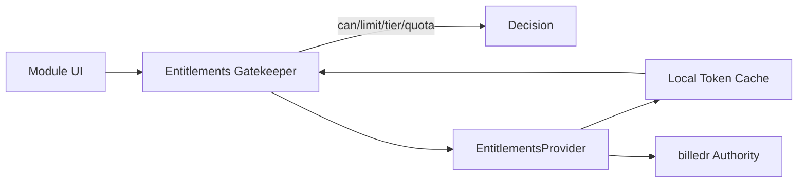
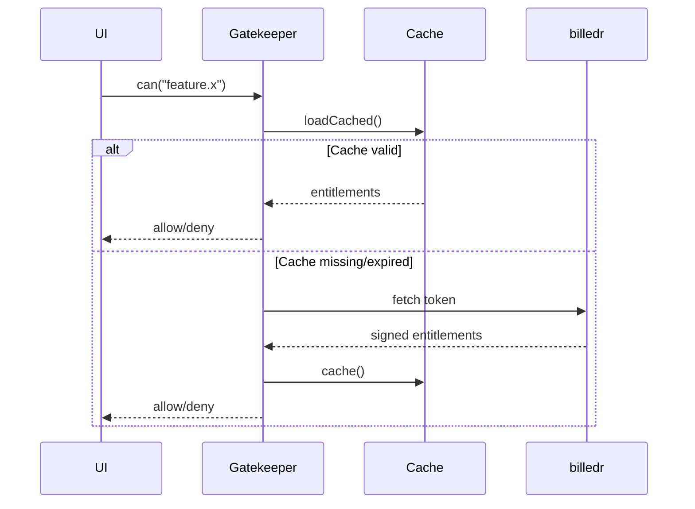

Copyright (C) 2025–2026 Robin L. M. Cheung, MBA
All rights reserved.
Unauthorized use without prior written consent is strictly prohibited.

# Entitlements Refactor AST Abstraction (2026-01-18)

## Purpose
Establish a baseline, abstracted AST representation of the current EnZIM repo and the proposed entitlements refactor so downstream coding can be executed precisely from a shared blueprint.

## Repo AST Abstraction (Current)

### Root (selected)
- `CHECKLIST.md`
- `README.md`
- `index.html`
- `build.sh`, `build.ps1`
- `package.json`, `package-lock.json`
- `tsconfig.json`, `tsconfig.node.json`
- `vite.config.ts`, `tailwind.config.js`, `postcss.config.js`
- `DOCS/ARCHITECTURE/*` (PlantUML + Mermaid)
- `DOCS/PLANNING/*` (PRD + planning)
- `DOCS/UI-Samples/*`
- `src/*` (React + TS frontend)
- `src-tauri/*` (Rust + Tauri)
- `AnZimmermanLIB/*` (ZIM core library)

### Frontend Modules (`src`)
- `main.tsx` → application bootstrap
- `App.tsx` → app shell composition + routing
- `router.tsx` → route map
- `contexts/ThemeContext.tsx` → ThemeProvider + `useTheme()`
- `stores/archiveStore.ts` → Zustand store for archives, history, bookmarks
- `services/zimService.ts` → ZIM service abstraction
- `components/layout/*` → App shell, menu, status bar, header, sidebar
- `components/library/*` → archive library UI
- `components/reader/*` → article reader UI
- `components/search/*` → search UI
- `components/mesh/*` → semantic mesh view
- `components/views/*` → settings/bookmarks/history views
- `components/dialogs/AboutDialog.tsx` → About dialog
- `components/SplashScreen.tsx` → splash UI
- `index.css` → theme tokens + base styles

### Backend Modules (`src-tauri`)
- `src/main.rs` → Tauri application entrypoint + plugins
- `build.rs` → build-time metadata
- `Cargo.toml`, `Cargo.lock` → Rust dependencies
- `tauri.conf.json` → app config + bundling

## Proposed Entitlements Refactor (AST Abstraction)

### New Conceptual Types (module-level)
- `EntitlementKey` (string literal union or enum)
- `Entitlements` (map of capability → values)
- `EntitlementsQuota` (remaining, resetAt)
- `EntitlementsDecision` (allow/deny + reason)

### Gatekeeper API (single entry point)
- `can(key: EntitlementKey): boolean`
- `limit(key: EntitlementKey): number | Infinity`
- `tier(key: EntitlementKey): string`
- `quota(key: EntitlementKey): { remaining: number; resetAt?: string }`

### Provider Interface
- `EntitlementsProvider`
  - `getEntitlements(): Promise<Entitlements>`
  - `verify(token: string): Promise<boolean>`
  - `cache(entitlements: Entitlements): Promise<void>`
  - `loadCached(): Promise<Entitlements | null>`

### Implementations
- `MockLocalEntitlementsProvider` (free-tier defaults)
- `RemoteEntitlementsProvider` (billedr stub; token verification; cache)

### Storage
- `EntitlementsTokenCache` (local storage key or filesystem JSON)

## Proposed Diagrams (Inline)

### Gatekeeper Data Flow (Mermaid)

### Offline/Online Sequence (Mermaid)

## Notes on Alignment
- This abstraction is derived from the repository layout and existing architecture docs.
- Detailed implementation will update C4/sequence/data-flow diagrams in place during Phase 2.

