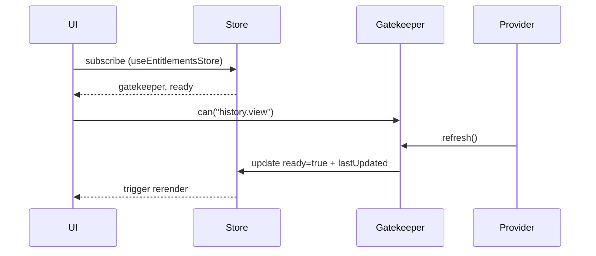
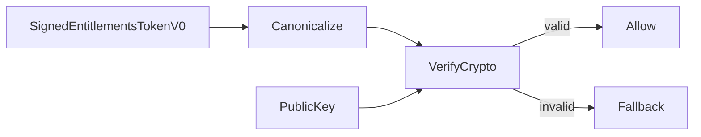

Copyright (C) 2025–2026 Robin L. M. Cheung, MBA
All rights reserved.
Unauthorized use without prior written consent is strictly prohibited.

# Entitlements Review Fixes AST Abstraction (2026-01-18)

## Purpose
Address code review issues by ensuring entitlement refresh triggers UI re-rendering and by implementing real signature verification for signed entitlements tokens.

## Current Entitlements Modules (AST)
- `src/entitlements/types.ts`
  - `EntitlementKey`, `Entitlements`, `EntitlementsProvider`, `EntitlementValue`
- `src/entitlements/gatekeeper.ts`
  - `EntitlementsGatekeeper` with `can`, `limit`, `tier`, `quota`, `refresh`
- `src/entitlements/defaults.ts`
  - `createDefaultEntitlements()`
- `src/entitlements/providers/mockLocalProvider.ts`
  - `MockLocalEntitlementsProvider`
- `src/entitlements/providers/remoteProvider.ts`
  - `RemoteEntitlementsProvider` using `fetch` + token cache
- `src/entitlements/token.ts`
  - `SignedEntitlementsTokenV0`, `verifySignedToken` (placeholder-level)
- `src/entitlements/tokenCache.ts`
  - `EntitlementsTokenCache`
- `src/entitlements/index.ts`
  - `initializeEntitlements`, `getEntitlementsGatekeeper`

## Targeted Fixes (AST)

### 1) Reactive Entitlements Store
- New file: `src/entitlements/store.ts`
- Zustand store to track:
  - `gatekeeper: EntitlementsGatekeeper`
  - `ready: boolean`
  - `lastUpdated: string | null`
  - `setGatekeeper(gatekeeper)`
  - `setReady(ready)`
  - `touch()` updates `lastUpdated` timestamp
- Purpose: ensure UI re-renders after `initializeEntitlements()` refresh completes.

### 2) Gatekeeper Initialization Flow
- Update `initializeEntitlements()` to:
  - Build gatekeeper (mock or remote)
  - Refresh entitlements
  - Update store: set `gatekeeper`, `ready = true`, `lastUpdated` updated

### 3) UI Entitlement Reads
- Update components (History/Mesh) to:
  - Read `gatekeeper` + `ready` from store hook
  - Gate display based on `ready && gatekeeper.can(key)`

### 4) Token Verification (Real)
- Update `verifySignedToken` to:
  - Require `publicKey` (SPKI PEM)
  - Canonicalize payload: `{version, issuedAt, expiresAt, entitlements}`
  - Verify signature using WebCrypto (RSASSA-PKCS1-v1_5, SHA-256)
  - Return `false` when no public key or verification fails

## Proposed Diagrams (Mermaid)

### Entitlements Refresh → UI Update

### Token Verification Flow

