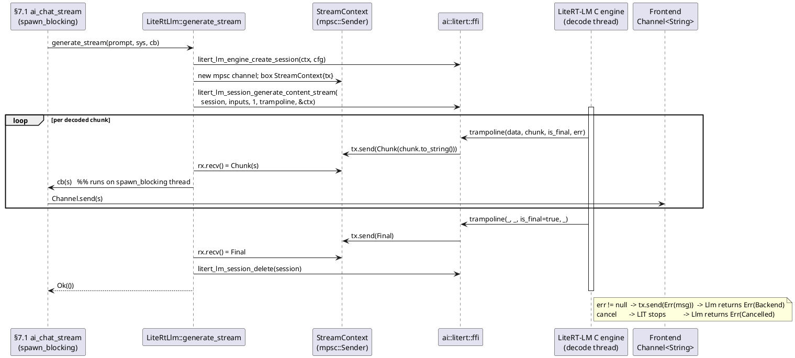

<!-- CURATED PARTIAL §7.2 AI subsystem. GLM-5.1 per-module dispatch (`ai`); Opus-reviewed/accepted 2026-06-13. Carry-forward flags: RF-AI-1 (ModelConfig.kv_cache_mb has no LiteRT C field — LiteRT sizes context in tokens; resolve mapping); RF-AI-2 (system_prompt has no Session-API channel — prepended; Conversation API is the alternative). Real extern-C LiteRT-LM FFI + Send/mpsc stream bridge specified. -->

# §7.2 AI subsystem (`src-tauri/src/ai/`) — behavioural end-state

**Airlock artifact (TC6).** Module partial authored by the GLM-5.1 architect seat
for orchestrator (Opus `cclaude`) curation, then assembly into the whole
`DOCS/ARCHITECTURE.md` §7 and whole-doc re-attestation (I-11). This file is NOT
the live doc — edit no live files from here. Intake was bounded to
`src-tauri/src/ai/**/*.rs`, §7.2 + §5.2 of `DOCS/ARCHITECTURE.md` (sed), and the
vendored LiteRT-LM C API `vendor/litert-lm/c/engine.h`.

**Authored by:** GLM-5.1 architect seat · **Date:** 2026-06-13 · **Module:** `ai`
(§7.2) · behavioural, no placeholders/TBD/signature-only rows (I-11).

---

## Behavioural overview (resolved design)

The AI subsystem runs **entirely on-device** (INV-OFFLINE: no network call exists
in any inference path). It wraps the **vendored LiteRT-LM C engine**
(`vendor/litert-lm/`, linked via `build.rs` + an `extern "C"` binding module)
running **Gemma 4 E2B q4**.

- **Text generation** — `LiteRtLlm` drives the LiteRT-LM C API synchronously:
  `load` builds engine settings + engine once; `generate`/`generate_stream`
  create a per-call **session**, build a `LiteRtLmInputData` text segment, and run
  `litert_lm_session_generate_content` (blocking) or
  `litert_lm_session_generate_content_stream` (callback-driven). LiteRT-LM owns
  internal tokenization + sampling; the Rust side maps `ModelConfig`
  (`temperature`/`top_k`/`top_p` → `LiteRtLmSamplerParams`, `max_tokens` →
  session `max_output_tokens`).
- **Streaming** — the C stream API invokes its callback from LiteRT's background
  decode thread. Because the trait's `callback: &dyn FnMut(&str)` is not `Send`,
  `generate_stream` bridges through a `Send` `StreamContext` holding an
  `mpsc::Sender`: the `extern "C"` trampoline pushes `StreamEvent`s from the
  decode thread; `generate_stream`'s body (running on the caller's
  `spawn_blocking` task, per §7.1 `ai_chat_stream`) drains the receiver and
  invokes the user callback per chunk, returning on `Final`/`Err`. The §7.1
  command wraps that callback to do `Channel<String>::send` to the frontend.
- **STT** — `GemmaAudioEncoder` uses **Gemma 4 E2B's native audio encoder** via
  LiteRT-LM multimodal input (`LiteRtLmInputData` `Audio` + `AudioEnd` segments).
  **No separate Whisper** (project decision). Pipeline: mic PCM →
  `audio::resample` to 16 kHz mono → session `generate_content` → transcribed text.
- **TTS** — deferred to **post-v1.0**. The `Tts` trait + `NullTts` empty-state
  stay; no Piper-on-by-default, no v1.0 TTS UI surfaces. Honors the existing
  deferral decision.
- **Null\* types** are the **production v1.0 startup state** (legit empty-state,
  not stubs): before any model loads they return `Err(NotLoaded)` and the app
  prompts the user to download/select a model.
- **Application-layer utilities** — `SentencePieceTokenizer` (mirrors Gemma's
  tokenizer for context windowing/token-budgeting without FFI round-trips),
  `TopKSampler`/`TopPSampler` (logits→token-id samplers for auxiliary/standalone
  decode; **not** in LiteRT's internal decode loop, which samples via
  `LiteRtLmSamplerParams`), `ContextWindow` (token-window bound), `audio::resample`,
  `Variant`/`VariantManifest` (on-device model selection).

---

## Entity table

| ID | Name | Target | Role (behavioural) | Signature / fields | Type |
|---|---|---|---|---|---|
| E-AI-1 | `LlmRuntime` | `ai/mod.rs:15` | Abstraction over an on-device text-generation backend. `load` makes a model runnable; `generate` returns one complete completion; `generate_stream` emits each decoded chunk through the callback and returns when generation finishes (EOS or `max_tokens`). v1.0 impls: `LiteRtLlm` (Gemma) and `NullLlm` (startup). | `trait { fn load(&mut self, &Path) -> Result<(),AiError>; fn generate(&self, &str, Option<&str>) -> Result<String,AiError>; fn generate_stream(&self, &str, Option<&str>, &dyn FnMut(&str)) -> Result<(),AiError>; }` | trait |
| E-AI-2 | `NullLlm` | `ai/null.rs:8` | Production startup-state LLM (no model loaded yet). All three ops return `Err(NotLoaded)` — the app treats this as "no model loaded, prompt user to download/select." Legit empty-state, not a stub. | `struct; impl LlmRuntime` | concrete |
| E-AI-3 | `LiteRtLlm` | `ai/litert/mod.rs:17` | On-device LLM runtime backed by the vendored LiteRT-LM C engine running Gemma 4 E2B q4. `load` builds engine settings from the `.task` path + device backend, sets `max_num_tokens`, calls `litert_lm_engine_create`, stores the opaque engine in `ctx` (idempotent if already loaded; `Err(Backend)` on null). `generate` creates a per-call session (sampler params from `config`, `max_output_tokens=config.max_tokens`), builds a `LiteRtLmInputData` text segment (`system_prompt` prepended when `Some`), calls `litert_lm_session_generate_content`, returns owned response text. `generate_stream` same setup → `litert_lm_session_generate_content_stream`; a `Send` `StreamContext` + `extern "C"` trampoline forward each detokenized chunk from LiteRT's decode thread to the user callback on the calling (`spawn_blocking`) thread until `is_final`; returns `Ok`/`Err(Backend)`/`Err(Cancelled)`. | `struct { ctx: *mut LiteRtLmEngine, config: ModelConfig }; unsafe impl Send; impl LlmRuntime` | concrete |
| E-AI-4 | `ai::litert::ModelConfig` | `ai/litert/config.rs:4` | Load/sampling params consumed by `LiteRtLlm` at session creation: `max_tokens`→session `max_output_tokens` (decode cap); `temperature`/`top_k`/`top_p`→`LiteRtLmSamplerParams` (TopK type). `kv_cache_mb` is an app-level KV-cache budget hint — see **RF-AI-1** (LiteRT sizes context in tokens, not MB). | `struct { max_tokens: u32, temperature: f32, top_k: u32, top_p: f32, kv_cache_mb: u32 }` | struct |
| E-AI-5 | `AudioEncoder` | `ai/mod.rs:32` | Abstraction over speech-to-text. `transcribe` takes mono PCM samples + their sample rate and returns recognized text. v1.0 impls: `GemmaAudioEncoder` (Gemma native audio) and `NullAudioEncoder` (startup). | `trait { fn transcribe(&self, &[i16], u32) -> Result<String,AiError>; }` | trait |
| E-AI-6 | `NullAudioEncoder` | `ai/null.rs:33` | Production startup-state STT before an audio model loads; `transcribe` returns `Err(NotLoaded)`. Legit empty-state. | `struct; impl AudioEncoder` | concrete |
| E-AI-7 | `GemmaAudioEncoder` | `ai/gemma_audio.rs:12` | STT via Gemma 4 E2B's **native audio encoder** (NO separate Whisper). `transcribe`: resamples i16 PCM to 16 kHz mono via `audio::resample`, creates a session on `backend.ctx`, builds a `[Audio, AudioEnd]` `LiteRtLmInputData` array from the PCM bytes, calls `litert_lm_session_generate_content`, returns the response text (the transcription). `Err(NotLoaded)` when backend not loaded; `Err(Backend)` on FFI failure. | `struct { backend: Arc<LiteRtLlm> }; impl AudioEncoder` | concrete |
| E-AI-8 | `Tts` | `ai/mod.rs:38` | Abstraction over text-to-speech. `speak` synthesizes text → i16 PCM. No concrete engine in v1.0 (Piper deferred to post-v1.0); `NullTts` is the v1.0 production impl. | `trait { fn speak(&self, &str) -> Result<Vec<i16>,AiError>; }` | trait |
| E-AI-9 | `NullTts` | `ai/null.rs:45` | Production v1.0 TTS impl — `speak` returns `Err(NotLoaded)`. Kept because no TTS UI surfaces exist in v1.0 and Piper integration is post-v1.0 (honors existing deferral decision). | `struct; impl Tts` | concrete |
| E-AI-10 | `AiError` | `ai/mod.rs:4` | Common AI error. `NotLoaded` = no model/engine loaded (startup `Null*` states, or generate-before-load). `Backend(String)` = a LiteRT-LM C call returned failure/null (wraps the C `error_msg`). `Cancelled` = a running generation was aborted via `litert_lm_session_cancel_process`. | `enum { NotLoaded, Backend(String), Cancelled }` (thiserror) | enum |
| E-AI-11 | `Sampler` | `ai/sampler.rs:3` | Application-layer logits→token-id sampler. Operates on a raw logits slice; **not** in LiteRT-LM's internal decode loop (LiteRT samples internally via `LiteRtLmSamplerParams`) — used by standalone/auxiliary decode paths. Impls: `TopKSampler`, `TopPSampler`. | `trait { fn sample(&self, &[f32]) -> u32; }` | trait |
| E-AI-12 | `TopKSampler` | `ai/sampler.rs:10` | Top-k (truncated) sampler: sorts logits desc, keeps top `k`, applies `softmax(logits/temperature)`, samples one index by inverse-CDF. Returns `0` on empty logits. | `struct { k: u32, temperature: f32 }; impl Sampler` | concrete |
| E-AI-13 | `TopPSampler` | `ai/sampler.rs:46` | Nucleus sampler: sorts desc, `softmax(logits/temperature)`, keeps the smallest prefix whose cumulative probability ≥ `p`, samples within it by inverse-CDF. Returns `0` on empty logits. | `struct { p: f32, temperature: f32 }; impl Sampler` | concrete |
| E-AI-14 | `ContextWindow` | `ai/context.rs:2` | Token-window data structure the context-management layer uses to bound how many recent token ids (prompt + RAG context + history) are retained for the next generation; `max` is the hard cap the consumer enforces by truncating `tokens`. | `struct { tokens: Vec<u32>, max: u32 }` | struct |
| E-AI-15 | `Tokenizer` | `ai/tokens.rs:3` | Application-layer text↔token-id encoder/decoder for context windowing and token-budgeting (`encode(prompt+context)` in §5.2, history trimming). SentencePiece-backed impl mirrors Gemma's tokenizer so the app need not round-trip through LiteRT FFI for token counts. | `trait { fn encode(&self, &str) -> Vec<u32>; fn decode(&self, &[u32]) -> String; }` | trait |
| E-AI-16 | `SentencePieceTokenizer` | `ai/tokens.rs:9` | SentencePiece tokenizer loaded from a real `.model` file. `encode`→token-id vec (empty on encode failure); `decode`→string (empty on failure). Round-trips text against the bundled Gemma tokenizer model. | `struct { sp: sentencepiece::SentencePieceProcessor }; impl Tokenizer` | concrete |
| E-AI-17 | `AudioBuffer` | `ai/audio.rs:2` | PCM buffer carrier (mono i16 samples + their sample rate) passed between the mic capture path and `AudioEncoder::transcribe`. | `struct { samples: Vec<i16>, sample_rate: u32 }` | struct |
| E-AI-18 | `audio::resample` | `ai/audio.rs:8` | Linear-interpolation sample-rate converter (identity when `from==to`). Used to bring mic PCM to the Gemma audio encoder's 16 kHz expected rate. | `fn(&[i16], from_rate: u32, to_rate: u32) -> Vec<i16>` | fn |
| E-AI-19 | `Variant` | `ai/probe.rs:5` | On-device model variant selector. `GemmaE2bQ4` is the canonical v1.0 model (Gemma 4 E2B q4 via LiteRT-LM); `Qwen3_06B_Q4` is the low-RAM alternative. `name`→stable string id used to resolve the `.task` model path. (Q8 variant removed per 2026-05-15 decision.) | `enum { Qwen3_06B_Q4, GemmaE2bQ4 }` (serde) | enum |
| E-AI-20 | `VariantManifest` | `ai/probe.rs:27` | Per-device variant catalog + the selected variant. `variants` lists what the device can run (RAM/CPU probe); `picked` is the one the loader loads (`GemmaE2bQ4` by default; `Qwen3_06B_Q4` on constrained devices). | `struct { variants: Vec<Variant>, picked: Variant }` (serde) | struct |
| E-AI-21 | `ai::litert::ffi` | `ai/litert/ffi.rs:1` | Rust `extern "C"` binding surface to the vendored `vendor/litert-lm` C library (linked via `build.rs`). Declares the `litert_lm_*` functions used by `LiteRtLlm`/`GemmaAudioEncoder` — `litert_lm_engine_settings_create`/`_delete`/`_set_max_num_tokens`, `litert_lm_engine_create`/`_delete`, `litert_lm_engine_create_session`, `litert_lm_session_config_create`/`_set_sampler_params`/`_set_max_output_tokens`/`_delete`, `litert_lm_session_generate_content`, `litert_lm_session_generate_content_stream`, `litert_lm_session_cancel_process`/`_delete`, `litert_lm_responses_get_response_text_at`/`_delete`, `litert_lm_engine_tokenize`/`_detokenize` + result accessors — plus `#[repr(C)]` mirrors of `LiteRtLmEngine`/`Session`/`Responses`/`EngineSettings`/`SessionConfig`, `LiteRtLmInputData`, `LiteRtLmInputDataType`, `LiteRtLmSamplerType`, `LiteRtLmSamplerParams`, and the `LiteRtLmStreamCallback` typedef. Layout-compatible with `vendor/litert-lm/c/engine.h`. | `mod ffi { extern "C" { … }; #[repr(C)] struct …; type LiteRtLmStreamCallback = extern "C" fn(*mut c_void, *const c_char, bool, *const c_char); }` | module (extern C) |
| E-AI-22 | `litert_stream_trampoline` | `ai/litert/ffi.rs` | `extern "C" fn` matching `LiteRtLmStreamCallback`; recovers `&StreamContext` from `callback_data` (raw pointer), converts the `chunk` `CStr`→`String`, and forwards a `StreamEvent` (`Chunk`/`Final`/`Err`) through the `StreamContext`'s `mpsc::Sender`. Invoked from LiteRT's background decode thread; allocates only the chunk `String`. SAFETY: `callback_data` must point at a live `StreamContext` for the whole stream. | `extern "C" fn(data: *mut c_void, chunk: *const c_char, is_final: bool, err: *const c_char)` | fn (extern C) |
| E-AI-23 | `StreamContext` | `ai/litert/mod.rs` | `Send` bridge between LiteRT's decode thread and `generate_stream`'s calling thread. Holds an `mpsc::Sender<StreamEvent>`; boxed and passed as the C `callback_data`. `generate_stream`'s body owns the `Receiver` and drives the user callback from it, so the non-`Send` `&dyn FnMut` stays on the `spawn_blocking` thread. | `struct StreamContext { tx: std::sync::mpsc::Sender<StreamEvent> }` (`StreamEvent` = `Chunk(String)` / `Final` / `Err(String)`) | struct |

---

## Semantic acceptance (I-12 — observable / real-fixture, never grep)

- **E-AI-1 `LlmRuntime`** — contract verified through its concrete impls
  (E-AI-2, E-AI-3): both compile against the trait and each method's behaviour is
  observed in those impls' acceptances.
- **E-AI-2 `NullLlm`** — `#[test]`: `load(p)==Err(NotLoaded)`,
  `generate("x",None)==Err(NotLoaded)`, `generate_stream(..)==Err(NotLoaded)`.
- **E-AI-3 `LiteRtLlm`** — integration test against the real bundled model at
  `models/gemma-4-e2b/`: `load(path)==Ok`; `generate("What is 2+2? Answer with
  just the number.", None)` returns a non-empty `String`; `generate_stream(p,None,cb)`
  invokes `cb` with ≥1 non-empty chunk and the concatenation is non-empty; a
  second `load()==Ok` (idempotent); `load("/nonexistent")==Err(Backend(_))`.
- **E-AI-4 `ModelConfig`** — test loads with
  `{max_tokens:8, temperature:0.0, top_k:1, top_p:1.0, kv_cache_mb:_}`; observes
  `generate` output length consistent with `max_tokens=8` truncation and
  deterministic (greedy, temp 0) output across two calls. (`kv_cache_mb` mapping →
  RF-AI-1.)
- **E-AI-5 `AudioEncoder`** — verified through E-AI-6 / E-AI-7.
- **E-AI-6 `NullAudioEncoder`** — `transcribe(..)==Err(NotLoaded)`.
- **E-AI-7 `GemmaAudioEncoder`** — integration test against `models/gemma-4-e2b/`:
  `backend.load()==Ok`; `transcribe(<real 16 kHz mono PCM fixture of spoken text>,
  16000)` returns a non-empty `String`; `transcribe` on an unloaded backend
  `==Err(NotLoaded)`.
- **E-AI-8 `Tts`** — verified through E-AI-9 (`NullTts`): `speak` returns
  `NotLoaded`; no v1.0 engine.
- **E-AI-9 `NullTts`** — `speak("hi")==Err(NotLoaded)`.
- **E-AI-10 `AiError`** — `Display` renders each variant; a test that calls
  `litert_lm_session_cancel_process` during a running `generate_stream` observes
  `generate_stream` returning `Err(Cancelled)`.
- **E-AI-11 `Sampler`** — verified through E-AI-12 / E-AI-13.
- **E-AI-12 `TopKSampler`** — `#[test]` with `logits=[1.0,5.0,2.0,3.0]`,
  `k=1`, `temperature=1.0` → returns index `1` (top-1/argmax) on every sample;
  with `k=2` + fixed seed the sampled index ∈ `{1,3}`; empty logits → `0`.
- **E-AI-13 `TopPSampler`** — `#[test]` with `p→0.0` returns the argmax index
  every time; with `p=1.0` any index may be chosen; the chosen index always lies
  in the smallest nucleus whose cumulative probability ≥ `p` (re-asserted by
  recomputing the nucleus).
- **E-AI-14 `ContextWindow`** — construct
  `{tokens:(0..10).collect(), max:5}`; the context-management consumer truncates
  `tokens` to the 5 most recent before the next generate — observed in that
  consumer's test.
- **E-AI-15 `Tokenizer`** — verified through E-AI-16.
- **E-AI-16 `SentencePieceTokenizer`** — `#[test]` loading the bundled Gemma
  `.model` fixture: `encode("Hello, world")`→non-empty `Vec<u32>`;
  `decode(encode(s))==s` for several ASCII and Unicode strings (round-trip).
- **E-AI-17 `AudioBuffer`** — construct `{samples:vec![…], sample_rate:16000}`;
  fields read back equal the inputs (structural).
- **E-AI-18 `audio::resample`** — `#[test]` resample a 48 kHz cosine (known
  samples) to 16 kHz: `out.len()==ceil(in.len()*16/48)` and each `out[i]` equals
  the hand-computed linear-interpolation value within 1 LSB; `from==to` returns
  the input unchanged.
- **E-AI-19 `Variant`** — `#[test]`: `GemmaE2bQ4.name()=="GemmaE2bQ4"`,
  `Qwen3_06B_Q4.name()=="Qwen3_06B_Q4"`, `Display` matches; exactly two variants
  (no Q8).
- **E-AI-20 `VariantManifest`** — `#[test]`: build a manifest for a device
  profile; assert `picked ∈ variants` and the default profile picks `GemmaE2bQ4`.
- **E-AI-21 `ai::litert::ffi`** — `build.rs` links the vendored `liblitert_lm`;
  a smoke test calls `litert_lm_engine_settings_create(valid_path,"cpu",null,null)`
  → non-null and `(missing_path,..)` → null; `sizeof`/offset assertions confirm
  the `#[repr(C)]` mirrors match `vendor/litert-lm/c/engine.h`.
- **E-AI-22 `litert_stream_trampoline`** — unit test with a stub pipeline: feeding
  `(chunk="abc", is_final=false)` then `(chunk="", is_final=true)` yields
  `StreamEvent::Chunk("abc")` then `Final` on the `mpsc` receiver; a non-null
  `error_msg` yields `Err(msg)`.
- **E-AI-23 `StreamContext`** — unit test: `tx` send of `Chunk`/`Final` is
  received in order by the paired `rx`; `static_assert Send` (need not be `Sync`).

---

## Invariants honoured

- **INV-OFFLINE** — no network in any inference path. `load`/`generate`/
  `generate_stream`/`transcribe` are pure on-device C-FFI against the vendored
  engine; the backend string resolves to a local compute target (`"gpu"` where
  present, else `"cpu"`).
- **No separate Whisper** — STT is Gemma 4 E2B's native audio encoder via
  multimodal `LiteRtLmInputData` (`Audio` + `AudioEnd`), not a standalone STT model.
- **TTS post-v1.0** — `Tts` trait + `NullTts` retained; no Piper in v1.0.
- **Threading** — `LiteRtLlm: Send` (already `unsafe impl Send`) permits handoff
  into the §7.1 `spawn_blocking` task. The engine is loaded once before any
  generate; **sessions are per-call** (`engine_create_session`), so the shared
  `Arc<LiteRtLm>` only fans out immutable engine reads. The non-`Send` user
  callback never crosses the C thread boundary (it runs on the `spawn_blocking`
  thread via the `mpsc` bridge).
- **Memory safety** — every C object the FFI returns with caller-ownership
  (`EngineSettings`, `Engine`, `Session`, `Responses`, tokenize/detokenize
  results) is paired with its `_delete` call on all return paths (incl. `Err`).

---

## Dependencies (named)

- **LiteRT-LM C library** — vendored at `vendor/litert-lm/`, compiled and linked
  by `src-tauri/build.rs` (`cc`/`cmake`), declared to Rust through `ai::litert::ffi`
  (`extern "C"`). New build-time dep.
- **`sentencepiece`** (crate, already present) — `SentencePieceTokenizer`.
- **`tokio`** (`task::spawn_blocking`) — already present via Tauri; used at the
  §7.1 command boundary, not inside `ai/`.
- **`rand`** (already) — sampler inverse-CDF draw.
- **`thiserror`** (already) — `AiError`.

---

## Reconciliation flags (surfaced for orchestrator; not silently applied)

- **RF-AI-1 — `ModelConfig.kv_cache_mb` has no LiteRT C-API field.** LiteRT-LM
  sizes context in **tokens** (`litert_lm_engine_settings_set_max_num_tokens(int)`),
  not megabytes; `max_tokens` already consumes the token budget as the decode
  output cap (`session max_output_tokens`). Options for the orchestrator: (a)
  reinterpret `kv_cache_mb` as a token-count budget and feed it to
  `set_max_num_tokens` at engine creation; (b) repurpose/rename the field to a
  token-count `context_tokens`; (c) drop it as unused app metadata. The §7.2
  behaviour above leaves it unmapped (app-level hint) until resolved.
- **RF-AI-2 — `system_prompt` application via the Session API.**
  `litert_lm_session_generate_content` takes raw `LiteRtLmInputData` with no
  separate system-message channel (system messages are first-class only on the
  Conversation API). The behaviour above prepends `system_prompt` to the input
  text segment. If first-class system-role turns are required, the alternative is
  the Conversation API (`litert_lm_conversation_config_set_system_message`) — a
  larger change flagged for orchestrator decision, not applied here.

---

## Streaming-generate FFI sequence (behavioural)

---

