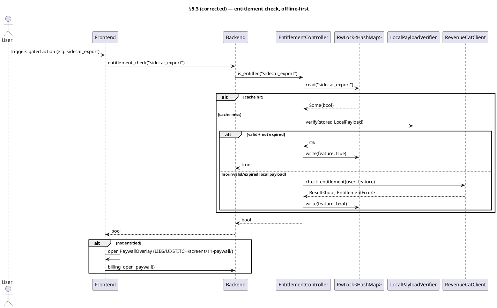

<!-- CURATED PARTIAL §7.6 Billing/entitlement + bridge. GLM-5.1 (`billing`); Opus-reviewed/accepted 2026-06-13. 24 entities, offline-first (cache→LocalPayloadVerifier→RC) with CORRECTED §5.3 diagram; production EntitlementSyncBridge. Carry-forward: (1) §5.3 master diagram must adopt offline-first order at assembly; (2) I-16 VIOLATION — bridge default port 3000 forbidden → proposed 47921, NEEDS OPERATOR CONFIRM before baking + DOCS/NETWORKING.md; (3) new rows E-ENT-19..24; (4) new env vars (secrets cleartext-canonical per I-15 — never mask); (5) BillingMode::CustomArtifact reserved. -->

# §7.6 replacement — Entitlement / billing (`src-tauri/src/billing/` + `bridge/`)

GLM-5.1 per-module architect partial (TC13). Behavioural end-state, no
placeholders/TBD/signature-only (I-11). Semantic acceptance per row (I-12 —
observable behaviour or real-fixture test, **never** grep-for-existence).

**Source truth at intake (mostly hollow):**
- `EntitlementController::is_entitled` returns `Ok(false)`; `rc`/`local` are
  `Arc<()>` placeholders; `refresh` is a no-op.
- `PaywallController::open` is a no-op; struct has no fields.
- `PurchaseRestorer::restore` is `todo!("E-ENT-10")`.
- `RevenueCatClient` exists with only `new`; `LocalPayloadVerifier` exists
  with a `public_key` field but no `verify`.
- Bridge `webhook_intake` returns `501 Not Implemented`; `RcGrantSender::send`
  is `todo!()`; `HealthMetrics::serve_metrics` returns a TODO string;
  `bridge::main` defaults the bind port to `3000`.

This partial specifies the **real** behaviour for all of the above. Existing
IDs E-ENT-1..18 are preserved verbatim (referenced elsewhere: `commands.rs`
comments, `ledger.rs`/`webhook.rs`/`hmac.rs`/`health.rs`/`main.rs` row
citations). New behavioural methods become E-ENT-19 onward.

---

## Resolved design (binding; per `~/.claude/BILLING_CONVENTIONS.md`)

- **RevenueCat is the runtime entitlement truth.** Feature gates read **one**
  `EntitlementController` only — processor-agnostic by construction
  (adding/removing Stripe/BTCPay/Play Billing must not touch any feature gate).
- **Offline-first check order (SUPERSEDES the §5.3 PlantUML ordering):**
  `cache → LocalPayloadVerifier → RevenueCatClient fallback → cache`. The local
  signed payload is checked **before** the network path so that `is_entitled`
  resolves with airplane mode on (INV-OFFLINE). RC is the freshness/fallback
  path, not the first path.
- **Clients never grant entitlements directly.** Direct processors
  (Stripe/BTCPay/Square) push purchases to the server-side
  `EntitlementSyncBridge`, which is the only component that calls RC's granting
  REST API (`RcGrantSender`). The client only **reads** entitlement state.
- **Channel routing:** Play build → Play Billing via RevenueCat; sideload /
  F-Droid / desktop → Stripe or BTCPay, selected by **build flag**
  (`ENZIME_BILLING_PROCESSOR=stripe|btcpay`). Routing lives in
  `PaywallController` + build flags, never in feature gates.
- **No project-owned magic-link auth.** Identity is the RevenueCat `app_user_id`
  (Play: derived from the install / Play account; desktop: a generated UUID
  persisted in `Storage`).
- **`EntitlementSyncBridge` is production-grade from v1** — webhook intake,
  HMAC verify, idempotent ledger, RC grant, structured logs, Prometheus
  `/metrics`, systemd unit. No stubs.
- **INV-OFFLINE:** `LocalPayloadVerifier` needs **no network at verify time**;
  the operator's ed25519 public key is compiled into the binary.

---

## Entity table (replacement §7.6)

| ID | Name | Target | Role | Signature / fields | Type |
|---|---|---|---|---|---|
| E-ENT-1 | `EntitlementController` | `billing/mod.rs:34` | Single gate truth all feature gates read; processor-agnostic. Cache → local verifier (offline-first) → RC fallback → cache. | `struct { mode: BillingMode, storage: Arc<Storage>, rc: Arc<RevenueCatClient>, local: Arc<LocalPayloadVerifier>, cache: RwLock<HashMap<String,bool>> }` | struct |
| E-ENT-2 | `EntitlementController::is_entitled` | `billing/mod.rs:55` | Feature check: cache hit → return; else local-payload verify (offline-first); else RC `check_entitlement`; result written to cache. | `fn(&self, entitlement: &str) -> Result<bool, EntitlementError>` | fn |
| E-ENT-3 | `EntitlementController::refresh` | `billing/mod.rs:73` | Pull latest entitlement state from RC, overwrite cache, re-write a fresh signed local payload if RC confirms active entitlement. No-op-ish safe on network error (keeps stale cache). | `fn(&self) -> Result<(), EntitlementError>` | fn |
| E-ENT-4 | `EntitlementError` | `billing/mod.rs:22` | Billing/entitlement error (thiserror). | `enum { Network(String), NotEntitled, Backend(String) }` | enum |
| E-ENT-5 | `RevenueCatClient` | `billing/revenuecat.rs:7` | RC REST client; offline-tolerant (network failures → `EntitlementError::Network`, never panic). | `struct { api_key: String, http: reqwest::Client }` | concrete |
| E-ENT-6 | `LocalPayload` | `billing/local_payload.rs:7` | Operator-ed25519-signed offline entitlement claim; verified with no network. | `struct { tier: BillingMode, expires: i64 (unix secs), signature: Vec<u8> (64B ed25519), payload_hash: [u8;32] (SHA-256 of serialized blob) }` | struct |
| E-ENT-7 | `LocalPayloadVerifier` | `billing/local_payload.rs:24` | Verifies operator-signed `LocalPayload` against the compiled-in ed25519 public key; checks `expires` vs now. | `struct { public_key: VerifyingKey }` | struct |
| E-ENT-8 | `BillingMode` | `billing/mode.rs:3` | Grant mode. Mode 1 Perpetual + Mode 2 Subscription active v1.0; Mode 3 reserved, not user-visible. | `enum { Perpetual, Subscription, CustomArtifact }` | enum |
| E-ENT-9 | `PaywallController` | `billing/paywall.rs:5` | Triggers the paywall/purchase surface. Play → Play Billing via RC Offering; desktop/sideload → Stripe/BTCPay checkout URL by build flag. UI = Stitch screen `11-paywall`. | `struct { rc: Arc<RevenueCatClient>, mode: BillingMode }; impl open(&self) -> Result<(), String>` | struct |
| E-ENT-10 | `PurchaseRestorer` | `billing/restore.rs:14` | Restore prior purchases: query RC subscriber state for the persisted `app_user_id`, sync active entitlements into the controller cache, count successes. | `struct { rc: Arc<RevenueCatClient>, storage: Arc<Storage> }; impl restore(&self) -> Result<RestoreResult, String>` | struct |
| E-ENT-11 | `RestoreResult` | `billing/restore.rs:6` | Restore outcome returned to frontend. | `struct { restored: u32, errors: Vec<String> }` (serde Serialize/Deserialize) | struct |
| E-ENT-12 | `EntitlementSyncBridge` | `bridge/` (workspace binary `entitlement-sync-bridge`) | Operator-deployed server: webhook intake from direct processors → HMAC verify → idempotent ledger → RC grant push. Production-grade v1. | binary crate; `axum` `Router` on `POST /webhook` + `GET /metrics`; systemd unit `enzime-entitlement-sync.service` | concrete |
| E-ENT-13 | `bridge::webhook_intake` | `bridge/src/webhook.rs:8` | `POST /webhook` handler: read raw body + signature header → HMAC validate (401 on fail) → `IdempotentLedger::seen` (200 idempotent if dup) → parse event → `RcGrantSender::send` → 200/502. | `async fn(axum::Request, State<AppState>) -> axum::Response` | fn |
| E-ENT-14 | `bridge::HmacValidator` | `bridge/src/hmac.rs:15` | Webhook signature check, SHA-256 HMAC, **constant-time** compare. | `struct { secret: secrecy::SecretString }; impl validate(&self, body: &[u8], signature_hex: &str) -> bool` | struct |
| E-ENT-15 | `bridge::IdempotentLedger` | `bridge/src/ledger.rs:14` | Dedup webhooks via SQLite (`webhook_ledger` table, PK `webhook_id`); `seen` is insert-or-conflict → `Ok(true)` if duplicate. | `struct { db: Arc<sqlx::Pool<sqlx::Sqlite>> }; impl init() + seen(&self, &str) -> Result<bool, sqlx::Error>` | struct |
| E-ENT-16 | `bridge::RcGrantSender` | `bridge/src/rc.rs:4` | Push entitlement to RC via granting REST API; the **only** component that calls RC's grant endpoint. | `struct { secret: SecretString, http: reqwest::Client }; impl async send(&self, user_id: &str, entitlement_id: &str, expiration_ms: i64) -> Result<(), Box<dyn Error+Send+Sync>>` | fn |
| E-ENT-17 | `bridge::HealthMetrics` | `bridge/src/health.rs:8` | Prometheus text-format `/metrics`: counters `webhook_received_total`, `webhook_valid_total`, `webhook_duplicate_total`, `rc_grant_success_total`, `rc_grant_failure_total` + `bridge_build_info` gauge. Hand-rolled exposition (AtomicU64), no `prometheus` crate. | `struct; impl async serve_metrics(State<AppState>) -> impl IntoResponse` | struct |
| E-ENT-18 | `bridge::main` | `bridge/src/main.rs:23` | Tokio `#[tokio::main]` entrypoint: init `tracing_subscriber` (journald-friendly env filter), build `AppState` (HmacValidator + IdempotentLedger + RcGrantSender + BridgeMetrics) from env, wire Router, serve on `BRIDGE_BIND_ADDR`. | `async fn main()` | fn |
| E-ENT-19 | `RevenueCatClient::check_entitlement` | `billing/revenuecat.rs` | Read one feature's entitlement from RC. `GET /v1/subscribers/{app_user_id}/entitlements/{feature}` with `Authorization: Bearer <api_key>` + `X-Platform`. Maps HTTP/parse/network failures to `EntitlementError`. | `async fn(&self, app_user_id: &str, entitlement: &str) -> Result<bool, EntitlementError>` | fn |
| E-ENT-20 | `RevenueCatClient::fetch_subscriber` | `billing/revenuecat.rs` | Read full subscriber entitlement map for restore. `GET /v1/subscribers/{app_user_id}`; returns active (non-expired) entitlement ids. | `async fn(&self, app_user_id: &str) -> Result<Vec<String>, EntitlementError>` | fn |
| E-ENT-21 | `LocalPayloadVerifier::verify` | `billing/local_payload.rs` | Recompute signing input `[tier_byte] ‖ expires.to_be_bytes()`, assert `payload_hash` matches the serialized blob, verify the ed25519 signature with `public_key`, reject if `now > expires`. Returns `Ok(())` / `Err(NotEntitled)`. No network. | `fn(&self, payload: &LocalPayload, now_unix: i64) -> Result<(), EntitlementError>` | fn |
| E-ENT-22 | `LocalPayload::signing_input` | `billing/local_payload.rs` | Deterministic canonical bytes the operator signs and the verifier recomputes. | `fn(&self) -> Vec<u8>` → `[BillingMode discriminant] ‖ self.expires.to_be_bytes()` | fn |
| E-ENT-23 | `bridge::AppState` | `bridge/src/main.rs` | Shared axum state wiring the four collaborators into the Router. | `struct { hmac: Arc<HmacValidator>, ledger: Arc<IdempotentLedger>, grant: Arc<RcGrantSender>, metrics: Arc<BridgeMetrics> }` | struct |
| E-ENT-24 | `bridge::BridgeMetrics` | `bridge/src/health.rs` | Atomic counters backing `HealthMetrics::serve_metrics`. | `struct { webhook_received: AtomicU64, webhook_valid: AtomicU64, webhook_duplicate: AtomicU64, rc_grant_success: AtomicU64, rc_grant_failure: AtomicU64 }` | struct |

**Named dependencies (build entities; crates already in tree):**
`reqwest` (RC REST, client + bridge), `ed25519-dalek` + `sha2` (local payload
sign/verify, reused for the bridge HMAC digest), `hmac` + `secrecy` + `hex`
(bridge webhook HMAC + constant-time-safe secret hold), `axum` + `tokio` +
`sqlx` (bridge HTTP + ledger), `thiserror` (client `EntitlementError`). No new
external crate is required beyond these.

---

## Behavioural acceptance (semantic, per I-12 — observable, never grep)

**E-ENT-1 / E-ENT-2 (`EntitlementController::is_entitled`):**
- Given a `LocalPayload` signed by the operator key with `expires` in the future
  and `tier ∈ {Perpetual, Subscription}`, a fresh controller (empty cache) returns
  `Ok(true)` for any feature string, with airplane mode on (RC unreachable) — the
  local path resolves and the result is written to `cache`.
- Same payload with `expires` in the past (verifier called with `now > expires`)
  returns `Ok(false)` **and** does not grant; cache is written `false`; if RC is
  then reachable it is consulted and the cache updated to RC's verdict.
- A payload whose `signature` or `tier`/`expires` bytes were tampered (so
  `signing_input` no longer matches what was signed) is rejected as
  `NotEntitled`; never grants.
- A second `is_entitled(same_feature)` call after a miss returns the previously
  cached value **without** touching the verifier or RC (observable: no HTTP, no
  signature op on the second call).

**E-ENT-3 (`refresh`):** After `refresh`, the cache reflects RC's current
subscriber state for the persisted `app_user_id`; an entitlement that was active
then lapsed on RC flips from `true` to `false` in the cache; a network failure
returns `Err(Network)` but leaves the existing cache intact (no wipe).

**E-ENT-5 / E-ENT-19 / E-ENT-20 (`RevenueCatClient`):**
- `check_entitlement` returns `Ok(true)` when RC reports an active entitlement,
  `Ok(false)` when RC reports none, `Err(Network)` on connection failure, and
  `Err(Backend)` on an unexpected non-2xx body — verified against a recorded RC
  JSON fixture, not the live network.
- `fetch_subscriber` parses a recorded `GET /v1/subscribers/{id}` fixture and
  returns exactly the set of non-expired entitlement ids, dropping expired ones.

**E-ENT-7 / E-ENT-21 / E-ENT-22 (`LocalPayloadVerifier::verify`):** Against a
real operator keypair fixture: a correctly-signed payload verifies `Ok(())`; the
same payload after `expires` returns `Err(NotEntitled)`; a payload re-signed by a
*different* key fails; flipping any bit in `signature` or the canonical input
fails. None of these cases performs any network I/O.

**E-ENT-9 (`PaywallController::open`):** On the Play build, `open` triggers the
RC paywall Offering for the configured product id; on the desktop/sideload build
(`ENZIME_BILLING_PROCESSOR=stripe`), it surfaces the Stripe checkout URL;
`ENZIME_BILLING_PROCESSOR=btcpay` surfaces the BTCPay invoice URL. Returns
`Err(String)` when no Offering/price is configured for the active channel. The
rendered surface is the Stitch `11-paywall` screen.

**E-ENT-10 (`PurchaseRestorer::restore`):** With a recorded subscriber fixture
carrying two active entitlements and one expired one, `restore` returns
`RestoreResult { restored: 2, errors: [] }` and the controller cache holds both
active features as `true`. An RC network error is captured in
`errors` (non-fatal) and `restored` reflects the count actually synced.

**E-ENT-13 (`webhook_intake`):**
- A request whose `X-Signature` fails HMAC validation → HTTP **401**, no ledger
  write, no grant, `webhook_received` increments but not `webhook_valid`.
- The same valid event delivered twice: first → 200 and one RC grant;
  second → 200 with **no** second grant (`IdempotentLedger` returns `seen=true`),
  `webhook_duplicate` increments.
- A valid event whose RC grant call fails → HTTP **502** and
  `rc_grant_failure` increments; a retry of the same event id is still deduped
  by the ledger only after a successful grant (ledger write happens **after** the
  grant succeeds, so a failed grant is retriable).

**E-ENT-14 (`HmacValidator::validate`):** Returns `true` for the correct
hex-encoded HMAC of the body, `false` for a truncated/modified signature or
wrong secret, verified via constant-time compare (no early-return timing leak on
mismatched length).

**E-ENT-15 (`IdempotentLedger::seen`):** First call with an id → `Ok(false)` and
a row is inserted; immediate second call with the same id → `Ok(true)`; two
distinct ids each return `Ok(false)`; the table is created by `init()` on a fresh
SQLite file without error.

**E-ENT-16 (`RcGrantSender::send`):** Against a recorded RC fixture, issues
`POST /v1/subscribers/{user_id}/entitlements/{entitlement_id}` with
`Authorization: Bearer <secret>`, `X-Platform`, and `expiration_at_ms`; returns
`Ok(())` on 2xx and `Err` on non-2xx (body surfaced in the error). Verifies the
exact request line/headers/body of the recorded interaction.

**E-ENT-17 / E-ENT-24 (`HealthMetrics::serve_metrics`):** After N received / M
valid / D duplicate / S success / F failure events, `GET /metrics` returns
Prometheus text exposition with each counter at its current value
(`webhook_received_total N`, etc.) and a `bridge_build_info` line; content-type
`text/plain; version=0.0.4`.

**E-ENT-18 (`bridge::main`):** Boots, binds `BRIDGE_BIND_ADDR`, logs the bound
address at info, and serves `/webhook` (POST) + `/metrics` (GET); a health `GET
/metrics` returns 200 on the bound port. Exits non-zero if a required secret env
var (`BRIDGE_RC_SECRET`, `BRIDGE_HMAC_SECRET`) is absent.

---

## Reconciliation flags (surface to orchestrator — do NOT silently apply)

1. **§5.3 PlantUML ordering superseded.** The existing §5.3 diagram shows the RC
   check *before* the local-payload verify (`Ctrl -> RC` then `opt local`). The
   resolved design is **offline-first: local verify before RC**. The orchestrator
   must re-attest §5.3 to match the corrected diagram above when assembling the
   whole (I-11 re-attestation of the master).
2. **Port I-16 violation in `bridge::main` (E-ENT-18).** Current default
   `BRIDGE_BIND_ADDR = [::]:3000` is a forbidden framework-default port (I-16).
   End-state default must be a high, non-patterned port. **Proposed: `47921`.**
   Record in `DOCS/NETWORKING.md`. Needs operator/orchestrator confirmation of
   the exact value before it is baked into the binary and the systemd unit.
3. **New rows E-ENT-19..E-ENT-24 + `bridge::AppState`/`BridgeMetrics`.** These
   are the method/state entities required to make E-ENT-5/7/13/17 behavioural
   rather than signature-only. The master entity table should adopt them so the
   three-role chain has concrete acceptance targets.
4. **New named env vars (config entities):** client-side `ENZIME_RC_API_KEY`
   (RC *public* SDK key), `ENZIME_BILLING_PROCESSOR` (`stripe|btcpay`, desktop);
   bridge-side `BRIDGE_BIND_ADDR`, `BRIDGE_RC_SECRET` (RC *secret* key),
   `BRIDGE_HMAC_SECRET`, `BRIDGE_DB_PATH` (sqlite ledger). All secrets are
   cleartext-canonical per I-15 — never masked/rotated by agents.
5. **`BillingMode` source drift (minor):** `mode.rs` carries `CustomArtifact`
   (Mode 3, reserved). Entity table E-ENT-8 already reflects this; retained as
   reserved, not user-visible — no action, flagged only for attestation parity.
