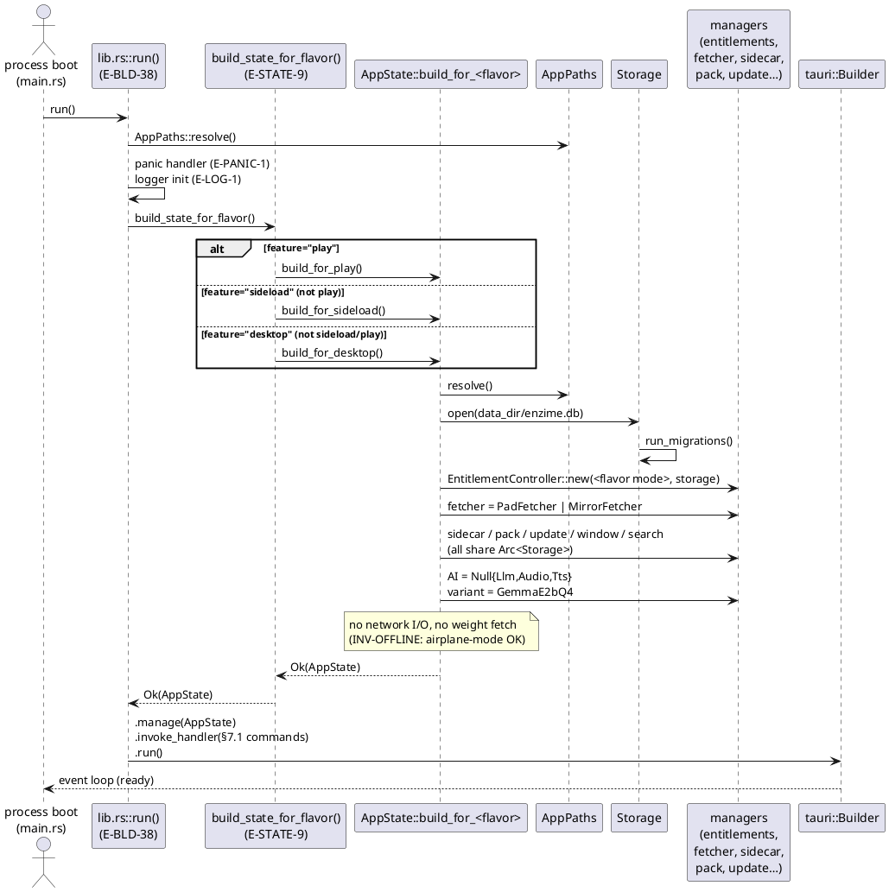

<!-- CURATED PARTIAL §7.4 AppState. GLM-5.1 (`state`); Opus-reviewed/accepted 2026-06-13. AppState (20 managers, shared Arc<Storage>) + per-flavor build_for_* (differ only in BillingMode + default fetcher). SECURITY-CRITICAL carry-forward (coder tasks, cross-module): RF-STATE-A SidecarSigner::from_seed([0u8;32]) zero seed → IdentityKeystore (§7.10 E-SIDE-34) — else identical signatures across devices; RF-STATE-B MirrorFetcher::new(()) + zero verifier key → real client+MIRROR_PUBLIC_KEY (§7.9) — else unverified weights; RF-STATE-C PackCatalog placeholder Client + no-op verifier → real reqwest+PACK_CATALOG_PUBLIC_KEY (§7.14 E-PACK-18); RF-STATE-D run_migrations must create schema (§7.5 RF3). -->

### §7.4 Application state (`src-tauri/src/state.rs`)

`AppState` is the **single per-process state container** behind Tauri's
`State<AppState>` — the dispatch surface every `§7.1` command reads through.
It holds one owning handle (`Arc<…>` / `Mutex<Box<dyn …>>`) to **every**
subsystem manager and is constructed exactly once at process boot by a
cargo-feature-selected builder. Because every sub-store is given a **shared
`Arc<Storage>`** (one connection pool, cloned by `Arc`) rather than a borrow,
no lifetime escapes the struct: `AppState: Send + Sync + 'static` and is
`.manage()`-able by Tauri with no bound errors.

**Flavor selection (processor-agnostic).** `lib.rs run()` (E-BLD-38,
`lib.rs:38`) calls `build_state_for_flavor()` (E-STATE-9, `lib.rs:130`), a
mutually-exclusive cfg bridge: `play` ⊻ `sideload` ⊻ `desktop`. The three
flavors differ **only** in (a) `BillingMode` and (b) the default
`ModelFetcher` — never in feature gates, never in which managers exist
(processor-agnostic per `BILLING_CONVENTIONS`):

| Flavor | `BillingMode` | Default `ModelFetcher` | cargo gate |
|---|---|---|---|
| `play` | `Subscription` | `PadFetcher` (Play Asset Delivery) | `feature = "play"` |
| `sideload` | `CustomArtifact` | `MirrorFetcher` (HTTPS mirror) | `feature = "sideload"` |
| `desktop` | `Perpetual` | `MirrorFetcher` (HTTPS mirror) | `feature = "desktop"` |

**Construction performs no network I/O and no weight fetch (INV-OFFLINE).**
Every builder wires the AI runtimes as `Null*` (`NullLlm`, `NullAudioEncoder`,
`NullTts`) and `variant = Variant::GemmaE2bQ4`; `capability` is an empty
`OnceLock` (probed lazily by `device_probe` per §5.1). The real LiteRT-LM
weights are **not** fetched during construction — `§5.1` first-launch later
calls `model_fetch` / `model_import_from_media` (Pad/Mirror fetch with the
INV-OFFLINE media-import fallback) and then `swap_llm` to load a real
`LiteRtLlm`. A builder therefore returns `Ok(AppState)` with airplane mode on,
before any model is present. This is the `NullFetcher`/weights-on-disk-until-
fetch-lands default of §5.1 made concrete.

**Common construction order (all three builders, lines below reference
`state.rs`):** (1) `AppPaths::resolve()`→`Arc<AppPaths>`; (2) `Storage::open
(data_dir/enzime.db)`→`Arc<Storage>`; (3) `EnzimeLogger::init(&paths)`→
`Arc<EnzimeLogger>`; (4) `storage.run_migrations()` ⚠RECONCILE; (5)
`EntitlementController::new(<flavor BillingMode>, storage.clone())`→`Arc`;
(6) `fetcher` = flavor-correct `PadFetcher`/`MirrorFetcher` ⚠RECONCILE (mirror
placeholder args); (7) `SidecarStore::new(sidecars_dir)`; (8)
`SidecarIndex::new(storage)`; (9) `SidecarSigner::from_seed(...)` ⚠RECONCILE;
(10) `TrustDb::new(storage)`; (11) `VoiceClipBlobStore { root }`; (12)
`PackCatalog { … verifier }` ⚠RECONCILE; (13) `UpdateSignatureVerifier::new()`
→ `AppUpdater { channel, verifier, current_version }`; (14)
`WindowStateStore { storage }`; (15) `GlobalSearcher { catalog }`; (16) Null
AI runtimes + `GemmaE2bQ4` + empty `OnceLock`; (17) `Ok(AppState { … })`.

#### Resolved decisions (architect-committed)

The entity rows below specify the **end-state** wiring (referencing managers
defined in their own `§7.x` partials). The following placeholder constructor
args were identified and **resolved** — the resolutions are committed
architectural decisions; coder tasks to apply them to the source are tracked
in `CHECKLIST.md` Phase R2.

- **RF-STATE-A (RESOLVED) — `SidecarSigner` zero seed → `IdentityKeystore` (§7.10 E-SIDE-34).**
  All three builders called `SidecarSigner::from_seed(&[0u8; 32])`
  (`state.rs:101`, `:194`, `:287`). **Resolution:** the signer is built from the
  device's real ed25519 identity via `IdentityKeystore::load_or_create
  (paths.identity_dir)` (E-SIDE-34, §7.10). Coder task: R2.1.

- **RF-STATE-B (RESOLVED) — `MirrorFetcher`/`MirrorManifestVerifier` placeholder args (§7.9 Dynamic Download).**
  Sideload + desktop builders called `MirrorFetcher::new((), verifier,
  paths.models_dir)` with `()` as the transport arg and
  `MirrorManifestVerifier::new(&[0u8; 32])` (zero verification key)
  (`state.rs:180-189`, `:273-282`). **Resolution:** real `reqwest::Client` + real
  verifier key materialised from `MIRROR_PUBLIC_KEY` (§7.9). Coder task: R2.2.

- **RF-STATE-C (RESOLVED) — `PackCatalog` placeholder transport + no-op verifier (§7.14 E-PACK-18).**
  All builders constructed `PackCatalog { http: crate::pack_catalog::Client, …,
  verifier: crate::pack_catalog::ManifestVerifierPlaceholder }`
  (`state.rs:105-115`, `:198-208`, `:291-301`). **Resolution:** real `reqwest::Client`
  + real catalog manifest verifier keyed by `PACK_CATALOG_PUBLIC_KEY` (§7.14,
  E-PACK-18). Coder task: R2.3.

- **RF-STATE-D (RESOLVED) — `run_migrations()` must actually create the schema (§7.5 RF3).**
  All builders call `storage.run_migrations()?` (`state.rs:88`, `:173`, `:266`).
  §7.5 RF3 flagged the `MIGRATIONS` array as empty. **Resolution:** `run_migrations()`
  materialises the full schema (four `CREATE TABLE` statements) before any manager
  that queries `storage` is constructed. Coder tasks: R1.2 (populate MIGRATIONS),
  R2.5 (ordering guarantee).

#### Entity table

| ID | Name | Target | Role | Signature / fields (end-state) | Semantic acceptance (end-state) | Type |
|---|---|---|---|---|---|---|
| E-STATE-1 | `AppState` | `state.rs:29` | One per-process state container behind Tauri `State<AppState>`; holds an owning handle to every subsystem manager; `Send+Sync+'static` | `struct AppState { zim: Mutex<Vec<Box<dyn ZimReader+Send+Sync>>>; llm: Mutex<Box<dyn LlmRuntime+Send+Sync>>; audio: Mutex<Box<dyn AudioEncoder+Send+Sync>>; tts: Mutex<Box<dyn Tts+Send+Sync>>; storage: Arc<Storage>; entitlements: Arc<EntitlementController>; fetcher: Box<dyn ModelFetcher+Send+Sync>; variant: RwLock<Variant>; capability: OnceLock<DeviceCapability>; sidecar_store: Arc<SidecarStore>; sidecar_signer: Arc<SidecarSigner>; sidecar_index: Arc<SidecarIndex>; trust_db: Arc<TrustDb>; voice_blobs: Arc<VoiceClipBlobStore>; paths: Arc<AppPaths>; logger: Arc<EnzimeLogger>; pack_catalog: Arc<PackCatalog>; app_updater: Arc<AppUpdater>; window_state_store: Arc<WindowStateStore>; global_searcher: Arc<GlobalSearcher> }` (every sub-store shares the one `Arc<Storage>` — no borrowed lifetime escapes) | A constructed `AppState` (any flavor) has all 20 fields as concrete initialised managers (no `Option`/`None`/uninit); the type compiles as `tauri::State<AppState>` (no `Send+Sync+'static` bound error); the `Arc<Storage>` held by `entitlements`, `sidecar_index`, `trust_db`, `window_state_store`, etc. is the *same* pool (one shared connection, not N), observable by a round-trip write through one manager being readable from another | struct |
| E-STATE-2 | `AppState::build_for_play` | `state.rs:82` | `#[cfg(feature="play")]` constructor; Play flavor | `pub fn build_for_play() -> Result<Self, AppError>` — wires `EntitlementController::new(BillingMode::Subscription, storage, local_verifier)`, `fetcher = PadFetcher` (PAD), and the common manager set; end-state signer/verifier wiring per RF-STATE-A/B/C | Under `cfg(feature="play")`, `build_for_play()` returns `Ok(AppState)` whose `entitlements` was built with `BillingMode::Subscription` (asserted by reading the controller's mode) and whose `fetcher` downcasts to `PadFetcher`; construction completes with airplane mode on (no network call observed); a migrated storage key round-trips; end-state signer/verifier wiring per RF-STATE-A/B/C (resolved — coder tasks R2.1–R2.5) | fn |
| E-STATE-3 | `AppState::build_for_sideload` | `state.rs:167` | `#[cfg(feature="sideload")]` constructor; sideload flavor | `pub fn build_for_sideload() -> Result<Self, AppError>` — wires `EntitlementController::new(BillingMode::CustomArtifact, storage, local_verifier)`, `fetcher = MirrorFetcher`, common set; end-state mirror/verifier wiring per RF-STATE-A/B/C | Under `cfg(feature="sideload")`, returns `Ok(AppState)` with `BillingMode::CustomArtifact` and a `MirrorFetcher` fetcher; offline construction succeeds; end-state wiring per RF-STATE-A/B/C (resolved — coder tasks R2.1–R2.5) | fn |
| E-STATE-4 | `AppState::build_for_desktop` | `state.rs:260` | `#[cfg(feature="desktop")]` constructor; desktop flavor | `pub fn build_for_desktop() -> Result<Self, AppError>` — wires `EntitlementController::new(BillingMode::Perpetual, storage, local_verifier)`, `fetcher = MirrorFetcher`, common set; end-state mirror/verifier wiring per RF-STATE-A/B/C | Under `cfg(feature="desktop")`, returns `Ok(AppState)` with `BillingMode::Perpetual` and a `MirrorFetcher` fetcher; offline construction succeeds; end-state wiring per RF-STATE-A/B/C (resolved — coder tasks R2.1–R2.5) | fn |
| E-STATE-5 | `AppError` | `error.rs` (authoritative def in the error-module `§7.x` partial) | Top-level fallible-result error for every builder + command | `enum { Ai(AiError), Zim(ZimError), Storage(StorageError), Entitlement(EntitlementError), Fetch(FetchError), Sidecar(SidecarError), Update(UpdateError), Path(PathError) }` (thiserror with `From`) | Every fallible call in a builder's chain that returns `Err` propagates as the matching variant via `From`: a failing `AppPaths::resolve` surfaces as `AppError::Path`, `Storage::open`/`run_migrations` as `AppError::Storage`, `MirrorManifestVerifier::new` as `AppError::Fetch`, `UpdateSignatureVerifier::new` as `AppError::Update` — so the caller sees a typed variant, never a panic, never a swallowed `Ok` | enum |
| E-STATE-6 | `AppState::push_zim` | `state.rs:348` | Register an opened ZIM reader; return a stable session handle | `pub fn push_zim(&self, zim: Box<dyn ZimReader + Send + Sync>) -> u64` | `push_zim(z0)` returns `0`, `push_zim(z1)` returns `1`, …; a subsequent `zim_get_article(0, …)` routes to `z0` and `zim_get_article(1, …)` to `z1`; handles are stable for the session lifetime (no re-indexing on push) | fn |
| E-STATE-7 | `AppState::swap_llm` | `state.rs:358` | Hot-swap the active `LlmRuntime` at runtime (no `AppState` rebuild) | `pub fn swap_llm(&self, llm: Box<dyn LlmRuntime + Send + Sync>)` | After `swap_llm(new)`, the next `ai_chat`/`ai_voice_chat` produces `new`'s output (distinct from the prior `NullLlm` sentinel, which returned the null token), observable by a changed reply with no second `build_for_<flavor>`; the prior runtime is dropped (no double-emit) | fn |
| E-STATE-8 | `AppState::current_variant` | `state.rs:366` | Read the currently-active `Variant` | `pub fn current_variant(&self) -> Variant` | Returns `Variant::GemmaE2bQ4` immediately after construction (the default), and reflects the resolved variant once §5.1 `pick_with_override` + `variant_override` lands its selection into `variant` | fn |
| E-STATE-9 | `build_state_for_flavor` | `lib.rs:130` | cfg-gated flavor bridge: dispatch to the one enabled `build_for_<flavor>` | `fn build_state_for_flavor() -> Result<AppState, AppError>` — three mutually-exclusive `cfg` arms: `feature="play"` → `build_for_play`; `all(feature="sideload", not(feature="play"))` → `build_for_sideload`; `all(feature="desktop", not(feature="sideload"), not(feature="play"))` → `build_for_desktop` | With exactly one of {`play`,`sideload`,`desktop`} enabled, returns `Ok` of the matching flavor (asserted by that builder's `BillingMode`); the cfg gates are mutually exclusive and total, so enabling zero or >1 flavor features is a compile-time error (unimplemented arm), not a silent default | fn |

*`run()` (`lib.rs:38`, E-BLD-38, build/entry-point partial) is the caller that
resolves paths, installs the panic handler (E-PANIC-1) and logger (E-LOG-1),
then calls `build_state_for_flavor()` and `.manage()`s the result into the
Tauri builder with all `§7.1` command handlers — referenced here, not
re-architected.*
