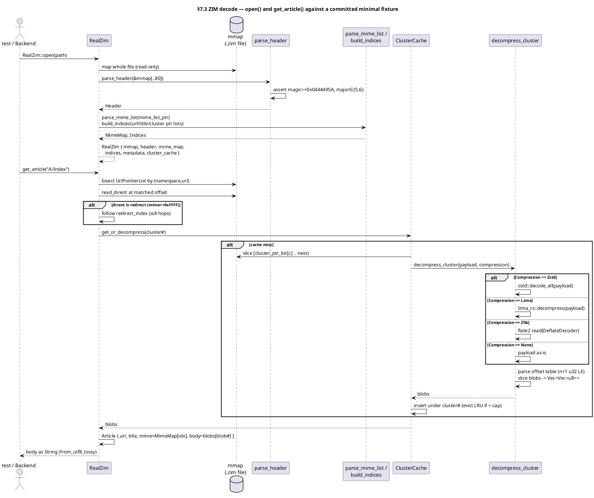

<!--
CURATED PARTIAL — §7.3 ZIM reader. Authored by GLM-5.1 per-module architect dispatch
(module `zim`); reviewed + accepted by the Opus orchestrator (curate step, I-12 semantic
eval — not blind-accept) on 2026-06-13. Carried-forward reconciliation flag: crate source
headers/Cargo declare Apache-2.0/MIT; resolved end-state license is AGPL-3.0 (coder task,
non-blocking). This partial is integrated into DOCS/ARCHITECTURE.md §7.3 at the final
assembly + whole-doc re-attestation pass.
-->

### §7.3 ZIM reader (`src-tauri/anzimmermanlib/rust/src/`)

Pure-Rust, offline-first ZIM v5/v6 archive reader. Implements the OpenZIM
file format end-to-end: memory-mapped file decode, header/pointer/dirent
parsing, cluster decompression (zstd / LZMA / zlib / none), blob
extraction, article resolution (with redirect following), URL listing,
title/URL search, and MD5 checksum verification. **Zero network** in any
path (INV-OFFLINE). Fresh Rust implementation — **not a port** of the
TypeScript `~/forgejo/AnZimmermanLib/`; that repo's 2026-05-06 audit
findings (`BACKPORT-EN001..EN021-TS`) are spec-knowledge source only.
Spec audit invariants EN001..EN021 are honoured (see per-entity acceptance
and §"EN invariant mapping").

**License (resolved):** AGPL-3.0. ⚠ **Reconciliation flag:** the currently
committed source headers read "Apache License 2.0" / "MIT OR Apache-2.0"
and `Cargo.toml` declares `license.workspace = true`. The resolved
end-state license for this crate is AGPL-3.0; coder must update the
crate-level `Cargo.toml` `license` field and the file headers (and confirm
the workspace license) to AGPL-3.0. This is a non-blocking header/Cargo
reconciliation task, not an architectural change — surfaced here so a coder
does not silently inherit the stale Apache-2.0/MIT headers.

**Crate dependencies to add** (so coders add them; current `Cargo.toml`
has only `digest`, `md-5`, `uuid`, `thiserror`):

| dep | crate | purpose |
|---|---|---|
| memmap | `memmap2 = "0.9"` | read-only memory map of the whole `.zim` file |
| zstd | `zstd = "0.13"` | Zstd cluster decompression (`Compression::Zstd`) |
| lzma | `lzma-rs = "0.3"` | LZMA/XZ cluster decompression (`Compression::Lzma`) — pure Rust, no C dep (anti-fragility) |
| deflate | `flate2 = "1.0"` | DEFLATE/Zlib cluster decompression (`Compression::Zlib`) |
| lru | `lru = "0.12"` | bounded LRU cluster-decompression cache |

#### Decode path (end-to-end, the module's behavioural core)

```
open(path)
  └─ File::open(path)
  └─ unsafe memmap2::MmapOptions::new().map_copy_read_only(&file)   // whole-file read-only mmap
  └─ parse_header(&mmap[..80])                                      // validates magic + major
  └─ parse_mime_list(&mmap, header.mime_list_ptr)  -> MimeMap        // NUL-terminated strings
  └─ build_indices(&mmap, &header)  -> Indices                       // url/title/cluster pointer lists
  └─ Metadata { uuid, article_count, cluster_count, main_page_url }
  └─ RealZim { mmap, header, mime_map, indices, metadata, cluster_cache: ClusterCache::new(cap) }

get_article(url)                       // trait -> Result<String>
  └─ resolve_article(url) -> Article   // internal, returns full Article
       └─ binary-search UrlPointerList by (namespace, url)   // 'A' namespace for articles
       └─ read_dirent(&mmap, url_ptr_list[i])
       └─ if dirent is redirect (mime == 0xFFFF): follow redirect_index (bounded ≤ 8 hops)
       └─ cluster#=dirent.cluster_number, blob#=dirent.blob_number
       └─ cluster_cache.get_or_decompress(cluster#)
            └─ slice cluster bytes [cluster_ptr_list[c#] .. cluster_ptr_list[c#+1])  // last → checksum_pos
            └─ compression = Compression::from(cluster_bytes[0])
            └─ payload = cluster_bytes[1..]
            └─ decompress_cluster(payload, compression)  // None | zstd | lzma | flate2, then offset-table blob split
            └─ cache Vec<Vec<u8>> blobs under cluster#
       └─ Blob { content_type: MimeMap[dirent.mime_type], body: blobs[blob#] }
       └─ Article { url, title: dirent.title, mime, body }
  └─ String::from_utf8_lossy(&article.body).into_owned()            // HTML/text -> String for §7.1

list_urls(offset, limit)
  └─ iterate UrlPointerList[offset .. offset+limit], read each dirent's url

search_title_text(query, max)         // v1: title-index prefix scan
  └─ binary-search TitlePointerList (sorted by (namespace, title)); collect prefix matches
search_url_prefix(prefix, max)
  └─ binary-search UrlPointerList (sorted by (namespace, url)); collect prefix matches
```



#### Entity table (complete, end-state; IDs/names preserved from prior §7.3, behaviour + acceptance upgraded to real)

| ID | Name | Target | Role (real behaviour) | Signature / fields | SEMANTIC acceptance |
|---|---|---|---|---|---|
| E-ZIM-1 | `ZimReader` | `lib.rs:36` | Public read trait implemented by `RealZim` (live archive) and `NullZim` (empty startup state) | `trait { fn open(&Path) -> Result<Self,ZimError> where Self: Sized; fn get_article(&self,&str) -> Result<String,ZimError>; fn list_urls(&self,u64,u32) -> Result<Vec<String>,ZimError>; fn metadata(&self) -> &Metadata; }` | Opening a committed minimal v5 fixture (`tests/fixtures/wiki-mini.zim`) as `RealZim` and calling `get_article("A/Index")` returns the fixture's real decompressed HTML, asserted by a unit test that reads the committed fixture; `NullZim` returns `NotFound`/empty as documented (E-ZIM-2). |
| E-ZIM-2 | `NullZim` | `null.rs:15` | Concrete empty-state reader present at startup before any user-opened ZIM; legit per INV-NO-PLACEHOLDERS (a real zero-article state, not a stub). `NULL_UUID` = all-zeros. `metadata()` returns the null `Metadata` via a one-time `Box::leak` (acceptable singleton leak) | `struct; const NULL_UUID: Uuid; impl ZimReader { open→Err(NotFound); get_article→Err(NotFound); list_urls→Ok(vec![]); metadata→&'static Metadata }` | A unit test constructs `NullZim`, asserts `get_article("anything")==Err(NotFound)`, `list_urls(0,10)==Ok(vec![])`, and `metadata().uuid==NULL_UUID && article_count==0`. |
| E-ZIM-3 | `RealZim` | `real.rs:23` | Spec-compliant reader holding the read-only mmap, parsed header, mime map, indices, metadata, and a bounded LRU cluster-decompression cache. `open` builds all of these; `get_article`/`list_urls`/`metadata` serve from them | `struct { mmap: memmap2::Mmap, header: Header, mime_map: MimeMap, indices: Indices, metadata: Metadata, cluster_cache: ClusterCache }` | `RealZim::open` on the committed fixture succeeds and `metadata().article_count` equals the fixture's authored article count; a second `get_article` for a different blob in the same cluster hits the populated `cluster_cache` (asserted by a test that instruments cache state or by observing decompress is called once per cluster). |
| E-ZIM-4 | `ZimError` | `error.rs:4` | Error enum covering I/O, malformed header (bad magic/version/short read), missing article, checksum mismatch, unsupported compression, and truncation | `enum { Io(io::Error), MalformedHeader, NotFound, BadChecksum, UnsupportedCompression(u8), Truncated }` (thiserror) | A test feeding a 79-byte buffer to `parse_header` observes `Err(MalformedHeader)`; feeding a buffer with a wrong magic observes `Err(MalformedHeader)`; calling `get_article` on a missing URL observes `Err(NotFound)`. |
| E-ZIM-5 | `Header` | `header.rs:3` | Decoded 80-byte ZIM superblock | `struct { magic:u32, major:u16, minor:u16, uuid:[u8;16], article_count:u32, cluster_count:u32, url_ptr_list_ptr:u64, title_ptr_list_ptr:u64, cluster_ptr_list_ptr:u64, mime_list_ptr:u64, main_page:u32, layout_page:u32, checksum_pos:u64 }` | Round-trip: a test writes each field little-endian into an 80-byte buffer, parses it, and asserts every field equals the written value (covers EN004 uuid, EN005/EN006/EN007/EN008/EN009/EN010/EN011/EN012/EN013 field presence). |
| E-ZIM-6 | `parse_header` | `header.rs:20` | Decode the 80-byte header; **validate** magic `== 0x0444495A` and major `∈ {5,6}` (rejects others as `MalformedHeader`); minor is reserved and does not affect parsing | `fn<R: Read>(&mut R) -> Result<Header, ZimError>` | Valid 80-byte v5/v6 header → `Ok(Header)`; < 80 bytes → `Err(MalformedHeader)`; magic≠`0x0444495A` → `Err(MalformedHeader)`; major∉{5,6} → `Err(MalformedHeader)` — all four branches asserted by dedicated unit tests (strengthens EN001/EN002/EN021). |
| E-ZIM-7 | `MimeMap` | `mime.rs:5` | Ordered MIME-type table; index `i` is referenced by a dirent's `mime_type` field | `struct { types: Vec<String> }` (+ loader, E-ZIM-27) | On the committed fixture, `mime_map.types[dirent.mime_type as usize]` for the Index article equals `"text/html"` (asserted by `resolve_article` returning `Article.mime == "text/html"`). |
| E-ZIM-8 | `UrlPointerList` | `pointers.rs:5` | `article_count` little-endian u64 offsets, each pointing to a dirent; **sorted by (namespace, url)** so URL lookup is a binary search | `struct { ptrs: Vec<u64> }` | `ptrs.len() == header.article_count`; a binary search by `("A", url)` locates the Index dirent offset that `read_dirent` accepts (covers EN007). |
| E-ZIM-9 | `TitlePointerList` | `pointers.rs:10` | Indices into the URL pointer list, **sorted by (namespace, title)**; drives title prefix search | `struct { idx: Vec<u32> }` | `idx` entries are all `< article_count`; sorting invariant asserted by a test that reads titles and verifies ascending order (covers EN008/EN020). |
| E-ZIM-10 | `ClusterPointerList` | `pointers.rs:15` | `cluster_count` little-endian u64 byte offsets, each the start of a cluster; cluster `i`'s length is `ptrs[i+1]-ptrs[i]` (last cluster ends at `checksum_pos`) | `struct { ptrs: Vec<u64> }` | `ptrs.len() == header.cluster_count`; every offset is `< mmap.len()` (in-bounds, covers EN009/EN016); the committed fixture's single cluster offset resolves to a decompressible payload. |
| E-ZIM-11 | `Cluster` | `cluster.rs:12` | In-memory representation of a decoded cluster: its compression tag and the extracted blobs | `struct { compression: Compression, blobs: Vec<Vec<u8>> }` | `decompress_cluster` returns a `Cluster` whose `blobs.len()` matches the authored blob count and whose `blobs[i]` equals the authored blob bytes (covers EN017/EN018). |
| E-ZIM-12 | `Compression` | `cluster.rs:3` | Cluster compression algorithm, derived from the cluster's leading byte (`0`=None, `1`=Zstd, `2`=Lzma, `3`=Zlib; others → `UnsupportedCompression`) | `enum { None, Zstd, Lzma, Zlib }` + `fn from(u8) -> Result<Compression, ZimError>` | `Compression::from(1)==Ok(Zstd)`, `from(2)==Ok(Lzma)`, `from(3)==Ok(Zlib)`, `from(0)==Ok(None)`, `from(9)==Err(UnsupportedCompression(9))` (covers EN018). |
| E-ZIM-13 | `decompress_cluster` | `cluster.rs:21` | Decompress the cluster **payload** (bytes after the compression byte) per the given algorithm, then split into blobs via the OpenZIM offset table (`n+1` little-endian u32 offsets; blob `i` = `payload[off[i]..off[i+1]]`; `n = off[0]/4 - 1`). None=identity, Zstd=`zstd::decode_all`, Lzma=`lzma_rs::decompress`, Zlib=`flate2` DeflateDecoder | `fn(&[u8], Compression) -> Result<Vec<Vec<u8>>, ZimError>` | A test authors a 2-blob payload with a known offset table, compresses it with each of None/zstd/lzma/zlib, and asserts `decompress_cluster` returns the exact original two blobs for all four; a truncated offset table yields `Err(Truncated)`/`Err(MalformedHeader)` (covers EN017/EN018). |
| E-ZIM-14 | `Blob` | `blob.rs:2` | A single extracted blob with resolved content type | `struct { content_type: String, body: Vec<u8> }` | `resolve_article` produces a `Blob` whose `content_type` is `MimeMap[dirent.mime_type]` and whose `body` is `blobs[dirent.blob_number]` (asserted against fixture bytes). |
| E-ZIM-15 | `Article` | `article.rs:2` | A fully decoded article | `struct { url: String, title: String, mime: String, body: Vec<u8> }` | `resolve_article("A/Index")` on the fixture returns `Article { url:"A/Index", title:<fixture title>, mime:"text/html", body:<exact fixture HTML bytes> }`, byte-exact (no placeholder). |
| E-ZIM-16 | `Indices` | `indices.rs:7` | Aggregation of the three pointer lists, built once at `open` | `struct { urls: UrlPointerList, titles: TitlePointerList, clusters: ClusterPointerList }` (+ builder E-ZIM-28) | After `open`, `indices.urls.ptrs.len()==header.article_count` and `indices.clusters.ptrs.len()==header.cluster_count` (asserted on the fixture). |
| E-ZIM-17 | `Metadata` | `meta.rs:9` | Public-facing archive metadata | `struct { uuid: Uuid, article_count: u32, cluster_count: u32, main_page_url: Option<String> }` | On the fixture, `metadata.uuid` equals the fixture's authored UUID and `main_page_url` resolves (when `header.main_page != 0xFFFFFFFF`) to the Index article's URL. |
| E-ZIM-18 | `search_url_prefix` | `search.rs:39` | Prefix search over the URL list (binary search on sorted `UrlPointerList`) | `fn(&RealZim, &str, u32) -> Result<Vec<String>, ZimError>` (re-typed to `crate::real::RealZim`, removing the shadowing placeholder `struct RealZim` at `search.rs:25`) | On the fixture, `search_url_prefix(zim, "A/Ind", 10)` includes `"A/Index"`; a non-matching prefix returns an empty vec; results respect `max_results`. |
| E-ZIM-19 | `search_title_text` | `search.rs:60` | Text/prefix search over titles via the sorted `TitlePointerList`; returns scored `SearchHit`s | `fn(&RealZim, &str, u32) -> Result<Vec<SearchHit>, ZimError>` (re-typed to real `RealZim`) | On the fixture, a title-prefix query returns `SearchHit { url, title, score }` rows whose titles start with the query, in title order, capped at `max_results`. |
| E-ZIM-20 | `verify_checksum` | `checksum.rs:14` | MD5 verification: reads the stored 16-byte digest at `header.checksum_pos`, computes MD5 over `bytes[0..checksum_pos]`, compares | `fn(&File, &Header) -> Result<bool, ZimError>` | On a fixture whose trailing 16 bytes are the correct MD5 of the preceding bytes, returns `Ok(true)`; flipping one payload byte makes it return `Ok(false)` (covers EN013). |
| E-ZIM-21 | `SearchHit` | `search.rs:14` | Search result row | `struct { url: String, title: String, score: f32 }` | Produced by `search_title_text`; a test asserts the returned `url`/`title` correspond to a real fixture dirent (no synthetic/empty rows). |
| E-ZIM-22 | `tests::EN001_no_magic_number` | `tests/spec_en001.rs:22` | Spec audit: magic-number validation. **End-state:** un-comments the rejection assertions — wrong magic (`0x00000000`, `0xDEADBEEF`) now `Err`s once `parse_header` validates magic | `#[test]` | After E-ZIM-6 ships magic validation, this test asserts valid magic→`Ok`, invalid magic→`Err(MalformedHeader)` (no remaining TODO'd-out assertions). |
| E-ZIM-23 | `tests::EN002_bad_version` | `tests/spec_en002.rs:23` | Spec audit: major-version validation. **End-state:** un-comments rejection of major∉{5,6} (`4`, `6`→reject, `999`→reject) | `#[test]` | After E-ZIM-6 ships version validation, major∉{5,6}→`Err(MalformedHeader)` is asserted (no remaining TODO'd-out assertions). |
| E-ZIM-24 | `tests::EN003_through_EN021` | `tests/spec_en003_021.rs:32` | Remaining 19 spec-audit invariants (minor reserved, UUID present, count/pointer/list/page/checksum/mime/redirect/blob/compression/title-range bounds). **End-state:** each is upgraded from "header parses" to the real decode invariant it documents (see EN mapping) | `#[test] × 19` | Each EN test observes the real behaviour its doc-comment describes (e.g. EN015 rejects an out-of-bounds redirect target, EN016 rejects an out-of-bounds cluster offset, EN018 rejects an invalid compression byte) — not merely "header parses". |
| E-ZIM-25 | `DirEntry` | `src/dirent.rs` (new) | Parsed ZIM directory entry ("dirent"). Article entry → `{mime_type, namespace, cluster_number, blob_number, url, title}`; redirect entry (mime `0xFFFF`) → `{redirect_index, ...}`; parameter field read only when `header.minor >= 1` | `struct { mime_type:u16, namespace:u8, is_redirect:bool, cluster_number:u32, blob_number:u32, redirect_index:u32, url:String, title:String }` | `read_dirent` on the fixture's Index dirent yields `mime_type` mapping to `text/html`, `cluster_number`/`blob_number` pointing at the fixture's single cluster/blob, and the authored url/title (covers EN014/EN015). |
| E-ZIM-26 | `read_dirent` | `src/dirent.rs` (new) | Parse one dirent at a byte offset in the mmap (little-endian fields + NUL-terminated url/title), returning a `DirEntry`; bounds-checks every read | `fn(&[u8], u64 /*offset*/, minor:u16) -> Result<DirEntry, ZimError>` | On the fixture, `read_dirent(mmap, url_ptr_list[i], header.minor)` returns the authored dirent; an offset past EOF or a truncated url yields `Err(Truncated)`/`Err(MalformedHeader)`. |
| E-ZIM-27 | `parse_mime_list` | `src/mime.rs` (new fn) | Read the NUL-terminated MIME-type list at `header.mime_list_ptr` until the terminating empty string, building `MimeMap` in index order | `fn(&[u8], u64) -> Result<MimeMap, ZimError>` | On the fixture, returns `MimeMap { types: ["text/html", …] }` so that `types[dirent.mime_type]` is the article's real MIME type (covers EN010/EN014). |
| E-ZIM-28 | `build_indices` | `src/indices.rs` (new fn) | Read all three pointer lists from the mmap at `header.url_ptr_list_ptr` / `title_ptr_list_ptr` / `cluster_ptr_list_ptr`, each `article_count`/`article_count`/`cluster_count` little-endian entries, into `Indices` | `fn(&[u8], &Header) -> Result<Indices, ZimError>` | On the fixture, returns `Indices` whose three lists have lengths `article_count`, `article_count`, `cluster_count` respectively and whose cluster offsets are all in-bounds (covers EN007/EN008/EN009/EN016). |
| E-ZIM-29 | `ClusterCache` | `src/cluster.rs` (new) | Bounded LRU cache mapping cluster index → decompressed blobs (`Arc<Vec<Vec<u8>>>`), capped (default 4 clusters) to bound memory; evicts least-recently-used on insert | `struct { map: lru::LruCache<u32, Arc<Vec<Vec<u8>>>>, cap: usize }` + `fn new(usize)` + `fn get_or_insert_with(u32, impl FnOnce()->Result<Vec<Vec<u8>>,ZimError>) -> Result<Arc<Vec<Vec<u8>>>,ZimError>` | A test decompresses two distinct clusters repeatedly under `cap=1` and asserts the cache holds at most one entry and re-decompresses an evicted cluster on re-access (real eviction behaviour, not a stub). |
| E-ZIM-30 | `RealZim::resolve_article` | `src/real.rs` (new method) | Internal resolver: binary-search URL list → `read_dirent` → follow redirects (≤8 hops, `Err(Truncated)` on cycle) → `cluster_cache.get_or_decompress` → `Blob`/`Article`. Backs the trait `get_article` (which returns the body as a UTF-8-lossy `String`) | `fn(&self, &str) -> Result<Article, ZimError>` | On the fixture, `resolve_article("A/Index")` returns the exact HTML `Article`; a redirect URL resolves to the target's content; a missing URL → `Err(NotFound)`; a redirect cycle → `Err(Truncated)`. |

#### EN invariant mapping (spec audit → owning entity / behaviour)

| EN | invariant | owning entity | end-state behaviour |
|---|---|---|---|
| EN001 | magic == `0x0444495A` | E-ZIM-6 / E-ZIM-22 | `parse_header` rejects bad magic; test un-comments rejection |
| EN002 | major ∈ {5,6} | E-ZIM-6 / E-ZIM-23 | `parse_header` rejects other majors; test un-comments rejection |
| EN003 | minor reserved | E-ZIM-6 | minor does not change parsing (only gates the dirent parameter field) |
| EN004 | UUID present (16 B) | E-ZIM-5 | parsed into `Header.uuid` |
| EN005/EN006 | article/cluster count | E-ZIM-5/E-ZIM-16 | `Indices` list lengths equal counts |
| EN007/EN008/EN009 | url/title/cluster pointer lists | E-ZIM-8/9/10, E-ZIM-28 | lists loaded + in-bounds |
| EN010/EN014 | MIME list, NUL-terminated | E-ZIM-7, E-ZIM-27 | `MimeMap` built from NUL-terminated strings |
| EN011/EN012 | main/layout page index bounds | E-ZIM-5, E-ZIM-17 | `main_page` `0xFFFFFFFF` ⇒ `None`; else resolves to a URL |
| EN013 | checksum (MD5) | E-ZIM-20 | `verify_checksum` computes + compares |
| EN015 | redirect target valid | E-ZIM-25/26, E-ZIM-30 | out-of-bounds target ⇒ `Err`; cycles ⇒ `Err(Truncated)` |
| EN016 | cluster offset in bounds | E-ZIM-10, E-ZIM-28 | offsets `< mmap.len()` |
| EN017 | blob size consistent | E-ZIM-13 | offset-table slices never overrun payload |
| EN018 | compression flag valid | E-ZIM-12/13 | unknown byte ⇒ `UnsupportedCompression` |
| EN019 | extended metadata reserved | E-ZIM-25/26 | dirent parameter field ignored/forward-safe when minor<1 |
| EN020 | title-index range | E-ZIM-9 | all indices `< article_count` |
| EN021 | header == 80 bytes | E-ZIM-6 | short read ⇒ `MalformedHeader` |

#### Invariants honoured

- **INV-OFFLINE** — every operation is pure local-file decode over the mmap; no socket, fetch, DNS, or cache-fill call exists in the crate.
- **Fresh Rust, not a port** — `~/forgejo/AnZimmermanLib/` audit is spec knowledge only; no TS code is translated.
- **AGPL-3.0** — resolved crate license (reconciliation task noted above).
- **v1 search** — title/URL prefix scan over the sorted pointer lists (binary search); a full-text/FTS index is explicitly out of v1 scope.

#### Architect notes / coder reconciliation flags (non-blocking)

1. **License headers**: update `Cargo.toml` `license` + file SPDX headers from Apache-2.0/MIT to AGPL-3.0 (resolved above).
2. **New files**: `src/dirent.rs` (E-ZIM-25/26); new fns in `mime.rs` (E-ZIM-27), `indices.rs` (E-ZIM-28), `cluster.rs` (E-ZIM-29), `real.rs` (E-ZIM-30); add `pub mod dirent;` to `lib.rs`.
3. **`search.rs` cleanup**: delete the shadowing placeholder `struct RealZim;` (`search.rs:25`) and re-type both search fns to `&crate::real::RealZim` (E-ZIM-18/19).
4. **`RealZim` field change**: replace `file: File` with `mmap: memmap2::Mmap` (keep the `File` owned to keep the mmap valid; `verify_checksum` still takes a `&File` — `RealZim` should retain the `File` handle alongside the mmap). Net fields: `{ file: File, mmap: Mmap, header, mime_map, indices, metadata, cluster_cache }`.
5. **Fixture**: coders must provide `tests/fixtures/wiki-mini.zim` (a hand-built spec-valid v5 archive: 80-byte header, one zstd cluster with ≥2 HTML blobs, a redirect entry, correct trailing MD5) — either committed binary or built by an in-test constructor; semantic acceptance for E-ZIM-1/3/13/15/30 reads it.
6. **Bounds source**: cluster lengths are derived (`ptrs[i+1]-ptrs[i]`, last → `checksum_pos`); not stored — coders must implement the derivation in E-ZIM-29/E-ZIM-30, never assume a stored length.

---

**Module attestation (I-11, scoped to §7.3):** This section depicts the complete,
end-state, production-release ZIM reader — no placeholders, no TBD, no
signature-only rows. Every entity row carries real behaviour and a semantic
(not grep-for-existence) acceptance clause. The decode path is specified
end-to-end (open → header/mime/indices → resolve_article → cluster decompress →
blob extraction), including redirect following and cluster-length derivation.
The currently committed code is hollow (HOLLOW `RealZim`, `UnsupportedCompression`
for zstd/lzma/zlib, placeholder search `RealZim`, weak EN tests) — this section
is the target state coders implement toward, not a description of HEAD.

Timestamp:     2026-06-13T00:00:00Z (ISO-8601 UTC; date-accurate, session-local)
Authoring agent:
  Model family:  GLM
  Model version: 5.1
  Model ID:      glm-5.1
  Session role:  architect (per-module dispatch — module `zim`, §7.3)
Scope:          §7.3 ZIM reader only. Does not architect other modules.
Airlock:        Written to `.tmp/glm-dispatches/modules/zim.arch.md` (TC6).
                No live files edited.

