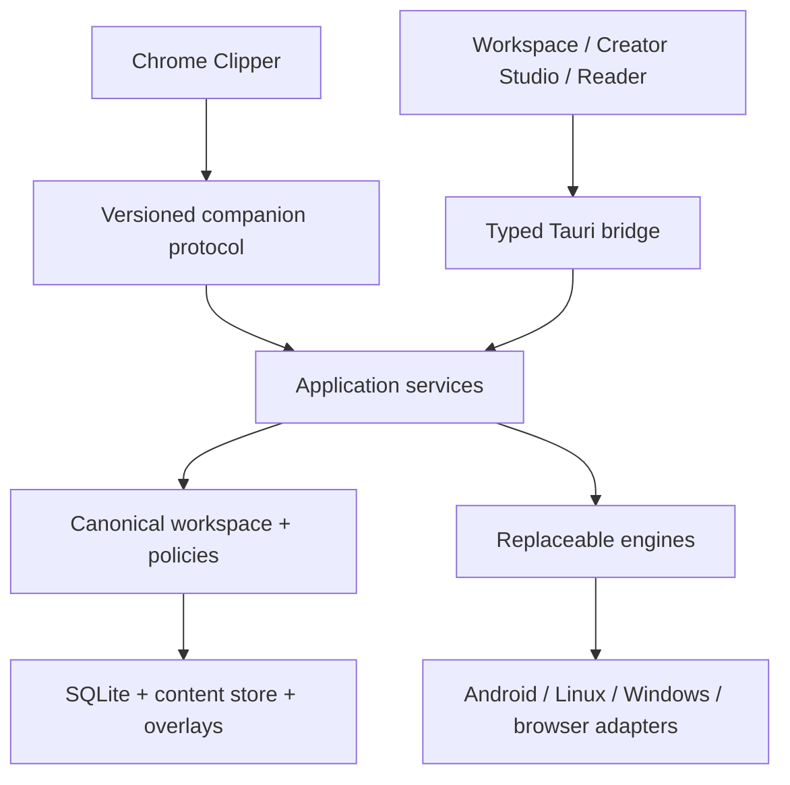
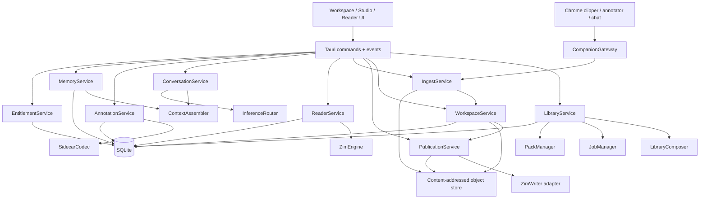
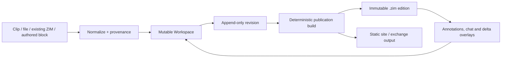
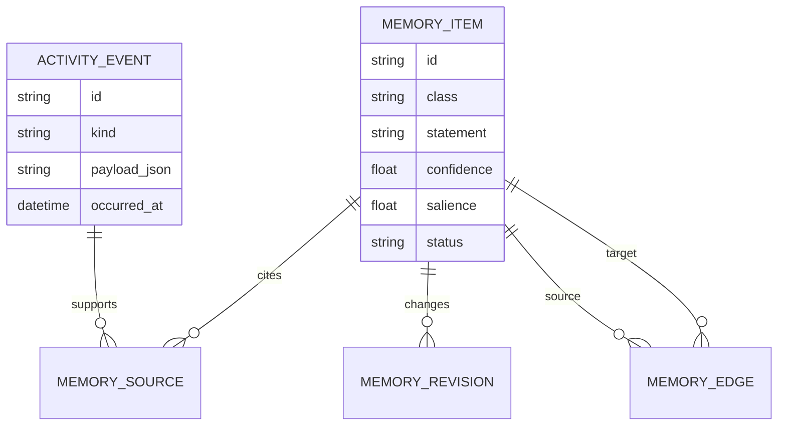
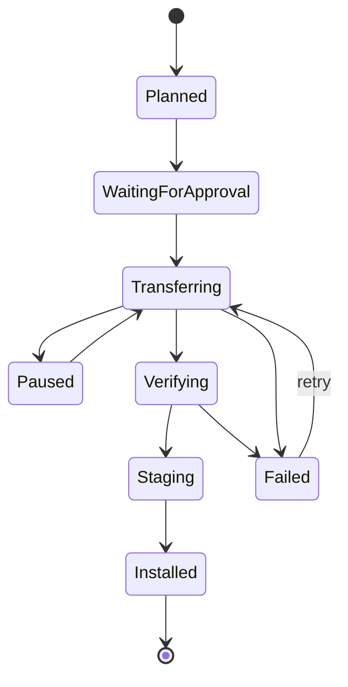
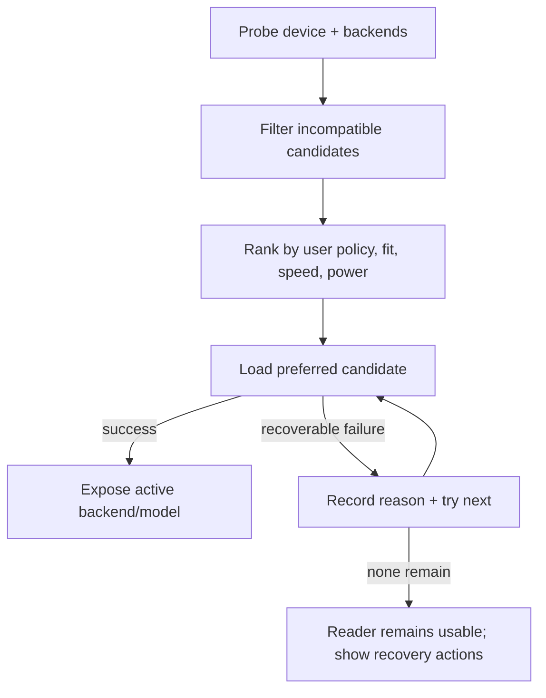
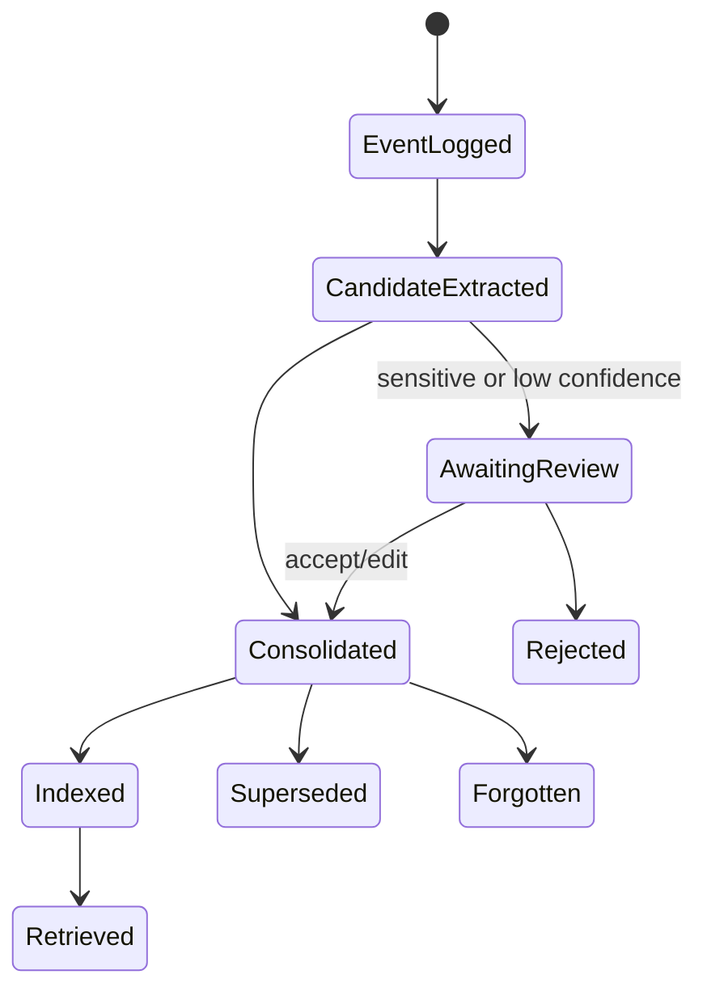
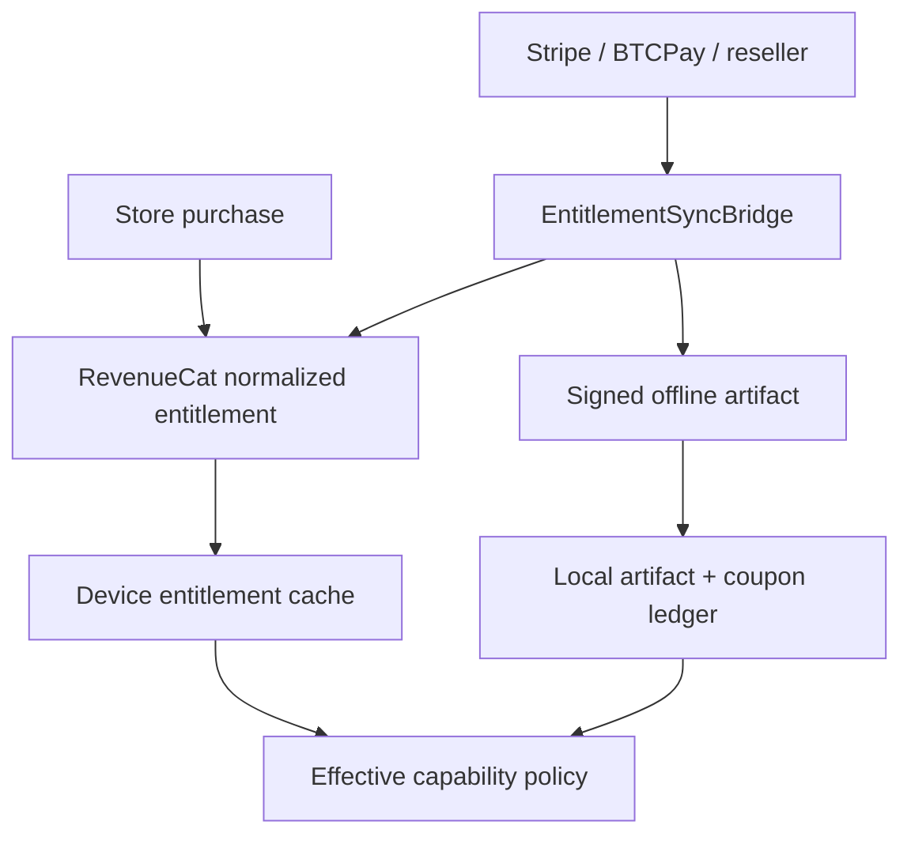

# EnZIME One — Unified Tauri 2 Architecture

**Document role:** implementation architecture for the consolidated reboot  
**Companion:** `PRD-SITE.md`  
**Implementation directive:** `CLAUDE-ONE-SHOT-PROMPT.md`

## 1. Architectural decision

Initialize a clean canonical repository at `forgejo.robin.mba/rcheung/EnZIME-v3`. The current Forgejo EnZIME project and GitHub repositories enumerated in `PRD-SITE.md` §1.1 are read-only donors. Desktop/web and Android errors have diverged sufficiently that repairing the existing tree would risk canonizing accidental incompatibilities. V3 therefore begins with one green Tauri 2/Rust/React cross-platform shell and imports no donor source until it passes the donor airlock.

The Chrome extension is a companion delivery surface, not a second product core. ZIM Workspace, Creator Studio, Living Library and Reader are modes over the same canonical content/services; the extension speaks a versioned ingest/annotation/conversation protocol to them. Do not preserve Expo, Supabase, Flutter, Electron or a required Python server as runtime dependencies. Do not bind the product permanently to a single ZIM parser, model runtime, catalog, payment processor or hosted service.

The architecture has four rings:

1. **Canonical content/workspace** — content objects, revisions, provenance, annotations, conversations, lore, publication profiles and reproducible snapshots.
2. **Application services** — ingest, editing, library composition, reading, publishing, jobs, retrieval and entitlement policy.
3. **Replaceable engines** — ZIM, capture, conversion, inference, embeddings, STT/TTS, catalogs, transfer sources and entitlement issuers.
4. **Delivery surfaces** — Tauri Workspace/Studio/Reader, Android, desktop and Chrome MV3 extension.



## 2. Binding invariants

| ID | Rule |
|---|---|
| A-01 | Airplane mode is a supported steady state; network sources are additive adapters. |
| A-02 | Tauri 2 + Vite/React is the only primary application shell; Chrome MV3 is a bounded companion using shared schemas/protocols, not an alternative core. |
| A-03 | Domain managers contain policy; Tauri commands are thin serialization/dispatch boundaries. |
| A-04 | Canonical user data never depends on an embedding model, vector index, or cloud account to remain readable. |
| A-05 | Every large or long-running operation is a durable job: resumable or explicitly restartable, observable, cancellable, and idempotent. |
| A-06 | Engine availability is discovered at runtime and represented truthfully in a capability registry. |
| A-07 | Automatic selection is the default; every automatic compute/model/memory decision is visible and overridable. |
| A-08 | No production capability is marked ready without compilation plus a semantic fixture test. |
| A-09 | User-authored content and export are never entitlement-gated after creation. |
| A-10 | New schema versions migrate forward from every released version and back up before destructive transformation. |
| A-11 | Published ZIMs are immutable reproducible editions; the user’s “living ZIM” experience is backed by a mutable workspace, revisions and overlays that materialize new editions. |
| A-12 | Clipper, Workspace, Creator Studio, Reader and Living Library share stable content/provenance/annotation/conversation identifiers. |
| A-13 | No donor source enters V3 without a transplant record, licence/dependency review, destination owner and cross-platform semantic test. |
| A-14 | Prepper V1 is a thin end-to-end slice; whole-shelf capabilities extend the same primitives rather than widening V1 into a feature-count mammoth. |

## 3. Repository target structure

Adapt existing paths where they already contain working code; the names below describe boundaries, not permission for a blind directory rewrite.

```text
EnZIME-v3/
├── src/                         React/TypeScript presentation
│   ├── app/                     routes, responsive shell, error boundaries
│   ├── features/                inbox, workspace, studio, library, reader, ask, memory
│   ├── stores/                  view/session state only
│   └── bridge/                  generated/typed IPC client + event helpers
├── src-tauri/
│   ├── src/
│   │   ├── commands/            thin Tauri commands
│   │   ├── app/                 application services/use cases
│   │   ├── domain/              canonical types, policies, errors
│   │   ├── storage/             SQLite repositories + migrations
│   │   ├── workspace/           content objects, revisions, views, edit sessions
│   │   ├── ingest/              capture/import normalization + provenance
│   │   ├── publish/             deterministic ZIM/site/export builds
│   │   ├── jobs/                durable job state machine
│   │   ├── zim/                 ZimEngine trait + adapters
│   │   ├── retrieval/           lexical, embedding, rerank, citations
│   │   ├── inference/           backend registry + sessions
│   │   ├── memory/              journal, extraction, consolidation, recall
│   │   ├── annotations/         anchors, drawings, attachments, sidecars
│   │   ├── packs/               catalogs, planner, downloads, verification
│   │   ├── composer/            dynamic corpus optimization and explanation
│   │   ├── peer/                mDNS discovery and LAN transfer
│   │   ├── entitlement/         policy, signed artifacts, RC client
│   │   └── platform/            paths, power/thermal, Android, desktop
│   └── adapters/                accepted engines only; no donor subtree dump
├── extension/                    Chrome MV3 clipper/annotator/chat companion
│   ├── src/                      capture UI, outbox, permission adapters
│   └── manifest.json
├── packages/
│   ├── protocol/                 generated JSON schemas + TS clients
│   ├── editor-core/              framework-neutral editor/content primitives
│   └── design-system/            shared surface tokens/components where suitable
├── donor-ledger/                 transplant records; metadata/patch refs, not donor trees
├── bridge/                       optional EntitlementSyncBridge service
├── fixtures/                     legal tiny ZIMs, manifests, sidecars, DBs
├── DOCS/REBOOT/                  these three source-of-truth documents
└── scripts/                      builds, fixture checks, release tooling
```

## 4. Application component topology



### 4.1 Service responsibilities

| Service | Owns | Must not own |
|---|---|---|
| `LibraryService` | registered packs, locations, versions, storage plan | parsing article bodies |
| `LibraryComposer` | explainable corpus optimization by scenario, value, overlap, freshness, device and storage budget | silent eviction or opaque “AI chose this” policy |
| `PackManager` | catalog normalization, manifests, install/update/remove policy | UI prompts |
| `JobManager` | durable state, progress, cancellation, resumption, retry | domain-specific verification rules |
| `CompanionGateway` | authenticated local extension handshake, protocol negotiation, durable outbox receipt and idempotency | browser capture policy or canonical storage |
| `IngestService` | normalize web clips/files/imports into content objects, assets and provenance | format-specific UI or immediate publication |
| `WorkspaceService` | documents/blocks/links/views/revisions/edit sessions and transactional autosave | ZIM byte layout or browser permissions |
| `PublicationService` | validate and reproducibly materialize ZIM/static/exchange editions from a workspace revision | mutable editing state or hidden source transformations |
| `ReaderService` | open handles, navigation/history, article/resource requests | raw Tauri event handling |
| `AnnotationService` | anchors, drawings, attachments, layer/merge semantics | Supabase/auth assumptions |
| `ConversationService` | sessions, tool loop, streaming, cancellation, citations | backend-specific tokens/handles |
| `MemoryService` | journal, candidate extraction, canonical memories, recall policy | opaque full-chat prompt stuffing |
| `EntitlementService` | effective capabilities and signed offline artifacts | ownership of notes or pack bytes |

## 5. Canonical storage model

SQLite is the canonical structured store, opened in WAL mode with foreign keys enabled. Large immutable content stays in files addressed by manifest identity and hash. Derived indexes are disposable.

### 5.1 Storage classes

| Class | Canonical? | Examples | Recovery |
|---|---|---|---|
| User data | Yes | annotations, notes, conversations, canonical memories, preferences | backup/restore |
| Operational state | Yes | jobs, pack registry, entitlement ledger, trust records | migration/restore |
| Source content | External/immutable | ZIMs, model files, attachments | hash verify/reimport |
| Derived data | No | FTS indexes, embeddings, graph adjacency caches, thumbnails | rebuild |

### 5.2 Core schema families

- `schema_migrations(version, applied_at, app_version, checksum)`
- `workspaces`, `workspace_revisions`, `content_objects`, `content_blocks`, `content_links`, `content_views`
- `assets`, `asset_variants`, `provenance_records`, `ingest_receipts`, `capture_outbox_receipts`
- `publication_profiles`, `publication_builds`, `publication_items`, `edition_diffs`
- `packs`, `pack_locations`, `pack_versions`, `pack_resources`
- `jobs`, `job_parts`, `job_events`
- `reading_history`, `bookmarks`
- `annotations`, `annotation_selectors`, `drawings`, `attachments`, `sidecar_layers`
- `conversations`, `messages`, `message_citations`
- `activity_events` (append-only canonical lore journal)
- `memory_items`, `memory_sources`, `memory_edges`, `memory_revisions`
- `embedding_documents`, `embedding_chunks`, `embedding_vectors` (derived)
- `settings`, `capability_snapshots`, `backend_overrides`
- `entitlement_artifacts`, `coupon_redemptions`, `trust_keys`

### 5.3 Mutable workspace and immutable ZIM editions

The user may reasonably say “I am editing this ZIM,” but V3 must not pretend an immutable published archive is an ordinary random-write document. The canonical authoring object is a `WorkspaceRevision`; a `.zim` is a compiled, verifiable edition of one revision plus a publication profile. Imported ZIMs may receive overlay edits/annotations, be extracted into a workspace where legally/technically appropriate, or be referenced as read-only sources.



Required identity rules:

- `workspace_id` remains stable across revisions and views.
- `content_id` remains stable across edits; revisions carry content hashes.
- `edition_id` identifies an immutable publication build and its manifest.
- `source_locator` and provenance survive clipping/import/transformation.
- annotations target stable content/selectors and record the edition/revision observed.
- deterministic builds pin converter versions, publication profile and ordered inputs.

### 5.4 Unified content primitives and views

One canonical block graph supports preparedness V1 and the later whole-shelf expansion:

- blocks: paragraph, heading, list/checklist, table, code, quote, callout, media, embed, citation, form/field and container;
- relationships: hierarchy, semantic link, transclusion, citation, dependency, version/supersession and publication navigation;
- views: notebook, document, outline, canvas, site tree, graph, timeline and page layout;
- sources: authored, clipped, imported, generated-with-provenance or immutable external reference.

V1 implements the blocks and views needed for field libraries. Advanced free-position layout, DOCX fidelity and Publisher/FrontPage-class tooling extend these primitives; they must not introduce parallel document models.

### 5.5 Memory provenance graph



Deleting a memory item must remove it from retrieval immediately. Deleting its source event is a separate explicit operation. Derived vectors and graph caches are keyed by revision and can be rebuilt.

## 6. ZIM subsystem

### 6.1 Interface

```rust
trait ZimEngine: Send + Sync {
    fn probe(&self, path: &Path) -> Result<ZimProbe, ZimError>;
    fn open(&self, path: &Path, budget: OpenBudget) -> Result<Box<dyn ZimArchive>, ZimError>;
}

trait ZimArchive: Send + Sync {
    fn metadata(&self) -> Result<ZimMetadata, ZimError>;
    fn main_page(&self) -> Result<ArticleRef, ZimError>;
    fn article(&self, reference: &ArticleRef) -> Result<ArticleResponse, ZimError>;
    fn resource(&self, path: &str, range: Option<ByteRange>) -> Result<ResourceResponse, ZimError>;
    fn search(&self, query: &str, limit: usize) -> Result<Vec<SearchHit>, ZimError>;
}
```

The in-tree AnZimmerman Rust code is the first adapter candidate, not an exemption from conformance. A second adapter can be added without changing application services if real-world fixtures expose irreparable gaps.

### 6.2 Conformance gate

Fixtures must cover:

- supported ZIM versions and header rejection;
- redirects and main-page resolution;
- compressed clusters actually encountered in target packs;
- MIME resources, Unicode titles, zero-length content, malformed offsets;
- bounded memory under large index counts;
- safe concurrent article reads;
- deterministic archive identity.

No “supports ZIM” claim is release-valid until these fixtures pass.

### 6.3 Rendering boundary

Article HTML is treated as untrusted content. Rewrite archive-local URLs to an EnZIME resource protocol, block unexpected network fetches under offline policy, sanitize or sandbox active content, and route external links through an explicit user action.

## 7. Capture, Workspace and Creator Studio surfaces

### 7.1 Chrome MV3 companion

The extension has four bounded responsibilities: capture, immediate annotation, page-scoped chat and durable handoff. It does not become a second database or inference product.

```mermaid
sequenceDiagram
    participant U as User
    participant X as Chrome extension
    participant O as Durable browser outbox
    participant G as Local CompanionGateway
    participant I as IngestService
    participant W as Workspace

    U->>X: Clip selection/page and annotate
    X->>O: Store CaptureEnvelope
    X->>G: Negotiate protocol and submit
    alt app reachable
        G->>I: Validate + idempotency key
        I->>W: Create content/assets/provenance
        W-->>X: Receipt + workspace locator
        X->>O: Mark delivered
    else app unavailable
        O-->>U: Saved locally; delivery pending
    end
```

`CaptureEnvelope` contains schema version, capture ID, canonical URL, retrieval timestamp, page metadata, selected/cleaned/full content according to user choice, asset references/blobs, annotations, conversation/citations, destination hint and content hashes. The gateway authenticates a locally paired extension, negotiates versions and processes each capture ID idempotently.

### 7.2 Workspace versus Studio

The mode switch changes information density and tools, never the project format:

| Workspace | Creator Studio |
|---|---|
| Inbox, notebooks, documents, checklists, reader, links, annotations, Ask | Bulk ingest, schemas/metadata, transformations, site tree, validation, edition diff, signing and multi-target publishing |
| Everyday language and safe defaults | Expert controls and explicit build profiles |
| Autosave current work | Reproducible build from pinned revision |

The Prepper Beachhead exercises a minimal complete path: clip a source, edit a field note/checklist/article, organize it into a scenario library, validate resources, publish a ZIM edition and deploy it to offline devices. Later Word/Publisher/FrontPage/Obsidian/OneNote/Evernote-class features must extend the same content graph.

### 7.3 Import/export adapters

Adapters normalize into/out of the canonical block graph and emit a conversion report. They must never silently discard structure. Priority starts with HTML/URL, Markdown, plain text and filesystem assets, then DOCX, ENEX and other migration formats. Publication targets start with ZIM and static HTML; PDF/DOCX and layout-heavy interchange may report reduced fidelity until their adapters become platform-proven.

## 8. Pack, transfer and Dynamic Library Composer

All sources normalize to `PackManifest` and `TransferSource`:

```rust
trait CatalogSource {
    async fn list(&self, query: CatalogQuery) -> Result<Vec<PackOffer>, CatalogError>;
}

trait TransferSource {
    async fn metadata(&self, item: &TransferItem) -> Result<TransferMeta, TransferError>;
    async fn read_range(&self, item: &TransferItem, range: ByteRange) -> Result<ByteStream, TransferError>;
}
```

Adapters: Kiwix/OpenZIM catalog, operator mirror, filesystem, removable media, LAN peer, and future torrent. Transfer policy is source-agnostic.

### 8.1 Dynamic corpus model

`LibraryComposer` converts intent into a constrained, explainable acquisition/deployment plan rather than independently listing downloads.

```rust
trait LibraryComposer {
    async fn compose(
        &self,
        intent: LibraryIntent,
        inventory: InventorySnapshot,
        offers: Vec<PackOffer>,
        constraints: DeviceConstraints,
    ) -> Result<LibraryPlan, ComposerError>;
}
```

`LibraryPlan` includes proposed acquire/update/retain/archive actions, coverage claims, overlap/gap analysis, storage and transfer cost, target-device projections, rejected alternatives and human-readable reasons. Scoring may combine scenario relevance, pinned/user-lore relevance, source trust, freshness, language/geography, marginal coverage, size and device fit. No score authorizes eviction; execution requires an approved plan revision.

For Prepper V1, ship named scenario templates and transparent deterministic scoring before model-assisted composition. Local AI may suggest or explain plans but cannot be the only way to produce one.

### 8.2 Durable install sequence



Rules:

- Persist state before emitting progress.
- Download to a content-addressed staging path.
- Resume only after validating existing part length and source identity.
- Verify hash and signature before atomic rename/registry switch.
- Keep the prior installed version until the new one is committed.
- Dry-run returns the exact `InstallPlan` used by execution.

## 9. Annotation and sidecar subsystem

Canonical annotations use selectors rather than rendered DOM identity alone:

```text
Annotation
├── archive_id + article_id
├── kind: highlight | comment | drawing | voice | note
├── selectors[]
│   ├── TextQuote(exact, prefix, suffix)
│   ├── TextPosition(start, end, normalized_text_version)
│   ├── DomHint(path, local_offset)
│   └── CanvasRegion(x, y, w, h, coordinate_space)
├── body/tags/style
├── attachment hashes
└── provenance + revision
```

Anchor resolution tries selectors in order of semantic stability, returns a confidence, and never silently attaches to a low-confidence match. Drawings preserve normalized coordinates and original viewport metadata.

Sidecar encoding is versioned canonical CBOR (JSON debug export allowed), with optional ed25519 signature. Domain separation keys signatures by artifact kind (`enzime.sidecar.v1`, `enzime.pack.v1`, `enzime.entitlement.v1`) so a signature cannot be replayed across domains.

## 10. Inference subsystem

### 10.1 Backend contract and registry

```rust
trait InferenceBackend: Send + Sync {
    fn descriptor(&self) -> BackendDescriptor;
    async fn probe(&self) -> ProbeResult;
    async fn load(&self, model: &ModelSpec, budget: ResourceBudget) -> Result<Box<dyn InferenceSession>, InferenceError>;
}

trait InferenceSession: Send {
    async fn generate(&mut self, request: GenerationRequest, sink: TokenSink, cancel: CancellationToken)
        -> Result<GenerationSummary, InferenceError>;
}
```

Candidate adapters include LiteRT-LM, a llama.cpp-family native adapter, and a WebView/WASM adapter such as wllama where it is demonstrably supported. The architecture does not claim CPU/GPU/WebGPU support merely because a toggle exists; `probe()` and a smoke generation establish the capability.

### 10.2 Selection policy

Inputs:

- platform and architecture;
- model format and required backend;
- RAM/free-storage budget;
- CPU features and available accelerators;
- thermal/power state;
- user preference: Auto/CPU/GPU/backend;
- recent backend failures with cooldown.

Outputs: ordered candidate list plus human-readable reasons.



The frontend always receives `SelectionReport { preferred, active, fallback_used, reasons, retryable }`.

### 10.3 Model lifecycle

Models are packs with manifests, hashes, size/resource requirements, licence metadata, and compatible backend IDs. A model may be unloaded to reclaim memory without losing conversation state. Context/prompt data remain backend-neutral.

## 11. Retrieval and citation subsystem

Retrieval is a staged pipeline with a strict context budget:

1. Determine scope from explicit user controls and current reader state.
2. Candidate generation: active selection/article, FTS, title index, notes, memories.
3. Optional embedding similarity when a compatible embedding index exists.
4. Deduplicate and rerank by source diversity, recency, user pins, and query match.
5. Pack passages into the token budget while preserving citation boundaries.
6. Generate and persist citation mappings to exact source locators.


If embeddings are unavailable, the lexical path still works. A model-generated citation identifier is not trusted unless it maps to a passage actually supplied in the request.

## 12. Lore memory subsystem

### 12.1 Pipeline



### 12.2 Interfaces

- `ActivityJournal`: append and query immutable activity events.
- `MemoryExtractor`: local rule/model adapter producing typed candidates with source spans.
- `MemoryConsolidator`: deduplicate, merge, supersede, link entities, apply retention policy.
- `MemoryIndex`: FTS plus optional vector index; fully rebuildable.
- `MemoryRetriever`: bounded retrieval with explanation scores.
- `MemoryPolicy`: automatic/manual/private-session/sensitivity rules.

Extraction runs automatically after eligible events when resource policy allows. It is queued as a durable low-priority job, so “automatic” does not mean blocking the chat response. A deterministic rule extractor provides a minimum offline implementation; a local model may improve it.

### 12.3 Retrieval explanation

Each recalled item includes:

- canonical statement and type;
- sources and dates;
- confidence/salience;
- match reason (`entity`, `topic`, `explicit pin`, `recency`, `semantic`);
- revision/supersession status.

## 13. Entitlement architecture



`EffectiveCapability` is derived from free baseline, perpetual grants, active periods, and redeemed coupons. Coupons encode a duration unit and unique serial, not a named calendar month. Redemption creates a local ledger entry and advances the paid-through date from `max(now, current_paid_through)`. Reconciliation detects duplicate serials across devices according to the chosen account/transfer policy.

Private signing keys never ship in the client. Public keys are versioned and support overlap during rotation. Entitlement failure degrades premium execution, never access to existing user-authored data.

## 14. Tauri IPC and frontend state

Commands are grouped by capability and return typed DTOs. Long operations return a job ID immediately and publish replayable progress derived from the job table. Token streaming may use a direct event/channel but must persist the final message and terminal state.

Frontend state categories:

- **Server/domain state:** queried from Rust and invalidated by events; never duplicated as an authoritative Zustand store.
- **View state:** selected panes, filters, draft text, scroll positions.
- **Ephemeral operation state:** optimistic UI and active stream controller.

Generate TypeScript types from Rust schemas where practical, or enforce contract snapshots in CI.

## 15. Platform adapters

| Concern | Android | Linux | Windows |
|---|---|---|---|
| File access | Storage Access Framework/content URI adapter | native paths/file picker | native paths/file picker |
| Background transfer | foreground service/work manager adapter | process job + notifications | process job + notifications |
| TTS | Android native TTS | native accessibility/speech adapter | Windows speech adapter |
| Acceleration | capability-probed backend | CPU/GPU backend probes | CPU/GPU backend probes |
| LAN discovery | mDNS with permission handling | mDNS | mDNS/firewall guidance |
| Packaging | signed APK/AAB flavours | AppImage/deb optional | MSI/exe optional |

Platform-specific code implements ports; it does not fork domain policy.

## 16. Security and trust boundaries

- Treat ZIM HTML and imported sidecars as hostile input.
- Apply path canonicalization and archive-bound resource resolution.
- Enforce size/decompression limits to resist archive bombs.
- Verify manifest signature and content hash independently.
- Separate device identity, peer trust, release signing, pack signing, sidecar signing, and entitlement verification keys.
- Never log prompts, notes, memory statements, tokens, or secrets by default.
- Hosted requests require explicit policy and an inspectable outbound-context preview mode.
- Backup encryption is user-selected; restore never overwrites the sole copy without staging and validation.

## 17. Test architecture

### 17.1 Test pyramid

| Layer | Evidence |
|---|---|
| Domain unit | policies, selectors, coupon math, memory consolidation, job transitions |
| Adapter conformance | every ZIM, inference, catalog, transfer, and entitlement adapter runs a shared suite |
| Storage integration | migration matrix, WAL/restart, corruption handling, backup/restore |
| IPC contract | Rust DTO ↔ TypeScript snapshots and command errors |
| UI component | responsive layouts, annotation placement, fallback status |
| End-to-end | airplane-mode reader, interrupted transfer, offline cited answer, sidecar round trip, memory continuity |
| Platform smoke | clean install/upgrade on Android, Linux, Windows |

### 17.2 Capability evidence registry

At build/test time produce a machine-readable report:

```json
{
  "capability": "local_inference",
  "platform": "linux-x86_64",
  "adapter": "example-backend",
  "state": "fixture-proven",
  "evidence": ["test name", "model hash", "build id"]
}
```

Allowed states: `declared`, `compiles`, `fixture-proven`, `platform-proven`, `release-proven`. Product copy can only advertise `platform-proven` or higher.

## 18. Build and release pipeline

1. Format, lint, Rust checks, frontend typecheck/build.
2. Domain and storage tests.
3. Adapter conformance fixtures.
4. Build platform/flavour matrix without model blobs in GitHub.
5. Sign manifests and installers in controlled release jobs.
6. Install/upgrade smoke tests.
7. Publish capability evidence and checksums.

Large models and licensed packs remain external release assets or canonical Forgejo/LFS objects; GitHub carries manifests and pointers, not accidental blobs.

## 19. V3 initialization and donor-airlock migration strategy

1. **Create V3 cleanly:** initialize the canonical Forgejo repository, branch policy, toolchains and CI without copying donor source.
2. **Prove one shared shell:** smallest Tauri 2/Rust/React desktop and Android builds from one application/domain core; no platform feature expansion until both remain green.
3. **Establish canonical schemas:** content/workspace/revision/provenance plus generated extension protocol and fixture contracts.
4. **Prove the Prepper vertical:** clip/import → edit/annotate → compose field library → publish tiny ZIM → read/share offline.
5. **Materialize jobs/storage:** make transfers, builds and indexing durable before expanding catalogue/downloader UI.
6. **Port behaviours through the airlock:** for each donor unit, create `donor-ledger/<id>.md` with source repo+commit, licence, dependencies, extracted behaviour, rejected code, V3 destination, tests and reviewer decision.
7. **Prove one inference adapter:** actual smoke generation before model/backend menus expand.
8. **Add automatic memory:** journal first, then extraction/consolidation/retrieval across clipper, Workspace and Reader.
9. **Integrate entitlements last in the core path:** free/offline access remains testable without bridge credentials.

Never copy an entire donor repository into the target. No donor subtree, squashed bulk commit or generated-code dump may bypass the ledger. Prefer rewriting against behaviour/fixtures where dependencies or platform assumptions are entangled.

## 20. Architecture fitness tests

- Blocking all network interfaces does not fail startup, reading, notes, memory review, backup, or an installed local model.
- Removing any optional hosted adapter does not change canonical schemas.
- Rebuilding FTS/vector indexes does not alter canonical notes or memories.
- Killing the process at every durable-job transition leaves a valid resumable or terminal state.
- Two backend adapters pass the same generation/cancellation contract where supported.
- A user can export canonical data without a paid entitlement or EnZIME account.
- The frontend contains no direct HTTP, SQLite, RevenueCat, ZIM parsing, or model-runtime policy.
- A capture made while the Tauri app is closed is ingested exactly once when it returns and opens offline with provenance intact.
- Workspace and Creator Studio open the same project/revision identifiers; switching modes creates no migrated copy.
- Rebuilding the same pinned revision/profile produces the same publication manifest and bytes where the selected ZIM writer permits reproducibility.
- A Prepper scenario plus device/storage constraints produces an explainable plan without an LLM and never performs an unapproved eviction.
- Every transplanted donor source file maps to a donor-ledger record and a cross-platform semantic test.
- No accepted milestone leaves desktop green while Android is knowingly broken, or vice versa, merely to continue feature work.

## 21. Deferred decisions

The implementation may create feature flags and adapter slots, but must not silently lock these choices:

- final native inference adapter per platform;
- final embedding model/index implementation;
- peer transport encryption mode;
- hosted providers and default pricing;
- exact mutable-workspace bundle extension and packaging (`.zim` remains the published artifact);
- precise division between shared editor-core TypeScript and Rust canonical services;
- depth/order of post-beachhead DOCX, ENEX, canvas, page-layout and visual-site features.

The seams, canonical data, acceptance tests, and offline behaviour are binding regardless of those choices.
