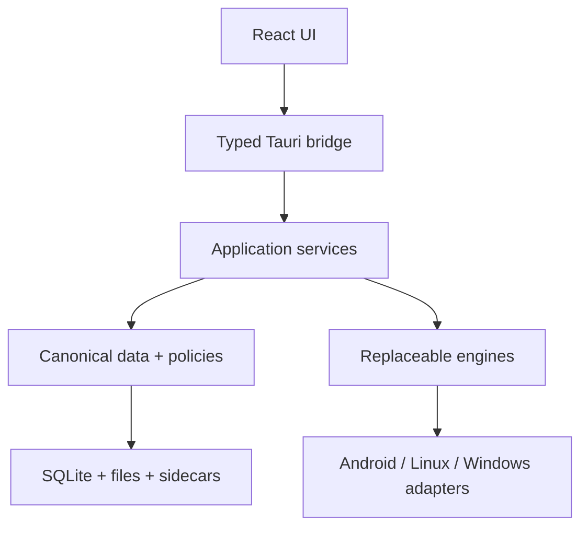
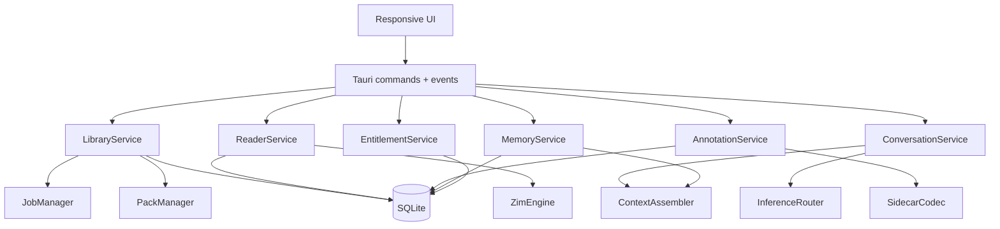
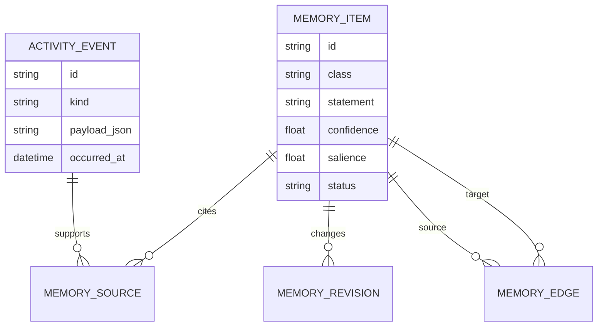
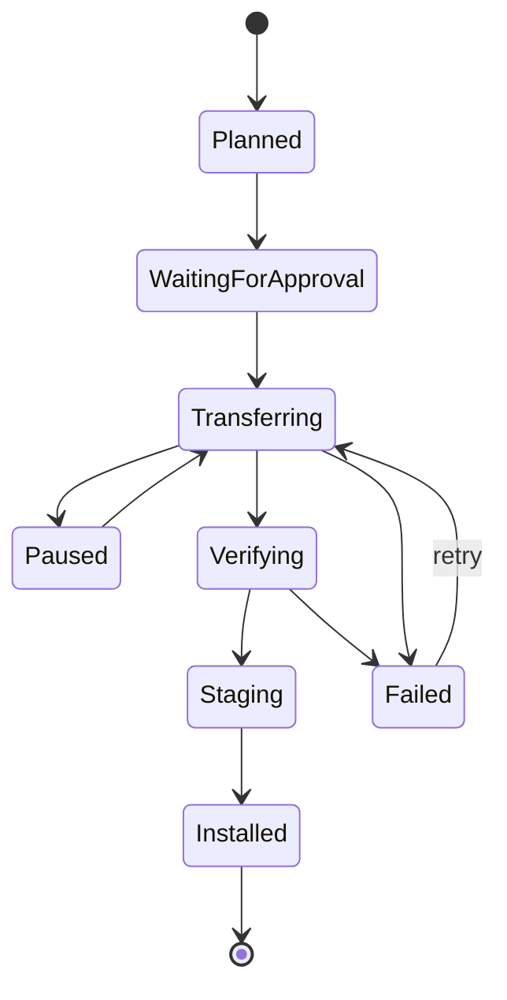
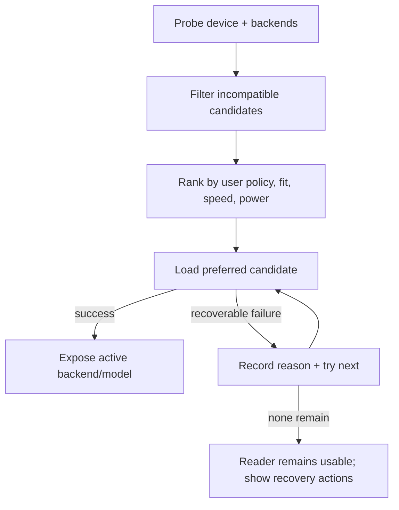
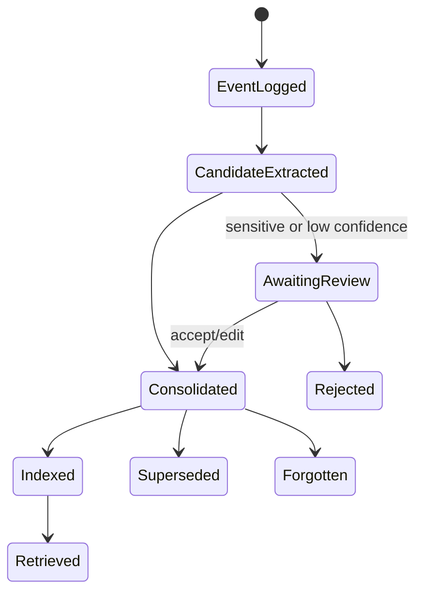
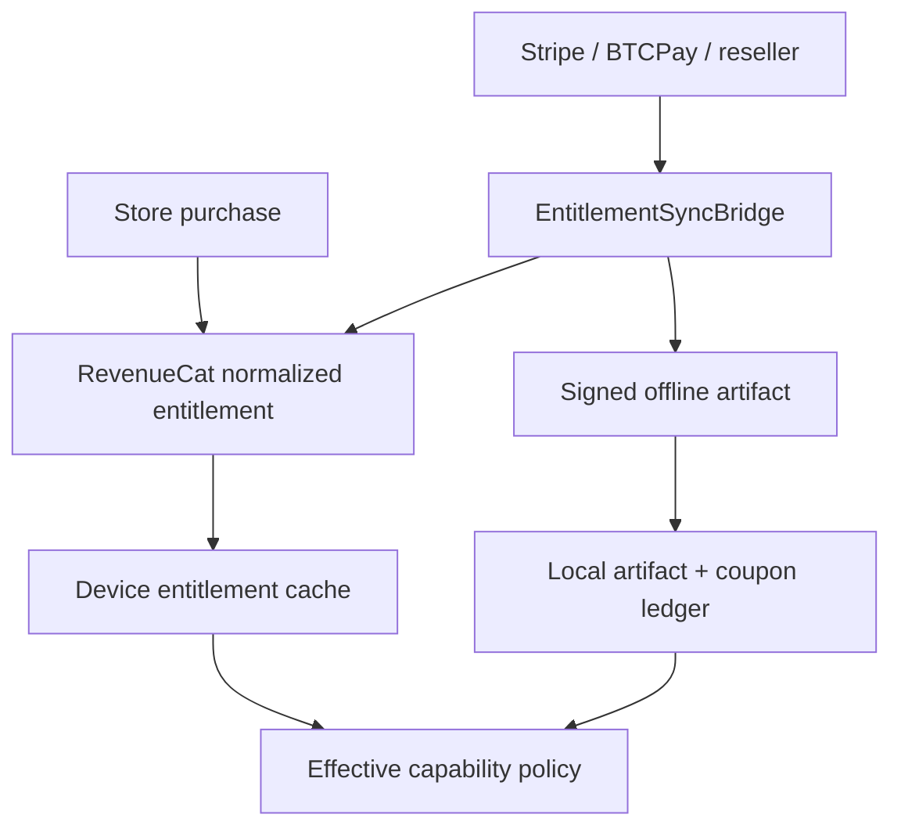

# EnZIME One — Unified Tauri 2 Architecture

**Document role:** implementation architecture for the consolidated reboot  
**Companion:** `PRD-SITE.md`  
**Implementation directive:** `CLAUDE-ONE-SHOT-PROMPT.md`

## 1. Architectural decision

Keep the existing `rebots-online/EnZIME` Tauri 2/Rust/React repository and turn its declared seams into a small, proven vertical product. Do not start another framework migration. Do not preserve Expo, Supabase, or a Python server as runtime dependencies. Do not bind the product permanently to a single ZIM parser, model runtime, catalog, payment processor, or hosted service.

The architecture has three rings:

1. **Canonical domain and data** — portable Rust types, SQLite schema, event journal, sidecars, jobs, manifests, and policies.
2. **Replaceable engines** — ZIM, inference, embeddings, STT/TTS, catalogs, transfer sources, entitlement issuers.
3. **Platform delivery** — Tauri commands/events, React UI, Android JNI/plugins, desktop filesystem and acceleration.



## 2. Binding invariants

| ID | Rule |
|---|---|
| A-01 | Airplane mode is a supported steady state; network sources are additive adapters. |
| A-02 | Tauri 2 + Vite/React is the only application shell. |
| A-03 | Domain managers contain policy; Tauri commands are thin serialization/dispatch boundaries. |
| A-04 | Canonical user data never depends on an embedding model, vector index, or cloud account to remain readable. |
| A-05 | Every large or long-running operation is a durable job: resumable or explicitly restartable, observable, cancellable, and idempotent. |
| A-06 | Engine availability is discovered at runtime and represented truthfully in a capability registry. |
| A-07 | Automatic selection is the default; every automatic compute/model/memory decision is visible and overridable. |
| A-08 | No production capability is marked ready without compilation plus a semantic fixture test. |
| A-09 | User-authored content and export are never entitlement-gated after creation. |
| A-10 | New schema versions migrate forward from every released version and back up before destructive transformation. |

## 3. Repository target structure

Adapt existing paths where they already contain working code; the names below describe boundaries, not permission for a blind directory rewrite.

```text
EnZIME/
├── src/                         React/TypeScript presentation
│   ├── app/                     routes, responsive shell, error boundaries
│   ├── features/                library, reader, notes, ask, memory, settings
│   ├── stores/                  view/session state only
│   └── bridge/                  generated/typed IPC client + event helpers
├── src-tauri/
│   ├── src/
│   │   ├── commands/            thin Tauri commands
│   │   ├── app/                 application services/use cases
│   │   ├── domain/              canonical types, policies, errors
│   │   ├── storage/             SQLite repositories + migrations
│   │   ├── jobs/                durable job state machine
│   │   ├── zim/                 ZimEngine trait + adapters
│   │   ├── retrieval/           lexical, embedding, rerank, citations
│   │   ├── inference/           backend registry + sessions
│   │   ├── memory/              journal, extraction, consolidation, recall
│   │   ├── annotations/         anchors, drawings, attachments, sidecars
│   │   ├── packs/               catalogs, planner, downloads, verification
│   │   ├── peer/                mDNS discovery and LAN transfer
│   │   ├── entitlement/         policy, signed artifacts, RC client
│   │   └── platform/            paths, power/thermal, Android, desktop
│   └── anzimmermanlib/rust/     current ZIM adapter candidate
├── bridge/                       optional EntitlementSyncBridge service
├── fixtures/                     legal tiny ZIMs, manifests, sidecars, DBs
├── DOCS/REBOOT/                  these three source-of-truth documents
└── scripts/                      builds, fixture checks, release tooling
```

## 4. Application component topology



### 4.1 Service responsibilities

| Service | Owns | Must not own |
|---|---|---|
| `LibraryService` | registered packs, locations, versions, storage plan | parsing article bodies |
| `PackManager` | catalog normalization, manifests, install/update/remove policy | UI prompts |
| `JobManager` | durable state, progress, cancellation, resumption, retry | domain-specific verification rules |
| `ReaderService` | open handles, navigation/history, article/resource requests | raw Tauri event handling |
| `AnnotationService` | anchors, drawings, attachments, layer/merge semantics | Supabase/auth assumptions |
| `ConversationService` | sessions, tool loop, streaming, cancellation, citations | backend-specific tokens/handles |
| `MemoryService` | journal, candidate extraction, canonical memories, recall policy | opaque full-chat prompt stuffing |
| `EntitlementService` | effective capabilities and signed offline artifacts | ownership of notes or pack bytes |

## 5. Canonical storage model

SQLite is the canonical structured store, opened in WAL mode with foreign keys enabled. Large immutable content stays in files addressed by manifest identity and hash. Derived indexes are disposable.

### 5.1 Storage classes

| Class | Canonical? | Examples | Recovery |
|---|---|---|---|
| User data | Yes | annotations, notes, conversations, canonical memories, preferences | backup/restore |
| Operational state | Yes | jobs, pack registry, entitlement ledger, trust records | migration/restore |
| Source content | External/immutable | ZIMs, model files, attachments | hash verify/reimport |
| Derived data | No | FTS indexes, embeddings, graph adjacency caches, thumbnails | rebuild |

### 5.2 Core schema families

- `schema_migrations(version, applied_at, app_version, checksum)`
- `packs`, `pack_locations`, `pack_versions`, `pack_resources`
- `jobs`, `job_parts`, `job_events`
- `reading_history`, `bookmarks`
- `annotations`, `annotation_selectors`, `drawings`, `attachments`, `sidecar_layers`
- `conversations`, `messages`, `message_citations`
- `activity_events` (append-only canonical lore journal)
- `memory_items`, `memory_sources`, `memory_edges`, `memory_revisions`
- `embedding_documents`, `embedding_chunks`, `embedding_vectors` (derived)
- `settings`, `capability_snapshots`, `backend_overrides`
- `entitlement_artifacts`, `coupon_redemptions`, `trust_keys`

### 5.3 Memory provenance graph



Deleting a memory item must remove it from retrieval immediately. Deleting its source event is a separate explicit operation. Derived vectors and graph caches are keyed by revision and can be rebuilt.

## 6. ZIM subsystem

### 6.1 Interface

```rust
trait ZimEngine: Send + Sync {
    fn probe(&self, path: &Path) -> Result<ZimProbe, ZimError>;
    fn open(&self, path: &Path, budget: OpenBudget) -> Result<Box<dyn ZimArchive>, ZimError>;
}

trait ZimArchive: Send + Sync {
    fn metadata(&self) -> Result<ZimMetadata, ZimError>;
    fn main_page(&self) -> Result<ArticleRef, ZimError>;
    fn article(&self, reference: &ArticleRef) -> Result<ArticleResponse, ZimError>;
    fn resource(&self, path: &str, range: Option<ByteRange>) -> Result<ResourceResponse, ZimError>;
    fn search(&self, query: &str, limit: usize) -> Result<Vec<SearchHit>, ZimError>;
}
```

The in-tree AnZimmerman Rust code is the first adapter candidate, not an exemption from conformance. A second adapter can be added without changing application services if real-world fixtures expose irreparable gaps.

### 6.2 Conformance gate

Fixtures must cover:

- supported ZIM versions and header rejection;
- redirects and main-page resolution;
- compressed clusters actually encountered in target packs;
- MIME resources, Unicode titles, zero-length content, malformed offsets;
- bounded memory under large index counts;
- safe concurrent article reads;
- deterministic archive identity.

No “supports ZIM” claim is release-valid until these fixtures pass.

### 6.3 Rendering boundary

Article HTML is treated as untrusted content. Rewrite archive-local URLs to an EnZIME resource protocol, block unexpected network fetches under offline policy, sanitize or sandbox active content, and route external links through an explicit user action.

## 7. Pack and transfer subsystem

All sources normalize to `PackManifest` and `TransferSource`:

```rust
trait CatalogSource {
    async fn list(&self, query: CatalogQuery) -> Result<Vec<PackOffer>, CatalogError>;
}

trait TransferSource {
    async fn metadata(&self, item: &TransferItem) -> Result<TransferMeta, TransferError>;
    async fn read_range(&self, item: &TransferItem, range: ByteRange) -> Result<ByteStream, TransferError>;
}
```

Adapters: Kiwix/OpenZIM catalog, operator mirror, filesystem, removable media, LAN peer, and future torrent. Transfer policy is source-agnostic.

### 7.1 Durable install sequence



Rules:

- Persist state before emitting progress.
- Download to a content-addressed staging path.
- Resume only after validating existing part length and source identity.
- Verify hash and signature before atomic rename/registry switch.
- Keep the prior installed version until the new one is committed.
- Dry-run returns the exact `InstallPlan` used by execution.

## 8. Annotation and sidecar subsystem

Canonical annotations use selectors rather than rendered DOM identity alone:

```text
Annotation
├── archive_id + article_id
├── kind: highlight | comment | drawing | voice | note
├── selectors[]
│   ├── TextQuote(exact, prefix, suffix)
│   ├── TextPosition(start, end, normalized_text_version)
│   ├── DomHint(path, local_offset)
│   └── CanvasRegion(x, y, w, h, coordinate_space)
├── body/tags/style
├── attachment hashes
└── provenance + revision
```

Anchor resolution tries selectors in order of semantic stability, returns a confidence, and never silently attaches to a low-confidence match. Drawings preserve normalized coordinates and original viewport metadata.

Sidecar encoding is versioned canonical CBOR (JSON debug export allowed), with optional ed25519 signature. Domain separation keys signatures by artifact kind (`enzime.sidecar.v1`, `enzime.pack.v1`, `enzime.entitlement.v1`) so a signature cannot be replayed across domains.

## 9. Inference subsystem

### 9.1 Backend contract and registry

```rust
trait InferenceBackend: Send + Sync {
    fn descriptor(&self) -> BackendDescriptor;
    async fn probe(&self) -> ProbeResult;
    async fn load(&self, model: &ModelSpec, budget: ResourceBudget) -> Result<Box<dyn InferenceSession>, InferenceError>;
}

trait InferenceSession: Send {
    async fn generate(&mut self, request: GenerationRequest, sink: TokenSink, cancel: CancellationToken)
        -> Result<GenerationSummary, InferenceError>;
}
```

Candidate adapters include LiteRT-LM, a llama.cpp-family native adapter, and a WebView/WASM adapter such as wllama where it is demonstrably supported. The architecture does not claim CPU/GPU/WebGPU support merely because a toggle exists; `probe()` and a smoke generation establish the capability.

### 9.2 Selection policy

Inputs:

- platform and architecture;
- model format and required backend;
- RAM/free-storage budget;
- CPU features and available accelerators;
- thermal/power state;
- user preference: Auto/CPU/GPU/backend;
- recent backend failures with cooldown.

Outputs: ordered candidate list plus human-readable reasons.



The frontend always receives `SelectionReport { preferred, active, fallback_used, reasons, retryable }`.

### 9.3 Model lifecycle

Models are packs with manifests, hashes, size/resource requirements, licence metadata, and compatible backend IDs. A model may be unloaded to reclaim memory without losing conversation state. Context/prompt data remain backend-neutral.

## 10. Retrieval and citation subsystem

Retrieval is a staged pipeline with a strict context budget:

1. Determine scope from explicit user controls and current reader state.
2. Candidate generation: active selection/article, FTS, title index, notes, memories.
3. Optional embedding similarity when a compatible embedding index exists.
4. Deduplicate and rerank by source diversity, recency, user pins, and query match.
5. Pack passages into the token budget while preserving citation boundaries.
6. Generate and persist citation mappings to exact source locators.


If embeddings are unavailable, the lexical path still works. A model-generated citation identifier is not trusted unless it maps to a passage actually supplied in the request.

## 11. Lore memory subsystem

### 11.1 Pipeline



### 11.2 Interfaces

- `ActivityJournal`: append and query immutable activity events.
- `MemoryExtractor`: local rule/model adapter producing typed candidates with source spans.
- `MemoryConsolidator`: deduplicate, merge, supersede, link entities, apply retention policy.
- `MemoryIndex`: FTS plus optional vector index; fully rebuildable.
- `MemoryRetriever`: bounded retrieval with explanation scores.
- `MemoryPolicy`: automatic/manual/private-session/sensitivity rules.

Extraction runs automatically after eligible events when resource policy allows. It is queued as a durable low-priority job, so “automatic” does not mean blocking the chat response. A deterministic rule extractor provides a minimum offline implementation; a local model may improve it.

### 11.3 Retrieval explanation

Each recalled item includes:

- canonical statement and type;
- sources and dates;
- confidence/salience;
- match reason (`entity`, `topic`, `explicit pin`, `recency`, `semantic`);
- revision/supersession status.

## 12. Entitlement architecture



`EffectiveCapability` is derived from free baseline, perpetual grants, active periods, and redeemed coupons. Coupons encode a duration unit and unique serial, not a named calendar month. Redemption creates a local ledger entry and advances the paid-through date from `max(now, current_paid_through)`. Reconciliation detects duplicate serials across devices according to the chosen account/transfer policy.

Private signing keys never ship in the client. Public keys are versioned and support overlap during rotation. Entitlement failure degrades premium execution, never access to existing user-authored data.

## 13. Tauri IPC and frontend state

Commands are grouped by capability and return typed DTOs. Long operations return a job ID immediately and publish replayable progress derived from the job table. Token streaming may use a direct event/channel but must persist the final message and terminal state.

Frontend state categories:

- **Server/domain state:** queried from Rust and invalidated by events; never duplicated as an authoritative Zustand store.
- **View state:** selected panes, filters, draft text, scroll positions.
- **Ephemeral operation state:** optimistic UI and active stream controller.

Generate TypeScript types from Rust schemas where practical, or enforce contract snapshots in CI.

## 14. Platform adapters

| Concern | Android | Linux | Windows |
|---|---|---|---|
| File access | Storage Access Framework/content URI adapter | native paths/file picker | native paths/file picker |
| Background transfer | foreground service/work manager adapter | process job + notifications | process job + notifications |
| TTS | Android native TTS | native accessibility/speech adapter | Windows speech adapter |
| Acceleration | capability-probed backend | CPU/GPU backend probes | CPU/GPU backend probes |
| LAN discovery | mDNS with permission handling | mDNS | mDNS/firewall guidance |
| Packaging | signed APK/AAB flavours | AppImage/deb optional | MSI/exe optional |

Platform-specific code implements ports; it does not fork domain policy.

## 15. Security and trust boundaries

- Treat ZIM HTML and imported sidecars as hostile input.
- Apply path canonicalization and archive-bound resource resolution.
- Enforce size/decompression limits to resist archive bombs.
- Verify manifest signature and content hash independently.
- Separate device identity, peer trust, release signing, pack signing, sidecar signing, and entitlement verification keys.
- Never log prompts, notes, memory statements, tokens, or secrets by default.
- Hosted requests require explicit policy and an inspectable outbound-context preview mode.
- Backup encryption is user-selected; restore never overwrites the sole copy without staging and validation.

## 16. Test architecture

### 16.1 Test pyramid

| Layer | Evidence |
|---|---|
| Domain unit | policies, selectors, coupon math, memory consolidation, job transitions |
| Adapter conformance | every ZIM, inference, catalog, transfer, and entitlement adapter runs a shared suite |
| Storage integration | migration matrix, WAL/restart, corruption handling, backup/restore |
| IPC contract | Rust DTO ↔ TypeScript snapshots and command errors |
| UI component | responsive layouts, annotation placement, fallback status |
| End-to-end | airplane-mode reader, interrupted transfer, offline cited answer, sidecar round trip, memory continuity |
| Platform smoke | clean install/upgrade on Android, Linux, Windows |

### 16.2 Capability evidence registry

At build/test time produce a machine-readable report:

```json
{
  "capability": "local_inference",
  "platform": "linux-x86_64",
  "adapter": "example-backend",
  "state": "fixture-proven",
  "evidence": ["test name", "model hash", "build id"]
}
```

Allowed states: `declared`, `compiles`, `fixture-proven`, `platform-proven`, `release-proven`. Product copy can only advertise `platform-proven` or higher.

## 17. Build and release pipeline

1. Format, lint, Rust checks, frontend typecheck/build.
2. Domain and storage tests.
3. Adapter conformance fixtures.
4. Build platform/flavour matrix without model blobs in GitHub.
5. Sign manifests and installers in controlled release jobs.
6. Install/upgrade smoke tests.
7. Publish capability evidence and checksums.

Large models and licensed packs remain external release assets or canonical Forgejo/LFS objects; GitHub carries manifests and pointers, not accidental blobs.

## 18. Migration strategy from the current repository

1. **Inventory, do not rewrite:** map existing modules and commands to the boundaries above.
2. **Compile first:** resolve current Rust/TypeScript errors without adding features.
3. **Prove a vertical reader:** fixture open → render → navigate → bookmark.
4. **Materialize jobs/storage:** make transfers/indexing durable before downloader UI expansion.
5. **Port donor interactions:** reproduce BoltZIMnote annotation behaviour using local Rust storage and stable selectors.
6. **Prove one inference adapter:** actual smoke generation before model/backend menus expand.
7. **Add automatic memory:** journal first, then extraction/consolidation/retrieval.
8. **Integrate entitlements last in the core path:** free/offline access remains testable without bridge credentials.

Never copy an entire donor repository into the target. Port behaviours one bounded feature at a time with tests.

## 19. Architecture fitness tests

- Blocking all network interfaces does not fail startup, reading, notes, memory review, backup, or an installed local model.
- Removing any optional hosted adapter does not change canonical schemas.
- Rebuilding FTS/vector indexes does not alter canonical notes or memories.
- Killing the process at every durable-job transition leaves a valid resumable or terminal state.
- Two backend adapters pass the same generation/cancellation contract where supported.
- A user can export canonical data without a paid entitlement or EnZIME account.
- The frontend contains no direct HTTP, SQLite, RevenueCat, ZIM parsing, or model-runtime policy.

## 20. Deferred decisions

The implementation may create feature flags and adapter slots, but must not silently lock these choices:

- final native inference adapter per platform;
- final embedding model/index implementation;
- peer transport encryption mode;
- hosted providers and default pricing;
- Creator/Extension reintegration.

The seams, canonical data, acceptance tests, and offline behaviour are binding regardless of those choices.
