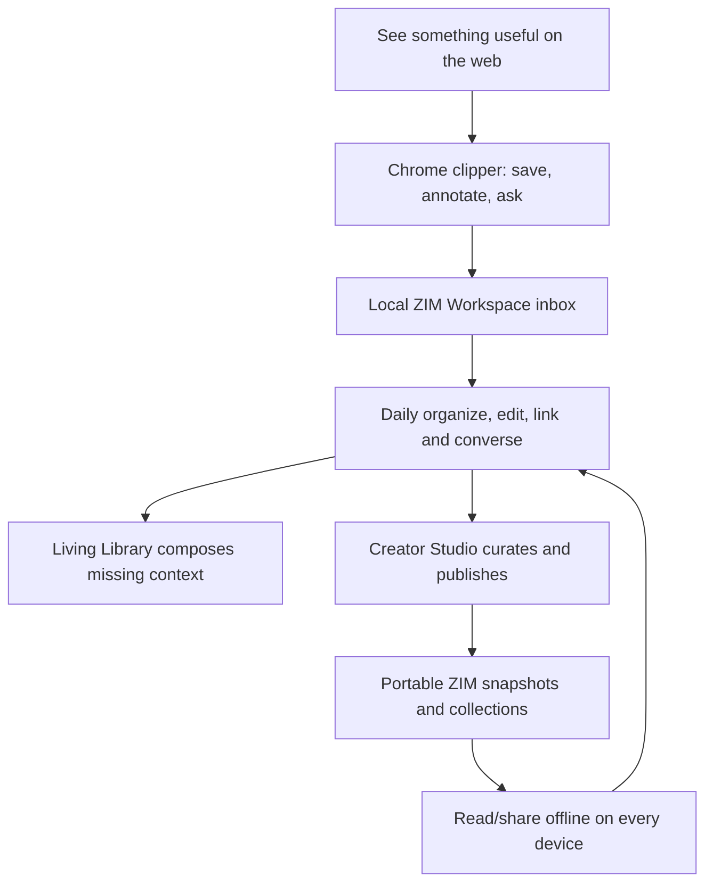
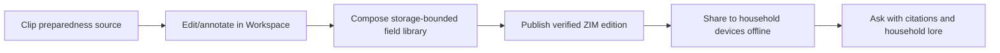

# EnZIME One — Consolidated Product Requirements Document

**Document role:** product source of truth and PRD-site content model  
**Product:** EnZIME Workspace, Creator Studio, Chrome Clipper, Living Library, and Offline AI Companion  
**Planned canonical repository:** `https://forgejo.robin.mba/rcheung/EnZIME-v3`  
**Donor repository:** `https://forgejo.robin.mba/rcheung/EnZIME`  
**Vestigial planning checkpoint:** `rebots-online/EnZIME` on GitHub  
**Status:** implementation directive for the unified Tauri 2 reboot  
**Platforms:** Android, Linux, Windows  
**Default posture:** offline-first, local-first, no login required

> There can be only One. The earlier repositories remain evidence and donor material; they are not separate products to keep alive.

## 1. Executive decision

EnZIME is one product substrate presented through several deliberately different entrances: a near-frictionless Chrome clipper/annotator/chat box, an everyday **ZIM Workspace**, an impressive advanced **ZIM Creator Studio**, and the mobile/desktop Living Library reader. “There can be only One” means one content model, one annotation/memory system, one ingest pipeline and one publishing pipeline—not one cramped UI pretending every user arrived with the same intent.

The strategic objective is not merely to read downloaded ZIMs. It is to make ZIM-backed work sufficiently convenient for collecting, editing, conversing, organizing and publishing that EnZIME can become an hourly-driver knowledge workspace. It must work in airplane mode after assets are installed, remain useful without an account or subscription, and scale from a browser selection or Android phone to a desktop Creator Studio or homestead knowledge server.

The implementation target is a clean Forgejo project, `forgejo.robin.mba/rcheung/EnZIME-v3`. The current `rcheung/EnZIME` and its mirrors contain valuable Tauri/Rust/React, ZIM, annotation, inference, downloader, memory and entitlement work, but their desktop/web and Android paths have diverged amid accumulated errors. They are therefore read-only archaeological donors, not the V3 foundation. GitHub remains a vestigial backup/tool-access surface, never the canonical origin or LFS authority.

V3 uses a **donor airlock**: extract behaviour, schemas, fixtures and acceptance tests first; review each prospective source transplant for dependency, platform and placeholder contamination; then reimplement or copy only the bounded proven unit. No bulk merge, subtree import or “start by making the old tree compile” is permitted.

The donor repositories contribute product knowledge, not competing runtimes:

| Donor | Keep | Do not carry forward |
|---|---|---|
| `forgejo.robin.mba/rcheung/EnZIME` and GitHub backups | Tauri/Rust vocabulary; typed command bridge; SQLite; build-flavour lessons; local AI, sidecar, updater, pack, peer and entitlement seams | Treating the error-diverged desktop/Android tree as V3’s starting commit; bulk source copying; completion claims without green fixtures |
| `Robin-s-AI-World/EnZIME` | Original invariants, pinned-stack intent, earlier architecture vocabulary | Pre-implementation status and stale mirror state |
| `Robin-s-AI-World/EnZIMErgent` and `emergent-EnZIME-Mobile` | Mobile information architecture; offline-only switch; model picker; tier/paywall concepts; voice, drawing, and hosted-inference UI vocabulary | Expo/Metro runtime; mandatory auth; Python server dependency; cloud-first data paths |
| `rebots-online/BoltZIMnote-8mar2026` | Three-pane reader; back/forward/home navigation; text highlighting; comments; drawings; resilient text anchors; annotation panel; import/export interaction | Supabase and login as prerequisites; browser-only ZIM and persistence assumptions |
| `rebots-online/EnZIM-Stitch` and frozen Stitch assets | Visual hierarchy, responsive layouts, component language | A second UI application or a build-time dependency on Stitch |
| `rebots-online/kiwix-zim-updater` | Dry-run planning; update discovery; visible progress; checksums; min/max size constraints; safe replacement and history | Shell-script coupling, filename-only identity, destructive replacement defaults |
| EnZIM/archive repositories | Format research, scaffolding lessons, billing and integration notes | Parallel implementations; outdated format assertions; unproved “clean-room” code treated as production fact |

### 1.1 Internal repository provenance register

This is the mandatory tracking ledger for V3. “Referenced” does not mean “safe to copy.” Every transplant requires a donor-airlock record containing source commit, licence, dependencies, platform assumptions, tests, destination and acceptance evidence.

| Repository | Authority/status | Draw or reference | Explicit exclusion | V3 destination / review state |
|---|---|---|---|---|
| `forgejo.robin.mba/rcheung/EnZIME-v3` | **Planned canonical target** | New clean history, V3 architecture and all accepted implementations | No old-tree initial commit or bulk merge | Initialize at M0; sole development origin |
| [`forgejo.robin.mba/rcheung/EnZIME`](https://forgejo.robin.mba/rcheung/EnZIME) | Current canonical project; **read-only donor for V3** | Tauri/Rust vocabulary, SQLite/storage, IPC, sidecar, inference, entitlement, CI and build-flavour lessons | Error-diverged desktop/Android topology; placeholder implementations; completion claims | Inventory at M0; transplant only bounded fixture-proven units |
| [`rebots-online/EnZIME`](https://github.com/rebots-online/EnZIME) | Vestigial GitHub backup and present planning checkpoint | Accessible copy of docs/current lineage for external tools | Never treat as origin or LFS authority | Inspected; this PR lives here temporarily |
| [`Robin-s-AI-World/EnZIME`](https://github.com/Robin-s-AI-World/EnZIME) | Older private GitHub mirror | Original offline/no-Expo/no-Apple invariants and pinned-stack intent | Pre-implementation/stale mirror state | Inspected; requirements donor only |
| [`Robin-s-AI-World/EnZIME.archive-2026-05-14`](https://github.com/Robin-s-AI-World/EnZIME.archive-2026-05-14) | Archived prior Tauri attempt | Scaffolding, ZIM integration, billing and Android lessons | Direct resurrection of failed architecture | Inspected docs; archaeological reference |
| [`rebots-online/EnZIMe-Archive-4feb2026`](https://github.com/rebots-online/EnZIMe-Archive-4feb2026) | Archived predecessor | Project index, historical checklists, ZIM/billing decisions | Stale completion state and whole-tree copy | Inspected docs; archaeological reference |
| [`Robin-s-AI-World/EnZIMErgent`](https://github.com/Robin-s-AI-World/EnZIMErgent) | Private Emergent takeout | Product vocabulary, mobile flows and screens | Expo/Metro runtime, server/auth coupling | Pending deeper screen-by-screen donor review |
| [`Robin-s-AI-World/emergent-EnZIME-Mobile`](https://github.com/Robin-s-AI-World/emergent-EnZIME-Mobile) | Private mobile prototype | Offline-only toggle, model selection, RevenueCat tier UX, voice/drawing/sidecar concepts | Expo/React Native, required Python backend, hosted-first/auth paths | Settings/paywall inspected; behavioural donor |
| [`rebots-online/EnZIM-Stitch`](https://github.com/rebots-online/EnZIM-Stitch) | Private Flutter/Stitch prototype | Sovereign Instrumentation visual system; Virtual ZIM; range access; ZIM Surgery; reader/chat/annotation component map | Flutter runtime and unproved format claims | README inspected; highest-priority design/dynamic-downloader donor |
| [`rebots-online/BoltZIMnote-8mar2026`](https://github.com/rebots-online/BoltZIMnote-8mar2026) | Private Vite prototype | Three-pane shell, toolbar placement mode, highlights/comments/drawings, anchors, annotation panels, import/export | Supabase, `AuthGate`, remote user identity and browser-only persistence | Source inspected; port behaviours to local V3 services |
| [`rebots-online/ZIMnotebolt`](https://github.com/rebots-online/ZIMnotebolt) | Empty private shell | Name/history only | No implementation to transplant | Exclude unless non-default refs reveal material |
| [`rebots-online/EnZIM`](https://github.com/rebots-online/EnZIM) | Private multi-language clean-room experiment | Format vocabulary, reader/writer examples, extension “Zimmer” intent and API hypotheses | Treating claimed completeness or outdated header/compression assertions as fact | README inspected; specification questions only |
| [`rebots-online/AnZimmerman`](https://github.com/rebots-online/AnZimmerman) | Private clean-room ZIM libraries | TypeScript browser reader/writer ideas, edit-by-copy examples, multi-language test ideas | Unverified parser/writer claims and licence assumptions | README inspected; conformance donor, never default engine without fixtures |
| `forgejo.robin.mba/rcheung/AnZimmermanLib` | Forgejo library referenced by current EnZIME docs | Candidate Rust ZIM API and prior audit findings | Trust by proximity or name | Locate exact repo/ref at M0; run shared conformance suite |
| [`rebots-online/libzim`](https://github.com/rebots-online/libzim) | Public fork/mirror of upstream libzim | Local availability of upstream reference implementation | Accidental copyleft incorporation into proprietary core without explicit licence decision | Reference/conformance oracle; legal boundary required |
| [`rebots-online/kiwix-zim-updater`](https://github.com/rebots-online/kiwix-zim-updater) | Public utility mirror | Dry-run, update detection, checksums, progress, size bounds, safe replacement history | Shell dependency, filename-only identity and destructive defaults | README inspected; semantics reimplemented in Rust jobs/composer |
| [`rebots-online/robinpedia`](https://github.com/rebots-online/robinpedia) | Earlier offline companion | Prepper positioning, graph-aware annotations, knowledge paths, offline queue and conflict concepts | Flutter codebase and vague feature claims | README inspected; product/ontology donor |
| [`rebots-online/kiwix-robinpedia`](https://github.com/rebots-online/kiwix-robinpedia) | Kiwix Android fork | Android storage-policy and Play/full-flavour lessons, proven reader UX reference | Direct code import without GPL/product-boundary decision | README inspected; platform-policy reference |
| [`rebots-online/EnZIM1`](https://github.com/rebots-online/EnZIM1) | Near-empty private shell | Historical name only | No implementation to transplant | Exclude |
| [`rebots-online/EnZIMErgent-26apr2026-14h`](https://github.com/rebots-online/EnZIMErgent-26apr2026-14h) | Empty private shell | Historical pointer only | No implementation to transplant | Exclude unless another ref contains material |
| [`rebots-online/AndZimmerMan`](https://github.com/rebots-online/AndZimmerMan) | Empty private shell | Historical name only | No implementation to transplant | Exclude |

### 1.2 External upstream and conformance references

| Repository | Why referenced | Usage boundary |
|---|---|---|
| [`openzim/libzim`](https://github.com/openzim/libzim) | Canonical mature ZIM implementation and possible native adapter | Licence review before linking/distribution; always useful as behavioural oracle |
| [`openzim/zim-testing-suite`](https://github.com/openzim/zim-testing-suite) | Real conformance corpus/test strategy | Prefer interoperable fixtures; record licences for committed samples |
| [`openzim/zim-tools`](https://github.com/openzim/zim-tools) | Inspect/check/diff tooling for publication validation | Development/release oracle; do not make end-user installation depend on CLI availability |
| [`openzim/warc2zim`](https://github.com/openzim/warc2zim) | Web-capture-to-ZIM pipeline reference | Compare capture fidelity and metadata; adapter/service boundary required |
| [`kiwix/kiwix-js`](https://github.com/kiwix/kiwix-js) and [`kiwix/kiwix-js-pwa`](https://github.com/kiwix/kiwix-js-pwa) | Browser ZIM access, range/virtual archive and PWA lessons | Reference/conformance; no silent copyleft code transplant |
| [`kiwix/kiwix-android`](https://github.com/kiwix/kiwix-android) | Android lifecycle, file access, flavours and large-library UX | Platform-policy and behavioural reference; licence boundary applies |

The implementation report must keep this register synchronized with any newly discovered donor. A repository not listed here cannot donate code until it is added with an explicit boundary.

## 2. Product promise

**Primary promise:** “Capture anything, work with it every day, publish it durably—and keep the whole knowledge shelf working when the network does not.”

EnZIME combines six jobs that should feel like one continuous activity:

1. **Capture without ceremony.** Clip a page, selection, image, link or conversational note from Chrome into a local inbox, annotate it immediately and ask questions before deciding where it belongs.
2. **Create and edit every day.** Treat ZIM-backed projects as living workspaces containing articles, notes, assets, links, revisions, conversations and metadata.
3. **Acquire and maintain a living library.** Dynamically compose, download, import, verify, update, copy and share the most useful corpus for the user, device and scenario.
4. **Read and mark it up.** Fast navigation, search, bookmarks, highlights, marginalia, drawings, voice notes and portable sidecars across downloaded and self-created material.
5. **Ask and synthesize.** Local AI answers from the active article, selected passages, workspace, multiple packs, notes and personal memory, with visible citations.
6. **Publish and remember.** Materialize reproducible ZIM snapshots/collections while retaining editable project history and lasting user lore.

### 2.1 Adoption flywheel

The extension is the low-commitment adoption edge; Workspace is the habit-forming centre; Creator Studio is the power-user and publishing ceiling. They must share primitives so work never reaches a migration cliff between them.

### 2.2 Market sequence: Prepper beachhead, whole-shelf expansion

The initial market is deliberately narrower than the architectural ceiling. Preparedness users offer a manageable, internally coherent wedge: they already value offline ownership, removable media, storage planning, trustworthy updates, household customization and durable sharing. Mainstream note/document vendors may not merely misunderstand this constituency; they may avoid the brand association of visibly pursuing it. That competitive reluctance gives EnZIME time to earn trust, domain fluency, distribution and a hardened offline substrate without first winning a head-on feature-count war.

**Internal strategic doctrine — “Moat by Perceived Target Garbage-Dump Market.”** Incumbents dismiss or reputationally avoid the beachhead; EnZIME treats it seriously and becomes structurally good at requirements—offline operation, ownership, verification, repairability, local distribution and storage-constrained corpus design—that later prove valuable far beyond the niche. This is a sequencing moat, not permission to patronize the users whose trust creates it.

**Public translation:** “Built first for people the cloud-first productivity market leaves behind.”

**Campaign voice:** “Mushroom-cloud-first productivity: the operational antithesis of ‘The Cloud’-first productivity—for the contingency the rest of the market doesn’t want to think about.”

**House notation:** `Mushroom Cloud <!=> antithesis <=!> “The Cloud”`. “The Cloud” assumes continuous remote infrastructure; the mushroom cloud is the limiting case that removes the premise. EnZIME is the productivity substrate designed to remain useful across that inversion.

**Beachhead promise:** “Build the offline field library your household actually needs, keep it current, add your own knowledge and make it useful under pressure.”

V1 therefore implements a thin but complete path through the entire substrate:

The Obsidian/OneNote/Evernote/Word/Publisher/FrontPage shelf is the expansion path. V1 must establish the shared primitives and import/export seams, not reproduce every incumbent feature before the first prepper can use it.

## 3. Users and contexts

### 3.1 Beachhead users

| User | Situation | Must succeed without |
|---|---|---|
| Prepared household | Builds a household field library for outages, travel, rural connectivity and emergencies | Network, account, subscription validation, cloud model |
| Prepper curator/community publisher | Builds scenario-specific packs and distributes them through removable media, LAN or signed releases | Central hosting platform or recipient account |
| Homestead operator | Maintains one broad local corpus and projects right-sized subsets to household devices | Repeated Internet downloads or cloud tenancy |

### 3.2 Expansion users

| User | Situation | Must succeed without |
|---|---|---|
| Lifelong learner/researcher | Builds a personal corpus and returns to it over years | Re-explaining context each session |
| Field worker | Phone/tablet, gloves or intermittent attention, limited power | Desktop-only controls or large-model assumptions |
| Desktop power user | Multiple large ZIMs, keyboard-driven research, local GPU/CPU | Mobile simplifications or forced hosted inference |
| Family/small group | Shares packs, annotations, and selected lore over LAN or removable media | Central cloud tenancy |
| Publisher/curator | Produces signed collections, companion sidecars, and personalized artifacts | Rebuilding the Reader or owning user data |

### 3.3 Core scenarios

- A user installs EnZIME, imports Wikipedia and first-aid ZIMs from an SD card, and reads immediately in airplane mode.
- EnZIME probes RAM, storage, CPU/GPU capability, and available backends, then recommends a model without silently downloading gigabytes.
- A user highlights a passage, sketches over a diagram, records a voice note, and exports those annotations as a portable sidecar.
- A question is answered from the current article and related local sources. Each factual claim links back to the article passage used.
- A returning user asks “How does this connect to the washer-repair research from last month?” and EnZIME retrieves the relevant local lore with an inspectable explanation.
- A desktop downloads packs once and offers them to phones over the LAN. Phones can also import from USB/SD with identical verification.
- An inference backend fails or its GPU is busy. The UI says what happened, falls back automatically when allowed, and offers a CPU/GPU/backend toggle plus Retry.
- A user highlights a paragraph on an ordinary website, adds “compare this with my washer notes,” asks the extension chat box one question, and saves the page plus provenance into the Workspace inbox without creating an account.
- A user tidies clipped pages and personal notes into a living workspace, edits titles and structure, adds local files, then presses Publish to produce a deterministic ZIM snapshot without learning a scraper/build toolchain.
- Creator Studio opens the same workspace with batch ingestion, metadata, link checking, transformations, preview, validation and signing controls; it is not a separate incompatible project format.

## 4. Binding product principles

| ID | Principle | Requirement |
|---|---|---|
| P-01 | Offline is a mode of operation, not an error state | Every core workflow has a zero-network path. |
| P-02 | Local data belongs to the user | Notes, chat, memory, indexes, and settings are stored locally and exportable. |
| P-03 | No mandatory identity | Reading, annotation, search, local AI, backup, and restore work without login. |
| P-04 | Automatic, visible, overridable | Model/backend/memory choices are automatic by default, visibly reported, and manually overridable. |
| P-05 | Evidence before fluency | Answers cite local passages; unsupported synthesis is labelled as inference. |
| P-06 | Graceful capability scaling | The same product remains coherent on low-memory phones and GPU desktops. |
| P-07 | One core, replaceable engines | ZIM, inference, embeddings, TTS/STT, downloads, and entitlements sit behind explicit adapters. |
| P-08 | Earned continuity | Long-term memory is useful, editable, attributable, and never silently treated as objective truth. |
| P-09 | Commercially releasable | Distribution, entitlement, update, privacy, and migration paths are product features, not post-launch chores. |
| P-10 | Honest status | Scaffolded, compiled, fixture-tested, and release-proven are distinct states in UI and documentation. |
| P-11 | One substrate, several doors | Clipper, Workspace, Creator Studio and Reader share schemas, services and identity; their different names and UI density are positioning, not forks. |
| P-12 | ZIM as an hourly-driver ecosystem | Capture and editing must be as convenient as ordinary notes/bookmark tools; publication complexity stays below the user interface. |
| P-13 | Immutable output, mutable experience | Published `.zim` files are reproducible snapshots; edits live in a workspace/overlay and materialize a new version rather than corrupting an archive in place. |

## 5. Scope

### 5.1 V1 Prepper Beachhead release scope

- Open local ZIM files and registered pack libraries.
- Correctly render articles and their local resources with safe internal navigation.
- Per-ZIM and cross-library search.
- Bookmarks, reading history, highlights, comments, drawings, tags, and voice-note attachments.
- Sidecar export/import with stable archive and article identity.
- Resumable pack/model downloads with plan, pause, resume, checksum/signature verification, and atomic install.
- Removable-media and LAN import paths.
- On-device text chat with streaming, cancellation, citations, and context controls.
- Automatic inference backend/model selection with clear status, manual override, retry, and safe fallback.
- Automatic personal-memory capture with review/edit/delete/pin/forget controls.
- Local backups and deterministic restore.
- RevenueCat-backed entitlements for store purchases, plus signed offline entitlement artifacts for direct sales.
- Linux, Windows, and Android builds from one repository.
- Chrome extension for clipping preparedness pages/selections/assets, immediate annotation, contextual chat and delivery into a local Workspace inbox.
- Focused ZIM Workspace for notes, checklists, articles, links, attachments, annotation and conversation—not full incumbent-format fidelity yet.
- Creator Studio field-library mode over the same workspace: ingest, metadata, hierarchy, validation, preview and reproducible ZIM publication.
- Dynamic Library Composer that proposes an explainable, storage-bounded preparedness corpus from catalogues, existing work, household lore and named scenarios.
- Household/homestead projection: maintain a broad source library and deploy right-sized verified subsets to phones, tablets and laptops.

### 5.2 Post-V1, architecture-ready

- Deeper Word/DOCX interchange and page-layout fidelity.
- Notebook canvas/ink parity, advanced graph views and broader personal-productivity templates.
- Full visual website authoring and multi-page publication themes.
- Optional hosted/frontier inference and web retrieval.
- Multi-device encrypted sync through a user-chosen provider.
- LoRa/low-bandwidth chunk transport.
- Collaborative annotation merge and conflict UI.
- Personalized artifacts generated at purchase time.

### 5.3 Explicit non-goals for V1

- iOS/macOS support.
- A required EnZIME cloud account.
- Full web-browser parity with native filesystem and background-task behaviour.
- Training or fine-tuning foundation models on device.
- In-place alteration of immutable published ZIM archives; EnZIME edits a mutable workspace/overlay and builds a new snapshot.
- Making all previous repositories compile or remain deployable.

## 6. Functional requirements

### 6.1 First launch and capability selection

1. Show a concise “local-first” explanation and data location.
2. Probe platform, RAM, free storage, CPU features, GPU/WebGPU availability where applicable, and supported inference backends.
3. Offer three setup paths: **Use existing files**, **Choose packs/models**, **Explore without AI**.
4. Recommend a backend/model and state the reason, estimated RAM/storage, and expected speed class.
5. Never begin a multi-hundred-megabyte download without explicit approval.
6. Persist the automatic/manual mode independently for compute backend and model.
7. If an accelerator is unavailable or busy, show `Preferred backend unavailable → using <fallback>` and retain a Retry action.

**Acceptance:** first launch completes in airplane mode with an imported ZIM and no model; the reader remains fully usable.

### 6.2 Living Library and Dynamic Library Composer

The downloader is not a file-transfer screen with unusually good manners. It is a corpus optimizer that proposes the best offline shelf for a particular user, device, storage budget, project and anticipated situation.

- Inputs: natural-language intent, installed library, workspace topics, searches, annotations, lore memory, device capability, storage/bandwidth budget, language, geography, freshness policy and named profiles.
- Compare available editions and variants (`mini`, `nopic`, `maxi`, date/language editions), overlaps, dependencies, gaps and expected marginal coverage.
- Produce an explainable `LibraryPlan`: what to acquire/update/retain/archive, why, expected coverage gained, space consumed, alternatives rejected and what would need displacement.
- Never evict silently. Simulate the resulting shelf and permit pin/ban/substitute/budget changes before execution.
- Named profiles can include Preparedness, Catholic Library, Medical Field Kit, Travel, Project-specific research, Mom’s tablet and Household Homestead.
- A homestead node may hold the superset while each device receives a capability/storage-sized projection.
- Recompose when user work, available catalogues, versions or budgets change; learning improves proposals but never makes deletion autonomous.

**Acceptance:** from a scenario and storage ceiling, EnZIME produces a reproducible plan with reasons, offers smaller/larger alternatives, executes approved jobs, and later explains why every installed item belongs.

### 6.3 Chrome Clipper, Annotator and Chatty Box

- Capture modes: whole page, reader-cleaned page, selection, link/bookmark, image/media reference, screenshot, structured metadata and free note.
- Preserve provenance: canonical URL, retrieval time, page title/byline, selection context, content hash and capture recipe.
- Allow highlight/comment/tag/notebook assignment before or after saving.
- The extension chat box answers from the current page/selection plus explicitly selected Workspace context, then saves the conversation and citations alongside the capture when requested.
- Default delivery is local: native messaging/local companion service when available, with a browser-local outbox that survives the desktop app being closed.
- Permit standalone export as an ingest bundle or small ZIM when the companion is absent; synchronize later idempotently.
- Show exactly what page material and Workspace context would leave the device before optional hosted inference.
- Browser permissions are progressive and narrowly explained; “read all sites” is not the unexplained starting demand.

**Acceptance:** clip, annotate and question a page while EnZIME is closed; reopen Workspace, ingest the outbox exactly once, open the preserved capture offline and follow its citations/provenance.

### 6.4 ZIM Workspace — the everyday hourly driver

Workspace competes for the storage and communication territory occupied separately by Obsidian, OneNote, Evernote, Word and ordinary shared folders. It must sound and feel mundane enough for daily work while using the same powerful substrate as Creator Studio.

The table below is the long-term shelf map. **V1 implements only the preparedness-critical subset:** rapid capture, structured notes/checklists/articles, attachments, semantic links, annotation, search/chat, revision history and reliable ZIM/static export. Advanced DOCX fidelity, free-position notebook canvas, print-layout tooling and full site design follow after the beachhead is useful.

| Shelf being contested | Workspace primitive |
|---|---|
| Obsidian | backlinks, graph/link browser, Markdown/source option, local files, transclusion, search and lore-aware synthesis |
| OneNote | notebooks/sections/pages, free-position canvas blocks, ink/drawing, audio and rapid capture |
| Evernote | web clip inbox, tags, saved searches, attachments, OCR-ready assets and cross-device export |
| Word | rich-text documents, styles, headings, tables, footnotes/citations, comments, revision history, print/PDF/DOCX interchange |
| Publisher | page templates, frames, image/text layout, master styles and print-ready publication export |
| FrontPage-style HTML editor | visual page/site tree, HTML/CSS source, link/resource validation, preview and static-site/ZIM publication |
| Shared-drive/chat fragmentation | portable workspace/ZIM editions plus annotation, conversation and delta sidecars with explicit recipients/trust |

Requirements:

- Unified block/document model for rich text, Markdown/HTML, canvas placement, media, tables, code, citations, embeds and semantic links.
- Multiple views over the same canonical content: notebook, document, outline, canvas, site tree, graph, timeline and publication layout.
- Autosave, append-only revisions, undo/redo across restarts, templates, reusable blocks and bulk organization.
- Import adapters prioritized by adoption value: HTML/URL, Markdown, plain text, DOCX, PDF-as-source/reference, Evernote ENEX and common folder structures; preserve provenance and report conversion loss.
- Export/publish adapters: ZIM, static HTML site, Markdown, DOCX/PDF where fidelity permits, and portable sidecar/delta bundles.
- Sharing is artifact-first: a recipient can read the frozen edition and optionally import comments/annotations/deltas without joining an EnZIME tenant.

**Acceptance:** a user can clip research, write and restructure a rich document, link notes, lay out a printable page, preview a small site and publish a self-contained ZIM edition from one workspace without copying content between applications.

### 6.5 Creator Studio — the impressive face of the same workspace

Creator Studio is an advanced mode, not a second project format. It opens the exact Workspace and adds:

- bulk URL/file/folder ingestion and capture recipes;
- metadata/schema editing, collection hierarchy and reusable templates;
- asset deduplication, content-addressed storage and licence/provenance review;
- batch transformations, AI-assisted cleanup/classification/link suggestions with preview;
- visual HTML/CSS editing, site navigation, redirects and link/resource validation;
- publication profiles, deterministic build, diff between editions, signing and release manifests;
- multi-target output from one source workspace: ZIM, static site, print/PDF and exchange formats.

“Workspace” wins everyday use; “Creator Studio” communicates ceiling and commercial value. Switching labels must not duplicate or migrate data.

For the Prepper Beachhead release, Studio prioritizes field-library assembly: bulk source ingest, scenario/category hierarchy, offline dependency/resource checking, edition comparison, validation, signing and reproducible ZIM output. General-purpose publishing refinements remain additive.

**Acceptance:** the same project alternates between Workspace and Studio modes, produces byte-reproducible output under a fixed toolchain/profile and can explain every transformed or excluded source item.

### 6.6 Pack transfer lifecycle

- Sources: Kiwix/OpenZIM catalog adapter, operator mirror, local file, watched folder, SD/USB, LAN peer, and manually supplied manifest.
- Before download, present a plan containing item, version, size, destination, free space after install, source, and verification method.
- Support pause/resume after process restart using `.partial` data and durable job state.
- Verify checksums and signed manifests when provided; never replace a good installed pack until verification succeeds.
- Identify content by manifest identity and content hash, not filename alone.
- Allow update policy per pack: manual, notify, Wi-Fi/LAN only, or scheduled.
- Include min/max size and storage-reserve rules.
- Keep an inspectable job and replacement history.

**Acceptance:** kill the application during a large transfer, relaunch, resume, verify, and atomically install without corrupting the previous version.

### 6.7 Reading and navigation

- Open multiple ZIMs without loading their complete indexes into RAM.
- Render HTML, images, CSS, fonts, redirects, and internal links from the local archive.
- Back, forward, home, article list, in-article find, and keyboard shortcuts on desktop.
- Responsive layout:
  - Desktop: library/sidebar + reader + notes/assistant panel.
  - Tablet: two panes with collapsible third panel.
  - Phone: tab/stack navigation with persistent article and conversation state.
- Restore the last open article and scroll position per device.
- Sanitize active content and mediate external links.

**Acceptance:** verified fixture ZIMs covering redirects, compressed clusters, local assets, Unicode titles, and malformed entries open without process crashes.

### 6.8 Search and retrieval

- Fast title/prefix search inside a pack.
- Full-text search when a compatible index exists; incremental local index otherwise.
- Cross-pack search with pack/title filters.
- Semantic search across article chunks, notes, annotations, and memory when embeddings are installed.
- Every result indicates source type, pack, article, match passage, and score class.
- Indexing is resumable, cancellable, storage-aware, and deprioritized on battery/thermal pressure.

### 6.9 Annotation workspace

- Types: highlight, comment, drawing, bookmark, tag, voice note, and free note.
- Text anchors store multiple selectors: article identity, quoted text, prefix/suffix context, DOM/path hint, and offsets.
- Drawings store normalized coordinates and viewport/article anchor metadata.
- The UI follows the proven donor pattern: toolbar activation, visible placement mode, article overlay, right-side annotation list, edit/delete, global note browser, and import/export.
- Sidecars include schema version, archive identity, annotations, attachments by hash, provenance, timestamps, optional signature, and merge metadata.
- Import modes: preview, merge, replace local copy, or keep as separate layer.

**Acceptance:** annotations survive app restart, theme change, window resize, article rerender, export, fresh-install import, and a compatible newer edition of the same pack where the quoted passage still exists.

### 6.10 Local AI conversation

- Chat against: active selection, active article, selected packs, notes only, memory only, or automatic context.
- Stream tokens with Stop and Regenerate.
- Show the active backend, model, compute path, context size, and whether fallback occurred.
- Cite retrieved passages with clickable source chips.
- Keep generation available when embeddings are absent by using deterministic lexical/context selection.
- Provide separate controls for `Local only`, `Allow hosted fallback`, and `Ask every time`.
- Hosted inference is optional, explicit, and never required to unlock the user's local data.
- Model/backends are hot-swappable through a shared interface; failure does not lose the conversation draft.

**Acceptance:** with network blocked, ask a question whose answer exists in an installed fixture; receive a cited answer, cancel a second generation, switch backend/model, and continue the same conversation.

### 6.11 Lasting user lore memory

Memory is a first-class subsystem, not a larger prompt pasted from chat history.

Memory classes:

| Class | Examples | Default retention |
|---|---|---|
| Preference | desired tone, units, device/backend choice | durable until changed |
| Entity | people, places, projects, devices | durable, mergeable |
| Episode | “washer repair investigation in July” | summarized with source links |
| Claim/belief | user hypothesis or conclusion | attributed and confidence-labelled |
| Task/commitment | unresolved question, follow-up, planned download | until done/expired |
| Reading trace | opened article, highlight, search trail | compressed, lower salience |
| Correction | “that earlier model name was wrong” | high salience, supersedes prior item |

Automatic pipeline:

1. Append user-visible activity events locally.
2. Extract candidate memories asynchronously.
3. Deduplicate and link candidates to existing entities/topics.
4. Score salience, confidence, sensitivity, novelty, and expiry.
5. Commit according to user policy: automatic, ask for sensitive items, or manual-only.
6. Generate embeddings/graph edges when resources permit.
7. Retrieve a bounded set for each query and show “Why this was remembered.”

Controls: Memory Inbox, pin, edit, merge, forget, exclude a conversation, private session, export, and rebuild indexes from the event journal.

**Acceptance:** memory selection and generation happen automatically under the default policy; deleting an item removes it from retrieval; rebuilding derived indexes produces equivalent canonical memories from the journal.

### 6.12 Voice and accessibility

- Voice notes attach to articles/annotations and may be transcribed locally when supported.
- STT/TTS adapters advertise availability; absent engines do not create dead controls.
- Native OS TTS is the universal low-cost baseline; richer offline voices are optional packs.
- Keyboard navigation, screen-reader labels, scalable text, reduced motion, contrast-safe themes, and touch targets suitable for mobile.

### 6.13 LAN and homestead mode

- Desktop may advertise a local pack/sidecar service by mDNS.
- Peers see source identity, item hashes, size, and trust status before transfer.
- The same verification path is used for Internet, LAN, and removable media.
- A peer can never silently overwrite local annotations or trusted packs.
- Server mode is optional and off by default on mobile.

### 6.14 Entitlements and commerce

- RevenueCat is the normalized entitlement authority for store and synced direct purchases, not the owner of local content.
- Product forms:
  - Free reader baseline.
  - Perpetual licence.
  - Subscription.
  - Consumable signed “one month” coupons that activate one entitlement period when redeemed, allowing multiple purchases to be banked.
  - Future personalized artifact/lifetime bundles.
- Direct processors may include Stripe and BTCPay; Gumroad/Lemon Squeezy may act as sales channels through the same bridge.
- Devices cache signed entitlement artifacts with clear issuance, capabilities, redemption state, and expiry semantics.
- Expired commercial entitlements may remove premium execution features but never prevent access to user-created notes, exports, or already-readable local content.

**Acceptance:** a perpetual key and an offline month coupon validate with the network blocked; the same coupon cannot be consumed twice on one ledger; a fresh device can restore through an explicit transfer/online reconciliation path.

### 6.15 Backup, migration, and recovery

- One portable backup contains the SQLite database, sidecars, memory journal, settings, trust records, and manifests; large ZIM/model files may be referenced by hash rather than duplicated.
- Backup creation is atomic and versioned.
- Restore supports preview and conflict reporting.
- Schema migrations are forward-only, tested from every released schema, and never destroy the only copy before backup.
- Derived indexes can be discarded and rebuilt.

## 7. UX and visual system

EnZIME should feel like a calm field instrument rather than a neon AI dashboard. Preserve the donors’ useful spatial logic while removing dependency-driven gates.

### 7.1 Primary navigation

| Area | Purpose |
|---|---|
| Home | Continue reading, recent packs, unresolved tasks, memory inbox, system readiness |
| Library | Packs, downloads, imports, updates, storage planner |
| Reader | Article navigation and annotation canvas |
| Ask | Conversation with explicit source scope and backend status |
| Notes | Cross-pack annotations, notebooks, tags, sidecar layers |
| Memory | Lore browser, inbox, entities, episodes, corrections, controls |
| Settings | Offline/network policy, compute/model choices, accessibility, entitlements, backup |

### 7.2 Persistent status vocabulary

- `Offline ready`
- `Online optional`
- `Indexing 42% — safe to close`
- `GPU preferred / CPU active`
- `Fallback: preferred backend unavailable`
- `Sources: 5 local passages`
- `Memory: 3 items used`
- `Unverified pack` / `Checksum verified` / `Signature verified`

### 7.3 PRD site information architecture

This document may be rendered as a static PRD site. The site should expose:

- **Overview:** promise, status, release target, blocking risks.
- **Experience:** responsive reader, annotation flow, Ask flow, memory flow.
- **Requirements:** filterable requirement list with IDs and acceptance tests.
- **Architecture:** embedded diagrams sourced from `ARCHITECTURE.md`.
- **Donor ledger:** repository-to-feature provenance table.
- **Delivery dashboard:** milestones, test evidence, builds, open decisions.
- **Commercial:** tiers, offline entitlements, channels, non-gating guarantees.
- **Runbook:** developer quick start and the implementation prompt.

The site is a view over these Markdown sources; it must not become a fourth source of truth.

## 8. Non-functional requirements

| Area | Requirement |
|---|---|
| Startup | Library shell usable within 2 seconds on reference desktop and 4 seconds on reference Android, excluding first migration. |
| Memory | Opening a ZIM must not load the full archive into RAM; indexing and inference declare budgets. |
| Reliability | Downloads and indexes survive kill/restart; database uses WAL and integrity checks. |
| Battery/thermal | Background work pauses or reduces concurrency under platform pressure. |
| Security | External HTML is sandboxed; paths are canonicalized; manifests and offline licences use domain-separated signatures. |
| Privacy | Zero analytics by default; any future diagnostics are opt-in and inspectable. |
| Accessibility | WCAG-oriented contrast, keyboard use, scalable type, screen-reader semantics, reduced motion. |
| Portability | Canonical data can be exported without an EnZIME server. |
| Observability | Local structured logs with redaction and user-controlled export; no automatic upload. |
| Testability | Core managers run without a WebView; engines use conformance fixtures. |

## 9. Release milestones and gates

### M0 — Establish V3 and the donor airlock

- Initialize `forgejo.robin.mba/rcheung/EnZIME-v3` as a clean repository with no copied donor source.
- Record toolchains, platform matrix, architectural fitness tests and donor inventory.
- Scaffold the smallest Tauri 2/Rust/React desktop and Android shells from one source tree.
- Make format, frontend build/typecheck, Rust checks and smoke tests green on both available reference targets.
- Add a small legal ZIM fixture or deterministic fixture generator.

**Exit:** V3 baseline commit, green dual-platform shell and donor-airlock ledger.

### M1 — Living Workspace and reader spine

- Open/render/navigate/search fixture ZIMs.
- Mutable workspace, content objects, revisions, ingest inbox and deterministic ZIM snapshot.
- Persistent library, history, bookmarks and responsive shell.
- Android filesystem flow proven on emulator/device.

**Exit:** create/edit/publish/read the same tiny workspace on desktop and Android without platform forks.

### M2 — Chrome adoption edge

- MV3 clipper captures page/selection/provenance to a durable local outbox.
- Local companion ingest, immediate annotation and page-context chat.
- Idempotent offline handoff into the same Workspace content model.

**Exit:** clip while the desktop app is closed, ingest once, edit and republish offline.

### M3 — Annotation durability

- Highlights/comments/drawings/voice attachments.
- Stable anchoring, sidecar import/export, merge preview.

**Exit:** round-trip annotation compatibility test.

### M4 — Dynamic Living Library

- Library Composer, explainable storage-bounded plan, catalog, resumable jobs, verification, atomic update and removable media.

**Exit:** scenario-to-corpus plan plus interrupted multi-part transfer recovery test.

### M5 — Local AI and retrieval

- At least one genuinely working local backend per release platform.
- Backend/model auto-selection, manual override, fallback indicator, citations.

**Exit:** offline cited-answer test on each platform.

### M6 — Lore memory

- Journal, extraction, consolidation, retrieval, review/delete/export/rebuild.

**Exit:** multi-session continuity scenario with inspectable memory provenance.

### M7 — Creator Studio, commerce and release

- Advanced ingest, site/page layout, validation and deterministic multi-target publishing.
- Entitlements, perpetual/offline coupon, backup/restore, installers, updates, accessibility and privacy review.

**Exit:** signed release candidates and clean-install upgrade matrix.

## 10. Success measures

Because analytics are not required, measures may come from opt-in reports, support, release testing, and small user studies.

- Time from install to first locally rendered article.
- Percentage of tested core workflows passing with network physically blocked.
- Recovery rate after killed downloads/indexes.
- Citation-open rate and source correctness in evaluation fixtures.
- Annotation survival across pack update and sidecar round trip.
- Memory precision: accepted/edited/deleted candidate ratio.
- Number of sessions before a user must manually re-explain durable context.
- Crash-free reference test suite and successful upgrade/restore matrix.
- Conversion by entitlement channel without loss of free-reader usefulness.
- Time from browser selection to locally searchable Workspace object.
- Percentage of users who progress from clipper to recurring Workspace use and from Workspace to publication.
- Number of external applications required to complete capture → author → publish → share; V1 target is one EnZIME substrate.
- Import conversion-loss rate and successful migration rate from HTML, Markdown, DOCX and ENEX fixtures.

## 11. Risks and mitigations

| Risk | Consequence | Mitigation |
|---|---|---|
| Existing architecture overstates implementation | False progress and brittle one-shot coding | M0 compile/fixture truth gate; capability registry generated from working adapters |
| ZIM parser incompleteness | Fails on real Kiwix archives | Conformance fixtures and adapter seam; do not advertise formats until proven |
| Mobile inference fragmentation | Crashes, thermal pressure, user distrust | Probe, budgets, model tiers, fallback, visible status, manual override |
| Long-term memory becomes prompt sludge | Worse answers and privacy anxiety | Typed memories, provenance, salience/expiry, bounded retrieval, edit/delete/rebuild |
| Offline entitlements become either porous or punitive | Revenue leakage or user lockout | Signed artifacts, local ledger, reconciliation, perpetual/free-content guarantees |
| Sidecar anchors break on updates | Lost scholarship | Multi-selector anchors, preview/repair tools, content-hash identity, compatibility tests |
| Clean V3 becomes an amnesiac greenfield rewrite | Proven behaviours and hard-won lessons are lost | Repository provenance register, donor airlock, behaviour/fixture extraction and bounded transplant ledger |
| V3 bulk-imports the old error topology | Desktop/Android divergence is reborn under a new name | Donor airlock, no bulk merges, source transplant ledger, cross-platform gate on every vertical slice |
| Workspace imitates every incumbent shallowly | Feature sprawl without daily-driver value | One canonical content/revision model; prioritize capture latency, editing fluency, interchange and publishing continuity |

## 12. Definition of done

EnZIME V1 is done only when:

- the canonical Forgejo V3 repository produces Android, Linux and Windows release candidates from one domain/application core;
- Chrome clipper, Workspace and Creator Studio exchange the same content, annotation, conversation and provenance schemas without migration;
- a user can capture, author, lay out, publish and share a useful ZIM edition without leaving the EnZIME substrate;
- core reading, annotation, search, backup, and local AI scenarios pass with the network blocked;
- at least one real ZIM and one real local inference backend are proven on each platform;
- downloads, indexes, and migrations survive interruption;
- annotations and lore memory are portable, inspectable, editable, and recoverable;
- the UI visibly distinguishes automatic selection, active backend, and fallback;
- entitlements do not gate access to user-authored data;
- documentation describes observed behaviour rather than intended scaffolding.

## 13. Open decisions that do not block the reboot

- Final product tier names and prices.
- Which optional hosted providers ship in the first commercial release.
- Whether the first desktop local backend is LiteRT-LM or a llama.cpp-family adapter; the interface and acceptance tests are binding, not the vendor.
- Whether peer sync encrypts all payloads in V1 or ships as trusted-LAN transfer with signatures first.
- Exact sunset criterion if V1 does not ship.

These decisions must not be silently made by an implementation agent. Defaults may be feature-flagged behind the stable seams in `ARCHITECTURE.md`.
